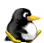
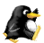
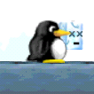
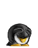
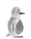

In SuperTux, if the player presses no keys, Tux will stay still and most
likely get killed by an enemy. Luckily, the player can make Tux do a
multitude of actions. Some actions require Tux to be Big Tux, while some
require him to be wearing one of the different hats that are available in
the game. Most actions require certain key/keys to be pressed, while some
happen without player input. 

As of 0.6.0, the current actions are available:

Walking
-------

When the presses and holds the "left" or "right" keys, he will walk in the left
or right direction. 

When the player releases these keys, Tux will slow down and come to a stop.

Running
-------

Running is an automatic action that gets activated when Tux is walking
in the same direction for a certain amount of time. When Tux is
running he is able to jump five tiles high instead of just four.

Milestone 1 used a dedicated run button, in Milestone 2 it's automatic.

Jumping
-------

If Tux presses the "Jump" Key, he will jump up in the air and come back down.
Tux normally crosses gaps and pits by running and jumping. Tux can also jump  below a bonusblock and hit it with his head to obtain the item inside. Tux can also kill enemies from below by headbutting filled bonusblocks when an enemy is directly above.

Most enemies can be killed by jumping on them once or twice.

If Tux is big, then he can break crates by jumping underneath them and headbutting them.

Carrying
--------

Tux can carry one item at a time around with him by pressing the "action" key when he is
right up against one of these special items. The items Tux can currently
carry are:

-   Iceblock (after being stepped on)
-   Bomb (after being ignited)
-   Trampolines (Movable ones)
-   Rocks
-   Lanterns
(Note: Some Rocks may have different sprites than normal.)

Ducking
-------

When Tux is Big Tux, or has a flower, he can duck. Simply press the "down" button to duck. 

If the player wants to move while ducking, simply jump and move while ducking. This allows Tux to move through one-tile spaces when he is two tiles tall.

Backflip
--------

The backflip is a special jump which gives Tux some extra height
(1 tile) compared to a normal jump. 

Tux can backflip by ducking and then jumping.

Buttjump
--------

The **buttjump** is an ability that lets Tux crush boxes from above
and destroy some badguys that cannot be harmed by a normal jump. It is
performed by jumping up into the air and then pressing the *Down* key
while in the air.

The buttjump has the following flow of actions

1.  Tux jumps up as normal
2.  Player presses 'down'
3.  Tux does some acrobatic movement to get into the 'butt-position'
4.  Tux then falls down back to the ground, butt first
5.  When smashing on the ground wooden boxes will be destroyed
6.  It takes Tux a small amount of time to jump back onto his feet to get back to normal

If Tux jumps from a high place and butt jumps onto a snail, an iceblock,
or a Walking Tree, he will kill them instantly.

Proposals featuring special items or power meters have been rejected.
For reasons why see [Special Items Are Evil](Ideas#special-items-are-evil).

Fireflower
----------

The behaviour of the **fireflower** is that it gives Tux the ability
to spit bouncing fire bullets. Most badguys are killed when being
struck by a fire bullet.

Any subsequent fireflowers that Tux takes increase the amount of fire
bullets that can be on the screen at the same time, but do not
increase the amount of hits Tux can take.

Iceflower
---------

The iceflower will give Tux the ability to shoot ice bullets. Ice
bullets will not bounce like fire bullets, but will shoot out in a
straight path towards the enemy. When the ice bullet hits an enemy it
will freeze him for a short time (if the enemy is freezable, not
Snowball, Mr. Iceblock and Bouncing Snowball, etc.).

### Proposed behavior

Perhaps the ice bullet could freeze water, bouncing across the surface
of a body of the aforesaid liquid and freezing the surface of the
**one block** it touches, and maybe one block either side of it. I got
the idea from water -&gt; ice on the User Ideas page.

Airflower
---------

The Airflower will give Tux the ability to run a small bit faster, and
jump farther. If the player holds the jump key, Tux will fall slower than
normal.

Earthflower
-----------

The Earthflower gives Tux a light source in dark areas. If Tux ducks,
the light points down. If Tux does a backflip, the light will spin.

StoneTux
--------

If Tux has a Earth Hat (aka Hardhat) he has the ability to turn into stone for a short while by:
1.  Pressing the Action key.
2.  Pressing the down key.
(Note: If Tux presses the down key first, he will duck instead.)

Now Tux is made of stone and is immune to damage for a short while. After a
few seconds, he will return to normal and won't be able to turn into stone
again for a few moments.

Idling (Partially Implemented)
------------------------------

Sometimes Tux just stands still. To make things more interesting we should have some animations in this case as well.

Examples:

-   Shaking his head
-   Flapping his flaps
-   Open/close an eyelid (Implemented)
-   Yawning or falling asleep
-   Whistling a tune
-   Tapping his feet in impatience
-   Getting more and more angry the longer he is left.

It would also be nice to make him turn and face the 'camera' if an idle timer was exceeded.

Proposed abilities
==================

Blowflyer
---------

The **blowflyer** or BalloonTux action should be a temporary limited
action in which Tux fills his body with air (helium?!) and is thus
able to fly for a short time, i.e. as long as he can go without
breathing. The end of the flight should be announced by Tux changing
color and catching for air.

Perhaps there could be a hidden “pump” in each level, which tux could
pump himself up with.

Flapping
--------

Once in the air, Tux should be allowed to flap with
his wings. They are not enough to let him fly, but should allow him to
get some additional air-time (like a small double-jump).

Dive
----

When jumping from a great height, Tux should have his beak facing
down, like a dive. It would work well with the swim ability.

Slider
------

Tux will be able to make use of smooth terrain by using the slide
action. By using the slider action Tux will jump on its belly and thus
slide speedy down the hill. Terrain that is formed like a ramp should
allow him to make huge jumps, which would be impossible without the
slide action. While sliding downhill Tux shall be invulnerable by
normal enemies, however special enemies with spikes or so, might still
be able to stop him.

Exact details on how the sliding will work have to be worked out, but
it might get a rather central role in gameplay.

Somewhat related, you could have icy platforms that when running on it
is much harder to stop/change-direction (i.e. you could slide off the
edge accidently) that require you to be extra careful.. these could
appear on later harder levels. If these aren't flat, you get what is
shown in the above picture, which you could slide down instead.

We'd probably need tile-based friction to make this work well. Holding
“duck” while moving above a certain speed (or on a slope) will reduce
Tux's friction by a large factor (4?) and make him slide as
illustrated in the above picture. He'll be able to kill/stun certain
enemies this way, but some (like the spiky ones) will damage and stop
him.

Swimming
--------

This could be useful in underwater levels.

Before implementing swimming there are some details that need to be
specified:

-   What can Tux do in water?

Swim left, swim right, dive, and porpoise.

Tux could be able to move a lot faster in water than on land, and he
could be able to jump higher when jumping out of a pool of water -
like real penguins.

- How does he leave the pool, ie. how high can Tux jump while
  swimming?
  - By jumping when near the surface.

- What happens to existing levels, especially in situations where the water is on the bottom of a shaft with no way to climb out?

### Proposal 1

My idea of a cool swimming mode would be that as soon as Tux is in
water, he jumps to the side so he lies on his belly (that's how
penguins swim if you've ever watched them in the zoo :) You could then
control his angle with the up/down keys (something between facing 45°
upward and 45° downwards). The left/right keys would be used to turn
Tux 180°. Pressing the jump key would accelerate Tux a bit into the
direction he is facing (the water will have a high friction). We could
tweak controls a bit so that an optimum forward movement is achieved
if you press the button for a long enough time (if you press it
shorter then Tux won't get as much acceleration) and then release the
button for a long enough time (Tux will only react to a 2nd push after
some time has passed). For getting out of the water you would dive a
bit deeper face upwards and accelerate so much that Tux springs out of
the water onto the land, we could have an animation there we Tux lands
on his belly on the land and then stands up. This would add an
interesting touch to the game and not feel like more jumping and
running. And it would feel like real penguins swimming.

The only problem here is that implementation isn't so easy :) We would
have to think about the following points:

- We would need some new collision detection code to check collisions
  on rotated rectangles (it's not that hard actually, but would need
  some API redesign to support this and would need more smart thinking
  on how to push out objects from collisions)
- We would need a several new animations: Tux landing in water and
  switching to swim mode, Tux pushing water away with his feet, Tux
  gliding in water, Tux landing on his belly on the land and going
  into normal mode again. This would also bring us to the old problem,
  that we currently would have to do all animation twice for big and
  small Tux...
- We could even make good use of more animations: Tux getting hurt in
  water, Tux flapping his wings while doing a jump out of the water,
  Tux hitting a wall in water, Tux turning to the other side in water.

Does someone know games that have a similar concept?

Yeah, i know a game that uses something similar, but there you \*fly\*
using Jetpack in that way. See
<http://www.parallelrealities.co.uk/blobWars.php> (Eek, you'll have to
cheat to get jetpack fast, read through the page)

TODO: Create some sketches for this to better explain it

--[MatzeB](Developers#matzeb) 11:24, 23 Oct 2006 (CEST)

Wario Land 2 for GB has this system:

- When Wario swims he lies on his belly
- Directional keys are used for moving
- The Action button (B) speeds up swimming, the Jump button (A) works
  as up+B
- Wario cannot hurt enemies when swimming
- When Wario is right under the surface of water, he floats remaining
  vertical with a different animation.
- Wario can jump only 1-2 tiles up when he's in water.

Shylence 14:31, 23 Oct 2006 (CEST)

How's this in water Tux swims along without stopping, and slowly
sinks, direction arrows change Tux's direction or speed him up if you
press the direction he is already moving. if you press down he dives,
when diving Tux hurts all enemies but can only move downwards fast. Up
arrow stops Tux sinking and he starts rising. When Tux is on solid
ground, pressing jump will make him kick the ground, and thus go
upwards very fast. when at the surface of the water, Tux can jump out
almost as high as when on land, but not quite.

The rotation angle could be uncomfortable. I think that instead of
making an actual permanent rotation, just make use of the 8
directional gamepad. I mean.. make Tux sprite \*look\* like 45º
rotated when you press both up and right arrows and perform a up and
right movement simultaneously. The last movement direction will be
kept after releasing the buttons, but you could press the right arrow
after that and make the Tux sprite return to the horizontal angle
(although it could have a bit of vertical velocity due to the prior
acceleration). There could be no need for a new collision detection
code after all, you don't need to rotate rectangles, just reorganize
them to fit each Tux shape (horizontal Tux, vertical Tux and +/-45º
rotated Tux, no more angles needed). -- Ferk 13:41, 2 February 2007 (UTC)

It's not about rotating images, but about the correct collision
detection for rotated rectangles.

That's what I did mean. wouldn't it be possible to make the Tux
character be 3 rectangles placed in some diagonal way instead of
rotating them? I think that being allowed to use more than one
rectangle for the same entity would be more useful than being allowed
to rotate them. As you could draw any shape with multiple rectangles.
If it is just the 45º rotated Tux collisions what needed to be
resolved, it could be made that way and you would not need to care
about actual rotation.