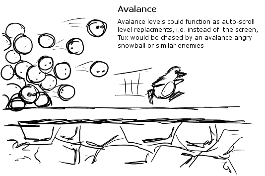
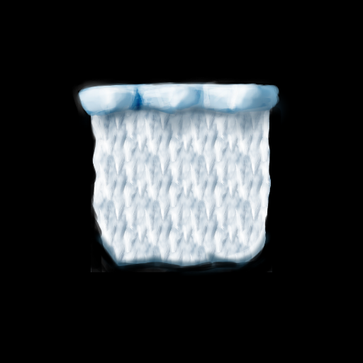
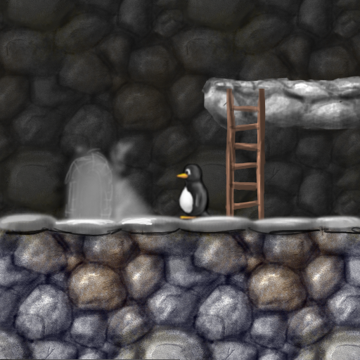
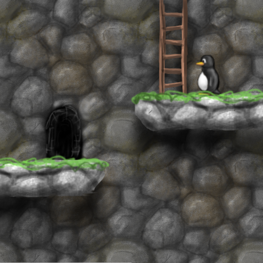
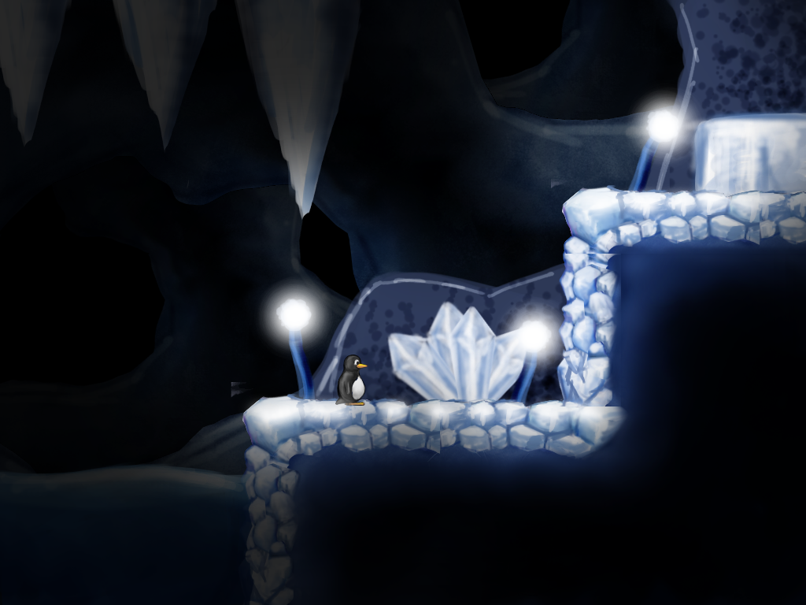
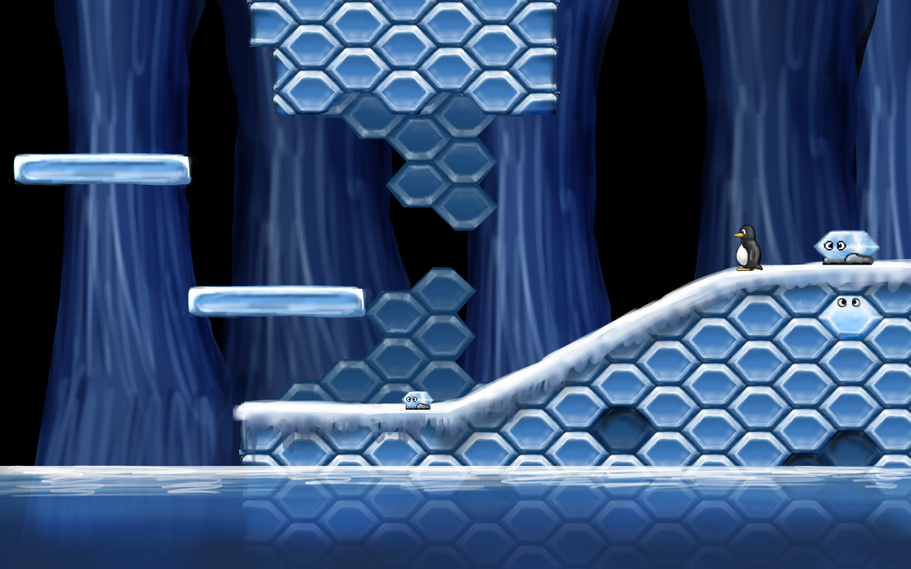
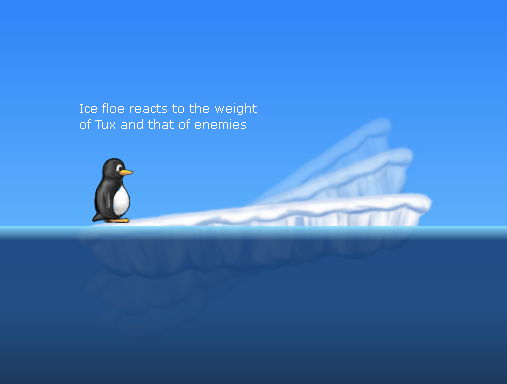

# **Alzter's SuperTux Vision**

**NOTE: This is something I know is not currently feasible, it's more of a far out goal that I may come back to at some point**

## Start fresh

  - Remove all existing content so we don't have to worry about
    supporting every user made thing. It is near impossible to keep
    track of all the ideas we have gotten in the past two decades, but
    it would be good to round up the good ones (places like the
    [SuperTux media directory](https://github.com/SuperTux/media) and
    [grumbel’s filesystem](https://pingus.seul.org/~grumbel/tmp/) have
    great ideas and concept art in them)

  - New engine that is easier to utilize and contribute to, the current
    one seems very difficult to get into or understand. This may clash
    with the more ambitious game idea, so it depends.

  - Opportunity to simplify and improve existing ideas when
    re-implementing them

      - Powerups could be adjusted, it would make much more sense if the
        mushroom equivalent was a fish instead of an egg

      - Make coins have a purpose of some sort, possibly add item shops
        in the worldmap where you can exchange coins for rare or even
        exclusive powerups

      - Re-introduce level timer for extra challenge or incentive

      - Rework the lives system, having coins as lives is too unclear
        and difficult to gauge

      - More interesting usage of lightmap for puzzles

  - Potentially integrate lost ideas like Granitos, Evil Penguin
    (Birdo), factory/industrial level theming, etc.

## Have clear focus, know what we want to be, a fun open source platformer

  - Clear idea for what to do with story mode, revamp the existing level
    theming and visual design to be more appealing and interesting

## Make things fun, nice to look at, polished, dynamic

  - Better menu design than just a list of options, maybe get
    inspiration from things like Pingus?

      - Have selected menu text wiggle and cycle through colours while
        selected, it’s the small fun things that add charm and character

  - Make character animation smoother and more expressive

  - Properly represent characters like Nolok and Penny

  - Larger, more interesting decals and set pieces with animation and
    effects like torch fire, waterfalls, etc.

## New mechanics / ideas

  - More moves for Tux to pull off? This might not be needed and only
    complicate Tux’s moveset, it depends.

  - Water that Tux can swim through, perhaps like Penguin Mario where
    you control direction and flap your arms with action for a boost of
    speed

      - How would we handle enemies in water?

  - Vines that Tux can swing back and forth on, think NSMB.

  - Sliding like a penguin down sloped surfaces, much like how Sonic
    rolls across hills. Might stray too far from current gameplay, it
    depends on how much we want to change things from a tile-based Mario
    platformer to a more Sonic like game with more freeform geometry and
    advanced physics

  - Autoscrolling “avalanche” levels where a horde of enemies like
    rolling snowballs or boulders chase Tux, make scrolling faster
    depending on how far Tux is from the edge to keep a frantic pace

  - Rework Ispys, make them able to interact with more things and make
    the things they interact with clearly marked as so

## More dynamic engine that can make more processes automated

  - Shaders for fire, water, god rays in the forest, proper lighting
    engine that makes light stop at walls instead of acting
    independently of terrain

  - Lightmaps to provide more realistic visuals like SuperTuxKart?

  - Use of puppet tools, 3D models or some alternative to more easily
    and smoothly animate characters? Alternatively, we could keep the
    hand-drawn animation and lean more towards that style for the
    visuals.

  - Support for larger, more freeform tiles that look more dynamic, like
    large rock faces with varied patterns. (see images below)

  - Potentially remove tiles altogether and come up with a new method
    for drawing terrain, maybe something more freeform like Sonic
    Studio? Perhaps use a very fancy script to fill ground shapes with a
    set texture and place tile edges around them?

  - Improved level editor that can place ground on a grid in different
    shapes, like full tiles, slopes, possibly even freeform shapes?

 

  - Have water be more dynamic than simply a tile, have it splash and
    ripple at the surface, use some sort of fancy tech to render it as a
    volume instead of using single tiles

  - Ice floes that tilt depending on the player's weight, and bob up and
    down as the player lands on them 

      - Instead of manually scripting these interactions on a case by
        case basis, have a proper engine that can support it

  - Fix slopes, make them easier to traverse and stop things like
    enemies failing to walk up them or treating them like walls
