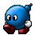
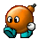
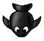

## Miscellaneous Badguys of SuperTux

This page shall describe all enemies, old and new, that can appear in all worlds in as much detail as possible.

Note: For some badguys, we still need to settle down on proper names (e.g. *Cannon* or *Dispenser*).

Mr. Bomb
========

The base behavior of Mr. Bomb is walking around forward but turns around when reaching the edge. When hit he doesn't
get squished, but knocked out and his fuse starts burning. While the fuse is burning he doesn't move, but instead can
be carried around like an iceblock.

After ~5 seconds he then explodes, killing nearby badguys as well. The presence of other Mr. Bombs during explosion
may cause a chain reaction of explosions. He also explodes if he is hit by one of Tux's fireballs, but if hit by an
iceball, he freezes without exploding.

| Property       | Status |
|----------------|--------|
| Squishable     | yes    |
| Buttjumpable   | yes    |
| Burnable       | yes    |
| Freezable      | yes    |

### Comments

> Grumbel: "Time to explosion is too short, blinking
> doesn't signal time to explosion well enough, making it almost
> impossible to carry it around to do anything. Fuse doesn't actually
> burn when activated."

Short Fuse
==========

Short Fuse is a small version of Mr. Bomb, who most commonly approaches Tux in groups. Since their fuse is so short they
will "pop" immediately upon contact. They however are non-lethal to Tux and only work to either distract him and throw
him back or push him into other obstacles.

| Property       | Status |
|----------------|--------|
| Squishable     | yes    |
| Buttjumpable   | yes    |
| Burnable       | yes    |
| Freezable      | no     |

Haywire
=======

A purple walking bomb behaving just like Mr. Bomb, happy to be around until touched without its consent. When jumped on
Haywire his fuse gets activated. This causes him to start chasing Tux at a much faster speed until he explodes.

He can't be carried around but jumping on him when the fuse is burning will cause Tux to bounce and Haywire to be stunned
for a very short moment (fraction of a second). When shot with a fireball Haywire explodes immediately.

| Property       | Status |
|----------------|--------|
| Squishable     | yes    |
| Buttjumpable   | yes    |
| Burnable       | yes    |
| Freezable      | yes    |

### Comments

> Grumbel: "Visually not distinct enough. Sound
> effects terrible. Behaviour change when jumped uppon not dangerous
> enough. See [Concept Art](images/Milestone2-sprites.png)."

Gold Bomb
========

The Gold Bomb has the same behavior as *Mr. Bomb*. The only difference being that upon exploding 10 coins will drop.

| Property       | Status |
|----------------|--------|
| Squishable     | yes    |
| Buttjumpable   | yes    |
| Burnable       | yes    |
| Freezable      | yes    |

SkyDive
=======

A Skydive is a bomb in the shape of a fish that is usually carried around and dropped by
*[Owl](https://github.com/SuperTux/supertux/wiki/Badguys-Forest#Owl)* but can also spawn from droppers.

They fall down to the ground once dropped and explode.

| Property       | Status |
|----------------|--------|
| Squishable     | yes    |
| Buttjumpable   | yes    |
| Burnable       | yes    |
| Freezable      | no     |

Flame
=====

  

Flames are glowing spheres that rotate around in a circle at a set radius, hurting Tux when he gets too close. They are
usually found in castles.

Flames are mostly indestructible. However, while only the ghost flame variant is fully indestructible the normal flame can
be destroyed with an ice ball and the ice flame variant with a fire ball. 

| Property       | Status |
|----------------|--------|
| Squishable     | no     |
| Buttjumpable   | no     |
| Burnable       | varied |
| Freezable      | varied |

Cannon (dispenser)
==================

 

While not a badguy in its own right the cannon most commonly spawns badguys like
*[Kamikaze Snowball](https://github.com/SuperTux/supertux/wiki/Badguys-Icy#Kamikaze)* or
*[Leafshot](https://github.com/SuperTux/supertux/wiki/Badguys-Forest#Leafshot)*. The cannon can be mounted on either static
or rotatable pedestal. It is also possible for the cannon to shoot inanimate, non-badguy objects.

Despite its cannon form, there also exists a dropper and invisible variant.

| Property       | Status |
|----------------|--------|
| Squishable     | no     |
| Buttjumpable   | no     |
| Burnable       | no     |
| Freezable      | yes    |

### Comments

> Grumbel: "Overly complicated and configurable. It
> should focus on one thing and doing it well (i.e. shooting
> snowballs) instead of doing everything and than some. Might be best
> to discard the current `Dispenser` class and replace it with a Canon
> class."

Ispy
====

Ispy is an eye embedded  in a stone housing that works similar to a photoelectric sensor. When Tux can be seen by the eye it
will activate a mechanism, like a door closing or a trap activating.

| Property       | Status |
|----------------|--------|
| Squishable     | no     |
| Buttjumpable   | no     |
| Burnable       | no     |
| Freezable      | no     |

List of miscellaneous badguys as of SuperTux 0.6.2
-------------------------------------------------

-   Mr. Bomb
-   Shortfuse
-   Haywire
-   Gold Bomb
-   Skydive
-   Flame
-   Cannon
-   Ispy

List of miscellaneous badguys in SuperTux 0.1.3
----------------------------------------------

-   Mr. Bomb
-   Flame

---

See also
--------

-   [Milestone 2 Design Document/Enemies](http://supertux.lethargik.org/wiki/Milestone_2_Design_Document/Enemies)
-   [Proposed Badguys](https://github.com/SuperTux/supertux/wiki/Current-Design-Document)
-   [Concept Art](https://github.com/SuperTux/supertux/wiki/Concept-Art)
-   [Bosses](https://github.com/SuperTux/supertux/wiki/Bosses)
-   [Worlds](https://github.com/SuperTux/supertux/wiki/Worlds)

<Category:Badguy>
