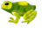

A badguy in SuperTux is a foe of Tux. They may not be "bad" in the way that a hedgehog isn't really bad, but they can certainly hurt Tux. Most of the badguys are creatures, like Snowballs with varying characteristics, but some are more like objects (Stalactite for example) or phenomena like Flame.

Tux will try to avoid approaching badguys if possible. If he runs into one or one drops on his head, he is hurt. When hurt Tux will lose a powerup or, if Tux has no powerups left, he will be killed.

Many of the badguys Tux can knock out by jumping on them and squishing them. Others are only stunned by this for a short while or are insusceptible to this and hurt Tux instead. As a rule of thumb, badguys with a spiky head or helmet can usually not be jumped on. For a list of badguys that can be squished take a look at the squishable badguys category. Most badguys can be killed with the fire- or iceflower power up.

| Badguy | Can appear in... | Introduction | icons |
| ------ | ---------------- | ------------ | ----- |
| [Bouncing Snowball](http://supertux.lethargik.org/wiki/Bouncing_Snowball) | Icy Island | M1 |  |
| [Cannon](http://supertux.lethargik.org/wiki/Cannon) | Any world | M2 | | Icy Island | M2 | |
| [Crystallo](http://supertux.lethargik.org/wiki/Crystallo) | Icy Island | M2 | | OK!
| [Fish](http://supertux.lethargik.org/wiki/Fish) | Any world | M2 | |
| [Flame](http://supertux.lethargik.org/wiki/Flame) | Any world | M1 | |
| [Flying Snowball](http://supertux.lethargik.org/wiki/Flying_Snowball) | Icy Island | M1 | |
| [Haywire](http://supertux.lethargik.org/wiki/Haywire) | Any world | M2 |!(img/badguy/icons/ |
| [Ispy](http://supertux.lethargik.org/wiki/Ispy) | Any world | M2 | |
| [Jumpy](http://supertux.lethargik.org/wiki/Jumpy) | Any world | M1 |!(img/badguy/icons/ |
| [Igel](http://supertux.lethargik.org/wiki/Igel) | Forest | M2 |!(img/badguy/icons/ |
| [Krush and Krosh](http://supertux.lethargik.org/wiki/Krush_and_Krosh) | Icy Island | M2 |!(img/badguy/icons/ |
| [Mole](http://supertux.lethargik.org/wiki/Mole) | Forest | M2 | |
| [Mr. Bomb](http://supertux.lethargik.org/wiki/Mr._Bomb) | Any world | M1 | |
| [Mr. Iceblock](http://supertux.lethargik.org/wiki/Mr._IceBlock) | Icy Island | M1 |!(img/badguy/icons/ |
| [Mr. Snowball](http://supertux.lethargik.org/wiki/Snowball) | Icy Island | M1 |!(img/badguy/icons/ |
| [Mrs. Snowball](http://supertux.lethargik.org/wiki/Mrs._Snowball) | Icy Island | M2 |!(img/badguy/icons/ |
| [Owl](http://supertux.lethargik.org/wiki/Owl) | Any world | M2 | |
| [Poison Ivy](http://supertux.lethargik.org/wiki/Poison_Ivy) | Forest | M2 |
| [Short Fuse](http://supertux.lethargik.org/wiki/Short_Fuse) | Any world | M2 | |
| [Skullyhop](http://supertux.lethargik.org/wiki/Skullyhop) | Forest | M2 |!(img/badguy/icons/ |
| [SkyDive](http://supertux.lethargik.org/wiki/SkyDive) | Any world | M2 |!(img/badguy/icons/ |
| [Sleeping Spiky](http://supertux.lethargik.org/wiki/Sleeping_Spiky) | Any world | M2 |!(img/badguy/icons/ |
| [Snail](http://supertux.lethargik.org/wiki/Snail) | Forest | M2 |!(img/badguy/icons/ |
| [Snowman](http://supertux.lethargik.org/wiki/Snowman) | Icy Island | M2 |!(img/badguy/icons/ |
| [Snowshot](http://supertux.lethargik.org/wiki/Snowshot) | Icy Island | M2 |!(img/badguy/icons/ |
| [Spider](http://supertux.lethargik.org/wiki/Spider) | Forest | M2 |!(img/badguy/icons/ |
| [Spike](http://supertux.lethargik.org/wiki/Spike) | Forest | M2 |!(img/badguy/icons/ |
| [Spiky](http://supertux.lethargik.org/wiki/Spiky) | Any world | M1 | |
| [Stalactite](http://supertux.lethargik.org/wiki/Stalactite) | Icy Island | M1 |!(img/badguy/icons/) |
| [Toad](http://supertux.lethargik.org/wiki/Toad) | Forest | M2 |  |
| [Walking Leaf](http://supertux.lethargik.org/wiki/Walking_leaf) | Forest | M2 |!(img/badguy/icons/)  |
| [Walking Tree](http://supertux.lethargik.org/wiki/Walking_tree) | Forest | M2 |!(img/badguy/icons/)  |
| [Will-o-wisp](http://supertux.lethargik.org/wiki/Will-o-wisp) | Forest | M2 |  |
| [Zeekling](http://supertux.lethargik.org/wiki/Zeekling) | Forest | M2 |  |

##### Further references

* [Milestone 2 Design Document/Enemies](http://supertux.lethargik.org/wiki/Milestone_2_Design_Document/Enemies)
* [Proposed badguys](http://supertux.lethargik.org/wiki/Proposed_Badguys)
* [Badguy concept art](http://supertux.lethargik.org/wiki/Badguys_concept_art)
* [Worlds](https://github.com/SuperTux/supertux/wiki/Worlds)
* [Bosses](http://supertux.lethargik.org/wiki/Bosses)
