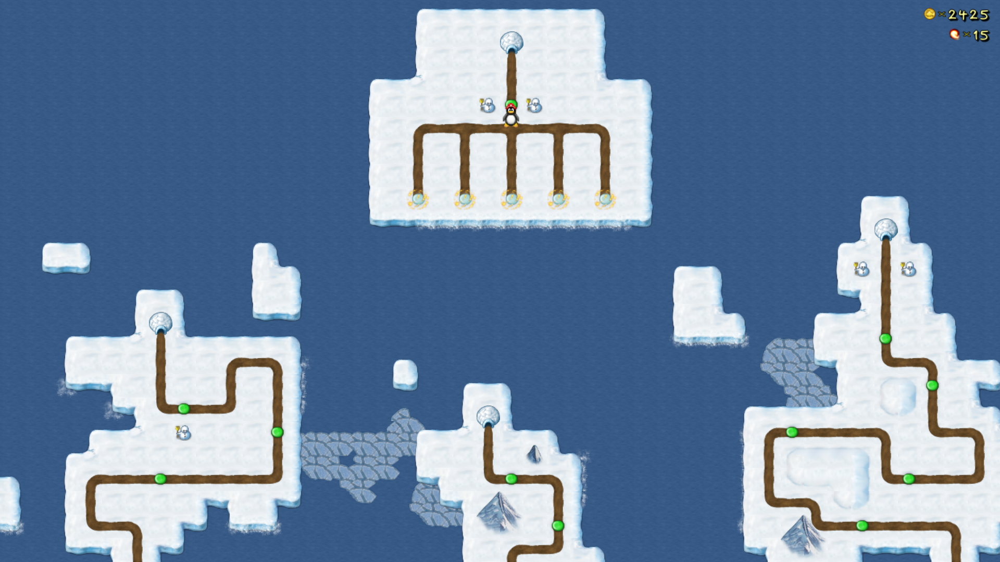

**Bonus Island I** is the first of four Bonus Islands in SuperTux. This world is comprised of levels created by community members in 2004.
This world was first released in *SuperTux 0.1.2*.

It is comprised of five sections, *Thompson's Domain*, *Matr1x' Sector*, the *SuperTux Team Island*, *Abednego's Area*, and *Torfi's Territory*.

---

### Levels

As of May 2022, Bonus Island I features the following levels:

* Bonus Dias!
* Have I been here before?
* Bad Guys Stink!
* Pipe Down Over There
* Something Fishy
* Fire In The Sky
* Castle Gate
* Bonus Island Castle
* A Long Way Home
* Area 42
* Flight Test
* Dungeons but no Dragons
* Lies!
* Train Leaves in One Minute
* A good start
* Too easy
* Still too easy

### Badguys

A list of Badguys for Bonus Island I can be found [here](https://github.com/SuperTux/supertux/wiki/Badguys-Icy).

### End Boss

There is no end boss for Bonus Island I.

---

See also
--------

-   [Icy Island](https://github.com/SuperTux/supertux/wiki/Icy-Island)
-   [Rooted Forest](https://github.com/SuperTux/supertux/wiki/Rooted-Forest)
-   [Worlds](https://github.com/SuperTux/supertux/wiki/Worlds)

<Category:World>
