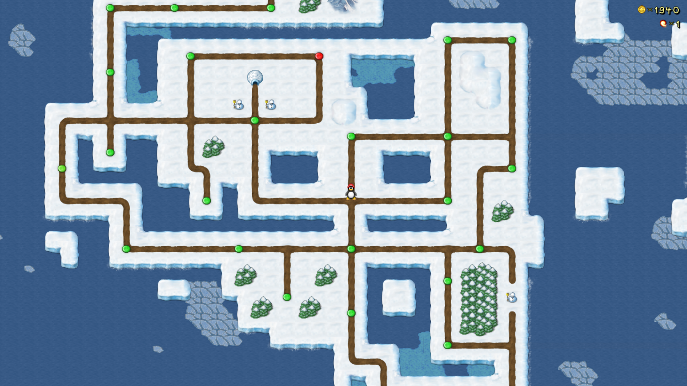

**Bonus Island II** is the second of four Bonus Islands in SuperTux. This world is comprised of levels created by community members between 2004 and 2005.
This world was first released in *SuperTux 0.1.3*. 

It was the last Bonus Island added into SuperTux for over ten years, until Bonus Island III was added in 2015.

---

### Levels

As of May 2022, Bonus Island II features the following levels:

* ...Where Everything Is Possible
* Think Fast, or Die
* Mario's Supposed to Deal With This...
* Into The Cave
* A Cold Day
* A Path Through The Clouds
* Blind To The World
* Tradition
* A Long Journey
* In Flanders Ice Field
* fjerd
* On The Road Again
* Water Ways
* Firestorm
* You have 1 Minute
* High Gravity
* Life Support
* Insert Original Title Here
* The long cave
* Frozen Tunnel
* All That Glistens Is Not Gold
* Cliff Jumping
* snarf
* Nolok's Party Pit
* Castle in the Sky
* Luft Airship
* Fan Fortress
* End Of The Ice Age

### Badguys

A list of Badguys for Bonus Island II can be found [here](https://github.com/SuperTux/supertux/wiki/Badguys-Icy).

### End Boss

There is no end boss for Bonus Island II.

---

See also
--------

-   [Icy Island](https://github.com/SuperTux/supertux/wiki/Icy-Island)
-   [Rooted Forest](https://github.com/SuperTux/supertux/wiki/Rooted-Forest)
-   [Worlds](https://github.com/SuperTux/supertux/wiki/Worlds)

<Category:World>
