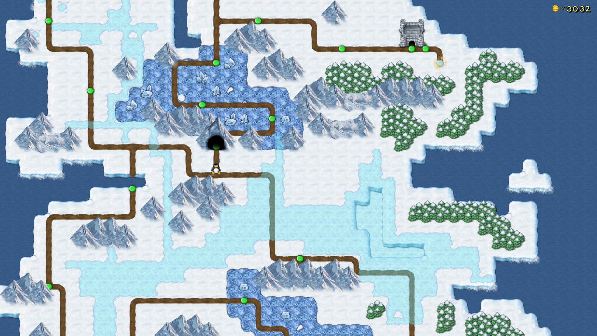
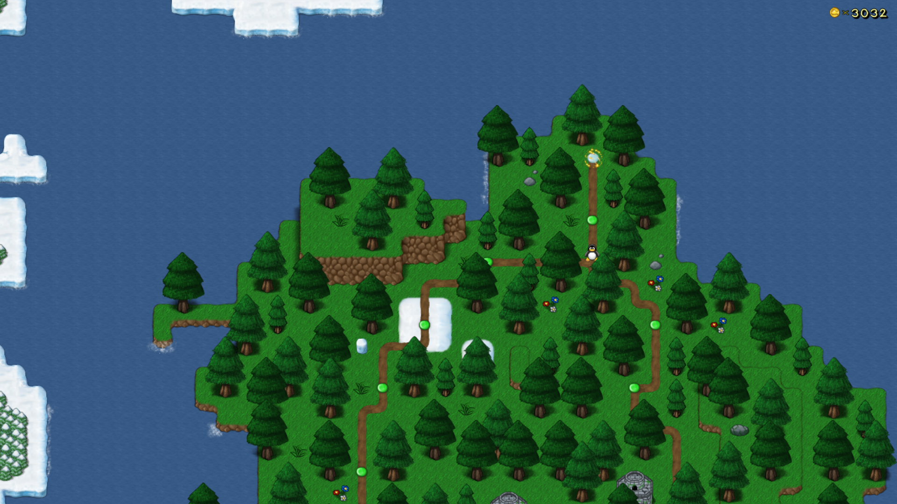

**Bonus Island III** is the third of four Bonus Islands in SuperTux. This world is comprised of levels created by community members between 2010 and 2014.
This world was first released in *SuperTux 0.4.0*.

It is comprised of two major sections, an icy island and a forested island. Upon completion of the icy island, a warp will teleport the player to the forest island.

This worldmap was originally named **Mantis Valley** and featured a collection of levels uploaded by fans to the old bug tracker, however the world has since been expanded to include other add-on levels.

---

### Levels

As of May 2022, Bonus Island III features the following levels:

* Under the Ice
* Hanging From the Roof
* Out on the Crystal Fields
* Another cold day
* A hilly landscape
* Crystal Skies
* Crystal Sunset
* Three Frosty Icebergs
* One Night in the Sky
* My Penny is over the ocean
* It's getting unfinishable
* Flower Bonus
* Pink Snow
* A snowy hill
* After the Glaciers
* Cold Cavern
* Cave Run
* Crystal Cataclysm
* Crystal Beauty
* Snowfall alert
* Holes, a Day on Ice
* Entering the castle
* The dark castle
* The Toilette Zone
* To rain or not to rain - That's the question
* To rain or not to rain - That's the question (Antarctic)
* You can't climb higher than the clouds...
* Some light in the darkness would be fine, thanks!
* Deep, deeper...
* ...deepest!
* The dark castle
* Castle of Light and Darkness
* Going down
* Circles
* Don't miss your ride
* Coconut Fortress
* In the Spring
* ...but no one can stop it...
* Forest Rain (aka "Antarctic Rain")
* The Level Formerly Known As "-89,2 Degrees"
* Red alert! The forest is burning!
* The abandoned castle
* Sewer escape

### Badguys

Bonus Island III uses Badguys from [Icy Island](https://github.com/SuperTux/supertux/wiki/Badguys-Icy) and [Rooted Forest](https://github.com/SuperTux/supertux/wiki/Badguys-Forest).

### End Boss

There is no end boss for Bonus Island III.

---

See also
--------

-   [Icy Island](https://github.com/SuperTux/supertux/wiki/Icy-Island)
-   [Rooted Forest](https://github.com/SuperTux/supertux/wiki/Rooted-Forest)
-   [Worlds](https://github.com/SuperTux/supertux/wiki/Worlds)

<Category:World> 
