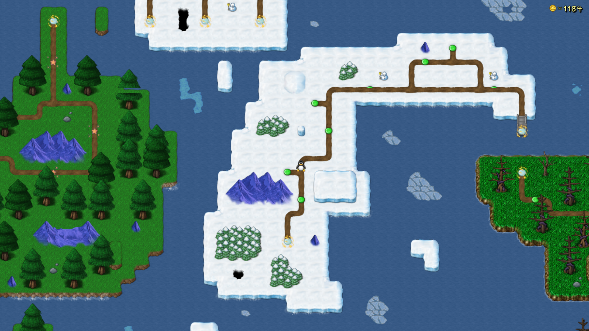
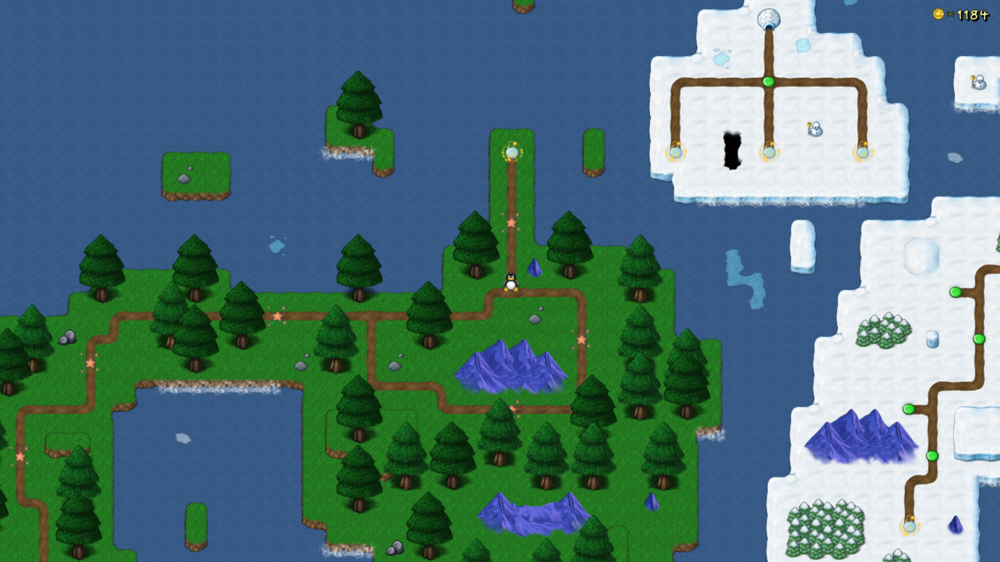
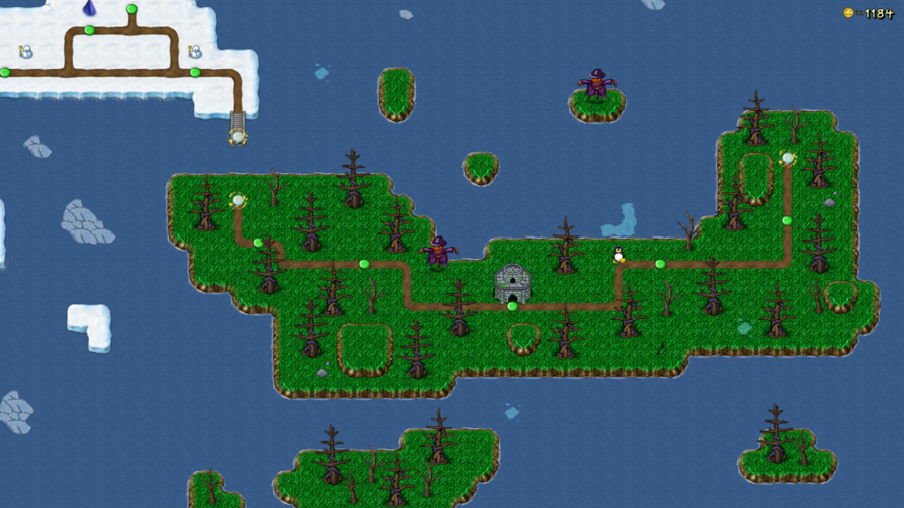

**Bonus Island IV** is the fourth and final Bonus Island in SuperTux. This world is comprised of levels created by community members in 2019.
This world was first released in *SuperTux 0.6.1*.

It is comprised of three sectors, an arctic sector, a forest sector, and a Halloween sector.

---

### Levels

As of May 2022, Bonus Island IV features the following levels:

* Glacier Danger
* SnowMan's Land
* Beginning The Journey
* Let's Climb That Mountain!
* The Way Of The Snow
* Generic Snow Level
* Crystal Mania
* Snowy Sunset
* Some Icy Path
* Forest Mountains
* Too Much Water
* Night Terrors
* Feeling The Nature
* Sky High
* Fog And Mist
* Rainy Swamps
* Cave Of Dreams
* Sunshine Valley
* A Narrow Path
* Cold Forest
* A Penguin In The Bushes
* Two Tiny Towers
* It's Halloween Time!
* Halloween Fields
* Spooky Mansion
* Deeper Into The Mountains
* Stormy Night

### Badguys

Bonus Island IV uses Badguys from [Icy Island](https://github.com/SuperTux/supertux/wiki/Badguys-Icy) and [Rooted Forest](https://github.com/SuperTux/supertux/wiki/Badguys-Forest).

### End Boss

There is no end boss for Bonus Island IV.

---

See also
--------

-   [Icy Island](https://github.com/SuperTux/supertux/wiki/Icy-Island)
-   [Rooted Forest](https://github.com/SuperTux/supertux/wiki/Rooted-Forest)
-   [Worlds](https://github.com/SuperTux/supertux/wiki/Worlds)

<Category:World>
