If you like to checkout what's planned for upcoming characters and/or other mechanics take a look at our [current design document](https://github.com/SuperTux/supertux/wiki/Current-Design-Document).

Main Characters
===============

Tux
---

  
Concept Art

Tux the Penguin is the main character and protagonist of SuperTux. Tux's goal in SuperTux is to rescue his
girlfriend Penny from the evil Nolok.

Tux has to chase down Nolok through different worlds with different climates, but will have different
[actions](https://github.com/SuperTux/supertux/wiki/Actions) to help him in his rescue attempt.

Penny
-----

  
Concept Art

  

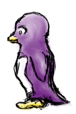

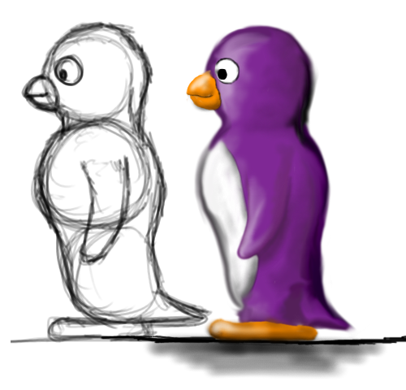

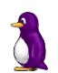

Penny the Penguin is the girlfriend of Tux who has been kidnapped by the evil Nolok during a nice picnic with
her beloved Tux.

While all attempts to escape by herself have failed, she manages to provide Tux with helpful information about her
situation through secret letters. But perhaps Nolok has even taken that into account?

Nolok
-----

  
Concept Art

  
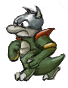
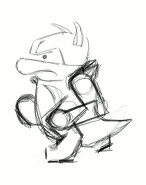

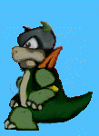
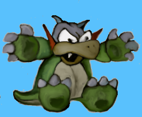

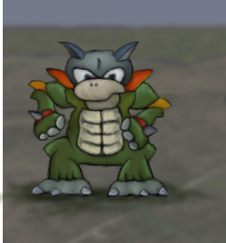

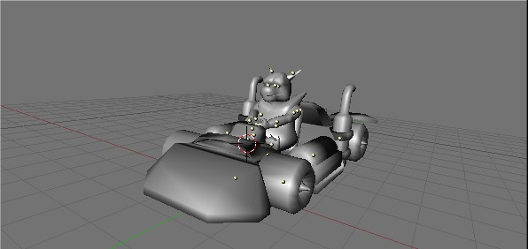

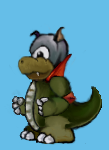

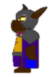

Nolok the crocodile is the main enemy of Tux, the antagonist of SuperTux. During a lovely picnic between Tux and his
beloved Penny, Nolok jumps out from behind an ice bush causing a bright flash to appear blinding Tux. He then captures
Penny leaving only a note behind.

As a predator, Nolok derives pleasure and entertainment from the sorrow of others resulting in him kidnapping Tux's
girlfriend Penny and sending him on a long and dangerous journey to the unknown.

To impede Tux's journey throughout several worlds, Nolok sends out his minions and followers.

Nolok is also the final boss of story mode. Nolok resides at [Nolok's Mountain Peak](Mountain-Peak "wikilink"). He is equipped with a mighty staff that gives him access to many powerful spells.

Badguys
=======

List of badguys:

- [Icy Island](https://github.com/SuperTux/supertux/wiki/Badguys-Icy)
- [Rooted Forest](https://github.com/SuperTux/supertux/wiki/Badguys-Forest)
- [Miscellaneous](https://github.com/SuperTux/supertux/wiki/Badguys-Misc)
- [Bosses](https://github.com/SuperTux/supertux/wiki/Bosses)

A badguy in SuperTux is a foe of Tux, serving as Nolok's minion. They may not be "bad" in the way that a snowball isn't really bad, but they can certainly hurt Tux. Most of the badguys are creatures, like Snowballs with varying characteristics, but some are more like objects (Stalactite for example) or phenomena like Flame.

Tux will try to avoid approaching badguys if possible. If he runs into one or one drops on his head, he is hurt. When hurt Tux will lose a powerup or, if Tux has no powerups left, he will be killed.

Many of the badguys Tux can knock out by jumping on them and squishing them. Others are only stunned by this for a short while or are insusceptible to this and hurt Tux instead. As a rule of thumb, badguys with a spiky head or helmet can usually not be jumped on.

For a list of the game's badguys and their properties take a look at the badguy categories below.

  
Unsorted art

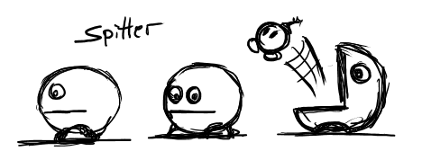
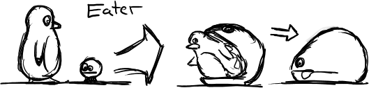
 

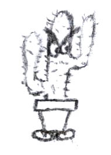

Special thanks to the students at Anderson Middle School.

Proposed list of characters
===========================

Fluffy
------

Fluffy is a penguin that never moulted from his original fluffy feathers, so he looks like a baby penguin. He is
a good friend of Tux and Penny. However, he can't run as fast as Tux, but he can jump higher. Fluffy would be a
second character for multiplayer which the person playing the game could control instead of Tux.

Granito
-------

  
Concept Art

Granitos are rock-like creatures living in the rooted forest and plagued by the Ghost Tree corrupting their land.

Gandrus
-------

Gandrus is a big imposing walrus with a beard acting as a shopkeeper for the planned item shops.

See also
--------

-   [Milestone 2 Design Document/Enemies](http://supertux.lethargik.org/wiki/Milestone_2_Design_Document/Enemies)
-   [Worlds](https://github.com/SuperTux/supertux/wiki/Worlds)

