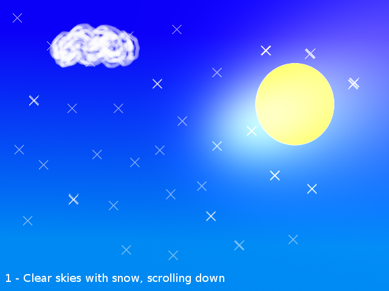
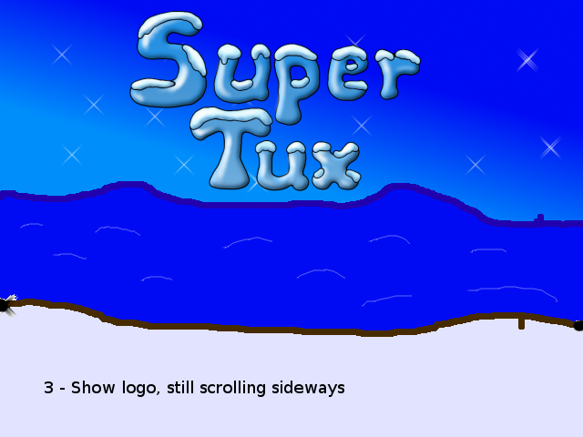
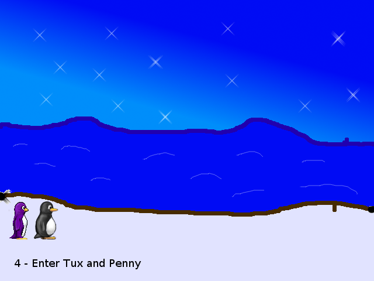

Detailed Storyboard - Intro Cutscene
------------------------------------

**Download the accompanying soundtrack here:** <http://www.wansti.de/tmp/tux_intro_concept.ogg>

The numbers below the images show which part of the sound file belongs to which image.

(0:00-0:15)

Fade in, start with the sky. Clouds, snow and sun (an animated sunrise would be cool!). Scroll down.

(0:15-0:27)

Stop scrolling down when the coastline is visible. Start scrolling to the right.

(0:27-0:35)

While still scrolling sideways, show the title logo.

(0:35-0:58)

(For some weird reason, the image doesn't show here.) Tux and Penny enter the screen from the left and walk to the right.

(0:58-1:12)

Tux and Penny having a picnic. Dialogue.

(1:12-1:31)

Tux dances and sings to the music.

...to be continued.
