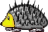
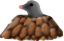
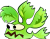
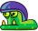
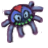
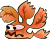
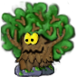
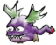
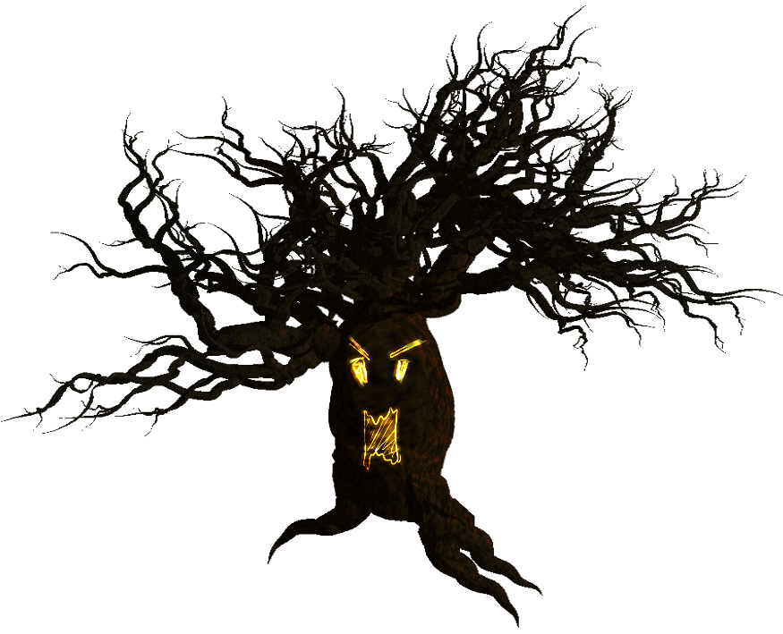

| Badguy | Can appear in... | Introduction | icons |
| ------ | ---------------- | ------------ | ----- |
| [Igel](http://supertux.lethargik.org/wiki/Igel) | Forest | M2 | |
| [Mole](http://supertux.lethargik.org/wiki/Mole) | Forest | M2 | |
| [Poison Ivy](http://supertux.lethargik.org/wiki/Poison_Ivy) | Forest | M2 |
| [Snail](http://supertux.lethargik.org/wiki/Snail) | Forest | M2 | |
| [Spider](http://supertux.lethargik.org/wiki/Spider) | Forest | M2 | |
| [Toad](http://supertux.lethargik.org/wiki/Toad) | Forest | M2 |  |
| [Walking Leaf](http://supertux.lethargik.org/wiki/Walking_leaf) | Forest | M2 |  |
| [Walking Tree](http://supertux.lethargik.org/wiki/Walking_tree) | Forest | M2 |  |
| [Will-o-wisp](http://supertux.lethargik.org/wiki/Will-o-wisp) | Forest | M2 |  |
| [Zeekling](http://supertux.lethargik.org/wiki/Zeekling) | Forest | M2 |  |

Mole
===================

-   Name=Mole
-   Image=
-   FoundIn=[Forest](Forest "wikilink")
-   Appearance=A molehill.
-   Behaviour=Static. From time to time, the mole peeks out.
-   Squish=yes
-   Buttjump=yes
-   Freeze=no
-   Burnable=yes
-   FirstVersion=

:   *This [badguy](badguy "wikilink") has been removed from the
    [Milestone 2](Milestone_2 "wikilink") branch in
    [6281](Template:Revision "wikilink").*

The **Mole** is a [badguy](badguy "wikilink") found in the
[Forest](Forest "wikilink"). He's usually underground, so that only his
molehill can be seen. He throws out small rocks in random directions
that can hurt [Tux](Tux "wikilink"). From time to time, he peeks out
which is the time in which Tux can squish him by jumping on him.

Poison\_Ivy
===================

-   Name=Poison Ivy
-   Image=Poisonivy.png
-   FoundIn=[Forest](Forest "wikilink")
-   Appearance=A green or red plant with teeth.
-   Behaviour=Walks around. Falls down from every ledge.
-   Squish=yes
-   Buttjump=yes
-   Freeze=no
-   Burnable=yes
-   FirstVersion=0.3

**Poison Ivy** is a [badguy](badguy "wikilink") found in the
[Forest](Forest "wikilink") of world 2. The plant roams around at the
ground, falling from platforms.

### Proposed behavior

-   Advanced forms of Poison Ivy could have the ability to flap their
    leaf-wings, then (after some flapping) do a short hop towards Tux

### See also

-   [Walking tree](Walking_tree "wikilink")
-   [Walking leaf](Walking_leaf "wikilink")

Igel
===================

-   Name=Igel
-   Image=
-   FoundIn=[Forest](Forest "wikilink")
-   Appearance=Looks like a common hedgehog.
-   Behaviour=Walks around. Stays on platforms.
-   Squish=no
-   Buttjump=no
-   Freeze=yes
-   Burnable=yes
-   FirstVersion=

**Igel** is a [badguy](badguy "wikilink") in the second world of
*SuperTux*, the [Forest](Forest "wikilink"). Igel cannot be squished or
[buttjumped](buttjump "wikilink") due to its spines but they can be shot
with a [fireflower](fireflower "wikilink") when facing
[Tux](Tux "wikilink").

The term “Igel” is German for “hedgehog”, which is precisely why the
*Igel* in the game look like hedgehogs.

### Proposed behavior

:   ''Note: The behavior described below differs from the behavior
    currently implemented in the development version of *SuperTux*.''

Although basically vulnerable to shots that hit the soft head, Igel will
immediately curl up for some seconds as soon as being shot at, thus
either absorbing or deflecting the shot.

Upon reaching a ledge or when [Tux](Tux "wikilink") stands less than 5
tiles behind Igel, Igel will slowly turn around, facing the camera and
thus exposing the only weakness: When hit by a bullet while facing the
camera, Igel will flip over for some seconds and can be squished by
jumping on the exposed belly.

Snail
===================

-   Name=Snail
-   Image=Snowsnail.png
-   FoundIn=[Forest](Forest "wikilink")
-   Appearance=A green snail with a purple helmet.
-   Behaviour=Moves around, falling from platforms.
-   Squish=yes
-   Buttjump=yes
-   Freeze=yes
-   Burnable=yes
-   FirstVersion=0.3

**Snail** or **Slow Snail** is a [badguy](badguy "wikilink") found in
the [Forest](Forest "wikilink"). When jumped upon, flips over. When
flipped over, further jumps on it will kick it around, hurting
everything in its way. Dies when [buttjumped](buttjump "wikilink") or
after being squished for a number of times.

### Design considerations

The *Snow Snail* should be an enhanced counterpart to [Icy
Island](Icy_Island "wikilink")'s [Mr.
IceBlock](Mr._IceBlock "wikilink"). They currently share the same
behaviour, i.e. Tux can jump on it to make it stop, carry it around
and/or kick it to use it as a projectile. In addition to that, the Snow
Snail could stop from time to time and excrete puddles of slime that
cover the ground and disappear after a certain amount of time. Whenever
Tux steps into such a puddle, his movement is slowed down and he cannot
jump until he slowly worked his way out of the trap or the puddle
disappears by itself.

The Snow Snail should move slower than Mr IceBlock and speed up whenever
Tux is in its visible area, especially when he's trapped in a slime
puddle.

Since the Snail is used in the forest world, the name might be changed
to Slow Snail

-   Proposed modified behaviour:
    -   When flipped over and bumped horizontally, the Snail will just
        flip back on its feet
    -   When flipped over and jumped on one end, the Snail will fly not
        only horizontally but also vertically
    -   When it hits a wall while flying it will turn back on its feet

Walking\_totem
===================

-   Name=Walking totem
-   Image=Walking1.png
-   FoundIn=*none yet*
-   Appearance=A walking totem.
-   Behaviour=Walks around. Falls down from all cliffs.
-   Squish=yes
-   Buttjump=yes
-   Freeze=no
-   Burnable=yes
-   FirstVersion=Milestone 3

:   *This [badguy](badguy "wikilink") has been removed from the
    [Milestone 2](Milestone_2 "wikilink") branch in
    [6280](Template:Revision "wikilink").*

**Walking totem** is a [badguy](badguy "wikilink") that's not widely
used. It may be used in [Forest](Forest "wikilink") levels in the
future, though.

There is some “stacking” and “carrying” code in the SVN repository,
which is probably a preparation for the functionality described below.
Currently, only one segment is implemented – layered totems squish the
ones below them.

### Design considerations

<Template:Proposed>

Walking Totem Poles could be especially interesting, as they generally
have many faces... Perhaps as Tux jumps on them it breaks apart into
smaller totems each with a different face.

This or a big Walking Tree could be used as a Boss.

Behaviour: Walks, might spit electricity or fire

Look: A multifaced Totem Pole

Hurt Tux: spitting, run over Tux

Hurt it: jump at it to break into smaller Totems which can be jumped on
or spat at.

### Comments

-   It could be interesting to have the Walking Totem only loose its
    topmost face when Tux jumps on it
-   Yeah, and it would be even better if Tux has to butt-jump.
-   that would be very hard!
-   the walking tree looks so good, better than a coming-from-nowhere
    totem!
-   The Walking Totem looses only its topmost face when Tux jumps NORMAL
    on it, and it looses more faces when Tux butt-jump on it
-   maybe each face shoots, and when one is squashed, it will not shoot.

Toad
===================

-   Name=Toad
-   Image=
-   FoundIn=[Forest](Forest "wikilink")
-   Appearance=Poisonous Toad
-   Behaviour=Takes long leaps at regular intervals.
-   Squish=yes
-   Buttjump=yes
-   Freeze=no
-   Burnable=yes
-   FirstVersion=

**Toad** is a [badguy](badguy "wikilink") found in the
[Forest](Forest "wikilink"). It follows [Tux](Tux "wikilink") by jumping
around in large leaps. Can be squished by jumping on it.

Walking\_tree
===================

-   Name=Walking tree
-   Image=Walk-left-6.png
-   FoundIn=[Forest](Forest "wikilink")
-   Appearance=A walking tree with eyes.
-   Behaviour=Walks around. Stays on platforms.
-   Squish=yes
-   Buttjump=yes
-   Freeze=yes
-   Burnable=yes
-   FirstVersion=0.3

**Walking tree** (sometimes also **Mr. Tree**) is a
[badguy](badguy "wikilink") in the [Forest](Forest "wikilink"). When
jumped on by [Tux](Tux "wikilink"), breaks into two [Poison
Ivy](Poison_Ivy "wikilink") and one [Stumpy](Stumpy "wikilink").

### Design considerations

:   *This section may be outdated.*

Hurt [Tux](Tux "wikilink") Option 1: Run over him.

Hurt [Tux](Tux "wikilink") Option 2: Runs over him and throws harmful
objects at him. Mr.tree starts throwing fire balls after being hit with
a fire shot from Tux.

Hurt [Tux](Tux "wikilink") Option 3: Mr.Tree throws (spawns) harmful
leaf/hair clump creatures by pulling clumps from his head. These
leaf/weed creatures attack Tux.

Hurt the enemy Option 1: Jump onto it.

Hurt the enemy Option 2: Knock down Mr.Tree by throwing a Snail shells
at him. Snails creatures can be stunned and then thrown at the tree. If
Mr.Tree is hit with fire the animation changes and Mr.tree starts
throwing fire balls at Tux. It is not a good idea for the player to
light trees on fire, it just makes Mr.Tree mad.

Additional and/or Future Gameplay Ideas: [Tux](Tux "wikilink") could
jump into the tree from under and control them since they're hollow, but
only if Tux is invulnerable. However, he can't jump inside them, other
than out of them.

Side Notes: normal trees in the background may shake their branches to
disturb [Tux](Tux "wikilink") and other creatures. Also, nonwalking
trees in the background might shake their branches disturbing Tux and
other creatures.

There might be rolling logs as well. Floating logs could also be useful
when crossing a river/waterfall; Tux could control them if he jumped on
them.

### Proposal for burning Mr. Tree

When Mt. Tree is hit by a fireball, it might be set on fire. A burning
Mr Tree runs around, killing small enemies (like Poison Ivies) and
setting on fire other Mr Trees and straw blocks. If a burning tree hits
Mr Bomb, they both die (Mr Bomb explodes). After a while, Mr Tree's
leaves will burn completely, reducing it to a normal Stumpy (or killing
it). A burning tree might be immune to fireballs.

### Proposal for Spooky Mr Tree

In Ghost forest, Mr Tree could have no leaves and have a carved out,
spooky face with jagged branches. In Milestone 0.3, Mr Tree releases one
or two Poison Ivies when jumped on. Spooky Mr Tree could release bats or
some such thing.

### Proposal for Branches

Mr Tree could have a thin branch sticking out either side of him which
Tux can stand on to be carried around. This could serve a purpose if
there was something that badguys could walk through but Tux couldn't.

Walking\_leaf
===================

-   Name=Walking leaf
-   Image=Leaf.png
-   FoundIn=[Forest](Forest "wikilink")
-   Appearance=Reddish version of [Poison Ivy](Poison_Ivy "wikilink").
-   Behaviour=Walks around. Stays on platforms.
-   Squish=yes
-   Buttjump=yes
-   Freeze=no
-   Burnable=yes
-   FirstVersion=

**Walking Leaf** is a [badguy](badguy "wikilink") in the
[Forest](Forest "wikilink") world. It is a bit smarter than the ordinary
badguy because it does not fall off of platforms. The leaf will hurt
[Tux](Tux "wikilink") on contact and can be killed the usual ways. Since
it is more careful, it is walks a bit slower than the average badguy.

Will-o-wisp
===================

-   Name=Will-o-wisp
-   Image=Willowisp.png
-   FoundIn=[Forest](Forest "wikilink")
-   Appearance=Small green patch of light
-   Behaviour=Moves towards and follows [Tux](Tux "wikilink").
-   Squish=no
-   Buttjump=no
-   Freeze=no
-   Burnable=no
-   FirstVersion=

The **Will-o-wisp** is a mean little [badguy](badguy "wikilink") found
in the haunted regions of the [Forest](Forest "wikilink"). When
[Tux](Tux "wikilink") comes close, it will start to follow him slowly.
Once it reaches Tux, he will be teleported to another, possibly
dangerous part of the level. If Tux manages to get out of reach of the
*Will-o-wisp*, it will stop following him.

Zeekling
========

-   Name=Zeekling
-   Image=
-   FoundIn=[Forest](Forest "wikilink")
-   Appearance=Purple, winged critter
-   Behaviour=Flies left and right high above ground. Dives to hit
    [Tux](Tux "wikilink").
-   Squish=yes
-   Buttjump=yes
-   Freeze=no
-   Burnable=yes
-   FirstVersion=0.3

**Zeekling** is a [badguy](badguy "wikilink") found in the
[Forest](Forest "wikilink"). It flies left and right in a straight path,
usually near the top of the level. When [Tux](Tux "wikilink") is below
it, will dive down to hit him. Tux can avoid being hit by hiding
underneath platform and other solid blocks.

Should be removed from Forest World for now.

Boss: Ghost Tree
================

The ghost tree is planned as the end boss for the forest world. It is not added yet but a incomplete version could be found in the test collection in contributed levels.

-   The tree is walking left/right, there will be platforms around the tree so tux can jump these to avoid getting hit
-   The tree is growing roots from the ground to attack you
-   The tree is glowing in a color that changes from time to time
-   The tree is sucking in colored will-o-wisp like things that have the same color as himself
-   Sucked in will-o-wisps make him grow
-   You destroy the tree by throwing something in a different color at him (lamps or arcorns?)

Sketch 2
--------

Less blue, more brown

<Category:Boss>
