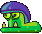
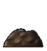

## Badguys of Rooted Forest

This page shall describe all enemies, old and new, that appear in Rooted Forest in as much detail as possible.

Note: For some badguys, we still need to settle down on proper names (e.g. *Mr. Tree* or *Walking Tree*).

Poison Ivy
==========

Poison Ivy is a vicious plant which walks straight forward and falls when reaching the edge of a platform. Due
to it flapping its wings while falling it starts hovering slowly towards the ground (not implemented yet).

| Property       | Status |
|----------------|--------|
| Squishable     | yes    |
| Buttjumpable   | yes    |
| Burnable       | yes    |
| Freezable      | yes    |

Walking Leaf
============

Walking Leaf is a bit smarter than the ordinary *Poison Ivy* because it does not fall off of platforms. Since it
is more careful, it walks a bit slower than the average badguy.

| Property       | Status |
|----------------|--------|
| Squishable     | yes    |
| Buttjumpable   | yes    |
| Burnable       | yes    |
| Freezable      | yes    |

Leafshot
========

A plant that decided falling from a tree is not the most exciting part in life went ahead and hoped to
one day be shot back into a tree. Sadly, the lack of hands makes it impossible for Leafshot to point the
[cannon](https://github.com/SuperTux/supertux/wiki/Misc-Badguys#Cannon) upwards. Thus the cannon only
shoots him out in a straight line until crashing.

| Property       | Status |
|----------------|--------|
| Squishable     | yes    |
| Buttjumpable   | yes    |
| Burnable       | yes    |
| Freezable      | yes    |

Mr. Tree (walkingtree)
======================

 

A walking tree crowned with luscious green leaves. Jumping on Mr. Tree will cause him to break into 2-3 *Poison Ivy*
and one *Stumpy*, a leaf-less version of Mr. Tree.

Buttjumping Mr. Tree will defeat the entire tree without spawning any *Poison Ivy*.

| Property       | Status |
|----------------|--------|
| Squishable     | yes    |
| Buttjumpable   | yes    |
| Burnable       | yes    |
| Freezable      | yes    |

### Idea proposal

When Mt. Tree is hit by a fireball, it might be set on fire. A burning
Mr. Tree runs around, killing small enemies (like Poison Ivies) and
setting on fire other Mr Trees and straw blocks. If a burning tree hits
Mr Bomb, they both die (Mr Bomb explodes). After a while, Mr Tree's
leaves will burn completely, reducing it to a normal Stumpy (or killing
it). A burning tree might be immune to fireballs.

Snail
=====

The Snail behaves similar to Poison Ivy while falling at normal speed. When buttjumped upon the snail will flips over.
When flipped over, further jumps on it will kick it around, hurting everything in its way and can die after being
squished again for a number of times. Snails can also be carried and thrown at other badguys.

| Property       | Status |
|----------------|--------|
| Squishable     | no     |
| Buttjumpable   | yes    |
| Burnable       | yes    |
| Freezable      | yes    |

Igel
====

Igel (*German for "hedgehog"*) are spiky fellows that cannot be squished or buttjumped due to their spines but they can
be shot with a projectile. Once shot they will be pushed back. They are defeated by pushing them close enough to a
wall or a ledge.

| Property       | Status |
|----------------|--------|
| Squishable     | no     |
| Buttjumpable   | no     |
| Burnable       | yes    |
| Freezable      | yes    |

### Idea proposal

Although basically vulnerable to shots that hit the soft head, Igel will
immediately curl up for some seconds as soon as being shot at, thus
either absorbing or deflecting the shot.

Upon reaching a ledge or when Tux stands less than 5
tiles behind Igel, Igel will slowly turn around, facing the camera and
thus exposing the only weakness: When hit by a bullet while facing the
camera, Igel will flip over for some seconds and can be squished by
jumping on the exposed belly.

Jumpy (woodjumpy)
=================

Jumpy is a wooden barrel with metal spikes attached to it. He jumps up and down and stays stationary on the same position.
His viewing direction follows Tux.

The simplest way of avoiding him is usually to run below him or jump over him at the right time.

| Property       | Status |
|----------------|--------|
| Squishable     | no     |
| Buttjumpable   | no     |
| Burnable       | yes    |
| Freezable      | yes    |

### Comments

> RustyBox: "Current design looks to bland and boring. Potentially something similar to
> [this](https://forum.freegamedev.net/viewtopic.php?f=68&t=7281&p=85667&hilit=forest#p71897)
> with some vines"

Fish
====

Fish is a badguy that jumps out of water. When Tux has to cross the water he has to pay attention to the fish so he
doesn't get caught.

| Property       | Status |
|----------------|--------|
| Squishable     | no     |
| Buttjumpable   | no     |
| Burnable       | yes    |
| Freezable      | yes    |

### Idea proposal

There should be a few different types of fish:

1.  Standard up-and-down movement
2.  Curving Jump landing in a different place, going back and forth
3.  Archer Fish
    -   Stays below the surface of the water, but follows tux when he is
        on platforms above
    -   Shoots high pressure water which can break blocks and knock Tux
        into water where the archer fish can get him
4.  Swordfish
    -   Curving Jump following Tux and jumping higher when there is a
        chance to get Tux

### Comments

> Grumbel: "Doesn't look dangerous enough, not obvious
> if he can be jumped up on. Maybe make it bigger and actually eat Tux."

Mole
====

The Mole is usually found in the underground or near a cave, inside his molehill. He throws out small rocks in random
directions that can hurt Tux. From time to time, he peeks out which is the time in which Tux can squish him by jumping
on him.

| Property       | Status |
|----------------|--------|
| Squishable     | yes    |
| Buttjumpable   | yes    |
| Burnable       | yes    |
| Freezable      | yes    |

Rock Crusher
============

 

Rock Crushers and their mossy counterpart are enemies that are hanging on the ceiling or walls. When Tux gets within one tile they
will attempt to crush Tux into the nearest wall or floor. After they hit a wall, they slowly drift back up. On this “return trip”,
Tux may safely climb on top of them and hitch a ride. When in their resting position, their eyes shall follow Tux.

| Property       | Status |
|----------------|--------|
| Squishable     | no     |
| Buttjumpable   | no     |
| Burnable       | no     |
| Freezable      | no     |

Owl
===

A flying enemy that flies high up in the air and carries either badguys or objects around. When Tux is below it,
it will drop whatever it is carrying. Most of the time Owl is carrying a single
*[Skydive](https://github.com/SuperTux/supertux/wiki/Misc-Badguys#Skydive)*.

| Property       | Status |
|----------------|--------|
| Squishable     | yes    |
| Buttjumpable   | yes    |
| Burnable       | yes    |
| Freezable      | no     |

Zeekling
========

Zeekling flies left and right in a straight path, usually near the top of the level. When Tux is below it, it will dive
down to hit him. Tux can avoid being hit by hiding underneath platforms and other solid blocks or simply running away.

| Property       | Status |
|----------------|--------|
| Squishable     | yes    |
| Buttjumpable   | yes    |
| Burnable       | yes    |
| Freezable      | yes    |

Skullyhop
=========

As the name would suggest, Skullyhop is a skull with two feet that hops around chasing Tux in the process. They can be
simply defeated by jumping on them.

| Property       | Status |
|----------------|--------|
| Squishable     | yes    |
| Buttjumpable   | yes    |
| Burnable       | yes    |
| Freezable      | yes    |

Dart Trap
=========

The Dart Trap is a stationary skull imbedded on a wall shooting out glowing darts out of its mouth in regular intervals.
The darts fly in a straight line, hurt Tux and cannot be destroyed.

| Property       | Status |
|----------------|--------|
| Squishable     | no     |
| Buttjumpable   | no     |
| Burnable       | no     |
| Freezable      | no     |

Spidermite
==========

Spidermites are simply moving up and down, hurting Tux on contact, but Tux can squished nonetheless.

| Property       | Status |
|----------------|--------|
| Squishable     | yes    |
| Buttjumpable   | yes    |
| Burnable       | yes    |
| Freezable      | yes    |

Livefire
========

A living flame with two eyes and burning feet that disguises itself as a stationary flame and moves around
back and forth once awoken.

| Property       | Status |
|----------------|--------|
| Squishable     | no     |
| Buttjumpable   | no     |
| Burnable       | no     |
| Freezable      | yes    |

### Idea proposal

Instead of either walking around or doing so after waking up,
Livefire should only be disguises itself as a stationary flame
and then move or only move when Tux turns his back on him.

Will-o-wisp
===========

Will-o-wisp is a mean little wisp found in the haunted areas of the Forest. When Tux comes close, it will start to
follow him slowly. Once it reaches Tux, he will be teleported to another, possibly dangerous part of the level.

If Tux manages to get out of reach of the Will-o-wisp, it will stop following him.

| Property       | Status |
|----------------|--------|
| Squishable     | no     |
| Buttjumpable   | no     |
| Burnable       | no     |
| Freezable      | no     |

Ghost Tree
==========

The ghost tree is the planned boss enemy that awaits Tux in the second castle. It is not fully implemented yet and only
an unfinished version of it and its incomplete graphics can be found in the game.

For more information on bosses, see [Bosses](https://github.com/SuperTux/supertux/wiki/Bosses).

List of Rooted Forest's badguys as of SuperTux 0.6.2
----------------------------------------------------

-   Poison Ivy
-   Walking Leaf
-   Leafshot
-   Snail
-   Igel
-   Jumpy
-   Fish
-   Mole
-   Rock Crusher
-   Owl
-   Zeekling
-   Skullyhop
-   Dart Trap
-   Spidermite
-   Livefire
-   Will-o-wisp
-   Ghost Tree

List of Rooted Forest's badguys in SuperTux 0.1.3
-------------------------------------------------

-   Fish
-   Jumpy

See also
--------

-   [Milestone 2 Design Document/Enemies](http://supertux.lethargik.org/wiki/Milestone_2_Design_Document/Enemies)
-   [Proposed Badguys](https://github.com/SuperTux/supertux/wiki/Current-Design-Document)
-   [Concept Art](https://github.com/SuperTux/supertux/wiki/Concept-Art)
-   [Bosses](https://github.com/SuperTux/supertux/wiki/Bosses)
-   [Worlds](https://github.com/SuperTux/supertux/wiki/Worlds)

<Category:Badguy>
