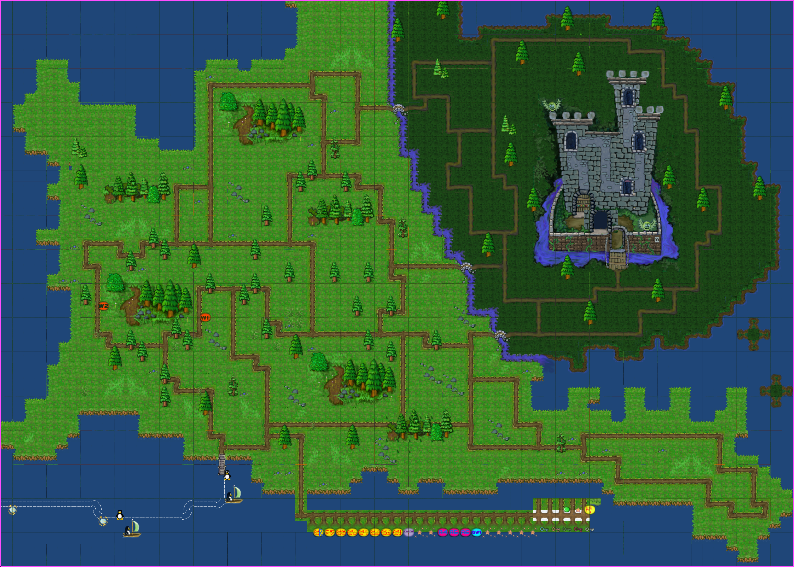

**The Forest** is the second world in SuperTux. 
This world is currently in the Contrib Levels menu, and has been in the game for a while now. 
It has yet to be added to the story, as it is not considered stable enough. 
It is currently one of the teams priorities for a future release.

### Badguys

There are a few forest specific enemies used in this world.

 - Zeeklings: These flying foes will bide their time and then suddenly swoop and dive-bomb you.
 - Walking Leaves: These enemies are much like snowballs in [Icy Island](Icy-Island), but have a camouflaged sprite to blend into the grass.
 - More exist, but are either considered unstable or are subject to change

### Levels

The forest world is still under development and therefore it is not reasonable to state which levels exist. Many will be removed or changed.

### End Boss

Currently, the end boss of this world is The Ghost Tree

== Forest ==

 The **Forest** is the second world in [SuperTux](SuperTux "wikilink"). It is generally a lively place with many creatures roaming about. Parts of the *Forest*, however, are spooked. This world was included in the unstable *SuperTux 0.3* releases but will be *removed* before [MMilestone 1.9](MMilestone_1.9 "wikilink"). It has been project to removed it, so status is uncertain. It will need attention before next release.

Badguys
-------

Badguys in the *Forest* can be found at the [Badguys](Badguys "wikilink") page.

New Features
------------

-   Switch
-   Moving Plateformes
-   Trampolino & Bouncing coils
-   Transportable Bricks
-   Doors & Teleport

Levels
------

 in the *Forest*.](SuperTux-0.3.0-4.png "Screenshot of Tux in the Forest.")

Currently (January 2010) the *Forest world* consists of the following 29 levels:

-   A Ghostly World
-   A Mouldy Grotto
-   A Village in the Forest
-   Bouncy Coils
-   Countercurrent
-   Crumbling Path
-   Dan Morial
-   Detour
-   Down The Rabbit Hole
-   Duct Ape
-   Entrance to the Castle
-   Find the Bigger Fish!
-   Going Underground
-   Kneep-deep in the depth
-   Light and Magic
-   Little Venice
-   Owls' Revenge
-   Penguins don't grow on Trees
-   Shocking
-   Short Visit to El Castillo
-   The Silent Walls
-   Three sheets to the wind
-   Treasure in the skies
-   Tree Fortress
-   Tux the Builder
-   Two Tiny Towers
-   Up and Down
-   Walking Leaves
-   Welcome to the Forest

See also
--------

-   [Icy Island](Icy_Island "wikilink")

<Category:World>
