## Badguys of Icy Island

This page shall describe all enemies, old and new, that appear in Icy Island
in as much detail as possible.

Note: For some badguys, we still need to settle down on proper names (e.g. *Mrs. Snowball* or *Smartball*).

Mr. Snowball
============

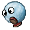

Mr. Snowball is a straight forward walking enemy, when reaching an edge he will fall down and
continue walking on the platform below. Jumping on him will squish him and thus kill him.

| Property       | Status |
|----------------|--------|
| Squishable     | yes    |
| Buttjumpable   | yes    |
| Burnable       | yes    |
| Freezable      | no     |

Mrs. Snowball (smartball)
=========================

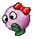

Mrs. Snowball behaves like *Mr. Snowball*, but instead of walking off a platform she will turn
around when reaching the edge.

| Property       | Status |
|----------------|--------|
| Squishable     | yes    |
| Buttjumpable   | yes    |
| Burnable       | yes    |
| Freezable      | no     |

Captain Snowball
================

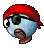

A snowball who claims to be captain of a ship despite not having set foot on one himself.

Captain Snowball behaves just like *Mr. Snowball* but once faced with a slope or the edge of a platform,
he will attempt to jump over it. Sometimes he succeseds, sometimes he doesn't.

| Property       | Status |
|----------------|--------|
| Squishable     | yes    |
| Buttjumpable   | yes    |
| Burnable       | yes    |
| Freezable      | no     |

Bouncing Snowball
=================

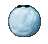

A leg-less snowball with eyes that moves forward in a constant bounce motion like a ball. It's jump height
is big enough that Tux can pass under him safely, while making it difficult to jump on him or (potentially)
outright impossible when he is at the highest point.

| Property       | Status |
|----------------|--------|
| Squishable     | yes    |
| Buttjumpable   | yes    |
| Burnable       | yes    |
| Freezable      | no     |

### Comments

> Grumbel: "Jump height and width in the current
> implementation could be tweaked a bit to make it easier to stand
> below it. Placement in the levels is the biggest problem, should
> only be used in open spaces, not closed ones where it hits the
> ceiling and bouncing becomes unpredictable. It could also move
> faster and jump higher, at the moment it is far to easy to just jump
> on it."

Flying Snowball
===============

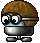

A snowball with a propeller underneath and a pilot hat and goggles. Flying Snowball, as it name suggests,
flies up and down constantly.

| Property       | Status |
|----------------|--------|
| Squishable     | yes    |
| Buttjumpable   | yes    |
| Burnable       | yes    |
| Freezable      | no     |

Jumpy (snowjumpy)
=================

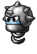

Jumpy is an armored snowball, wearing a spiky helmet, who jumps up and down and stays stationary on the
same position. His viewing direction follows Tux.

The simplest way of avoiding him is usually to run below him or jump over him at the right time.

| Property       | Status |
|----------------|--------|
| Squishable     | no     |
| Buttjumpable   | no     |
| Burnable       | yes    |
| Freezable      | yes    |

### Comments:

> Grumbel: "We have way too many variations of
> snowballs, making things look a little boring. I tend to prefer the
> Milestone 1 Jumpy for it's visual distinctiveness."
>
> 

Spiky (armoredsnowball)
=======================

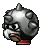 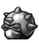

Spiky behaves just like *Mr. Snowball*, but he carries a spiky helmet which makes him invulnerable against
jump attacks as well as hurting Tux.

Sometimes, they can be found asleep waiting for their enemy to approach. Once Tux is in sight Spiky wakes
up and behave the same as always.

| Property       | Status |
|----------------|--------|
| Squishable     | no     |
| Buttjumpable   | no     |
| Burnable       | yes    |
| Freezable      | yes    |

Mr. Iceblock
============

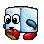

Like *Mr. Snowball*, Mr. Iceblock is a simple straight forward enemy. He will not stay on platforms. When
jumped upon he will get knocked out and become a portable item that one can use to throw or be kicked at other
enemies.

Continually squishing Mr. Iceblock will eventually kill him. Since version 0.3, he only walks off a cliff if
there is something safe on which he can land.

| Property       | Status |
|----------------|--------|
| Squishable     | yes    |
| Buttjumpable   | yes    |
| Burnable       | yes    |
| Freezable      | no     |

### Behavior in Milestone 1 (Pre-v0.3)

If Mr. IceBlock is eliminated, Tux is awarded 100 points. If destroyed via repeated squishes, Tux can get up
to 550 points.

When carrying Mr. IceBlock, Tux is granted a “get out of jail free” card: if he hits another, non-invincible
badguy, both Mr. IceBlock and the other badguy are killed, leaving Tux unharmed. A minor glitch occurs:
Mr. IceBlock is scored as 0 points.

Mrs. Iceblock (smartblock)
==========================

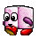

Similar to Mrs. Snowball, Mrs. Iceblock behaves as Mr. Iceblock but will turn around when reaching the edge of
a platform instead of walking off.

| Property       | Status |
|----------------|--------|
| Squishable     | yes    |
| Buttjumpable   | yes    |
| Burnable       | yes    |
| Freezable      | no     |

Snowman
=======

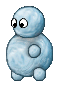

A snowman is build out of a base body combined with a *Mr. Snowball* as its head, if the body is destroyed, the
*Mr. Snowball* on top will fall out and continue moving around.

When attacked with a buttjump both the body and the head are defeated.

| Property       | Status |
|----------------|--------|
| Squishable     | yes    |
| Buttjumpable   | yes    |
| Burnable       | yes    |
| Freezable      | no     |

Kamikaze Snowball (snowshot)
============================

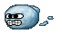

The Kamikaze Snowball shoots out of a [cannon](https://github.com/SuperTux/supertux/wiki/Misc-Badguys#Cannon) and
flies in a straight line until crashing. He is very angry, or very “wise”, and so can levitate through the force of
his will.

He is so concentrated on this, however, that he cannot turn or adjust his velocity.

| Property       | Status |
|----------------|--------|
| Squishable     | yes    |
| Buttjumpable   | yes    |
| Burnable       | yes    |
| Freezable      | no     |

Crystallo
=========

Another very basic enemy, but unlike the *Mr. Snowball* or *Mr. Iceblock* he doesn't walk around in a straight
pattern, but walks back and forth around a fixed position.

| Property       | Status |
|----------------|--------|
| Squishable     | yes    |
| Buttjumpable   | yes    |
| Burnable       | no     |
| Freezable      | no     |

### Comments:

> Grumbel: "As is, it's behaviour is pretty useless,
> needs a complete overhaul. Doing a ice version of
> the [Stony in Wall](images/Stony_wall.png) would be
> an option."

Ice Crusher
===========

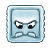 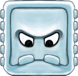

Ice Crushers are enemies that are hanging on the ceiling or walls. When Tux gets within one tile they will attempt
to crush Tux into the nearest wall or floor. After they hit a wall, they slowly drift back up. On this “return trip”,
Tux may safely climb on top of them and hitch a ride. When in their resting position, their eyes shall follow Tux.

There are two kinds of Ice Crushers, differentiated by their size: Krush (2x2 tiles) and Krosh (4x4 tiles).

| Property       | Status |
|----------------|--------|
| Squishable     | no     |
| Buttjumpable   | no     |
| Burnable       | no     |
| Freezable      | no     |

Stalactite
==========

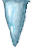

The stalactite stays stuck to the ceiling until Tux walks near it, then begins shaking. After a bit of shaking,
it falls down in an attempt to hurt Tux, while also harming badguys that get in the way.

Note: They can also be triggered when hit with a fireball and cause freezable enemies to be frozen upon impact!

| Property       | Status |
|----------------|--------|
| Squishable     | no     |
| Buttjumpable   | no     |
| Burnable       | no     |
| Freezable      | no     |

Yeti
====

The yeti is the boss enemy that awaits Tux in the first castle.

For more information on bosses, see [Bosses](https://github.com/SuperTux/supertux/wiki/Bosses).

List of Icy Island's badguys as of SuperTux 0.6.2
-------------------------------------------------

-   Mr. Snowball
-   Mrs. Snowball
-   Captain Snowball
-   Bouncing Snowball
-   Flying Snowball
-   Jumpy
-   Spiky
-   Mr. Iceblock
-   Mrs. Iceblock
-   Snowman
-   Kamikaze Snowball
-   Crystallo
-   Ice Crusher
-   Stalactite
-   Yeti

List of Icy Island's badguys in SuperTux 0.1.3
----------------------------------------------

-   Mr. Snowball
-   Bouncing Snowball
-   Flying Snowball
-   Jumpy
-   Spiky
-   Mr. Iceblock
-   Stalactite

See also
--------

-   [Milestone 2 Design Document/Enemies](http://supertux.lethargik.org/wiki/Milestone_2_Design_Document/Enemies)
-   [Proposed Badguys](https://github.com/SuperTux/supertux/wiki/Current-Design-Document)
-   [Concept Art](https://github.com/SuperTux/supertux/wiki/Concept-Art)
-   [Bosses](https://github.com/SuperTux/supertux/wiki/Bosses)
-   [Worlds](https://github.com/SuperTux/supertux/wiki/Worlds)

<Category:Badguy>
