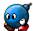

A badguy in SuperTux is a foe of Tux. They may not be "bad" in the way
that a hedgehog isn't really bad, but they can certainly hurt Tux.
Most of the badguys are creatures, like Snowballs with varying
characteristics, but some are more like objects (Stalactite for
example) or phenomena like Flame.

Tux will try to avoid approaching badguys if possible. If he runs into
one or one drops on his head, he is hurt. When hurt Tux will lose a
powerup or, if Tux has no powerups left, he will be killed.

Many of the badguys Tux can knock out by jumping on them and squishing
them. Others are only stunned by this for a short while or are
insusceptible to this and hurt Tux instead. As a rule of thumb,
badguys with a spiky head or helmet can usually not be jumped on. For
a list of badguys that can be squished take a look at the squishable
badguys category. Most badguys can be killed with the fire- or
iceflower power up.

Enemies
=======

This page shall describe all enemies, old and new, in as much detail
as possible. We also need to settle down on proper names for enemies,
since currently there is a lot of confusion. If you want see on real
names, click [here](real_badguys_names "wikilink").

##### Further references

* [Milestone 2 Design Document/Enemies](http://supertux.lethargik.org/wiki/Milestone_2_Design_Document/Enemies)
* [Proposed badguys](http://supertux.lethargik.org/wiki/Proposed_Badguys)
* [Badguy concept art](http://supertux.lethargik.org/wiki/Badguys_concept_art)
* [Worlds](https://github.com/SuperTux/supertux/wiki/Worlds)
* [Bosses](http://supertux.lethargik.org/wiki/Bosses)

Bouncing Snowball
=================

 

A leg-less Snowball with eyes that moves forward in a constant bounce
motion like a ball. It's jump height should be big enough that Tux can
pass under him safely, while making it difficult to jump on him or
(potentially) outright impossible when he is at the highest point.

### Comments

> Jump height and width in the current implementation could be tweaked
> a bit to make it easier to stand below it. Placement in the levels
> is the biggest problem, should only be used in open spaces, not
> closed ones where it hits the ceiling and bouncing becomes
> unpredictable. It could also move faster and jump higher, at the
> moment it is far to easy to just jump on it.
>
> -- [[Grumbel|User#grumbel]]

Cannon (dispenser)
==================

 The cannon can be mounted on either static or rotatable pedestal. It shoots angry looking snowballs. It is indestructible. [SVN](SVN "wikilink") for non-captainsnowball/kamizazesnowball enemies

The version in SVN can in fact shoot [Snowshots](Snowshot "wikilink"). Can this sentence be removed or do you mean something else? --[octo](User#octo "wikilink") 07:55, 27 February 2010 (UTC)

I didn't find any mention of [Captain Snowball](Captain_Snowball "wikilink") in neither the Milestone 2 nor the Milestone 3 design documents. What's the status on him? --[octo](User#octo "wikilink") 07:55, 27 February 2010 (UTC)

Captain snowball is used in several level in bonus 3 --[giby](User#giby "wikilink") Fev 2014

-   Image=Dispenser rocket launcher.png
-   Appearance=Differs, see below.
-   Behaviour=Spawns new badguys at fixed or random intervals.
-   Squish=yes
-   Buttjump=yes
-   Freeze=yes
-   Burnable=yes

A **Cannon** is a [game object](game_object "wikilink") that spawns new
[badguys](badguy "wikilink"). The interval in which badguys are spawned
is either fixed or random. A cannon can be shot with either the
[fireflower](fireflower "wikilink") (dies) or
[iceflower](iceflower "wikilink") (stops it emitting new badguys).
Whether or not the dispenser is squishable and butt-jumpable depends on
the appearance: The *trapdoor* and *rocket launcher* types are immune to
[Tux](Tux "wikilink") standing or jumping on them, the *cannon* type can
be broken this way.

It is also possible for the cannon to shoot inanimate, non-badguy
objects (even other cannons.)

### Appearance

There are three possible sprites for this object: Trapdoor, cannon and
(in lack of a better word) rocket launcher. Please note that despite the
name, *rocket launcher* is the preferred appearance, at least in [Icy
Island](Icy_Island "wikilink") ([Milestone 2](Milestone_2 "wikilink")).

### Design considerations

:   *This section is possibly outdated.*

### Mechanics

-   Spawns new Badguys
-   Interval: Fixed or random
-   Appearance: Trap door, cannon or invisible
-   Start direction of badguys: Fixed or random
-   Initial velocity of badguys: Fixed or random

### Uses

-   fires rockets
-   drops badguys from a (shootable) trap door
-   spawn badguys in tubes
-   launches molten rocks out of a lava lakes

Captain Snowball
================

-   Appearance=A walking pirate snowball with eyes and boots on.
-   Behaviour=Walks slower then the average snowball. Falls down from
    all cliffs.
-   Squish=yes
-   Buttjump=yes
-   Freeze=no
-   Burnable=yes

**Captain Snowball** is a [badguy](badguy "wikilink") planned to debut
in version 0.4. There are not yet many levels which feature *Captain
Snowball*, but he will most likely appear in [Icy
Island](Icy_Island "wikilink") levels or other snow-themed levels.

Planned for 0.4. In [SVN](SVN "wikilink") since
[5323](Template:Revision "wikilink").

Crystallo
=========

Again a very basic enemy, but unlike the Snowball he doesn't walk around in a straight pattern, but walks forward and backward around a fixed position. It is a stationary enemy.

-   Appearance=An ice crystal.
-   Behaviour=Moves around but doesn't leave a certain point.
-   Squish=yes
-   Buttjump=yes
-   Freeze=no
-   Burnable=yes

**Crystallo** is a [badguy](badguy "wikilink") in [Icy
Island](Icy_Island "wikilink"). He moves back and forth in a fixed
range. He is not yet widely used, but he has been implemented in some
test levels and some user-submitted levels.

Dart Trap
=========

<Template:NeedSound>

-   FoundIn=[Forest](Forest "wikilink")
-   Appearance=A skull mounted to the wall.
-   Behaviour=Static. Shoots darts at regular intervals.
-   Squish=no
-   Buttjump=no
-   Freeze=no
-   Burnable=no

The **Dart trap** is a [badguy](badguy "wikilink") in form of a skull.
In regular intervals it shoots darts out of its mouth. The darts fly in
a straight line, hurt [Tux](Tux "wikilink") and cannot be destroyed but
must be avoided. The *Dart trap* is mostly found in castles in the
[Forest](Forest "wikilink") world.

### To be done

<Template:outdated>

-   mechanical sound when dart is loaded
-   hissing sound when dart is fired
-   clicking sound when dart hits the wall

:   i belive this is already implemented in milestone 1.5 & subversion
    --[Disk](User#disk "wikilink") 18:51, 30 August 2007 (UTC)

Fish
====

 Already in the code, but not much used in Milestone1 Levels. This badguy shouldn't be used in Icyland, it is a forest enemy.

-   Image=FishBlue.png
-   Appearance=A fish jumping out of water.
-   Behaviour=Jumps up out of water regularly.
-   Squish=no
-   Buttjump=no
-   Freeze=yes
-   Burnable=yes

**Fish** is a [badguy](badguy "wikilink") that jumps out of water. When
[Tux](Tux "wikilink") has to cross the water he has to pay attention to
the fish so he doesn't get caught.

### Proposed changes

<Template:Proposed>

Maybe a different color can be used in the forest world than in the
[Icyisland](Icyisland "wikilink").

Also, possibly there should be a few different types of fish:

1.  Standard up-and-down movement
2.  Curving Jump landing in a different place, going back and forth
3.  Archer Fish
    -   Stays below the surface of the water, but follows tux when he is
        on platforms above
    -   Shoots high pressure water which can break blocks and knock Tux
        into water where the archer fish can get him
4.  Swordfish
    -   Curving Jump following Tux and jumping higher when there is a
        chance to get Tux

Flame
=====

 The flame rotates
around in a circle, hurting Tux when he gets too close. It is
indestructible. Do we want it to come in a line of fire?

-   Appearance=A glowing sphere.
-   Behaviour=Follows a circular path around a certain point.
-   Squish=no
-   Buttjump=no
-   Freeze=yes
-   Burnable=no

**Flames** are [badguys](badguys "wikilink") found in both
[worlds](worlds "wikilink") in *SuperTux*. They move in fixed circles,
hurting [Tux](Tux "wikilink") and other badguys on contact (unless, of
course, Tux is in invincibility mode.) Flames are immune to fire.
However, ice balls can kill them permanently as of version 0.3.4.

Flying Snowball
===============

 The flying snowball has a propeller at his bottom which keeps him floating in the air. Due to Nolok's hurry, the motor is inefficient and varies in effectiveness, causing the flying snowball to move up and down while coughing out smoke and possibly other debris.

**In need of a “good” name.**

What about Mr. Flyball?--[Noporque](User#noporque "wikilink") 09:00, 10 April 2010 (UTC)

Here are some ideas: Flyper, Propeller, Gadget, and Floatall. I'm Agent Spook, and I'm just trying to help.

-   Image=Flyingsnowball.png
-   Appearance=A [Snowball](Snowball "wikilink") with a propeller
    underneath and a pilot hat and goggles.
-   Behaviour=Flies up and down constantly.
-   Squish=yes
-   Buttjump=yes
-   Freeze=no
-   Burnable=yes

**Flying Snowball** is a [badguy](badguy "wikilink") often found in [Icy
Island](Icy_Island "wikilink"). It is a flying version of
[Snowball](Snowball "wikilink") which doesn't walk around but moves up
and down at random intervals and speeds.

Haywire
=======

When the fuse isn't burning Haywire looks similar to a normal Bomb except color and face. When the fuse of Haywire gets activated he starts to run around, maybe chasing Tux. He can't be carried around. Jumping on him when the fuse is burning will cause Tux to bounce and Haywire to be stunned for a short moment (fraction of a second).

**Status:** An initial version is available since [6443](Template:Revision "wikilink").

-   Image=MrBombCrazy.png
-   Appearance=A purple walking bomb.
-   Behaviour=Walks around. When jumped on, it's stunned for a little
    while and its explosion sequence is triggered.
-   Squish=yes
-   Buttjump=yes
-   Freeze=yes
-   Burnable=yes

**Haywire** is a [badguy](badguy "wikilink") from the [Milestone 2
Design Document](Milestone_2_Design_Document "wikilink"). It is very
similar to [Mr. Bomb](Mr._Bomb "wikilink"): When jumped upon, the
explosion sequence is triggered. In contrast to *Mr. Bomb*, *Haywire*
will not lie still but ran around madly. [Tux](Tux "wikilink") can stun
*Haywire* for a short while by jumping on it again, but should try to
get out of its reach. When it explodes, hurts [Tux](Tux "wikilink") and
other badguys nearby.

When shot with a [Fireflower](Fireflower "wikilink"), explodes
immediately.

Ispy
====

-   Appearance=A spying eye.
-   Behaviour=Static, looking towards the nearest player.
-   Squish=no
-   Buttjump=no
-   Freeze=yes
-   Burnable=no

**Ispy** is a [badguy](badguy "wikilink") that can be found in all
[worlds](worlds "wikilink") of *SuperTux*. It is a spying eye looking
for the player. When the player can be seen by the eye, i.e. no other
badguys or walls are in the way, an action is triggered, for example
doors close or bridges are removed.

Jumpy
=====

 [Jumpy](Jumpy "wikilink") jumps up and down and stays stationary on the same position. His viewing direction might follow [Tux](Tux "wikilink"). The spring should react when hitting the ground.

-   Image=Left-up.png
-   Appearance=A spiky grey ball with a spring underneath.
-   Behaviour=Jumps up and down.
-   Squish=no
-   Buttjump=no
-   Freeze=yes
-   Burnable=yes

**Jumpy** is a [badguy](badguy "wikilink") found in many levels. He is
stationary, bouncing up and down on the spot. Unless
[Tux](Tux "wikilink") has a [fireflower](fireflower "wikilink") or an
[iceflower](iceflower "wikilink"), the only way to get past *Jumpy* is
to run below him or jump over him at the right time.

Krush and Krosh (icecrusher)
============================

Krush and Krosh are enemies that are hanging on the ceiling. When [Tux](Tux "wikilink") gets within one tile they will fall down and try to smash Tux. When hanging on the ceiling, Krush and Krosh'es eyes shall follow Tux. The face expression shall become angry when he is falling down.

**Status:** Needs a cool-down time after an attack, so it doesn't go up instantly. Needs particle effects when it hits the ground. Eyes should follow Tux. Should be larger, maybe 3x3 tiles or 4x4. Should accelerate while falling down, currently looks to much like constant velocity. -- [Grumbel](User#grumbel "wikilink") 09:54, 23 February 2010 (UTC)

Acceleration has been fixed in [6403](Template:Revision "wikilink"). —[octo](User#octo "wikilink") 19:38, 26 February 2010 (UTC)

A cooldown timer has been added in [6405](Template:Revision "wikilink"). —[octo](User#octo "wikilink") 19:49, 26 February 2010 (UTC)

-   Image=Iceblock.png
-   Appearance=An ice block (two by two for Krush, four by four for
    Krosh) making an angry face.
-   Behaviour=Clings to the ceiling until [Tux](Tux "wikilink") is
    underneath. Then drops with unstoppable force.
-   Squish=no
-   Buttjump=no
-   Freeze=no
-   Burnable=no

**Krush** and **Krosh** are [badguys](badguy "wikilink") found in [Icy
Island](Icy_Island "wikilink"). They are usually found on ceilings. If
Tux comes underneath one, it suddenly drops without warning. If Tux does
not get out of the way fast, he is hurt. After they hit the ground, they
slowly drift back up. On this “return trip,” Tux may safely climb on top
of them and hitch a ride.

Both “icecrushers” are available in [SVN](SVN "wikilink"), but only
Krush is implemented in levels.

### Concept art

{width="400"}

Kugelblitz
==========

-   Image=Flying-0.png
-   FoundIn=*n/a*
-   Appearance=A *ball lightning* with sparks.
-   Behaviour=Moves to the ground, then randomly to the left and right
    within a limited range.
-   Squish=no
-   Buttjump=no
-   Freeze=no
-   Burnable=no

:   *This [badguy](badguy "wikilink") has been removed from the
    [Milestone 2](Milestone_2 "wikilink") branch in
    [6282](Template:Revision "wikilink").*

**Kugelblitz** is a [badguy](badguy "wikilink") not widely used in
*SuperTux* yet. The *Kugelblitz* moves down to the ground and then
randomly left and right within a limited range. After a couple of
seconds it vanishes. Like the [Flame](Flame "wikilink") it cannot be
hurt but [Tux](Tux "wikilink") has to avoid it if possible. “Kugelblitz”
is German for “ball lightning”.

### Design considerations

The *Kugelblitz* (German for [“ball
lightning”](http://en.wikipedia.org/wiki/Ball_lightning)) falls from the
sky without warning; as soon as it hits the ground, it starts moving
back and forth randomly for about two or three seconds in a fixed range,
then vanishes with a pop in a cloud of smoke. Explodes on contact which
hurts Tux. Alternatively, instead of moving at a random pattern, it
could also move between coins or badguys.

The Kugelblitz cannot be hurt, the player has to avoid its radius until
it's gone. With the alternative version, Tux can collect all
coins/destroy all badguys before the Kugelblitz lands to make it
disappear at once. It looks like a yellowish glowing wheel with
animations for falling (with glowing trail), rolling, exploding and
vanishing in smoke. It can be used in Ghost Forest and Forest Castle
settings.

If the Kugelblitz hits water it vanishes and all water tiles get
electrified for a short period of time. During that time, contact with
water causes Tux and badguys to get hurt.

(I chose the German name because it's one of the few words that actually
sound cooler in German than in English, IMHO.)

Variation1
==========

The path of the kugelblitz could be led by looking at surrounding
things. For example the kugelblitz could always go the nearest coin or
enemy in a range of 3 tiles give that it would not need to change it's
direction more than 45 degree or so. This would allow the following 2
situations:

The kugelblitz would go down and then go upwards along the 2 coins and
finally killing the 2 spikies and disappearing as there is no object
anymore it could move to.

The kugelblitz would come down and start moving in circles from coin to
coin. You could stop this behaviour by collecting 1 of the coins at the
right time.

More Ideas
==========

-   The kugelblitz could be attracted to spikes and if it hits them
    disappear. Like a lightning arrester.

Mr. Bomb
========

 The base behavior of [Mr. Bomb](Mr._Bomb "wikilink") is similar to the normal Snowball, except that when hit he doesn't get squished, but his fuse starts burning. After ~5 seconds he then explodes. While the fuse is burning he doesn't move, but instead can be carried around like an iceblock. Throwing MrBombs is more like a normal throw, not like MrIceblock getting kicked.

**Status:** Explosion timing is wrong, should be long enough to grab it and carry it around. -- [Grumbel](User#grumbel "wikilink") 09:51, 23 February 2010 (UTC)

-   Image=Mrbomb.png
-   Appearance=A blue walking bomb.
-   Behaviour=Walks around. When jumped on once, it is activated and
    explodes after a short time, killing nearby badguys.
-   Squish=yes
-   Buttjump=yes
-   Freeze=yes
-   Burnable=yes

**Mr. Bomb** is a [badguy](badguy "wikilink") that can be found in all
[worlds](worlds "wikilink") of *SuperTux*. When Tux or another badguy
hits him, he stops and begins ticking. After a few seconds, he explodes,
hurting all creatures within range. The presence of other Mr. Bombs
during explosion may cause a chain reaction of explosions. He also
explodes if he is hit by one of Tux's fireballs, but if hit by an
[iceball](Iceflower "wikilink"), he freezes without exploding.

Due to Grumbel's complaint that “Mr. Bomb is the ugliest badguy ever
created”, user [Poison Ivy](User#poison_ivy "wikilink") created a
concept image for a new look by combining features of
[Snowball](Snowball "wikilink") and the old Mr. Bomb in Gimp. This
approach was not accepted either.

Mr. IceBlock
============

 Like Snowball, Mr. IceBlock is a simple straight forward enemy. He will not stay on platforms. When jumped upon he will get knocked out and become a portable item that one can use to throw at other enemies.

-   Image=Mr iceblock.gif
-   Appearance=A cube of ice with eyes and legs.
-   Behaviour=Walks around. When jumped on once, it becomes a kickable
    and portable block of ice.
-   Squish=yes
-   Buttjump=yes
-   Freeze=no
-   Burnable=yes

**Mr. IceBlock** is a [badguy](badguy "wikilink") in [Icy
Island](Icy_Island "wikilink") with moderately complex behavior. In his
ordinary form, he works like an ordinary walking badguy, turning around
upon reaching walls and falling off cliffs. In version 0.3 and above, he
only walks off a cliff if there is something safe on which he can land.

When stomped on for the first time, Mr. IceBlock suddenly stops short.
If he is not stomped again for the next few seconds, he returns back to
normal. However, if he is stomped once more while squished, he suddenly
skids rapidly in one direction, hurting all creatures that he hits. When
skidding, he bounces off walls and falls off cliffs. If another creature
(including Tux) can stomp on him while he is skidding, he stops short
once more (and if he is stomped again, he begins skidding again, and so
on.)

While squished, Mr. IceBlock can also be “kicked,” if Tux runs up right
against him, and “carried” with the Action button. If Tux carries him
and lets go of Mr. IceBlock, he suddenly begins skidding in the
direction Tux is facing.

Continually squishing Mr. IceBlock will eventually kill him.

### Behavior in [Milestone 1](Milestone_1 "wikilink")

 If Mr.
IceBlock is eliminated, Tux is awarded 100 points. If destroyed via
repeated squishes, Tux can get up to 550 points.

When carrying Mr. IceBlock, Tux is granted a “get out of jail free”
card: if he hits another, non-invincible badguy, both Mr. IceBlock and
the other badguy are killed, leaving Tux unharmed. A minor glitch
occurs: Mr. IceBlock is scored as 0 points.

Mrs. IceBlock
=============

* Image=Mrs iceblock.gif
* Appearance=A pink cube of ice with eyes and legs.
* Behaviour=Walks around. When jumped on once, it becomes a kickable and portable block of ice.
* Squish=yes
* Buttjump=yes
* Freeze=no
* Burnable=yes

'''Mrs. IceBlock''' is a [[badguy]] in [[Icy Island]] with moderately
complex behavior. In his ordinary form, he works like an ordinary
walking badguy, turning around upon reaching walls or cliffs.

When stomped on for the first time, Mrs. IceBlock suddenly stops
short. If he is not stomped again for the next few seconds, he returns
back to normal. However, if he is stomped once more while squished, he
suddenly skids rapidly in one direction, hurting all creatures that he
hits. When skidding, he bounces off walls and falls off cliffs. If
another creature (including Tux) can stomp on him while he is
skidding, he stops short once more (and if he is stomped again, he
begins skidding again, and so on.)

While squished, Mrs. IceBlock can also be "kicked," if Tux runs up
right against him, and "carried" with the Action button. If Tux
carries him and lets go of Mr. IceBlock, he suddenly begins skidding
in the direction Tux is facing.

Continually squishing Mrs. IceBlock will eventually kill him.

Mrs. Snowball (smartball)
=========================

Mrs. Snowball behaves like a normal [Snowball](Snowball "wikilink"), but instead of walking off a platform she will turn around when reaching the edge.

.png)

-   Appearance=A walking snowball with eyes and boots on.
-   Behaviour=Walks around. Stays on platforms.
-   Squish=yes
-   Buttjump=yes
-   Freeze=no
-   Burnable=yes

**Mrs. Snowball** is a [badguy](badguy "wikilink") found in [Icy
Island](Icy_Island "wikilink"). In contrast to
(Mr.) [Snowball](Snowball "wikilink") she will stay on platforms rather
than falling down. [Tux](Tux "wikilink") can easily handle these
“badgals” by jumping on them, squishing them in the process.

This badguy is planned for [Milestone 2](Milestone_2 "wikilink"). It is
in SVN since [5321](Template:Revision "wikilink").

Owl
===

 A flying enemy that can carry things around and let them drop on Tux. One thing it is throwing might be *SkyDive*.

Some initial code is available from the [SVN](SVN "wikilink") repository since [6558](Template:Revision "wikilink"). Graphics are still pretty much a to-do. —[octo](User#octo "wikilink") 17:25, 6 March 2010 (UTC)

- Appearance=A blue owl carrying objects around.
- Behaviour=Flies left and right. Turns around when it hits a wall.
- Squish=yes
- Buttjump=yes
- Freeze=no
- Burnable=yes

The Owl is a [badguy](badguy "wikilink") from the [Milestone 2
Design Document](Milestone_2_Design_Document "wikilink"). It flies high
up in the air and carries badguys around. When Tux is below it, it will
drop whatever it is carrying.

This badguy is in the [SVN](SVN "wikilink") repository since
[6558](Template:Revision "wikilink"). The graphics for this badguy still
need to be improved. The graphics currently in SVN are colorized
versions of the concept graphics, basically.

Short Fuse
==========

 The Mini-Bomb is an
small version of the normal bomb, it approaches in groups most of the
time and is aggressive, it however is non-lethal to Tux and only works
to either distract him and throw him back.

A first version of this badguy has been added to [SVN](SVN "wikilink") in [6511](Template:Revision "wikilink").

Should “pop” like it was filled with air pressure air, not explode in fire, to make it clear that its not deadly.

- Behaviour=Walks around excitedly. Falls off platforms.
- Squish=yes
- Buttjump=yes
- Freeze=no
- Burnable=yes

His behavior is intended to be similar to that of [Mr. Bomb](#mr-bomb),
but the explosions do not harm Tux -- they only throw him back.

Skullyhop
=========

-   Image=Standing-0.png
-   FoundIn=Bonus Level, Ghost Forest
-   Appearance=A hopping skull.
-   Behaviour=Hops around, chasing [Tux](Tux "wikilink").
-   Squish=yes
-   Buttjump=yes
-   Burnable=yes
-   Freeze=yes

**Skullyhops** jump around and chase Tux.

SkyDive
=======

 An enemy that is let go by *Owl* and then falls down to the ground and explodes.

An initial version of this badguy has been committed to [SVN](SVN "wikilink") in [6564](Template:Revision "wikilink").

-   Image=BombFish.png
-   Appearance=A black, spherical fish.
-   Behaviour=Falls down; explodes when it hits the ground.
-   Squish=yes
-   Buttjump=yes
-   Freeze=no
-   Burnable=yes

**SkyDive** is a [badguy](badguy "wikilink") usually carried around and
dropped by [Owl](Owl "wikilink").

An initial version of this badguy has been committed to
[SVN](SVN "wikilink") in [6564](Template:Revision "wikilink").

Sleeping Spiky (sspiky)
=======================

 Sleeping Spiky sleeps, when Tux comes near he activates and behaves like a normal Spiky. (Grumbel: Not sure that guy is a good idea)

-   Image=Sleeping-left.png
-   Appearance=A snowball with a spiky helmet.
-   Behaviour=Sits around; starts walking when [Tux](Tux "wikilink")
    approaches.
-   Squish=no
-   Buttjump=no
-   Freeze=yes
-   Burnable=yes

**Sleeping Spiky** is a variation of the well-known
[Spiky](Spiky "wikilink"). This [badguy](badguy "wikilink") just sits
around sleeping. Only when he spots the player he slowly rises to his
feet and starts walking around.

Snowball
========

Snowball is a straight forward walking enemy, when reaching an edge he will fall down and continue walking on the platform below. Jumping on him will squish him and thus kill him.

**Status:** Basic behavior is implemented, could however be improved with additional animations when turning around or when falling from a cliff. -- [Grumbel](User#grumbel "wikilink") 09:41, 23 February 2010 (UTC)

-   Image=Snowball.gif
-   Appearance=A walking snowball with eyes and boots on.
-   Behaviour=Walks around. Falls down from all cliffs.
-   Squish=yes
-   Buttjump=yes
-   Freeze=no
-   Burnable=yes

**Snowball** is a simple walking [badguy](badguy "wikilink") found in
[Icy Island](Icy_Island "wikilink"). It will fall off platforms but will
turn around when reaching a wall. [Tux](Tux "wikilink") can easily
handle these badguys by jumping on them, squishing them in the process.

### See also

-   [Bouncing Snowball](Bouncing_Snowball "wikilink")
-   [Captain Snowball](Captain_Snowball "wikilink")
-   [Flying Snowball](Flying_Snowball "wikilink")
-   [Jumpy](Jumpy "wikilink")
-   [Mrs. Snowball](Mrs._Snowball "wikilink")
-   [Sleeping Spiky](Sleeping_Spiky "wikilink")
-   [Snowshot](Snowshot "wikilink")
-   [Spiky](Spiky "wikilink")

Snowman
=======

 A snowman enemy shall be added, a snowman is build out of a base body combined with a snowball head, if the body is destroyed, the snowman turns into a snowball. Alternative: Let the head get destroyed and the body turn into a snowball that can be rolled around.

**Status:** A very basic Snowman prototype is in [SVN](SVN "wikilink"), but lacks death animation and the whole separation behavior. Could use fists instead of balls as hands. -- [Grumbel](User#grumbel "wikilink") 09:39, 23 February 2010 (UTC)

Basic separation behavior has been implemented in [6418](Template:Revision "wikilink"). We're missing a graphic for the Snowman's body though. —[octo](User#octo "wikilink") 19:07, 27 February 2010 (UTC)

The snowman's body is now falling down when he's squished. [grumbel](User#grumbel "wikilink") wants to make a proper death graphic though. --[octo](User#octo "wikilink") 22:20, 2 March 2010 (UTC)

-   Image=SnowmanSprite.png
-   Appearance=A walking snowman with eyes.
-   Behaviour=Walks around. Falls off platforms. When jumped on, it
    turns into Snowball.
-   Squish=yes
-   Buttjump=yes
-   Freeze=no
-   Burnable=yes

**Snowman** is a [badguy](badguy "wikilink") found in [Icy
Island](Icy_Island "wikilink").

This badguy is planned for [Milestone 2](Milestone_2 "wikilink"). It is
in SVN since [6392](Template:Revision "wikilink").

Snowshot (kamikazesnowball)
===========================

 The [Snowshot](Snowshot "wikilink") comes out of a [Cannon](Cannon "wikilink"). He is very angry, or very “wise”, and so can levitate through the force of his will. He is so concentrated on this, however, that he cannot turn or adjust his velocity.

**Status:** There is MrRocket in SVN which should be recycled and turned into a Snowshot. There is also a cannon that can be reused after its graphics have been replaced. -- [Grumbel](User#grumbel "wikilink") 11:55, 23 February 2010 (UTC)

There's a Kamikaze Snowball in SVN, too. “Mr. Rocket” has been removed in [6408](Template:Revision "wikilink"). —[octo](User#octo "wikilink") 21:03, 26 February 2010 (UTC)

-   Image=Kamikaze-left2.png
-   Appearance=A flying snowball with a fierce facial expression.
-   Behaviour=Flies in straight line until he crashes in something. Can
    be shot from a [Cannon](Cannon "wikilink").
-   Squish=yes
-   Buttjump=yes
-   Freeze=no
-   Burnable=yes

**Snowshot** is a [badguy](badguy "wikilink") planned to debut in
[Milestone 2](Milestone_2 "wikilink"). He is a version of
[Snowball](Snowball "wikilink") which is shot from a
[Cannon](Cannon "wikilink") and flies a straight line until crashing
into something.

In [SVN](SVN "wikilink") since [5323](Template:Revision "wikilink").

Spider (spidermite)
===================

-   Image=Spidermite0.png
-   FoundIn=[Forest](Forest "wikilink")
-   Appearance=A spider hanging from the ceiling.
-   Behaviour=Moves up and down.
-   Squish=yes
-   Buttjump=yes
-   Freeze=no
-   Burnable=yes

**Spider** is a [badguy](badguy "wikilink") available in SVN. It flies
up and down vertically, hurting Tux on contact, although Tux can squish
him like a [Snowball](Snowball "wikilink"). It is themed to appear in
the [Forest](Forest "wikilink") world but is not (widely) used yet.

Spike
=====

The spike isn't really an enemy, so
much as an obstacle, but for some strange reason, it's in the
creatures' image directory, but implemented as a tile. Currently the
spike only hurts Tux, instead of insta-killing him as might be wanted,
for example at the bottom of deep pits. Alternately, we could simply
have shallow pits that are easy to jump out of. (but that still hurt
Tux)

\
\
IDs: 296, 297, 295, 298\
All spikes are hurting.

Spiky
=====

 Spiky behaves like *Mrs. Snowball*, i.e. he stays on platforms, but he carries a helmet which makes him invulnerable against jump attacks.

-   Appearance=A walking [Snowball](Snowball "wikilink") with a spiky
    helmet.
-   Behaviour=Walks around. Turns at ledges if about to fall offscreen.
-   Squish=no
-   Buttjump=no
-   Freeze=yes
-   Burnable=yes

**Spiky** is a [badguy](badguy "wikilink") commonly found in his
homeland, the [Icy Island](Icy_Island "wikilink"), but sometimes in the
[Forest](Forest "wikilink"), too. He is wearing a spiky helmet
protecting him from being squished by jumping on him, hurting
[Tux](Tux "wikilink") instead.

Stalactite
==========

 The
stalactite stays stuck to the ceiling until Tux walks near it, then
begins shaking. After a bit of shaking, it falls down in an attempt to
hurt Tux, while also harming badguys that get in the way.

-   Image=Falling.png
-   Appearance=An icicle hanging from the ceiling and underneath
    platforms.
-   Behaviour=Falls down when [Tux](Tux "wikilink") gets near.
-   Squish=no
-   Buttjump=no
-   Freeze=no
-   Burnable=no
-   FirstVersion=0.1

**Stalactites** are basic enemies, usually found hanging on ceilings.
They start shaking when [Tux](Tux "wikilink") approaches, falling down
after a short time. They hurt Tux and kill non-invincible enemies on
touch.

Spitter (proposed)
==================

 The spitter acts as walking dispenser, the enemy type that he can spit out might be limited to mini-bombs and similarly small enemies.

Gulpy, ~~Eater~~ (proposed)
---------------------------

 The Eater is a very small
enemy, half the size of a snowball, he can however expand a lot. If
Tux gets to close to him the Eater will open his mouth wide enough
that he can devour Tux or even other badguys. He is not defeatable by
jumping onto him, since he will then just eat Tux. Throwing stuff at
him won't work either, since again he will just eat them.

So how can you defeat Gulpy? As-is, he just seems to be a moving hurting platform. --[Mathnerd314](User#mathnerd314 "wikilink") 23:28, 7 March 2010 (UTC)

Maybe with starman--[173.59.123.229](Special:Contributions/173.59.123.229 "wikilink") 16:35, 23 December 2010 (UTC)

[Template:Navbox Badguys](Template:Navbox_Badguys "wikilink")

Stumpy
======

-   Image=Small-left-4.png
-   FoundIn=[Forest Island](Forest_Island "wikilink")
-   Appearance=A [Stumpy](Stumpy "wikilink") with eyes but treetop.
-   Behaviour=as [Snowball](Snowball "wikilink").
-   Squish=yes
-   Buttjump=yes
-   Freeze=no
-   Burnable=yes
-   FirstVersion=0.3

**Stumpy** is a [badguy](badguy "wikilink") in [Forest
Island](Forest_Island "wikilink"). He is beahaviour as
[Snowball](Snowball "wikilink"), but it is added in version 0.3.0.

Tikitchokwe
===================

-   FoundIn=[Tropical\_Island](Tropical_Island "wikilink")
-   Appearance=character with a mask juggling with fire torch.
-   Behaviour=Moves right and left, throw fire torch on Tux.
-   Squish=Maybe
-   Buttjump=Maybe
-   Freeze=Maybe
-   Burnable=Maybe

Tikitchokwe is a proposed badguy for world 3
[Tropical\_Island](Tropical_Island "wikilink"). Graphism would be
influenced by Hawaiian Tiki and Tchokwe mask design. Behavior has to be
think about, limited torch or not, squish without torch but not with.
There are real badguys' names:

Real Badguy Names
-----------------

| nickname                   | real name        |
|----------------------------|------------------|
|                            | angrystone       |
| bouncing snowball          | bouncingsnowball |
| crystallo                  | crystallo        |
| cannon, dispenser, dropper | dispenser        |
| ice fish                   | fish             |
| flame                      | flame            |
| flying snowball            | flyingsnowball   |
| haywire                    | haywire          |
| Krush and Krosh            | icecrusher       |
| igel                       | igel             |
| snow jumpy                 | jumpy            |
| kugelblitz                 | kugelblitz       |
| mole                       | mole             |
| Mr. bomb                   | mrbomb           |
| Mr. iceblock               | mriceblock       |
| Walking tree               | mrtree           |
| owl                        | owl              |
|                            | plant            |
| poison ivy                 | poison\_ivy      |
| short fuse                 | short\_fuse      |
|                            | skullyhop        |
| sky dive                   | skydive          |
| snail                      | snail            |
| snowball                   | snowball         |
| Mrs. snowball              | smartball        |
| snowshot                   | kamikazesnowball |
| captain snowball           | captainsnowball  |
| snowman                    | snowman          |
| spider                     | spidermite       |
| spiky                      | spiky            |
| stalactite                 | stalactite       |
| toad                       | toad             |
| walking totem              | totem            |
| walking leaf               | walkingleaf      |
| will-o-wisp                | willowisp        |
| yeti                       | yeti             |
| wingling                   | zeekling         |

Yeti
====

The Yeti is the boss that awaits Tux in the first castle. After entering the throne room Tux will find a letter in which Nolok tells Tux of the other castles in other worlds (see Milestone1 extro.txt). In the background there is a window. While reading the note one will see a shadow approaching the window and soon after the Yeti jumping through the window. The normal boss battle starts instantly after the jump.

Alternative: Sequence at end of castle: Tux find Yeti, Yeti jumps out of the window and flees

The **Yeti** is the boss for [Icyisland](Icyisland "wikilink")

Inspiration
-----------

As the first world is an Icyisland, a yeti as boss would match the thematics perfectly.

Here are some random links to get inspired for Yetis:

-   <http://en.wikipedia.org/wiki/Yeti>
-   <http://www.state2.de/images/Yeti-neu.jpg>
-   <http://www.hollywoodjesus.com/movie/monster_inc/20.jpg>

### Concept art

Behaviour
---------

The Yeti stands on the hill on the right or left and does 1 of the following things

-   throwing snowballs at tux
-   shouting angrily and jumping up and down. This would have the effect that 2 or 3 of the stalactites on the top of the screen start shaking and fall down.
-   he jumps off the hill and runs towards the other side of the screen. This would be the moment where tux is able to hurt him by jumping on him.

Finish
------

After 3-5 hits the yeti should give up and the screen fade away. Maybe in a short sequence the Yeti could show tux a slide down his hill with a ramp at the end that would bring tux to the next world (animated in the worldmap screen).

BadGuys
=======
  A **badguy** in *SuperTux* is a foe of [Tux](Tux "wikilink"). They may not be “bad” in the way that a hedgehog isn't really bad, but they can certainly hurt Tux. Most of the badguys are creatures, like [Snowballs](Snowball "wikilink") with varying characteristics, but some are more like objects ([Stalactite](Stalactite "wikilink") for example) or phenomena like [Flame](Flame "wikilink").

Tux will try to avoid approaching badguys if possible. If he runs into one or one drops on his head, he is hurt. When hurt Tux will lose a [powerup](powerup "wikilink") or, if Tux has no powerups left, will be pushed off the screen.

Many of the badguys Tux can knock out by jumping on them and squishing them. Others are only stunned by this for a short while or are insusceptible to this and hurt Tux instead. As a rule of thumb, badguys with a spiky head or helmet can usually not be jumped on. For a list of badguys that can be squished take a look at the [squishable badguys category](:Category:Squishable_badguys "wikilink").

List of badguys in SuperTux 0.1.3
---------------------------------

[[Badguy.1 category](:Category:Badguy.1 "wikilink")](Template:See_also "wikilink")

The following badguys are available in the stable 0.1 release.

-   [Icy Island](Icy_Island "wikilink")
    -   [Bouncing Snowball](Bouncing_Snowball "wikilink")
    -   [Flame](Flame "wikilink")
    -   [FlyingSnowball](FlyingSnowball "wikilink")
    -   [Jumpy](Jumpy "wikilink")
    -   [Mr. Bomb](Mr._Bomb "wikilink")
    -   [Mr. IceBlock](Mr._IceBlock "wikilink")
    -   [Snowball](Snowball "wikilink")
    -   [Spiky](Spiky "wikilink")
    -   [Stalactite](Stalactite "wikilink")
    -   [Fish](Fish "wikilink")

[Milestone 2](Milestone_2 "wikilink")
-------------------------------------

[[Milestone 2 Design Document/Enemies](Milestone_2_Design_Document/Enemies "wikilink")](Template:See_also "wikilink")

-   Endemic (any world)
    -   [Cannon](Cannon "wikilink")
    -   [Haywire](Haywire "wikilink")
-   [Icy Island](Icy_Island "wikilink")
    -   [Captain Snowball](Captain_Snowball "wikilink")
    -   [Crystallo](Crystallo "wikilink")
    -   [Krush and Krosh](Krush_and_Krosh "wikilink")
    -   [Mrs. Snowball](Mrs._Snowball "wikilink")
    -   [Snowman](Snowman "wikilink")
    -   [Snowshot](Snowshot "wikilink")
    -   [Sleeping Spiky](Sleeping_Spiky "wikilink")
-   [World 2 - Forest](World_2 "wikilink")
    -   [Igel](Igel "wikilink")
    -   [Mole](Mole "wikilink")
    -   [Poison Ivy](Poison_Ivy "wikilink")
    -   [Skullyhop](Skullyhop "wikilink")
    -   [Snail](Snail "wikilink")
    -   [Spike](Spike "wikilink")
    -   [Walking leaf](Walking_leaf "wikilink")
    -   [Walking tree](Walking_tree "wikilink")
    -   [Zeekling](Zeekling "wikilink")
    -   [Will-o-wisp](Will-o-wisp "wikilink")
-   [World 3 - Tropical Island](Tropical_Island "wikilink")
    -   [Toad](Toad "wikilink")
    -   [Spider](Spider "wikilink")

<!-- -->

-   Badguy in test
    -   [Short Fuse](Short_Fuse "wikilink")
    -   [SkyDive](SkyDive "wikilink") and [Owl](Owl "wikilink")
    -   [Ispy](Ispy "wikilink")

See also
--------

-   [Proposed Badguys](Proposed_Badguys "wikilink")
-   [Badguys concept art](Badguys_concept_art "wikilink")
-   [Worlds](Worlds "wikilink")
-   [Bosses](Bosses "wikilink")

[Template:Navbox Badguys](Template:Navbox_Badguys "wikilink")

[Category:For Users](Category:For_Users "wikilink") <Category:Design> <Category:Badguy>
