This is a list of ideas that need more discussion/polishing before they are ready to consider, and probably will never
see the light of day. However these features could be added to SuperTux at some point in the future, if somebody was
willing to put in the work and maintain it.

See also:
* [Implemented ideas](https://github.com/SuperTux/supertux/wiki/Implemented-ideas), for ideas that got implemented
* [Current Design Document](https://github.com/SuperTux/supertux/wiki/Current-Design-Document), for ideas that will be implemented "soon"
* [Rejected ideas](https://github.com/SuperTux/supertux/wiki/Rejected-ideas) - you can't polish a turd, and these ideas will never be added
to SuperTux no matter what
* The rest of the wiki, for ideas that are clear enough to implement

# Contents

1. [Story](https://github.com/SuperTux/supertux/wiki/Ideas#Story)
2. [Worlds](https://github.com/SuperTux/supertux/wiki/Ideas#Worlds)
   * [Side Worlds](https://github.com/SuperTux/supertux/wiki/Ideas#Side-Worlds)
3. [Level Ideas](https://github.com/SuperTux/supertux/wiki/Ideas#Level-Ideas)
4. [Multiplayer](https://github.com/SuperTux/supertux/wiki/Ideas#Multiplayer)
5. [Badguy Ideas](https://github.com/SuperTux/supertux/wiki/Ideas#Badguy-Ideas)
6. [Powerups](https://github.com/SuperTux/supertux/wiki/Ideas#Powerups)
7. [Objects](https://github.com/SuperTux/supertux/wiki/Ideas#Objects)
8. [Other Ideas](https://github.com/SuperTux/supertux/wiki/Ideas#Other-Ideas)

## Story

### Central Storyline

I believe the game really needs a storyline that makes the game not just about the arcade, but involves a greater plot.
There should be a cutscene for just about every level and specific objectives (like you need to find a certain key or
something before completing the level) Almost every level should have a cutscene that further adds to the plot. I also
like the NPC idea because that can also drive the the plot. An idea for a storyline is detailing how Tux and Penny met
and maybe add other characters that touch Tux's life (family, old flames, etc.)

> "I really don't want special level objectives, and a cutscene per level would get kind of annoying. Level objectives
  would complicate things, as would multiple cutscenes, but having one or two would be nice."

### Catching Background Story

SuperTux needs a catching background story that inspires and motivates the player and drags him into the story so that
he understands why Tux is doing what he does and why it is important.

“The bad guy took the penguins girlfriend, go save her from him!” or “Nolok stole Penny from Tux, you must save her!”
doesn't cut it.

It needs be passionate and inspiring like:

*“The evil Nolok kidnapped Tux beloved girlfriend Penny. Tux was worried he would never see her again, he was scared and
upset but knew he would do anything to get his true love back!”.*

The player shouldn't just play level, complete level, go next level, in an infinitive loop until the end. As the player
plays the game, he should learn more. When Nolok kidnapped Penny, Tux was shocked and confused. He perhaps don't need
where Nolok is hiding or where Nolok has taken Penny, this information he can learn on the way. And maybe he learns about
other bad stuff that Nolok has done to other people.

> "I shalt put that intoeth mine version of Super tux." - Rorikdude

> "Some games have a story that is more interesting than the game itself. Some games you play just because you are so into
  the story and really needs to know more about it. Kinda like when you started to read a book, you cant put it away. Of when
  you started watch a movie, it get so exciting you cant switch away channel. :)"

> "I like the idea of Tux not knowing anything in the beginning. Perhaps at the start - 'Antarctica - the dryest continent on
  Earth. (shows worldmap) One of the few creatures that can brave the polar winds is the penguin - there's some there...' and
  zooms in on Tux and Penny. 'Another is the - ' camera shakes, goes funny, ice bush moves and dark shape, blacks out. And when
  you start level one: 'Tux was confused and upset. Where wass Penny... his Penny... ? He started searching, not really beleiving
  he would find her, but he had to do something. There were rumours... such rumours... but nothing like that could have happened...
  could it? And level two: 'Tux caught sight of a peice of paper lying torn and wet under a overhanging ledge of ice. He picked it
  up carefully, and saw with a leap of his heart that it was only the bottom fragment of a larger sheet. All that was there was
  a delicately drawn ice flower - the symbol of his beloved Penny'" - poison Ivy

> "Hmm... we could say that Nolok lives at the North Pole (the other side of the world!) and Tux has to cross the planet
  to find Penny. Or/and maybe we could make Nolok escape continuously, and Tux has to follow him."

> "It does need to be more passionate/inspiring, but the classic platform-game atmosphere may be the highest priority." -
  Julius\_Freezer 23:58, 2 July 2009 (UTC)

### The Narrator Twist

Upon confronting Nolok for the final battle, an idea would be to have it revealed that Nolok has been the narrator of the game.

Basically, the entire game up until the final confrontation takes place in the past. The cutscene will end with narrator (Nolok)
saying something like: *"At least, that's where we are now..."*, fading to black as if the game has ended. However, shortly after
the cutscene will fade in again, now taking place in the present as Nolok and Tux duke it out in the final battle. This would be
the only cutscene using direct speech!

This would align with his character as he sees the entire quest for Penny as a sick and twisted game.

### Corrupted Forest

The Ghost Tree was planted by Nolok using his mighty staff to corrupt the forest and its inhabitants to be
more eerie and dangerous. A group of Granito, inhabitants of the forest who have not yet been overtaken
by the Ghost Tree's disease asked Tux to help save their home and fellow Granito that have been corrupted already.
When the Ghost Tree is destroyed and the Granito are healed some of the once infected Granito living near the tower
inform Tux about noticing someone strange leaving with another of Tux's kind to the north-east, shortly before the
disease began to spread.

### Tropical Paradise

Tux will sail from Rooted Forest towards the tropical island to find Penny there. Then Tux will pass trough some levels to a clearing, where
a mysterious temple is located. This part of the islands will be overrun by totem themed enemies. On the temple grounds, Tux will encounter
the boss. He will learn about a hidden teleporter that is located not far from the temple that will bring gim to Nolok's final fortress.

There, he spots Nolok as he teleports himself and Penny. Tux gives chase arriving on a snowy mountain peak. In front of him a gigantic fortress
with Nolok sitting on the highest tower on his throne.

### Penny's Story

Through an Add-on, the player could take Penny's role, and the story is continued from her point of view so the player can
explore the story some more.

Intro: Scene showing Penny in a prison cell, trying to escape. She is unaware about Tux's current location. She finally
manages to escape her cell. She flees through a window or a crack in the wall, gets out of the castle and disappears in
the background. Tux is still a ways away and doesn't find out about the escape (or: he finds her empty cell and a letter).
Penny wanders around the world looking for Tux.

Another intro: Tux enters some room in the Dark Forest Keep, sees Penny locked in the cage, comes closer. There is a rope
attached to the cage and Nolok holding the other end of the rope. Nolok says he will free Penny. Tux is confused and wonders
if Nolok is up to something and turns to the camera and asks you if you think he should ask Nolok to free Penny, if you say
no, the game continues as normal if you say yes Nolok pulls a rope and, because there is a pulley system on the rope, the
cage raises, Tux runs to meet Penny, BIG MISTAKE! A speech bubble appears at Noloks mouth: “whoops!” “LOOK OUT!” yells Penny
jumping away, the cage falls and traps Tux. Then you play from Penny's PoV trying to rescue Tux.

Or: When Tux reaches the final castle the boss is Nolok, but you need two people to defeat him. So you have to play Penny as
she escapes from the cage and makes her way through the castle to help Tux defeat Nolok.

Ending: Penny is caught by the cunning Nolok. But she doesn't give up
because she writes down information she overhears from Nolok himself in a letter
in hopes to reach Tux and to inform him on Nolok's plans help him as much as she can on his journey.

As a side affect of now having to play Penny, you should get ice flowers instead of fire flowers!

---

## Worlds

### In The Sea

In SVN version, you can travel with boat across the seas. Maybe there could be;

-   An iceberg or something.
-   A whirlpool / maelstrom.
-   A sea monster like a sea snake, or Nessie or a hydra with many heads.
    -   Sounds like a boss for a non-existent (as of now :-) water world.

### Tropical Island

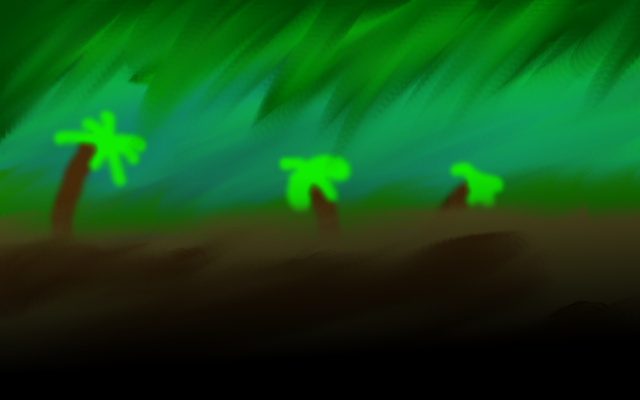

#### Totem Puzzle

Played upon entering the jungle section of the island and shows the user of some puzzle involving totems that needs to
be completed.Some sort of Hiroglyphs to open a door at the end of a level.

#### Boss

A majestic Toucan resides among the totem temples located on the tropical island creating totems in his image. Nolok
met the bird and offered him more land and power if he could successfully impede Tux's progress and defend the hidden
teleporter to his fortress on top of a mountain peak. After defeating the Toucan and his Master Totem, Tux finds Nolok's
base camp by the teleporter. Before Tux could confront him however, Nolok teleports to his mountain fortress. Tux gives
chase and also uses the teleporter...

### Nolok's Mountain Peak (Final)

#### Locked Entrance

Depending on whether or not Tux has all five NOLOK.keys collected, a cutscene will play. If no or less than five keys have
been found, Nolok taunts the player for not being able to enter. Once all keys are collected, Tux will unlock the door and
world 4 will become accessible.

### Secret Worlds

There might be alternative worlds accessible by beating secret levels, e.g. Tux might find a secret exit in a IcyIsland level
and go to a volcano world instead of the forest world. Think of Wario Land II. However, I'd reserve this for much latter, since
this would take a lot of designing.

### Side Worlds

These don't fit in the main story but could be playable as contrib / add-ons.

  
List of Themes

  
- Boreal Forest
- Dungeon
- Island
- Desert
- Nolok's Lab
- Nolok's Island
- Outer Walls
- Space Station
- Tower Tops
- Volcano/Lava
- Sky/Cloud
- Space/Moon
- Underground Lava
- Slimy Underground
- Spider Nest
- Penguin World
- Grassland
- Bonus World (you may play 1 level for every hidden ticket item you find)
- Castle Yard
- Mountain Range
- Underground Laboratory
- Ghost World
- Light-And-Magic World
- Ocean
- Cave
- Jungle
- Desert
- City
- Candyland
- Shanghai Temple
- Dinosaur Terrain

> "Some of these ideas might be better served as minigames? Like the Zelda GB crane game, fishing game etc. and could be
  added to the shop idea (you either buy the item or try your hand at a minigame to get said item, or a not-for-sale special
  item). Some of those minigames could be hacked into SuperTux by designing levels in other games (PlanetPenguin Racer, Frozen
  Bubble etc.) which could reduce development time and needs for new graphics."

> "Good idea. Minigames sounds like an excellent way to channel the creativity which doesn't necessarily fit with the
  whole. You could go onto the fan site or something, and put them in a special folder in the Super Tux directory."

> "why not a portal type place where he gets sucked in or a ray gun firing a beam at tux digitizing him or something." -
  Atomic1fire, 02:35, 1 Jan 2007 (CET)

> "Because they did that in “Tron” already."

---

## Level Ideas

- There should be underwater levels, and ways to go underwater.
- What's about a level in a world, where you can see a volcano in the background? And not just seeing it, after a few steps the
  volcano becomes active and throws up brocks into the level, which may hit you.
- What's about a snow level where an avalanche is chasing you, or where regulary come some big snowballs and you have to wait
  on a high platform?
  - This is how *autoscrolling* levels shall work in the future.
- Being chased by an animal (like a bear in a forest) would be great fun. He could ride down a mountain in an iceball.

> "There is a pirate ship level in Yeti's Revenge where the ship chases you."

---

## Multiplayer

The main idea of this concept is to improve supertux with multiplayer like “New Super Mario Bros. Wii” on the Wii or
something alike. For now idea limits to two players: Tux and Penny. Both players are playing inside one world in
single-screen mode.

To make game interesting to play in pair, i introduced new type of monsters (or new ability to all monsters) - carry
bonus (see Bonuses) and split ability to “fire” to two different types of attack (see Players).

Both players should be approximately equal in playing difficulty, to make the game interesting to all. If you will
want to replay level with Penny after finishing level with Tux and vice-versa - then this point is done well. If there
will be lots of holy wars over who is most difficult - then this point done well. If not - we have to change some details
in concept or fix the balance.

Players are designed to help each other. This makes game more addictive (as i think). You don't only play, you also help
your friend and he helps you. If we don't follow this - what for we are creating multiplayer at all?!

> "How about the FreeBSD demon (freebsd.org) or another penguin for player 2."

> "Penny would be a better second player. Alternatively, it could be like SuperTuxKart and support up to 4 players
  (Nolok and Yeti? Gnu and Wilber?), but I feel that it would be a better minigame and that 2-player with Penny would
  be the best implementation."

> "The other penguin could be Fluffy"

> "+1. I like it."

### Players

Both players have same abilities as original tux with following differences:

| Property       | Penny         | Tux             |
|----------------|---------------|-----------------|
| Fires with ... | Ice (iceball) | Fire (fireball) |
| Bonus for increase power of bullets. | Ice bonus - you can get it from enemy. Increases enemy freezing time. Every type of enemy has it's freezing-coefficient (float-point number) describing how strong will feel this hit. For example 0 means “completely immune to cold”, 1 means “sensitive to cold”, 1.5 means “extra-sensitive to cold” and so on. | Fire bonus - you can get it from enemy. Enemy has floating-point life and shots has floating-point damage. Bonus will increase damage of shot. |
| When bullet reaches enemy, then... | Enemy freezes for some seconds. Time depends on “coldness of ice” which may be increased with appropriate bonus (ice bonus). While enemy is frozen, both tux and beastie can stuck it by jumping on it. Enemy dies. If enemy contains bonus, bonus is dropped nearby. Bonus can be picked up by Tux or Beastie. | Enemy gets hit. If number of hits is enough to kill him, enemy dies. Number of necessary hits depends on “hotness of fire” (may be improved by fire bonus). You can't get bonus from enemy if you kill him. |
| What will be in single player? (or how this helps to achieve point 2) | Okay, you can get all bonuses from monsters. But there are enemies without bonuses. Killing them is expensive: freeze and be fast to stomp him. Tux will be useful in that situation. Play together with Tux. | Okay, you can kill any enemy. But you will not get fire bonuses from enemies. So killing enemies will be expensive: you need to fire a lot to kill big enemy (i.e. without fire bonus you don't have enough “fire hotness”). Play together with Penny, to get bonuses. |

### Bonuses

The first thing about bonuses - they may be placed inside enemies. Bonuses in blocks are still exist. Such
an enemy may be (or should be always?) marked with some symbol, describing type of bonus, or describing random
bonus.

The only way to extract bonus from enemy is to freeze enemy (Tux can do that) and then stuck it by jumping
on it (both players can do).

There is a list of new bonuses (of course may be more than two, but if you add some - keep your eye on the
balance.):

| Bonus      | Applies to                              | Meaning                                         |
|------------|-----------------------------------------|-------------------------------------------------|
| Ice Bonus  | Penny (multiplayer)/Both (singleplayer) | Increases freezing time for Penny's ice bullet. |
| Fire Bonus | Tux (multiplayer)/Both (singleplayer)   | Increases power for Tux's ice bullet.           |

In single player there will be two types of flowers (from classical supertux) - ice flower and fire flower. As
you can see, Tux can become “Pennyish” by gathering ice flower and then get bonuses from monsters. Or Penny can
become “Tuxy” by gathering fire flower.

Notes: “Pennyish” Tux cannot do ice-attack, so he kills enemies and improves fire from blocks. “Tuxy” Penny
cannot do fire-attack, so she freezes enemies and have to stuck them in order to kill and optionally gather bonus.

### Problems / What Is To Be Done Next

All enemy lives, powers of bullets, and freezing times should be balanced to make both players close (or better -
equal) in play difficulty. Maybe these values should be configurable in something like Options-&gt;Difficulty Settings
menu. For now I just can assume some sane values, but i haven't any ready-to-work balancing map.

Of course, we should paint sprites for Penny and other players, bonuses, monster-has-bonus marks, different bullets...

### Online Mode

How about instead of just a project for a multiplayer mode, a mass multiplayer mode. Of course, someone would probably
have to set up a good server for this. You could differentiate your Tux from everyone else's tux through ties, hats,
and body colors. Boxes and enemies could reappear after a certain amount of time. You could trade your coins for something
different from a one up. You could have firetux duels with other people, or maybe throw snowballs at each other. Maybe kill
other tuxes by jumping to hit bricks that they're standing on.

---

## Badguy Ideas

This is for miscellaneous enemy ideas. Any world-specific enemy plans or ideas can be found
[here](https://github.com/SuperTux/supertux/wiki/Proposed-Badguys).

- “invisible” enemies (you could see only their eyes or something else) maybe you could just see shoes or gloves etc
- enemies which becomes bigger and longer
- **BouncingGlassball** - Kind of like the BouncingSnowball but it bounces 3 tiles higher and is for the forest world.
- **Vinehat** - Just like the Icehat except it fires vines so it works for the forest world.
- **SpikeyBoss** - A big version of the stay-on-platform spikey bad-guys(64x64). When he reaches an edge of the platform,
  he pauses, soots a ball that blows up on contact, and repeats on the other side. You guys decide how to kill.
- **SpikeheadSnbowball** - Exactly like the Snowball, but after a configurable amount of spaces it jumps and lands 5 spaces
  foreward on it's spike. After a moment, it jumps back up and repeats.
- **WaterHeater** - Like Lightning except you can tell when you need to get out of the water because you slowly turn red.
- **Climbing snowball** - Snowball that can climb up walls and ceilings, not affected by gravity.
- **Ninja snowball** - Snowball that leaps at Tux if he is in range.
- **Rolling snowball** - Large snowball that rolls around, destroying other badguys and hurting Tux on contact. Think Indiana
  Jones...except frozen. Could be a kind of boss level, although we've already got one for Icyisland.
- **Fake Box Enemy** - The Fake Box looks exactly like an ordinary box from a far distance.But if you come closer to the fake
  box it will either open its eyes and attack you or it will still open its eyes and a random enemy appears above the box. This
  is the fake box active: 
- **Drippin'** - Invincible enemy that follows you around. Grows when hit by iceballs and shrinks when hit with fireballs.
  Preview: 
- **Flamin'** - Same as Drippin' but grows through fire and shrinks through ice.
- **Biella** - Quick, flying creature, continuously following Tux. Could shoot stingers. 
- **Mr. Log** -  Slow creature without any special abilities. Maybe “stackable”, similar to the cactuses in SMW: Up to four
  “Mr. Log” could be combined to serve as a high barrier, only destroyable from above (or with FireTux).
- **Limpy** - Another slow creature, which is able to adhere to any surface. When reaching the end of a platform, it doesn't fall
  down, but continues to crawl downwards, upwards, or even underneath.
- **Mr. Missile** - Once he “sees” Tux, Mr Missile starts shadowing him. So if Tux stops he doesn’t stop until he reaches the place
  Tux stopped at. It is the same with other actions. Mr Missile is as fast as Tux. He is killed by invincibility and Supertux’s fire.
  
- **Mr. Airtank** - Looks like a scuba tank with eyes and feet. When Tux gets near he puffs out gas which harms Tux. When killed,
- flashes (like [Mr. Bomb](https://github.com/SuperTux/supertux/wiki/Badguys-Misc#mr-bomb)) and explodes (also like Mr. Bomb)
- **Mr. Block** - Looks like shoes with eyes on top. “Gets” blocks somehow and uses them as a body. When killed only the eyes and
  feet die, leaving a block. He could make blocks, get them by pulling out of ground or take them when he bumps into a wall.
- **Mr. Jump** - Behaviour like the normal snowball. But: You can jump on it like on a trampoline. 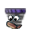

- Electric eel
- Mr. Palm Tree - Very tall badguy consisting of stacked segments; jumping on top removes the bottom segment.
  - When there's only one segment left, Mr. Palm Tree dies.
- Nutty - A harmless, indestructible badguy; a bit like a walking moving platform. Alternative: an equivalent
  of Mr. Ice Block.
- Volcano - Stationary boss badguy, spews ashes that can hurt Tux.
- Wild Boar/Feral pig - Basic walking badguy, starts running faster upon seeing Tux. Tux can stun him by kicking
  him from behind, and can kill him by stomping on him.
- Hungry Parakeet - Zeekling equivalent.
- Melon - Snowball equivalent.
- Mosquito - Flying snowball equivalent.
- Spider - A tarantulas going up and down
- Toad - A Frog seeking Tux
- Tikitchokwe - A badguy wearing a mask that send fireball on Tux
- Bengal Tiger (Boss)

##### Tumbleweed

Its graphics are implemented, but there is no sprite or badguy for them. It rolls along the floor, when Tux is on the left or on
the right. When Tux is above or under, it stops rolling. It hurts on touch and it can't be squished. It's flameable and freezable.

##### Hanging Ball

It could be a stone stalactite that fits the forest and jungle theme, but stone stalactite wouldn't break suddenly. It's a ball
of dirt and stones hanging on a wine. When Tux walks under it, it would fall down. It hurts on touch. When it's hit by fireball,
it falls down and when it's hit by iceball, it will freeze and it doesn't fall, when is Tux under it. It doesn't freeze enemies,
like [Stalactite](https://github.com/SuperTux/supertux/wiki/Badguys-Icy#stalactite).

### Swarm of Flies

The swarm of flies won't be flameable or freezable. It wouldn't hit on touch immediately, it will last a while. It will fly
dirrectly to Tux. When it crashes to a solid wall, it dies.

### Jungle Ivy

Jungle ivy will behave the same as [Crystallo](https://github.com/SuperTux/supertux/wiki/Badguys-Icy#crystallo), but leaf
particles will appear on death.

### Mr. Slimy

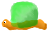

Mr. slimy will be squishable, freezable, but not flameable. When Tux jumps on it, Tux will stick and he will move twice slower
for five seconds. However, when it will be frozen first, this effect won't appear.

### Root

This root will grow up, when is Tux nearby and it will throw hurting stones to Tux. Root wouldn't hit on touch neither be solid.
Only the stones will hurt Tux. Root will be flameable and freezable.

### Panda Bear Boss

Tux gets off the ship at a pier, when he hears a splash. He looks at the water, and sees a giant panda bear get out and on
to the pier. Tux prepares to fight him...

... The boss panda bear is stunned, and he falls in to the water, causing a huge wave. Tux is swept off his feet and
carried through the water, screaming.

> "What is the moveset? Also we already have a big, fuzzy character, the yeti."

### Wing Snowball

- Flies straight and not very fast
- If Tux jumps on it, the wings of the snowball will fall down.
  - Then he becomes a Bouncing Snowball.

### Angry Snowball

- Runs very fast (because he's so angry)
- If Tux jumps on it, Angry Snowball will be eliminated.
- If Tux jumps over him, Angry Snowball turns, making him skid,

### Mr. Push-away

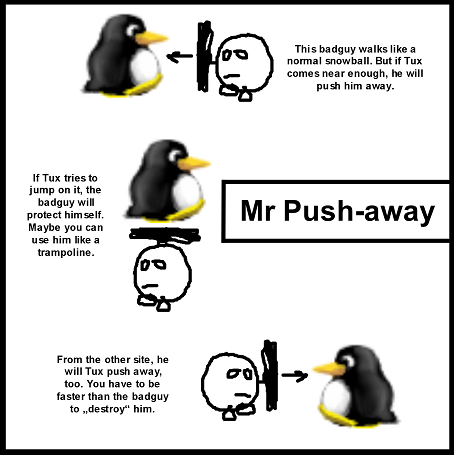

### Electric Eel

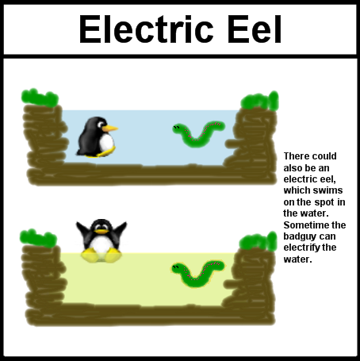

> "So kind of like the level “Shocking,” except the electrification of the water is triggered by a specific enemy
  rather than occurring for the whole level?" - Cooljeanius 22:10, 2 April 2011 (UTC)

### The Evil Tree

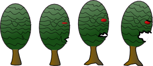

A badguy which could fit into the dark-forest scheme.

At first, this looks and behaves like a normal background tree, so tux can walk “through” it. (Especially mean when
having the same tree often as normal background) When tux passes a special point near the tree (surprise will be much
more intense if this point is behind that tree), it becomes alive and hunts tux.

> "It maybe would be a good idea to make the tree a little slow as it were strange to have it running around. That could
  be compensated by making it a bit harder to kill. (I also have the graphic in svg available where it should be easy
  editable and resizeable.)" - Henning 08:46, 27 Sep 2006 (BST)

### Leopard Seals

Just another badguy. See wikipedia article about this: en.wikipedia.org/wiki/Leopard\_Seal - They can grab penguins under
water, they can't breath and they die.

> "That's one that I've wanted since M1."

### Flattop/Flatbottom Iceberg

Flattop Iceberg looks like an upside-down icy cone with eyes that follow Tux and lives only in water. When jumped on,
speeds off at Mr.-Iceblock speed with Tux on top; at collision, Tux flies off and Iceberg crumbles.

Flatbottom Iceberg is a flipped Flattop Iceberg, so it can't be “ridden”. Both kinds of Iceberg can be killed by fire
shot and their points kill Tux.

### Walking Rock

It looks like an ordinary rock, but when Tux gets within range (5 spaces away), it grows eyes and legs and starts
walking. When Tux jumps on it, its legs vanish and its eyes close. Tux can then pick it up. If Tux lets go, or jumps
on it again, it speeds off like a Mr. Iceblock. This badguy can't be killed.

Alternatively, a big rock that works like a platform.

> "I don't think it should speed off, since it is a rock, not a block of ice and would have a good deal more friction.
  I do think it would be neat if a few seconds of it coming to a stop it revived and starts to chase Tux again if he
  is still nearby."

### Chameleon

This badguy is 4 spaces long. It lies motionless, and when Tux is in its sightline (10 spaces long, 1 space high),
it opens its eyes, waits one second, and shoots out its tongue. If it misses, it waits another second and shoots out
its tongue again. When Tux is hit by the tongue, he gets pulled into the chameleon's now open mouth and gets crushed.
If Tux jumps on it, it turns into a smaller, harmless chameleon which crawls around a bit and then disappears. If Tux
shoots it, it shrinks; with the second shot, it dies.

### Tick

The tick would hide behind plants and stuff, or in the grass. He attaches himself to Tux, hangs on for a while, and
becomes full and drops off, hurting Tux. Tux can then kill it. The tick may be killed by Tux becoming invincible, or
when Tux gets hurt by spiky plants, electricity, or lava.

### Swimming Fish

The Swimming Fish is like a fish turned on its side. It swims just below the surface of water and dives at Tux like
a Zeekling. It can be killed by jumping on it and by fire shot.

> "I've thought of this several times. I think that it will one day be implemented."

### Jellyfish

The Jellyfish is hard to beat because it moves randomly in water. The trailing tentacles (2 spaces long) can kill Tux.
It can be killed the same way as a Swimming Fish.

### Shark

Tux can only see the shark's fin. When he's at the surface of the water, the fin will poke out, and the shark will come
closer to Tux. It can be forced to submerge by fireballs, and killed by buttjumping or invulnerability.

### Earthworm

Earthworms slither vertically and horizontally. They are 1 space thick, and therefore would be best in 1- or 2-space-high
tunnels. They push Tux back; or, in 2-space-high horizontal tunnels, Tux can ride them. They only kill when they squash
Tux against a wall, floor, or ceiling. They cannot be killed.

### Killer Earthworm

Killer Earthworms move like a Limpy. They look like an Earthworm but are smaller with fangs in their mouth. They can be
killed only by fire shot and invincibility.

### Mr. Lightning

It looks like a small bolt of lightning with eyes and shoots down from a certain point, trying to hit Tux. It moves twice
as fast as a diving Zeekling. It cannot be killed, and it hurts Tux when it hits him, after which it disappears.

### Skullymine

I actually implemented this on my computer. It is the mr. bomb of the ghost forest; it can be frozen, carried, detonated, etc.
However, its explosion patterns will work differently of those of mr. bomb; different ways of killing it will produce different
results from the bomb, as it is encased in a skull. (P.S. unfortunately, I seem to have lost track of the skullymine files when
switching machines)

### Mr. Bubble

Mr. Bubble looks like a very fat ghost with legs and eyes. It mostly walks on the ground, but can also float up to 5 spaces
above the ground at random times. Upon spotting Tux, it shoots bubbles at him, and Tux has to dodge them. If he doesn't, he
gets caught in the bubble, the bubble shrinks to a tiny dot, there is a pop sound, and Tux dies.

Mr.Bubble 2: Looks and acts the same as Mr.Bubble,but warps Tux.

### Walking DartTrap

Looks like a walking SkullyHop, but shoots darts at preset intervals. Can be killed by squishing and fire shot.

### Suit of Armor

As high as BigTux, it runs with its sword held in front of it. It can kill Tux, as well as any badguy that can be killed by
Tux. When hit with fire shot, it melts and disappears.

### Smart Eye

|                        |                            |                        |
|------------------------|----------------------------|------------------------|
|  |       |  |
|   |  |   |
|  |       |  |

If Tux gets to near a Smart eye, it will haunt him until it hurt. Then Smart eye goes to wanish.

- Smart eye is not squishable.
- Smart eye is a bit faster than Tux.
- His pupil rotates under the direction of movement.
- Smart eye is freezable.

> "I think it is a bit the same of the the willowisp, no ?" - Ypetremann 18:26, 30 January 2011 (UTC)

> "Willowisp teleporting, but this will kill." - Hume 19:18, 30 January 2011 (UTC)

> "With script we can kill with it, or for me the right idea is to create a orange willowisp, like the flames that
  turn ... I see in the wiki that we will not make lot diferent monster or make the gake so dificult, and I think
  that the monster you descibe will looks like willowisp" - Ypetremann 19:00, 1 February 2011 (UTC)

> "Willowisp is not freezable." - Hume 19:00, 1 February 2011 (UTC)

### Icecrusher Family

| Krish                 | Krush                 | Kresh                 | Krosh                 | Krash                 |
|-----------------------|-----------------------|-----------------------|-----------------------|-----------------------|
|  |  |  | 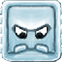 |  |

### Earth Badguys

- All earth badguys is freezable but not burnable
- Captain earth (simlary as Captain Snowball)
- Earthball (simlary as Snowball)
- Earth Jumpy (simlary as Jumpy)
- Earthman (simlary as Snowman)
- Flying Earth (simlary as Flying Snowball)
- Grassball (simlary as Smartball)
- Kamikazeearth (simlary as Kamikazesnowball)
- Mr. Earthblock (Simlary as Mr. Iceblock)

### Angry Stone

> "Angry stone is attached to the roof of a level, once Tux gets close to him (one tile to the left or right, he crushes
  to the ground, trying to kill Tux. Soon after he lifts back up to the ceiling for another attack. Angry stones might
  come in different sizes, from really small ones, 32x32, to very large ones, 256x256. Angry stones are always a multiple
  of the tilesize large so that they fit into the tilemap properly." - Mux

### Sleeping Snowball

Looks like a Mr Snowball with no feet and closed eyes, on contact with him Tux falls over and can't get up for a few
seconds, allowing badguys to get him. Might be defeatable.

### Sitting Spiky

- Looks like a metal dome with spikes
- Hurts Tux on contact

### Flying Spiky

- Looks like Sitting Spiky with propeller underneath
- If Tux touches prop. he gets blown away
- Hovers in mid-air

### Robber

Robber walks around and, on contact steals bonuses and runs off to somewhere. If he steals every kind of bonus, he gets
a weapon, allowing him to hurt Tux.

> "As an addition for this idea, it should be possible to pursuit and kill the robber to get the stuff back, though it should
  be pretty hard to get him." - Head 23:12, 8 Dec 2006 (CET)

> "Great idea."

> "Needs work... Besides, it sounds kinda cheesy." - DJ Wings 23:12, 20 Dec 2006 (CET)

> "SuperTux is Jump and run game, but not a shooting game." - Hume 19:21, 30 January 2011 (UTC)

> "I think that a monster like that will just rob anything, thing that can be important to the rest of the level, like a box,
  a key... and could look like a fox, or for antartic level, like a little jumping fish?" - Ypetremann 19:00, 1 February 2011 (UTC)

### Scared Cat

- Runs away from Tux
- Would be *nearly* as fast as Tux
- When he catches one Tux gets a reward-Special bonus?

### Ghostly Tree

Ghost forest version of Mr. Tree.

### Undead Enemy

When killed, stays dead for some time and then comes back to life. Could be a zombie penguin or a skeleton alike
to SkullyHops. Might be freezable and killed by fireballs or buttjump.

> "Like Dry Bones in SMW?" - linuxlove

### Volcano

Implementation of a Dispenser (took the idea from that page). Spawns rocks and/or flames randomly or at a given
interval. Might be frozen and become usable as a platform (or even something like a geyser), but only for a
limited time.

### Icy

Looks like a walking snowball encircled by a cloud of light blue smoke (frozen air). When the smoke touches an enemy or
an object, it reacts like it was hit by an icebullet or a stalactite. Can be killed only by invincibility, firebullet,
collision with Iceblocks and similar enmies. When Tux touches it he freezes for a short time, and is not hurt.

### Buzzer

Might look like . Generates an electric field that hurts Tux and enemies and electrifies
water. This could happen randomly, at fixed intervals or when Tux gets nearby.

### Fly

A fly that flies around Tux, annoying him and forcing him to move, but without harming him.

> "So it messes up the controls for a bit so that Tux is forced away from it? Original. Me likes!" - DJ Wings N0 PH33R 17:30, 10 July 2007 (UTC)

### Polar Bear

It's been suggested numerous times that a polar bear be used as a bad guy or NPC. Here's some concept art that I made:

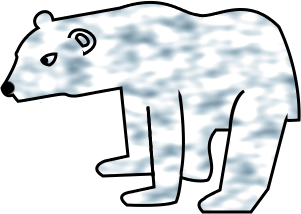

> "Suggestions for what it could do? Maybe it could pace around like other badguys and charge when it sees Tux? That's
  probably not a good idea, since it seems like  the sort of thing that only a boss should be able to do, and there's
  already the Yeti." - DJ Wings N0 PH33R 14:55, 9 August 2007 (UTC)

> "World 1 is [Antarctica](http://simple.wikipedia.org/wiki/Antarctica). That is a far away from polar bears as you can get without
  leaving the planet. But if we ignore that the bear might make a good boss for a snow world. He is way too big for a ordinary
  badguy." - Superdev 18:38, 9 August 2007 (UTC)

> "Since when have we been all about accuracy? Yeah, the bear is way too big for a normal badguy, and since there's already a
  boss, that's what I was afraid of. I don't want a clash in interests between me and the development team." -
  DJ Wings N0 PH33R 19:45, 9 August 2007 (UTC)

> "How about an NPC? Would that seem like a good NPC?" - 80.31.56.230 07:06, 11 August 2007 (UTC)

> "'Since when have we been all about accuracy?' I think that we should be more about it ASAP. The ghost forest is unrealistic
  enough. (No matter *how* cute the skullyhops are)" - Julius\_Freezer 23:58, 2 July 2009 (UTC)

### Pirates

Any bad guy pirate with a sword also be fun to the milestone 2.

> "Foudre: yer idea be seconded Me hearties, I bein' with ya, matey. Shiver me timbers, I've dreamed of this since M1,
  aargh. Cap'n snopwball be here! (Also, see [Water World](#water-world)" - Julius\_Freezer 23:58, 2 July 2009 (UTC)

### Flying Badguy

In SuperTux there was the idea of some flying badguy that if killed just loses his ability to fly and becomes
a walking BG. (Rip out his wings, pop his baloon, pull his goggles, etc.) A airborn BG that just flies left/right or
even is stationary could be used to jump on to cross a river or as moving obstacle.

> "Make it so." - Superdev 20:29, 31 Jul 2006 (BST)

### Giant Spider

It could be on a web that's in the background and walk randomly along it. It tries to drop webs on Tux. If Tux gets trapped,
it jumps on him and hurts him. Tux can hurt it by jumping on it when it's at the lowest part of its web.

### Giant Rats

### Penny

Nolok somehow makes her evil (maybe a trance, or magic, or something) and gets her to fight Tux; this leaves a problem for
Tux as he can't hurt Penny. This should be saved for when Tux meets Penny sometime in each world. Tux can kill off the magic
by throwing her enough love letters before he gets killed??

> "Or he could just have to stay alive until the trance wears off."

> "I would not bet on the love letter idea." - 166.137.11.53 22:36, 1 May 2012 (UTC)

### “Special” Yeti

Here's one big (graphically) miniboss for the ice level. A “special” yeti near an ice bank or something similar...
He makes ice-blocks in the ice bank and throw them at Tux. He can only be defeated by Tux throwing back the blocks at him.

### GIANT Snowball

One of those walking snowball enimies but BIGGER!

### Badguys and Immunity

> "I suggest that very few bad guys have complete immunity to [FireTux](https://github.com/SuperTux/supertux/wiki/Actions#fireflower)
  or [IceTux](https://github.com/SuperTux/supertux/wiki/Actions#iceflower). For example, instead of no effect, have
  [Mr. Iceblock](https://github.com/SuperTux/supertux/wiki/Badguys-Icy#mr-iceblock) get extra-ice stopping him in his tracks
  and making him take more jumps to kill in this state. Eventually (If Tux doesn't kill him first) the ice will melt and
  Mr. IceBlock will go back to normal. The same with the other bad guys. I think there should also be a downside for the
  bad guy in all cases." - F50

### Badguy Improvements

You should be able to pick up the beetle baddy and hit it from the side. The fish needs to be able to jump and swim,
and should work even if there is no water in the interactive layer, and is just in the foreground. The badguys should
stop killing each other.

You could\\should\\SHOULD make the creator of the level have the ability to turn badguys killing badguys on and off.

So sometimes a badguy behaves one way and sometimes it does something else? Stuff that looks the same should behave
the same way. Always. Maybe except Mr. Schroedinger's cat.

### More Paths for Badguys

There should be more Paths to edit in regard to the Badguys. Maybe for the Flame:

> "For the flame, you can create a hurting platform that uses the flame sprite. Kind of cheating, but it works." -
  Tuxnut 02:44, 16 June 2010 (UTC)

### Behaviour of Crystallo

- When Tux jumps on it: split in some pieces which fly around, destroy Badguys, hurt Tux or break wooden boxes.
- When Tux hits him with a fireball: It melts like other badguys with snow.
- When a icicled falls on the badguy, it also splits in pieces.

> "This sounds a bit too much like Mr. Bomb, except that the sprites are very different. Why not have a friendly-ish
  badguy for once? Tux can jump on Crystallo without harming him, but can use butt jump to kill Crystallo. The sides
  are sharp and will hurt Tux. Crystallo should also stack onto itself." - Mathnerd314 03:07, 23 January 2008 (UTC)

> "That's okay, too, but I didn't think about a badguy like MrBomb. The particles should look like the ones when you
  destroy the poison ivy. They don't touch Tux when he jumps on Crystallo. Well...let me add another behaviour: Only
  destroyable with a Butt Stomp."

> "Why not try the Idea of Crystallo doing a thing I think better than moving in a fixed position? Crystello could walk
  slower than Mr.Snowball, but have protection. The protection should be that a blue sphere should surround him every 3
  seconds or more, and when the shield is activated, Crystello cannot move. Also, when super tux gets hit by the Sphere,
  why not have supertux frozen, or hurt?"

### Nolok Ideas

> "I think that for a final boss that Nolok could transform into something really powerful."

> "Yes,I think too that Nolok could be the final boss.But very bore,like Bowser.I also think that can be an playable
  player, for who end the game unlock it and when play with Nolok,have another story (Nolok in the place of tux can be
  a bit strange,it's better that Nolok has an personal treasure and someone steals it)." -
  Baghogho  21:11, 17 April 2011 (UTC)

Art Ideas
---------

> "More tiles. I like the tiles we already have, but I think that there should be more."

> "More Music. I like the music, but I think there is room for more arctic and fortress music. I think we're good on
  forest music though."
  
> "Last but not least, Animations. I know making a game like this itself is super hard, but could you please add some
  animations? It would be utterly amazing if you could add stuff like that to the already fun gameplay.
  Bubble - float and pop in air (particle effect)"

What about a new glossy SuperTux. Or has he to be as all the other objects in wax crayon?

- **Fall position** if tux falls unexpectedly e.g. runs off an edge without jumping, he doesn't use the jump position
  but instead a “fall position”, flippers flailing, or just up in the air, looking down, feet spread to absorb the force
  of landing he might also use the “fall position” when falling at high speed
- **Fly position** when tux flies into the air unexpectedly e.g. he is blown by wind he assumes the “fly position” feet
  together pointing down, arms by side, looking up.

- Forest
  - Tile variance
    - Snowy Forest (needs discussion)
- Wasteland
  - Tiles and Background as pictured in the upper left-hand corner of
        <http://supertux.lethargik.org/wiki/images/9/97/Forestworldoverview.jpg>
  - Worldmap tileset
- Improve stone graphics of Tux
  - [Mantis 1072](http://supertux.lethargik.org/bugs/view.php?id=1072)
- Wallstone tileset and backgrounds
  - <http://supertux.lethargik.org/wiki/images/4/4b/Wallstone-tileset.jpg>
  - <http://supertux.lethargik.org/wiki/images/a/ab/Wallstone-tileset2.jpg>
- Portable objects (needs discussion)
  - Grabbing
  - Tux running while holding portable objects
- Ice crusher sound should be deeper / lighter depending on size of icecrusher sprite.

### Some Tile Ideas

#### Different Shades of Water

- **Light Water** This is easy to see through and should be used in shallow areas (less than 25 spaces deep).
- **Medium Water** This is darker and a bit harder to see through; it should be used in deeper areas (25-50
  spaces deep).
- **Dark Water** This is nearly black, hard to see through, and suitable for the bottoms of very deep pits and
  trenches (50-100 spaces deep).
- **SuperDark Water** This water is jet-black; you can hardly see Tux, and so it is suitable for the deepest
  oceans and trenches (100+ spaces deep).

> "This idea reminds me of one level in the original Jazz Jackrabbit. They implemented it by lowering the ambient
  brightness the further down Jazz swam, but they had a bunch of glow in the dark bits on plants and enemies so
  you could still see where to go (except the secrets they hid, no glowing bits there)."

> "I had a similar idea the other day... Maybe adjustable water would work better."

#### Decoration Tiles for Water

- **Kelp** There are two kinds; the darker immobilizes Tux for 5 seconds, while the lighter is just decorative.

> Have to be careful with this, 5 seconds is a looooooooooooooooong time to be immobilised, and becomes extremely
  frustrating to players in situations where it is possible to become immobilised very shortly after regaining
  movement. It's enough to make me personally put a game down and stop playing it for good.

> "Fine,2 seconds."
   
- **Black Smokers** These should be used in Dark and SuperDark water areas. There are two kinds again: one with
  light smoke and no light coming from its top, and the other with dark smoke and an angry red glow illuminating it.
- **Logs** - These logs are ordinary logs which Tux can jump on.
- **Deco Fish 1** - These are small, brightly colored fish that just float around in the same place all the time.

### Darker Background

Have the game engine display background as 75% brightness, making some levels easier to play, and making cave
background easier to see. Although this would cause conflicts with some other level designs, it would benefit
gameplay in the future. The background (the 3rd level that doesn't affect gameplay) would be darker than the
playable portion. (like in www.gamespot.com/gba/action/yoshisislandsuperma3/screens.html?page=59 Yoshi's Island:
Super Mario Advance 3\]) At least make a tileset of a darker color reserved for this reason. Otherwise it might
be hard to figure out what is background and what is an obstacle.

- An even better idea - Make it adjustable. Make the player able to adjust the brightness of the background, or every
  tileset, of blocks and such. Transparency would be a great bonus too. Although one of the suggested changes for
  milestone two is making the foreground transparent where Tux is, I think this would take some potential level gameplay
  possibilities away. Transparency around Tux, if implemented, should probably be adjustable. Hopefully in a 'layer'
  section of preferences.

> "The transparency and lightmap of a level is a part of level design and therefore really shouldn't be messed with
  by “normal” players. Changing either of those things would potentially have drastic impact on the playability of
  a level, either making it easier or harder than originally intended, as well as possibly lose certain atmosphere
  aspects e.g. bright snowiness, deep dark forest, foreboding castle, etc." - Tuxdev 03:41, 22 Aug 2006 (BST)

> "Eh... you may have misinterpreted me. I was referring to the possibility of adjustment of tileset color or brightness
  or opacity by level devs for each specific .stl, not by players. It's something that could make for some nifty levels,
  or at least more aesthetically appealing ones (depending on how it's used.)" - teal 22:23, 22 Aug 2006 (BST)

> "Okay, s/player/level designer. I think that both of these things have been implemented in SVN, but still needs
  tuning." - Tuxdev 22:43, 22 Aug 2006 (BST)

### Background Tileset

After reading Grumbel's rant: a tileset for forest parallax background is missing. Standard forest
tiles are too big.

### Ground Sounds

Could it be possible that there are sound effects when Tux walks on different types of ground, and when he hits the
ground? e.g. on snow he makes somewhat like “tsh, tsh tsh” and on grass (forest tiles) he is rustling? (You see, I
have some problems translating written sounds from German to English :( )I hope you can imagine what I think.

A sound if tux hits the ground should be possible. If someone creates a sound. For “walking” sounds its a bit
more tricky since there are no tile attributes that tell the engine what kind of ground tux is on, do we really want that?

> "Well, the tiles could get simple attributes, enabling this and, after some time of fooling around with it,
  lots of other effects. Deep snow makes you sink in and slower. Put the slickness of ice in there. Alternatively,
  just let the designer designate regions that have certain specs." - 84.154.88.23 22:17, 25 Sep 2006 (BST)

### Better Levels

> "The levels in Milestone 1 were ok but in Milestone 2 there are too hard ... :( They may be the same, but Milestone 2
  has got a worse control than Milestone 1." - 217.224.71.189 18:17, 8 April 2007 (UTC)

Hey, for some of us, harder is better! I thought the Mi1 levels were too easy. - DJ Wings N0 PH33R 19:30,
8 April 2007 (UTC)

> "I think the levesl are ok but maybe a adjustable grade would help. For example more/less savepoints, firetux
  directly becomes little when it's hit. More or less savepoints, sure, but fireTux -&gt; baby Tux = NO. -
  Julius\_Freezer 23:58, 2 July 2009 (UTC)

### Dynamic Environment

Perhaps a dynamic environment would be cool where the level reacts/interacts with Tux. Example; in forest levels
there are trees, and in the trees there are eyes or holes in the tree with eyes in and the eyes are watching in
the direction Tux is.

### Flame Sprite

I think that the current flame sprite sucks. I've designed a new one, maybe this could also be used as a meterorite.

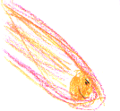

I think it's a bad idea for three reasons:

- **Flame** is always **flame** and never can be meteorite.
- If the flame should have a tail, the flame would have to draw on all angles.
- That's how you drew it looks weird.

--[Hume](mediawiki/Users/hume) 07:45, 21 February 2011 (UTC)

### Own Sketches

### Have a more complete tileset for each style of tiles

I see that I can't do what I wan't in the editor because there are a lot of tiles that where not implemented Like
in the image below

( the tile in the center don't corespond with the tile on the left )

> "Here I make a lot of snow tiles that were not created. With it and with the originals you can make up to 512 paterns
  that 3x3 sized " - Ypetremann 13:00, 23 January 2011 (UTC)

### The Infinite Patern

An idea to have the graphic not break. All tilemap that have a name becoming with \* where an infinite patern tilemap,
it make the graphic to be repeated if that the player see is out of the world For example, I make a very small level
to demonstrate how to make a good mario like pipe effect:  

> "For now we can make this effect by creating a tilemap that have an offset and that the size is over the most large
  screen size divided by 32." - Ypetremann 13:00, 23 January 2011 (UTC)

#### Running

Tux should have a better running animation, his legs should move faster, and perhaps he should flap his wings. Perhaps
if he reaches full run he could fly like everyone has been wanting.

---

## Powerups

- Better iceflower. No offense, but the iceflower is pretty useless. I think they should be like the ones in NSM Wii
  where the enemy is frozen into an iceblock. This iceblock can be carried and slides when thrown, taking out enemies
  and shattering on impact with a wall. In addition the enemies can be butt-jumped to shatter them.
- pongo stick (jumping)
- no slip boots
- snow ball instead of fireball
- skiis -(invincible)
- a powerup that would let him duck, then press jump and he starts somersaulting and spins in a (snow)ball, destroying
  enemies just like Sonic the Hedgehog.
  - I would love to see Super Tux become a Mario/Sonic fusion.
  - Unfortunately, Sonic is a hedgehog, which has a spiked back. Tux is a penguin, which doesn't
  - yes, but what if with iceflower he can do it to kill bombs and forest badguys, and with fireflower he can do it
    to ice guys?
- fast swimming powerup
- Fireflower should not be usable underwater and you should be immune to fireballs.
- Mega Tux power up (suggested in issue [#582](https://github.com/SuperTux/supertux/issues/582))

### Special Items are Evil

Special items look nice, allowing funny things to happen, but are still evil and should be avoided for most part.
The reason for this is that they make gameplay actually more monotone, not less. This is due to the fact that they
are less predictable, making it hard for the level designer to design situations in which the special items will be
actually useful instead of just toys. For example I can't design a way-blocking-puzzle for a fireflower, because the
player might already have used up all fireflowers in the level or I can't design a challenging level if the player
might still have a special item from a previous one rendering the level completely challenge-free.

This doesn't mean that there won't be special-items, but they should
be limited to stuff that respawns and is only usable for a fixed
section in the level, so that the level designer can much more
specifically use them and build puzzles and levels around them,
without having to worry if the player will have the item at all.

### More Powerups Discussion

Ability to have different power-ups and weapons would make the game more fun. For example, having a lot of power-ups
and weapons would make some players want to try out all the moves there are. Making the power-ups so that tux can only
have one at a time would make the game more interesting. (Possibly have offense and defensive powerups - no slip ice boots)

> Problem: More powerups means more combinations to test in the level to make sure it's playable

> "A while back I read somewhere here who you Dev people could not add more powers to Tux because then you could never tell
  what powers he would have when he got to a level thus making it harder for level writers. I was thinking that this was
  not true if you just make all these power ups have power downs for each one or for all or for some subsets. Thus a level
  could be made where the only way forward was to hit a power down. Thus the level maker would be in total contol of all
  of Tux's powers at any given place. Douglas E Knapp, Perspective Project MMORPG. (http://code.google.com/p/perspectiveproject)"

### Laser Flower

This would be a powerup looking like a fireflower, except that it glows green. When Tux gets this powerup, if the Action
button is pressed, a glowing green laser shoots out of Tux's beak and rebounds 3 times before disappearing, killing all
badguys that can be killed with fire shot. The laser should be about as slow as Tux's walking speed.

### Scuba Gear?

Give Tux a scuba tank for the inflated+Flying mode? He flies until out of breath, then falls. Once on ground, he can take
another puff. The physics wouldn't work in the real world, but it should be passable in a game, eh? When he gets hit, drop
the tank off the bottom of the screen much like a MrSnowball hit with a fireball?

### Boxing Gloves

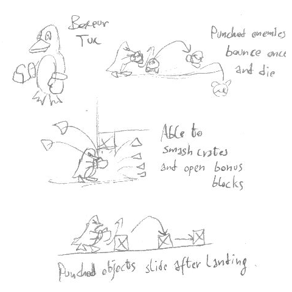

Boxing gloves might be found as temporary powerups, permanent powerups like the flowers or might be bought at the shops.
Boxeur Tux can smash crates, open bonus blocks and defeat most enemies by punching.

### Stone Bonus Blocks

these would only be activated by bigtux and firetux. depending on whether you are big or firetux, you would get a different
powerup.

bigtux powerup: hugetux tux looks like smalltux but is twice the size of bigtux, he is invincible and can kill badguys just
by touching them and earn coins doing it. he can also activate bonus blocks from above. this would run out after a certain
period of time.

firetux powerup: jet pack tux would act normally but if you press the set “up” button tux flies up slowly, gaining speed.
this would disapear after he has flown for a certain ammount of time and used all his fuel.

### Superpower Mass Effect

Whenever Tux has a powerup (fire/ice/whatever), a key combo may generate a big (almost whole screen) instant burning/
frosting/whatever area (fancy graphics) that results in only one fire/ice/whatever shot effect for each enemy/burnable
block/item in the area (this includes the potential [bad-side](User_ideas#Bad_guys_and_Immunity "wikilink") effects).
Once this ability is performed, Tux will lose the fire/ice/whatever ability and return to the normal bigTux.

> "I think this won't unbalance the game. The fact that with a fire/ice hat you have an unlimited fire/ice shot supply is pretty
  much useful than just an instant fire/ice area. You still could just kill every enemy in the screen by shooting and you still
  keep the powerup. Different ways with different difficulty and rewards will improve the game IMO. This feature could bring more
  fanciness and originality to the game along with more possible puzzles involving this ability (Ej: you need to burn a block
  that is out of range so that it makes a rock fall and push a button)." - Ferk 10:50, 2 February 2007 (UTC)

> "Like a Final Smash from Super Smash Bros Brawl? I'm pretty sure they kept the Smash Balls out of the Subspace Emissary
  mode of it (which is the closest part of it to Super Tux) for a reason." - Cooljeanius 21:07, 1 December 2008 (UTC)

> "A “superpower mass effect” actually isn't a bad idea. I thought it was at first, but come to think of it, it just might
  be better. (We'd just have to rewrite Welcome to Antarctica to include a section with it, and explaining not to use it by
  accident.) The thing would be, a lot of levels would have to have sections reworked in order to work with it. It isn't a
  bad notion, though, and would be something to keep in mind." - Julius\_Freezer 23:58, 2 July 2009 (UTC)

### Colorpile

They can be of different colors. When Tux eats a colorpile, Tux begins to shine color, what color has colorpile, what Tux ate.

### Gem

    
    
 

This is a powerup **without any specific features**, allowing that their function can not confused with something else.
It would be appropriate if I want to do unusual powerup, which would call a different script than the usual like egg,
fireflower ... and it wouldnt to powerup the confused with somewhat usunal. Gems could be a different color.

### Thunder Flower

-   ThunderTux would have head ruffled feathers and sparkles.
-   Tux would shot thunderbolts.
-   ThunderTux would kill just as FireTux, but something else.

#### Stacking

    (stacking
     (on_flying <boolean>)
     (on_non_flying <boolean>))

*on\_flying*
Powerup can lie on anything else powerup with flying.
*on\_non\_flying*
Powerup can lie on anything else powerup withoult flying.

### Water To Ice

> "It should be possible for Tux, when he has the ice-flower power up, to freeze water. But he should not freeze a whole
  lake with one ice-attack... I shalt put that intoeth mine version of Super tux." - Rorikdude

> "I've thought much about this. Perhaps Tux can use the iceflower to manufacture floating ice platforms, which melt
  when they are touched with fire and fall under his weight (like the unstable tiles). If he hits the tile twice, it
  will become semi-solid; a third time, completely solid. However, only surface tiles should be able to be frozen.
  Tux could freeze his was across a body of water if the ice doesn't melt or collapse before he can cross. Also, this
  **shouldn't** work underwater!"

### Pogo Stick

The Pogo Stick will give Tux the ability jump higher and to break blocks when he jumps on them. This will work simular
to the NES game Ducktales and the PC game Commander Keen.

Perhaps this should be just like a star, just a temporal ability. To avoid making the game too easy. It could also
be like the boot in Super Mario Bros. 3, which allows the player to jump on usually harmful enemies, but is gone a
the end of the level.

### Boomerang

Tux should be able to collect and use a boomerang on some levels.

This could maybe hit 3 badguys and then come back to Tux.

And of course not be usable against Flames.

### Soap

Tux might be able to eat some soap and thus be able to spit out bubbles, bubbles themselves should be usable as
steps to reach higher places and might be able to capture enemies.

This behaviour is similar to the bubbles in Bobble Bobble.

### Rope

Tux will be able to use a rope (in one form or another). The rope should be useful for both swinging around and
capturing/disabling enemies.

### New Movements For Tux

- Wall Jumping.
- **Diving** - in water?
- **Flying** - in air?
- **Hang glider** - to fly!
- **Walk on water** - but only if the water isn't deep
- Tux becoming frozen (as an ice block) in order to float and kill enemies

---

## Objects

- **Moving script triggers** - for example, have a cloud of smoke flying around and if it touches Tux it puts him to sleep
  for a few seconds.
- **Lava tiles** might be solid, making possible for some enemies (and maybe Invincible Tux) to walk on them. They may also
  kill even BigTux on touch instead of simply hurting him.
- **Special blocks** solid for enemies but not for Tux, and maybe vice-versa.
- **Truly floating platforms**, that actually float on water: if one of these is placed in midair, it will fall down, stopping
  when hitting solid or water tiles; if the level of water rises/falls, they will automatically rise/fall (SVN currently allows
  only platforms with a fixed path).
- Death mound
- Item which inverts the keyboard (if you press a key in order to go left, you will go right)
- Black hole which suck away Tux (he could die or the black hole could work as transporter)
- Transformed Tux which could cheat enemies
- **FreezeBall**: a kickable (but not portable) object that can be used to squish badguys. If the FreezeBall lands in a
  particular area (let's call it a goal) then a script is activated, possibly opening a door to a secret area...
- Ice floe as a game object (might also depend on fluid simulation as game object)

- **Weak stone**, Only explosions will be able to break these solid blocks.
- **TNT**, Tux will be able to grab this object. It will start ticking and then explodes, when dropped.
- **Broken boat**, The boat that goes from ice land to forrest land should be broken, and before Tux can use it, he must fix
  it somehow, by obtaining some tools like a hammer, saw, sail or something. This would create a new sub-objective in the game,
  which would make the game more interesting.

### Radar Man

Radar Man moves by disappearing from the square he is in and appearing in one next to it. He does not harm Tux he
simply makes Tux have to move like him for a while. Radar Man cannot be harmed.

Maybe its my poor English, but i dont understand what radar man is supposed to do.

Radar Man is a teleporter type object. He moves around, and if you touch him, you get teleported... that's how I
understand it.

> "In that case, it's already been implemented as a Will-O-Wisp." - DJ Wings N0 PH33R 19:52, 9 July 2007 (UTC)

> "Seems more like an object that forces Tux to move like it for a while." - Shylence 10:10, 10 July 2007 (UTC)

> "Look, it teleports short distances instead of actually moving. if it touches tux then tux will teleport short distances
  as well. Its up to you if that is good or bad. (this was posted by the guy who invented radar man in the first place."

### Safe

Something is hidden in a safe. If it is touched by Tux then as soon as Tux stops touching it the thing is released.
If it is a tile that’s hidden in it then to release it the safe turns into it, if it is a bad guy it appears on top of it.

> "I at least do not like that idea." - 84.154.88.23 22:14, 25 Sep 2006 (BST)

> "Every time you use Paint for anything other than pixmapping, God kills a graphics designer. I don't want to
  die because of you." - DJ Wings 23:15, 26 Oct 2006 (CEST)

> "I don't like it either." - Julius\_Freezer 23:58, 2 July 2009 (UTC)

### Change Blocks

Maybe you know it from Crash Bandicoot Games. It's a block containing different things. Tux has to choose
quickly, before the block become empty.

> "Like Blocks in SMW!" - linuxlove

There should be an option if it goes emty or not.

### Rotating Bridge

Create a rotating bridge, like in Mario. 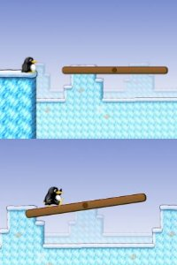

### Warp Pipes

Warp pipes should be able to be stood on, but by pressing down on the arrow pad, Tux could go down them. This could
connect underwater and cave levels, and should work somewhat like the door, which already works. They could be used
as secret areas, and would add a lot of depth to the gameplay.

> "This effect can already be accomplished by using a script over the top of the pipe. The script can use spawn points
  to respawn Tux inside the secret area, etc." - NathanKP 8/30/2007

> "There is only one problem. The Game must have some thin, invisible tiles to make the pipe's edges solid. I hope you
  know what i mean."

> "And with the scriptet way, it looks kinda ugly &gt;.&lt; He should move down, and then move to destination and then
  come out of an other pipe.."

> "I used heavily scripted pipes in my level. It's okay. Just you can see his legs sticking out."

### Ice Breaking

There are ice tiles or ice ground that can be walked on. They can also be jumped on without break. But if Tux does
the “buttjump” then it breaks the tile/ground. Perhaps this can be used to reach other areas or enter secret places.

> "I've implemented that in my own version - I can now smash wooden boxes with buttjump from top." - 500million

> "Or the fireflower could melt them. - Julius\_Freezer 23:58, 2 July 2009 (UTC)

> "There are [Unstable tiles](https://github.com/SuperTux/supertux/wiki/Objects#unstable-tiles) which dissolve after a while
  of Tux standing on them and [Weak blocks](https://github.com/SuperTux/supertux/wiki/Objects#weak-blocks) which burn when
  shot with the [Fireflower](https://github.com/SuperTux/supertux/wiki/Actions#fireflower)." - octo 07:58, 28 February 2010 (UTC)

### Throw / Shoot Up

> "It could be possible to throw objects/shoot fireballs upwards." - Shylence 22:16, 25 February 2008 (UTC)

> "*I* don't like the idea, but..." - Julius\_Freezer 23:58, 2 July 2009 (UTC)

### Teleporter

There are teleporters or some magic force fields that work as teleportation means on the level. When Tux walks into
the teleporter he gets teleported to somewhere else.

> "Doors."

> "Yes, doors are good. But maybe have other stuff too like teleporter, magic force field, hole, cave or something." - smallfoot

> "Can be done already. A door with another sprite or a script trigger." - WolfgangB 19:47, 7 Sep 2006 (BST)

> "Plus the willowisps." - Julius\_Freezer 23:58, 2 July 2009 (UTC)

### Diving

Tux can dive in water. Perhaps he need go up to surface to get more air sometimes (limited time underwater). Movement
under water is slower than on land. Perhaps there are monsters under water such as sharks, pirayas, “the dopefish” and
perhaps even some kind of boss. Can be a underwater tunnel, world, level, cave or something. Maybe need pull a switch/lever
under water or do something there to open something on the surface.

> "Time limit sucks."

> "Uhm.. since when a penguin is faster on land than on water?"

> "All the blocks he ran his head in have to have some effect."

> "Ok, I know the game is already unrealistic but there are still things that don't need to be forced. Why should
  Tux swim slower? its because Super Mario swims slower? Super Tux is another game and I think it has the right
  to break some non-existent rules on platform games. Been a penguin I think *at least* Tux should have the same
  speed than on land (though with different acceleration and physics), the underwater enemies could be faster too.
  I find many platform games too slow when they go underwater."

> "Yes, he could also be faster. But there should be a difference in movement under water and on land. Such as
  different acceleration or physics." - smallfoot

How 'bout make him actually look like he's swimming: - instead of |.

> "Here's what I say: Swimming graphics, MUCH faster, no time limit, and fire/ice don't work (though pecking badguys might).
  Yes, Tux is a penguin! Penguins fly underwater!" - Julius\_Freezer 23:58, 2 July 2009 (UTC)

> "See [Swimming](https://github.com/SuperTux/supertux/wiki/Actions#swimming)" - WolfgangB 19:48, 7 Sep 2006 (BST)

### Doors / Bridges

Tux needs to enter doors or open bridges to pass to some place. In order todo that, he needs to todo something first.
Such as get a key, or pull/push a lever or a switch. Or perhaps place an item (such as an stone or something) on a switch.

Can be done with scripting.

> "Good, but I have never seen this implemented in SuperTux yet. The game needs this type of stuff to be dynamic and
  fun and entertaining." - smallfoot

It has been added to SVN. (needs to be moves to Implemented).

- **Pushable/rollable stone** - you roll it over enemies so they die, and can roll it to place so you
  jump up on it to reach higher.

These stones can be pushable so they start rolling.

1. Can be pushed to roll over enemies so they die.
2. Can be pushed to places and then jumped upon to jump from the stone to reach higher places which are
   otherwise unreachable.
3. Can be pushed onto a switch to trigger the switch to trigger something, such as opening/unlocking a
   door/bridge, etc.

### Pushable Crates

Kind of similar to the above mentioned “rollable/pushable stone”. But these can only be pushed and not rolled.
Can not harm enemies. Unlock stones, these has the ability to be stacked on top of each other.

> "Seems already implemented as blocks." - Some Person 14:59, 17 March 2008 (UTC)

### NPC

There should be NPC's (Non-Player Characters) which can interact with Tux. These can provide Tux with information
of where to go, or where to find something, or what todo, how to accomplish something, guide Tux in something,
teach/learn Tux something. They should have different personalities and different roles. Maybe they can bless Tux
and grant him the powers of invulnerability or ice flower or fire flower or make him big if he is small (or perhaps
make him small if there are no monsters, and he is too big to enter something). They can also give him keys or other
items. Perhaps some NPC does this freely, while other require him to trade an item (perhaps a fruit?), or make a
promise, or provide some info to the NPC or answer a question or take some kind of test.

#### Merchant

I think there should be some sort of merchant in the game where you can spend gold and powerups to buy different
things so if you have any money that you can't use you at least you have some use for it!

"Shops have already been proposed. I rather like the idea. I think that the gnu should be the merchant selling stuff
in the shops." - Julius\_Freezer 23:58, 2 July 2009 (UTC)

> "Really! Where? Thanks! I'm Suprised anyone would answer my ideas! Just tell me where the shops are coz -
  I've never seen one!"

> "Maybe the coins could be money or something." - UltraTux 21:00, 16 August 2009 (UTC)

#### Rukush

A friendly NPC. Rukush the Crystallo could live in the bonus level of icy island, where it would have a garden of tree
saplings, fireflowers, and iceflowers.

### Glass Wall

Now, light permeates through walls. It shouldn't, although I don't know whether it can be done. Then there should be
a Glass Block, which would be permeable.

- This IS possible, but it would either be very difficult or it would make the game run more slowly.

### Anti-Lantern

Another idea, surely easier to implement, are Anti-lanterns. They should produce normal lightmap sprites (with positive
colors) but their real lightcolor would be negative. This could be simply a feture of Lantern. In Latern::updateColor,
instead of:

`sprite->set_color(lightcolor);`

there would be:

`if(lightcolor.red<0&&lightcolor.green<0&&lightcolor.blue<0){`
`   sprite->set_color(-lightcolor); //Now it's an Anti-lantern`
`}else{`
`   if(lightcolor.red<0||lightcolor.green<0||lightcolor.blue<0){`
`      //At least one component is negative but not every one because it was the first case`
`      //Error - it is neither a Lantern, neither an Anti-latnern`
`   }else{`
`      sprite->set_color(lightcolor);`
`   }`
`}`

As an Anti-lantern would seem to be a normal lantern, it should be marked somehow, possibly with a minus on its top.

> "Tux could use it when there was an inaccessable Lantern and a Magicblock standing in his way." - Špule 06:02, 3 July 2007 (UTC)

### Carrying Bird

I think there should be a creature (for example a bird?) that can carry you a few time through the air but can let you
down unexpected.

### Fire Escape

Behaves like “sequence-trigger” with parameter “sequence” set to value “stoptux”.

#### Ten-Coin

    
   

You gain 10 coins.

> "I think that for this, we should just copy the originals but in other color like argent, because it will be the same and
  different, when I play Supertux, I don't want to see text, just symbols, like a flower for the fire flower power ..." -
  Ypetremann 18:26, 30 January 2011 (UTC)

### Throwobject

| Big                         | Small                   |
|-----------------------------|-------------------------|
|        |     |
|  |    |
|        |  |

*If someone suggests another form, you can add it to this table.*

Throwobject can pick up, point and throw it. If you do that, and hit into a badguy, so it dies. Throwobjectsare
**big** and **small**.

    (throwobject
     (x <x-pos>)
     (y <y-pos>)
     (sprite <sprite fileneme>)
     (type <"big" or "small">))

#### Small Throwobject

- If you miss the target and falls to the ground, I can throw it more.
- If you hit, the throwobject is destroyed.

#### Big Throwobject

- Small Tux can not use it (because it can not carry).
- Once it reaches the target or falls to the ground, broken into four small throwobjects the same type.

### Overload Light

|                               |                               |                               |                               |                               |
|-------------------------------|-------------------------------|-------------------------------|-------------------------------|-------------------------------|
|  |  |  |  |  |
| Ambient light 0;0;0 | Ambient light 0.5;0.5;0.5 | Ambient light 0.5;1.5;1 | Ambient light 1.5;1.5;1.5 | Ambient light 1.5;1;1 |
|  | 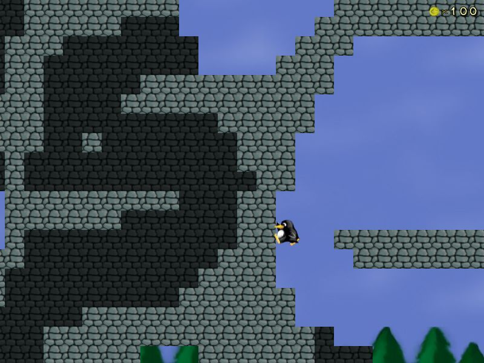 |  |  |  |
| Ambient light 1.5;1;1.25 | Ambient light 1;1;1 | Ambient light 1;2;1 | Ambient light 2;0;0 | Ambient light 2;2;2 |

### Laser

Not a laser, as you might think. This laser can not hurt anyone and always lights up. Lights are still in one direction
and the beam ends where the wall stops. Bonus blocks laser beam can pass too. It also has the ability to light up the
magic blocks. Tux can carry it.

    (laser
     (color <red> <green> <blue>)
     (side <"up", "right", "down" or "left">)
     (portable <boolean>)
     (x <x-pos>)
     (y <y-pos>))

### Mirror

This would reflect all the light produced from the objects away. Some mirrors Tux can carry.

    (mirror
     (x <x-pos>)
     (y <y-pos>)
     (angle <mirror's angle>)
     (portable <boolean>))

### Tiles

- **FrozenWater/Iced-water** - Just a frozen version of water where Tux skids 6 tiles when turning around after
  running.
- **Lightnincloud** - Looks like the normal cloud except gray. Every 7 time measurements, it blasts lightning
  down at Tux. Every 3rd blast is slower.
- **DesertTiles** - Like Grass and Snow tiles, except with only the flat, and sloped parts for Desert.
- **QuickSand** - When added, QuickSand would beam Tux to a new sector called ”UNDERGROUND” that gets added when
  QuickSand was.
- **OceanTileset** - Contains; Ship tiles(big and small) and all water tiles.
- **Waterflow** - A foaming right/left edge of the water so you can make it so the water looks like blockade in the
  river was removed.
- **New Air Tiles** - 
- Slime/Mud - Slow down Tux's movement
- Quicksand - Tux could sink slowly in this and be slower than usual

### Rope

> "This could also be implemented as a jungle vine especially for world 2" - zratchet

> "Tux is turning into Indiana Jones. Swinging on ropes, having darts fired at him by skulls on the wall, acquiring
  artifacts...but I kind of like that." - Julius_Freezer 14:07, 3 June 2009 (UTC)

### Collectibles

Maybe we could have big coins you could collect (like New Super Mario Bros Wii.), and unlock a bonus World
(World 9 in NSMB Wii).

> "Collectibles on a per-level basis are planned in *Milestone 2*, see
  [Milestone 2 Design Document](Milestone_2_Design_Document/Objects#Collectibles)." - octo 07:52, 28 February 2010 (UTC)

---

## Other Ideas

- **Grouping objects in the editor**, or at least being able to select more than one at a time - this would make it much
  easier to do levels with many similar objects. Say I have 20 snowballs, and I decide I need only 5 there. It takes 30
  clicks to delete 15 snowballs - I should be able to select 15 of them, right click one and delete them all.
- **Scrolling**: I know we have worldmaps for most level sets, but the test collection could use a scrolling feature.
  There are many more levels than the screen shows.
- **More sounds** for example, a ringing noise for whenever Tux touches a bell.
- **More options**: Especially being able to switch between the old and new behavior for running with the action key pressed.

Problem: You have to test all the options. Every time you change anything. Does it work with ALL combinations? PITA.

- **Let falling objects press buttons** - for example, burn some burnable blocks to make a rock fall on a button

- **Fading parts of tilemaps** so you don't have to make a separate tilemap for each secret area. Just fade the part
  that's covering \*this\* secret area.

> "That would be illogical, and hard to make it work correctly, having a separate tilemap is simpler and more logical." -
  AnMaster 20:14, 20 January 2007 (UTC)

> "What about a tilemap, that always makes the part in front of Tux semitransparent?"

> "Doesn't sound useful for anything." - AnMaster 15:03, 21 January 2007 (UTC)

> "Did you ever play Short Visit to El Castillo? It would be very useful if the foreground could fade away so you can see tux."

> "I have played that level of course... (I'm a SuperTux developer after all...) And I don't see what you mean. The
  trees directly after the start or what? The secret area fades in it iirc (at least it does in trunk, not sure about 0.3.0)" -
  AnMaster 18:04, 21 January 2007 (UTC)

> "AnMaster, i think it was about the building, like, from the outside you don't see what is inside, but when you fall
  into the hole in ceiling the from tilemap fades and you see what's inside. Got it?"

- climation (if the level is sunny, the ice will melt. If the level is windy, the wind will move Tux)
- secret levels reached by different exits

### Outfits

> "I think that Tux should be able to change his look and wear outfits, like color changes, masks, and whatever... just for
  fun, so that Tux suits your look. There should be costumes for Tux, Penny, and Both. You should be able to buy them with
  coins."

> "Hey! I like that Idea! It would really work. Because if you were a girl you would probably rather Supertux to wear a
  fairy dress (LOL) So it would be able to blend in well with my 'shop & merchant!' down below. It could be a costume and
  powerup shop."

### Nolok's Flag

What about a flag Nolok could have in his castle? Here is an example:

### Vehicles

Tux should be able to board vehicles or ride animals, like Yoshi in Super Mario. The vehicle could withstand 3 hits from
a badguy, and then explode. If tux was firetux, he could then throw fireballs from the vehicle. There would be 3 vehicle
types: Land Vehicles (3 hits to explode), Watercraft (2 Hits to explode) and Aircraft (1 hit to explode). Vehicles could be:

- Iceball
- Tuxmobile (A Snowmobile with tux painted on it)
- Jeep
- TuxBike (A Harley Davidson type bike, wheelies possible)
- Helicopter (Three types: Normal helicopter, Water Chopper (Can land on water), and Tux Chopper (Can fire at enemies)
- Jetski
- Airplane (Two types: Tux Plane, which has a picture of Tux on it and can drop fireballs when Firetux, and Waterplane,
  which can land on water)
- Glider that would let tux slowly glide in a line.
- A magic carpet, in order to make Tux go higher

> "+1 - hell f\*\*\*ing yeah" - 195.92.67.74

> "+1 three airplanes!!?!!?!"

> "Now that's getting AWESOME!!" - 124.183.155.78

> "Personally I think that this would not be keeping with the supertux theme."

#### Seal

Maybe Tux Could ride a seal like Mario rides Yoshi! that would be fun.

### Platforms

Rotatable platforms! Like moving platforms, except they can rotate.

Ability to move platforms without a fixed path. Something like: platform.move(x,y,speed). An optional turtle-like scripting
interface would be good, on the other hand it could be overkill.

Platforms that detect whether Tux is standing on them and only start moving once Tux is on them. And it could even change
directions each time Tux jumps (yes, I know those kind of platforms were in Super Mario 3).

Platforms that react to where Tux is standing on it - it moves left/right on a track if you stand on it and tilt it left/
right, but it corrects itself and stops after a little if you jump off. Or a platform like the one in level 7-2 of New Super
Mario Bros for the DS - it's a platform that continally moves up but tilts left/right when Mario stands on it so can be
steered.

### Improve The Handling of Tux

> "Please tweak the handling of Tux to make more precise movements possible. In version 0.3.0 at least, Tux gets accelerated
  forwards too fast, so it can be difficult to jump precisely. So reduce the \*initial\* accleeration, but of course, not
  the maximum. In other words, holding a direction should expotentially increase acceleration up to the normal level, starting
  off very slow, but then speeding up. This process would take maybe something like 1.5 seconds or something (test different
  settings and use the one that gives the best feeling of being in control). Basically make Tux handle more like Mario. ;P"

> "Yeah, the current method is lazy anyway, even an amateur programmer can do that. (x+=\[speed\], x-=\[speed\])"

> "Feel free to send a patch."

> "Give him some rubber boots. When he jumps and lands again, he is just slipping such a long way. I don't believe
  that SuperTux just cannot land. It's SUPERtux. ;-) Especially in the Forest he is still sliding which is kinda
  weird. When it is raining or in the water and on ice this property makes sense but underground and on grass rather not."

### Surviving A Fall

I don't think he should necessarily not be able to fall of the screen, but he shouldn't die right away. It would be
cool if you could swim in lava with a star or a special hat, too.

### Air Limit / Oxygen

> Penguins are built to fish, an emperor penguin can stay underwater without needing air for 27 minutes. So any air
  limit should be a very long one.

> "There are underwater platforms in the game. Maybe you can add an indicator of oxygen level? Then oxygen gone, Tux
  die... Sorry for my English..."

>" Unless you leave the game running while you go out and work in the yard, there would be no way Tux could run out
   of oxygen. Penguins can hold their breaths for a *very long time*...***very*** long time." - Julius\_Freezer 23:58, 2 July 2009 (UTC)

I don't know if penguins can breath underwater, but maybe Tux need swim to surface to breath sometimes...

> They can hold their breaths for up to 12 minutes. Good enough?
  - It depends on the penguin. Adélie's--like Tux--can hold their breaths for 15 minutes. I seriously doubt he
  - would be underwater for that long. You probably won't be making a level as long as “Moving On,” (an EXTREMELY
  - long--7000+ length, level made by a friend) all the way below the surface of the water." -
  Julius\_Freezer 04:32, 25 June 2009 (UTC)

### Stage Variety

One thing that SuperTux is missing that Mario had would be stage variety. There are already above and underground
stages, but where's the underwater action? Not to mention things like castle stages, stages with rising/falling
water, vertically scrolling stages, those really annoying maze stages, autoscrolling stages, et cetera. Not to
mention different locales, but I gather that those are already in the works. I refer specifically to some sort of
forest. (And, might I add, picturing a penguin in a forest is pretty amusing.)

They are going to use a forest in M2

foudre: I dl the alpha for milestone 2, problem being is that in mario and other games they had more variety, ie:
smaller worlds and more of them, rather then a long series of same themed levels, the forest is sort of cool, but
people need to work on more tile sets, i will try to create a mountain side/volcano one, but the thing about major
sidescroolers they had several worlds, and some levels even had their own tileset, so i think there shouldn't be the
same fear of extra tile sets here either, i mean keeping it reasonable of course. and of course more enemies, the new
set of forest creatures was sort of cool, still needs more variety

See: en.wikipedia.org/wiki/Computer\_and\_video\_game\_settings

The wall stone preview could really be a step in the right direction.

### Friendly NPCs(Non-Player Characters)

Perhaps there could be friendly(or at least non-hostile) beings in the world. I would prefer implementation in
milestone 3 or longer so as to not put another thing for the developers to do. A yoshi equivalent(seal?) would be
neat but may be an entirely different game altogether. Some other ideas: a character who gives tux a quest in exchange
for a key, hint for a puzzle etc., a charater who fights with tux for a little while to achieve something against nolok,
a character teaches tux certain abilities. -F50

> "This would be good. Make a 'talking' system that scrolls on the bottom. Maybe some characters could give you extra
  supplies or even weapons." - Ajdlinux 23:23, 30 Sep 2005 (BST)

> "Maybe modify the code for info boxes to let characters talk? Sounds good." - DJ Wings 18:27, 11 Jul 2006 (BST)

> "Text is evil. The player has to be able to read and understand the language which is a requirement that was not
  there in MS1." - WolfgangB 14:21, 12 Jul 2006 (BST)

> "Stores or some such could just work with numbers and pictures. Having a *story* told in little pictures would
  even add a very fun element.." - RichiH 22:42, 25 Sep 2006 (BST)

> "Yeah, that would be nice. If nothing else, a translatable infobox could describe a product and its price...Tux could
  buy flowers (for Penny? LOL), and the picture thing would be nice on a purchaseable map of a level." -
  Julius\_Freezer 23:58, 2 July 2009 (UTC)

> "I think that the Yoshi equivalent, if used, could better be a Polar Bear in stead of a Seal. A Polar Bear can walk
  a lot faster on land than a Seal." - Tuxenegger 17:35, 20 January 2006

Bad idea, polar bears live in the arctic, penguins live in the antarctic.

> "What about more then one Yoshi equivalent depending on the world he is in like for ice a polar bear or a walrus and
  for forest a sloth or some kind of gecko (nothing looking like yoshi of course) and even if polar bears and penguins
  dont live together i highly doubt there is such things as walking snowballs/icecubes exist and the yeti is debatable." -
  Atomic1fire 02:05, 1 Jan 2007 (CET)

> "I'll get to work on the graphics." - DJ Wings 18:27, 11 Jul 2006 (BST)

### Female Players

Perhaps a version of story mode where Tux is kidnapped rather than Tux and Penny must go safe him.

### Collecting Stuff

I think what makes some games really enjoyable is the possibility of collecting things. One (maybe totally crazy) idea:
if Tux could spit bubbles, he probably could catch enemies and carry them to a specific place, like a museum, which is
located on the world map. For completing the collection with all badguys of the current world, Tux would get a reward.

Big Coins or Medals would be more realistic. There should be an map where you can see what medals you have, or just
how many and when a specific number is reached a door on the world map opens...

I love this idea! However, I'm not sure about how it fits into the theme of SuperTux... Maybe instead of bubbles

Tux could somehow freeze enemies in a block of ice and carry them in his feet like real-life male penguins carry
there eggs. The challenge would be to get to the end of the coarse without it getting knocked out of your grasp
by an enemy and sliding of a cliff. Maybe the igloo that Tux starts out on could be the “Museum”.

### Cheats

Tux wears a little party hat when you type “tux rocks”. When you type “iddqd”, tux shakes his head. When you type
the name of a specific badguy, Tux looks like that badguy.

> "iddqd? idkfa!" - RichiH 22:47, 25 Sep 2006 (BST)

> "Pointless, useless, and we already have useful cheats." - Some Person 14:29, 17 March 2008 (UTC)

> "LOL I spelled “Tux” with “rocks” in *Tux the Builder*! I'll have to dig the screenshot out...I saved it as “Tux
  rocks”. - Julius\_Freezer 23:58, 2 July 2009 (UTC)

> "IT DOTH COOL!!!!! I shalt put that intoeth mine version of Super tux." - Rorikdude

In the mapeditor it should be selectable if the cheats are on or off, maybe for every cheat. Because some cheats will
cause a level to malfunction.

> "Or disable cheats altogether. Or, cheats such as ghost() could be built in via the console--sector.Tux.rock(),
  or sector.Tux.do\_iddqd()?" - Julius\_Freezer 23:58, 2 July 2009 (UTC)

### Improved Tux Surroundings Viewing

> "With some keypress the camera zooms out (to 175% for example), so everything looks small and you have a wider scope of
  the surroundings. As long as you keep the key pressed you can use the arrow keys to move the camera between certain
  limits (Tux should be always visible). This would enhance the usability of puzzle-oriented maps that had big schemes
  (buttons that had an effect at farther different places) and would make use of the fancy features of OpenGL." -
  Ferk 11:35, 2 February 2007 (UTC)

> "That would make some levels too easy." - 70.153.248.49 20:51, 28 March 2007 (UTC)

Maybe there could be some Map Blocks. Like info-blocks but these should show just a “roughly scetched map” of te level.
Or maybe just a part of it

You can make an info blog and show an image of the level. Maybe distant images are blurry to simulate limited visual acuity
so the amount of information that is present decreases with distance.

### 3D Tux

I think that Supertux would be even cooler in 3D. It could be partially implemented, for example, there could be
substages in 3D, or a 3D world later on? Or maybe it would more appropriate in a future spin off game?

> "Are you thinking of tuxaqfh.sourceforge.net, or something more like the 2.5D New Super Mario which uses 3D sprites
  in a 2D world." - Tuxdev 22:51, 3 Oct 2006 (CEST)
  
> "Like XTux? I don't think 2.5D would work with a completely 2D sidescroller like SuperTux." - DJ Wings 02:19, 10 Oct 2006 (CEST)

> "No, he means like New Super Mario Bros or Super Smash Bros Melee, where the game is 2D side-scrolling but the graphics are 3D.
  (I mean tuxdev meant that, not the OP)" - 67.168.194.207 02:12, 11 Oct 2006 (CEST)

> "2.5D approach is cool, maybe the game could be played mostly in 2.5D , and the bosses in 3D like tuxaqfh.sourceforge.net.
  Just throwing around ideas." - 66.153.31.148 06:54, 4 Oct 2006 (CEST)
  
> "Maybe leave the game itself how it is, and have 3D cutscenes?"

> "It's a good idea. Leave the game how it is, only change the cutscenes." - DirtY iCE 10:54, 5 Nov 2006 (CET)

> "This idea may seem a bit wacky, but tux could fall into a hidden hole where he gets virtualized and has to fight virtual
  enemies in a virtual 3D landscape for a few levels then he has to go through a portal in the last 3D level to take him back
  to 2D. The only problem is the huge amount of code and graphics that would be required, thus resulting in a huge package size.
  Perhaps this could be an addon for a new bonus world?"
  
> "Something similar to the original Jazz Jackrabbit style bonus stages perhaps? (For the uninitiated, picking up a large hidden
  gem in certain stages in JJ would take you to a 3D bonus stage on completion of the level, in which you would navigate a maze
  to collect a certain number of gems to win an extra life). Not entirely sure of the best way to set this out, certainly don't
  want to directly copy off JJ, just throwing the idea out there."
  
> "Sounds a bit too much like TRON." - Gyroknight

> "At first I was hoping that somebody would want 3D Tux, but the more I thought about it, the more I thought that the game
  would lose its atmosphere if it went from 2D drawings to 3D models." - Julius\_Freezer 23:58, 2 July 2009 (UTC)
  
> "I wholeheartedly agree. Above all, Supertux \*must\* remain firmly in the second dimension. 3-D models would ruin the
  game's cartoony, painting-esque charm." - Mr Eyeball 18:20, 11 October 2009 (UTC)

### Collect Coins by Shooting

> "It should be possible to collect coins by shooting at them with the fire flower powerup. AFAIR, you can do this in
  Super Mario games." - 217.235.171.77 01:24, 9 Dec 2006 (CET)

> "No, but maybe get coins for killing badguys?"

> "Why we turn that not arround and Tux have to pay coins for ever fireboll?"

> "I think both are bad ideas. Free fireballs is better, and coins should only be earned by collecting. (EXCEPTION: Tux can
  get a 100+ coin bonus like in certain blocks for each boss he defeats?)" - Julius\_Freezer 23:58, 2 July 2009 (UTC)

> "I like the idea of being able to use fireballs to collect coins. Actually, it seems obvious to me."

### Stylus Control

Why couldn’t one control Tux with stylus? By dragging right Tux would move right and after certain point would change to ctrl-mode.

The height relative to the middle of the screen would determine whether Tux should duck or jump or just move.

Picking things up with tapping the screen once?

> "Just some thoughts. We should not let the lack of keyboard restrict us. I assume that this would be in a DS version of the game,
  right?" - Cooljeanius 21:04, 1 December 2008 (UTC)

> "Or a version for phones with touchscreens, or (rare) laptops/computers with touchscreens, or the “tablet” doodad that
  apple is selling ect... Oh and you can get linux for DS."

### Alternative Character

A playable alternative character, maybe a secret character that can only be played by using a cheat code or unlocking the
char by winning something of doing some impressive feet.

He is quite the opposite of Tux with a complete different personality, instead of a cute little hero, this guy is an antihero
(like Spawn or Batman), hes eye glows green or something, he puts everything in its path on fire and make the level a living
inferno, hes very fast, strong, malicious, fearful and aggressive. Annihilating anything in his path, leaving only a trail of
destruction behind. Maybe he could be a sorcerer and have vast powers of magic, maybe a spell wand. A real badass that roars
like a tiger, arrr!

- In Sonic games, player can play Tails, Amy, Shadow, etc...
- In Mario games there are many different Yoshi's, and mushroom, princess, Luigi, Wario, etc...

Playing a cute little dragon would be cool too! :D Again,I shalt put that intoeth mine version of Super tux.It will be out
in three years-Rorikdude

> "I think that an alternative character (outside of [Super Tux Smash](https://github.com/SuperTux/supertux/wiki/Ideas#super-tux-smash))
  would be another very bad idea. Penny, of course, ***must*** be playable--that is given--but the whole idea is that you have Tux the
  penguin and you jump and squish your way through a variety of levels until you reach a fortress." - Julius\_Freezer 23:58, 2 July 2009 (UTC)

### Submit Level

A very nice way to get the community involved in creating artwork/levels for SuperTux would be to have a submit button in
the level editor. Submissions received this way can be put on a website where the community “votes” (for example digg style)
the levels.

> "See <http://supertux.info/pmlvls.php> . I don't think a button in the editor would do much good. Too many people would submit
  everything just because they can. Lets hope uploading manually makes them think a bit about their level." - Superdev 09:35, 6 October 2007 (UTC)

### Planet Map

> "To add a sense of proper geography to the game, after you defeat a world's boss, you could be given a brief cutscene of the
  game's entire world, with a little Tux icon shown moving between the “Worlds.” Antarctica would be at the very bottom, of
  course. And this would alleviate a little bit of the “Forest World is a little bit east of Antarctica” stress in the back
  of my mind every time I play. (Sorry to sound nitpicky.)" - Mr Eyeball 18:27, 11 October 2009 (UTC)

### Powerup Shop

> "Maybe, just like mario there would be a shop And what ever you brought would appear In the gadget with a thing that says
  “click here” And whenever you clicked on that the next box you searched would be the thing that you brought." - crazypenguin

### Complaints

> "I guess I'll start this section for us all to post our own “Grumbel Grumbles” about the current version. My main complaint
  would probably be the types of levels in the Forest World. It seems to me that ALL of the levels in there contain a gimmick
  which is never to be found again. “Bouncy Coils” is the only level to contain the coils. “Crumbling Path” introduces the
  crumble blocks, which are never seen again. “Tux the Builder” has building blocks which are also never seen again. Call me
  spoiled, but I'd like to see some more just-plain-levels (Like “Welcome to the Forest”) when Milestone 2 is finally released." -
  Mr Eyeball 21:59, 24 October 2009 (UTC)

> "One more thing: Just because it's the Forest World, doesn't mean that there have to be ONLY forest levels included in
  there. The Mario series has Grassland Levels in the Sky World, Sky Levels in the Forest World, Volcano Levels in the
  Grassland World, etc. After 23 levels of *only*forest, I got a little bored of the theme. You might say the novelty
  wore off. I'd also like to see certain enemies (Like the Goomba in Mario) that appear in every world. And I think the
  castles in each world should have the same (or somewhat similar) tileset to add a sense of uniformity to Nolok's
  designs." - Mr Eyeball 22:03, 24 October 2009 (UTC)

> "This is why 0.3.\* is called a “development version.” It is intended to preview new features. The levels are the demos
  for these features. This is also why you can get the editor for these levels.
  (See [Download/Unstable\#Release\_0.3.0](Download/Unstable#Release_0.3.0)) If you do not like the current levels,
  please create some. Nobody else is working on SuperTux; you'd probably be the first to make some. Submit them according to
  the instructions in [Contributing](https://github.com/SuperTux/supertux/wiki/Contributing)." - Mathnerd314 23:31, 24 October 2009 (UTC)

> "Ah, thanks. Perhaps I should. I have only one thing left to say for now, then. (Although this probably doesn't belong
  under “Complaints”.) The mere thought of glowy light-effect lava like that makes me drool. I hope somebody figures out
  some way to implement that in the near future."

### New Scripting Methods And Properties

#### Globals

  
Methods

:\*get\_pos\_x(object)

::return the x-pos of target object

:\*get\_pos\_y(object)

::return the y-pos of target object

:\*call\_script(script)

::call target script

:\*create\_object(type,properties)

create a object

#### Lantern

  
Properties

:\*brightness

times the value of lightmap on site one tile away from lantern and color of lantern

  
Methods

:\*get\_color\_red()

::return red component of color of the lantern

:\*get\_color\_green()

::return green component of color of the lantern

:\*get\_color\_blue()

::return blue component of color of the lantern

:\*get\_brightness()

::return brightness of the lantern

:\*set\_color(red,green,blue)

::set color of the lantern

:\*float\_to\_color(red,green,blue,time)

::float color of lantern to target

:\*set\_brightness(brightness)

::set brightness of the lantern

:\*float\_to\_brightness(brightness,time)

float brightness of lantern to target

#### Candle

  
Properties

:\*color

::color of candle

:\*brightness

times the value of lightmap on site one tile away from lantern and color of lantern

  
Methods

:\*get\_color\_red()

::return red component of color of the lantern

:\*get\_color\_green()

::return green component of color of the lantern

:\*get\_color\_blue()

::return blue component of color of the lantern

:\*get\_brightness()

::return brightness of the lantern

:\*set\_color(red,green,blue)

::set color of the lantern

:\*float\_to\_color(red,green,blue,time)

::float color of lantern to target

:\*set\_brightness(brightness)

::set brightness of the lantern

:\*float\_to\_brightness(brightness,time)

float brightness of lantern to target

#### Will'o'wisp

  
Properties

:\*color

color of willowisp

#### Kugelblitz

  
Properties

:\*lenght\_of\_live

lenght of kugelblitz's live

#### Spidermite

  
Properties

:\*radius

radius, where spidermite stay

### Restart And Rewind Level

It would be good if in pause can restart the level. Sometimes it happens that we commit a fatal mistake and turn off
and re-on level it takes too long and it's very frustrating. It would also be good if holding down the “v” rewind all
the action back and Tux would it cost coins, but it was not rewind more than 10 seconds. Action “rewind” could call
with script “Rewind (seconds);”.

### External Badguys Definiton Files

I thing, it should be possible to define custom badguys without changing the source code. i could be implemented in
Milestone 3. Writing in the level would look like this:

    (badguy
     (object "path of object definition file")
     (x int x_pos)
     (y int y_pos)
     (others struct other_parameters)
     (sprite UnicodeString sprite_path) ;optional
    )

Objects should be located in their own files. They would look like this:

compound **supertux-badguy** The root tag for whole structure.

- UnicodeString **default\_sprite** The sprite, that the badguy will use, when it won't be defined.
- bool **gravity** Set on, when the badguy will be affected by the gravity.
- UnicodeString **center** The center of the badguy. **center** means the badguy's hitbox center point, **border** means
  the point of badguy's hitbox border, that is closest to Tux.
- struct **others** The properties, that can be changed via the **others** tag in the badguy calling tag. They are accessible
  via the “others” variable in scripts.
- compound **events** A compound of names of scripts, that will be called when...
  - UnicodeString **on-hit-top** ...Tux hits the badguy from top.
  - UnicodeString **on-hit-side** ...Tux hits the badguy from side.
  - UnicodeString **on-hit-bottom** ...Tux hits the badguy from bottom.
  - UnicodeString **on-reach-edge** ...the badguy reaches an edge of platform and the badguy can't fall under the sector,
    when the badguy falls off the platform.
  - UnicodeString **on-reach-pit** ...the badguy reaches an edge of platform and the badguy will fall under the sector when
    he falls off the platform.
  - UnicodeString **on-hit-ground** ...the badguy hits a solid ground.
  - UnicodeString **on-hit-ceiling** ...the badguy hits a solid ceiling.
  - UnicodeString **on-hit-water** ...the badguy hits a water tile.
  - UnicodeString **on-hit-wall** ...the badguy hits a solid wall.
  - UnicodeString **on-hit-hurts** ...the badguy hits a hurting tile.
  - UnicodeString **on-fire** ...the badguy hits a fireball.
  - UnicodeString **on-freeze** ...the badguy hits an iceball.
  - UnicodeString **on-grab** ...Tux tries to grab the badguy.
  - UnicodeString **on-relase** ...Tux tries to relase the badguy.
  - UnicodeString **on-exist** The name of script, that will run each 100ms, when the badguy exists.
- compound-array **scripts** The scripts, that the events call.
  - compound **script** One of the scripts. Note: there will be possible to add scripts, that the events wouldn't use.
  - UnicodeString **name** The script's name, that the events use.
  - UnicodeString **content** The content of the script, that the events call.

methods:

- **fade()** The badguy will fall under the screen.
- **set\_velocity(int x, int y)** Sets the badguy's velocity.
- int **get\_velocity\_x()** Gets the badguy's X velocity.
- int **get\_velocity\_y()** Gets the badguy's Y velocity.
- **set\_pos(int x, int y)** Sets the badguy's position.
- int **get\_pos\_x()** Gets the badguy's X position.
- int **get\_pos\_y()** Gets the badguy's Y position.
- bool **on\_ground()** Will return true, when the badguy is on a solid ground.
- **grab()** The badguy will appear in Tux's hands.
- **release()** Tux will release the badguy.
- bool **is\_carried** Returns true, when Tux carrys the badguy.
- **set\_action(UnicodeString action)** Sets the sprite action. The default action is “default”.
- **call\_member\_script(UnicodeString script\_name)** Calls a script defined in the “scripts” tag.
- int **get\_tux\_distance()** Gets the distance between Tux and the badguy's center point.
- int **get\_tux\_angle()** Gets the angle, in which Tux currently is. When is Tux above the badguy, the function will return 0.
  When Tux is under the badguy, it returns 180.
- **mark\_as\_killed()** The number of killed badguys on scoreboard will be incremented.
- **despawn()** Despawns the badguy.

### Race Mode

* A game mode in which the time needed for each level is counted and saved in a per-level high-score list.
* Race Mode needs to be unlocked by beating the whole game first (including Bonus Island). (It could also be
  activated earlier, but then only for islands that already have been completed; however, I'd prefer the first solution.)
* "Race Mode" appears in the main menu. All levels will be open, showing the current record when Tux walks over them on
  the world map.
* All reset points are deactivated, so you have to run through the whole level again everytime you die. Therefore, lives
  are not needed.
* Coins and powerups that are collected on the way might be counted as well, either for themselves or as "bonus seconds"
  that are subtracted from the overall time.

### Code

- Arrow key navigation for text fields.
- Squirrel code completion for MN_SCRIPT items. This is a huge undertaking, but easier for people who want to
  get into scripting.
- Exporting created levelsets / worldmaps as ZIP files
- Upon dropping a layer / badguy onto the sector, open its properties (configurable in Options).
