This is a list of ideas. These are mostly features that could be added to
SuperTux at some point in the future. These will certainly need more discussion
in the future.

### Artwork

#### Graphics

- Different players? (very low priority)
- Forest
  - Tile variance
    - Snowy Forest (needs discussion)
- Wasteland
  - Tiles and Background as pictured in the upper left-hand corner of
        <http://supertux.lethargik.org/wiki/images/9/97/Forestworldoverview.jpg>
  - Worldmap tileset
- Improve stone graphics of Tux
  - [Mantis 1072](http://supertux.lethargik.org/bugs/view.php?id=1072)
- Portable objects (needs discussion)
  - Grabbing
  - Tux running while holding portable objects
- Wallstone tileset and backgrounds
  - <http://supertux.lethargik.org/wiki/images/4/4b/Wallstone-tileset.jpg>
  - <http://supertux.lethargik.org/wiki/images/a/ab/Wallstone-tileset2.jpg>

#### Levels

- Tileset variance: Snowy Forest (needs discussion, needs graphics if we
    decide to add)

### Code

- Ice crusher sound should be deeper / lighter depending on size of icecrusher sprite.
- Ice floe as a game object (might also depend on fluid simulation as game
    object)
- Mega Tux power up (suggested in issue [#582](https://github.com/SuperTux/supertux/issues/582))
- Arrow key navigation for text fields.
- Squirrel code completion for MN_SCRIPT items. This is a huge undertaking, but easier for people who want to get into scripting.
- Exporting created levelsets / worldmaps as ZIP files
- Upon dropping a layer / badguy onto the sector, open its properties (configurable in Options).

### GamePlay

#### Suggested Tiles

Some new suggested tile types from [[Tiles]]:

* Slime/Mud - Slow down Tux's movement
* Quicksand - Tux could sink slowly in this and be slower than usual

#### Rope
this could also be implemented as a jungle vine especially for world 2 - zratchet

Tux is turning into Indiana Jones. Swinging on ropes, having darts fired at him by skulls on the wall, acquiring artifacts...but I kind of like that. --[[User:Julius Freezer|Julius_Freezer]] 14:07, 3 June 2009 (UTC)

#### Sonic Spin Dash

HOw about something like Sonic the Hedgehog's rev up spin dash?
A rev up sliding move.  Or, a Sonic Clone as a project.  Slide dash away.
 Also would be cool to have loops

*Maybe Tux can destroy things with his beak when sliding. I like the sliding idea as all penguins do it.

Proposed Worlds
---------------

-   World 3 - [Tropical Island](Tropical_Island "wikilink")
    -   Electric eel
    -   Feral pig
    -   Hungry Parakeet
    -   [Mr. Palm Tree](Mr._Palm_Tree "wikilink")
    -   [Nutty](Nutty "wikilink")
    -   Mosquito
    -   [Melon](Melon "wikilink")
    -   [spider](spider "wikilink")
    -   [toad](toad "wikilink")
    -   [Tikitchokwe](Tikitchokwe "wikilink")
    -   Volcano
-   World 4 - Grassland/Plateau
    -   Llama (spitting)
    -   Bear
    -   Worm
    -   Sinkhole
    -   Vine
    -   Grass & flowers (implemented as object, so the level creator can edit colors. Variants: standard, ghost, maybe killer)
-   World 5 - Desert
    -   [Cactus](Cactus "wikilink")
    -   [Dillo](Dillo "wikilink")
    -   Dust Devil (Whirlwind)
    -   Mummies from pyramids
    -   Mr. Death Worm
    -   Sinkhole
-   World 6 - Industrial World/City
    -   Zombot (Zombi robot)
    -   Big Robot
    -   Vacuum Cleaner
    -   Mine
    -   Manufacturing Robot
    -   Laser Cannons
-   World 7 - Illusion Island
    -   [Skullyhop](Skullyhop "wikilink")
    -   Rainbow Creature e.g. rainbow serpent
-   World 8 - Nolok's Fortress
    -   Nolok
-   World 9 - Shanghai Temple
    -   Samurai Warrior
    -   Rotten Board Monster
-   World 10 - Water World
    -   Ships
    -   Pirates
    -   Fish
    -   Seagulls
-   World 11 - Dinosaurs terrain
    -   T-rex and others Dinosaurs
    -   [Mr. Palm Tree](Mr._Palm_Tree "wikilink")

Additional world ideas (for contrib)
------------------------------------

-   Boreal Forest
-   Dungeon
-   Island world
    -   Big Island-type Penguin
-   Nolok's Kitchens
    -   Chef
-   Nolok's Dining Room
    -   Giant Fork
-   Nolok's Lab
    -   Giant Amoeba
-   Nolok's Office
    -   A bad computer
-   Outer Walls
    -   Nolok-type creature
-   Space Station
-   Tower Tops
-   Volcano/Lava world
-   Cloud world
-   Throne Room
-   Bedroom
    -   Pillow
-   Space
-   Giant Celebration Cake
    -   Candles
-   Underground (lava) world.
-   Underground (slimy place) world.
-   Underground (spider nest) world.
-   Moon with low gravity world.
-   Penguin world(with bonus maps where you may go and play 1 level for every ticket item you find(very hidden))
-   Inside a castle or castle yard
-   Mountain range
    -   Mountain lion
-   Nolok's Underground Laboratory
    -   Mad Scientist
-   Water world (if Tux can swim...)
-   Ghost world
    -   Big ghost
-   Light-and-magic world

### End

This game must have an end. Here is an other idea:

-   Last world: One of Nolok's castles
    -   Nolok

User_ideas%2FImplemented
-------------------

**← Back to [User ideas](User_ideas#Implemented "wikilink")**

### Pre/Post story movie

Instead of showing scrolling text, movies can be shown stating Penny's kidnap... and at-last the re-union. Wouldn't that be nice?

  
I still remember the old SuperTux intro with Penny being kidnapped by the helicopter... as far as I know, cutscene support is on the TODO list, and I guess it will be used for the story intro. --[Ravu](User:RavuAlHemio "wikilink") 14:30, 7 Apr 2005 (BST)

Wrong! The story was Tux and Penny were having a picnic, when a creature jumped from behind an ice bush, there was a flash and Tux fell asleep when he woke up there was a note from Nolok saying he had Penny and not to try and save her. So Tux looks sees Nolok's castle and sets off.

I think in the story was: “A creature jumped from behind an ice bush, Tux...” ;-)- penma -

  
The \*old\* (as in 0.0.5) cutscene involved the helicopter. The new SVN cutscene is the picnic scene. --[Tuxdev](User:Tuxdev "wikilink") 22:00, 1 Oct 2006 (CEST)

Now we have the demos feature in SVN, and it shouldn't be too hard to make a 'movie' level for showing a demo mid-story. --[Ajdlinux](User:Ajdlinux "wikilink") 23:20, 30 Sep 2005 (BST)

### Add a gamepad configuration

It's currently possible to use a gamepad, but the setup must be done by manually editing the SuperTux configuration file.

  
This has been improved in the development version. supertux now uses all available joysticks and allows to configure the actions for the different joystick buttons.

### More starting points

Some levels are very hard in the middle and in the ending. Is there a way to make more starting points? So you haven't to start everytime at beginning of the level. Sometimes I need ten and more trials to cope a situation. It will be very useful. Thanks for the good game! Martin (pmw(at)web(dot)de)

  
Reset points are also being planned. ~~[Ravu](User:RavuAlHemio "wikilink") 17:28, 8 May 2005 (BST)

perhaps it should be possible to see that you are passing a resetpoint!

  
Restart points exist in the SVN version, they are marked by butterfly.

<!-- -->

  
also in the virsion on the download page, “unstable”, 0.1.9, or 0.3.0 (&lt;-all the same)

### New tiles for the worldmap

I already designed some additional worldmap objects for Supertux 0.1.2, e.g. paths through the forest or something like “water ways”. Maybe in MS 2 some kind of swimming tux in worldmap could be possible, or walking over a bridge. (For my current solution I only added something to my antarctica.stwt.) - penma -

  
In svn: bridges, boats

### One-way platforms

<small>(An idea from Stephen2985, taken from lists.berlios.de/pipermail/supertux-devel/2005-August/000570.html the Supertux-devel archives)</small>

I would recommend platforms that could be jumped through from the bottom but you can't fall through them if you are on top. SSB has this, as well as many mario and platforming game. This allows for Points of No Return, and would make the game capable of better and less redundant level design

  
In svn: unisolid tiles

also in “unstable” download

### Better rewards

<small>(An idea from Stephen2985, taken from \[lists.berlios.de/pipermail/supertux-devel/2005-August/000570.html the Supertux-devel archives\])</small>

A more fitting reward should be accomplished for collecting coins. Yoshi's Island had red coins, Super Mario Sunshine had Extra Shines, etc.

  
In svn: 25 coins let Tux respawn from the latest firefly

also in “unstable” download

-   Maybe teleports (or something) that cost a certain number of coins to get through?
-   How about the shops on Super Mario 3? they were really a good idea.. I don't understand why they dropped it for Super Mario World --[80.174.65.16](User:80.174.65.16 "wikilink") 21:16, 11 Aug 2006 (BST)

  
  
Supertux might be inspired Super Mario. (Basicly because Mario did almost everything you can do in a sidescroller) But that does not mean we have to clone everything Mario ever did.

  
However, shops are not so typical in Super Mario games and appear in many other games, it is a coherent use for coins. There are a lot of things from Super Mario not strictly necessary for Super Tux that were mentioned here without complain ([Yoshi-like NPC](User_ideas#Friendly_NPCs.28non-player_characters.29 "wikilink"), the [BowserKoopa-clonic final boss](Nolok "wikilink") and even the kidnapping storyline)

### One-liners

-   **Pulling levers** - activate/deactivate/open/close things. Added in SVN today thanks to me (mmiikkee12) :-) (they're called switches but they're more like levers)
-   **Standing on switches** - activate/open things.
    -   In svn (not sure what revision) - just put a script trigger over the platform
-   **Wind** - make it difficult for Tux to move, push him back, and push him much back if he jump.
    -   In svn (since r3640). --[AnMaster](User:AnMaster "wikilink") 11:08, 30 Jun 2006 (BST)
-   **Ice pick** - to crush blocking ice in order to enter closed areas.
    -   In svn (since 3468): Straw Blocks that can be destroyed with fire shot
-   **Falling bridge** - when walk on it, it fall apart, so cant go back and must hurry.
    -   In svn (since 2296): Blocks that crumble when Tux steps on them
-   **Bounce pad**, thing or something that when Tux jump on it, he bounce up and jumps really high! :D
    -   SVN has [trampolines](Trampoline "wikilink").
-   **Falling bounce pad**- once bounced on falls down so you must use it well.
-   **Pushable crates** - you push the crate to another place where you need it to jump on it so you can reach higher or something.
    -   SVN has carriable [rocks](Rock "wikilink").
-   **Switches** might also rise water level.
    -   Already in SVN (see level “Knee-deep in the depth”)
-   **Helmet**Tux could wear a helmet, stopping attacks from above, when he ducks he pulls it over himself, making him invincible
-   **Scrolling** in menu so that we can access all the test collection directly from the game. Currently it just overflows outside the screen and can only be accessed blindly through keyboard.
    -   This is a must. I don't understand why isn't it still here..

  
  
You did not implement it. I don't think it is that urgent. Real worlds have a worldmap, to test something you can use command line or call level from editor anyway. --[Superdev](User:Superdev "wikilink") 22:14, 7 February 2007 (UTC)

  
In SVN since revision 5420.

-   **BillBoss** - there's probably a good reason, but why doesn't Microsoft play a greater role as an enemy of tux? Couldn't Nolok be Bill or one of his minions?

  
**Updated**: Perhaps nolok could ultimately be defeated by manoeuvring him into Redmond and getting “embraced, extended and extinguished” by Bill. :)

  
No. Similar reasons as in [Rejected ideas\#No Beastie](Rejected_ideas#No_Beastie "wikilink").

I personally have nothing against Bill Gates and Microsoft. In fact, I quite like Microsoft's products. --[Gyroknight](User:Gyroknight "wikilink")

### Greek fonts

You should add these greek letters to the game. How you can add Greek letters to the game? There are no greek letters in the game. They have a F33 so they are accessible. So they have a Ransom font that has to be accessible in DOSBox. Letters not changed: 1, 4, 6, 8, 9, !, @, \#, $, %, ^, &, \*, (, ), ~, \`, etc. were having greatest. Letters changed: 0, 2, 3, 5, 7. A-Z, a-z. No-break space was filled in with JD. Capital R is vertical, 0, 2, 3, 5, 7 were made from different fonts. A, B, C, D, E, F, G, H, I, J, K, L, M, N, O, P, Q, S, T, U, V, W, X, Y, Z, a, b, c, d, e, f, g, h, i, j, k, l, m, n, o, p, q, r, s, t, u, v, w, x, y, z, were captured from different fonts. Yeah, you don't speak albanian, but you speak korean. The letter you should be added will be: Ë. It's defined as U+00CB.--[Sixtyfour](User:Sixtyfour "wikilink") 10:36, 16 January 2009 (UTC)

  
What are you talking about? You sound like that guy who was spamming the fansite recently. And no, I don't speak Korean. --[Superdev](User:Superdev "wikilink") 18:48, 16 January 2009 (UTC)

<Category:Design> [Category:For Users](Category:For_Users "wikilink")

User_ideas%2FMultiplayer
-------------------
\_\_TOC\_\_

What?
-----

The main idea of this concept is to improve supertux with multiplayer like “New Super Mario Bros. Wii” on the Wii or something alike. For now idea limits to two players: Tux and Penny. Both players are playing inside one world in single-screen mode.

To make game interesting to play in pair, i introduced new type of monsters (or new ability to all monsters) - carry bonus (see Bonuses) and split ability to “fire” to two different types of attack (see Players).

Oh, of course, main points of concept i wanted to achieve:

-   Both players should be approximately equal in playing difficulty.

  
Firstly, to make game interesting to all. If you will want to replay level with Penny after finishing level with Tux and vice-versa - then this point is done well. If there will be lots of holy wars over who is most difficult - then this point done well. If not - we have to change some details in concept or fix the balance.

-   Players are designed to help each other.

  
This makes game more addictive (as i think). You don't only play, you also help your friend and he helps you. If we don't follow this - what for we are creating multiplayer at all?!

Players
-------

Both players have same abilities as original tux with following differences:

| Property                                                              | Penny                                                                                                                                                                                                                                                                                                               | Tux                                                                                                                                                                                                                                                                    |
|-----------------------------------------------------------------------|---------------------------------------------------------------------------------------------------------------------------------------------------------------------------------------------------------------------------------------------------------------------------------------------------------------------|------------------------------------------------------------------------------------------------------------------------------------------------------------------------------------------------------------------------------------------------------------------------|
| Fires with ...                                                        | Ice (iceball)                                                                                                                                                                                                                                                                                                       | Fire (fireball)                                                                                                                                                                                                                                                        |
| Bonus for increase power of bullets.                                  | Ice bonus - you can get it from enemy. Increases enemy freezing time. Every type of enemy has it's freezing-coefficient (float-point number) describing how strong will feel this hit. For example 0 means “completely immune to cold”, 1 means “sensitive to cold”, 1.5 means “extra-sensitive to cold” and so on. | Fire bonus - you can get it from enemy. Enemy has floating-point life and shots has floating-point damage. Bonus will increase damage of shot.                                                                                                                         |
| When bullet reaches enemy, then...                                    | Enemy freezes for some seconds. Time depends on “coldness of ice” which may be increased with appropriate bonus (ice bonus). While enemy is frozen, both tux and beastie can stuck it by jumping on it. Enemy dies. If enemy contains bonus, bonus is dropped nearby. Bonus can be picked up by Tux or Beastie.     | Enemy gets hit. If number of hits is enough to kill him, enemy dies. Number of necessary hits depends on “hotness of fire” (may be improved by fire bonus). You can't get bonus from enemy if you kill him.                                                            |
| What will be in single player? (or how this helps to achieve point 2) | Okay, you can get all bonuses from monsters. But there are enemies without bonuses. Killing them is expensive: freeze and be fast to stomp him. Tux will be useful in that situation. Play together with Tux.                                                                                                       | Okay, you can kill any enemy. But you will not get fire bonuses from enemies. So killing enemies will be expensive: you need to fire a lot to kill big enemy (i.e. without fire bonus you don't have enough “fire hotness”). Play together with Penny, to get bonuses. |

Bonuses
-------

The first thing about bonuses - they may be placed inside enemies. Bonuses in blocks are still exist. Such an enemy may be (or should be always?) marked with some symbol, describing type of bonus, or describing random bonus.

The only way to extract bonus from enemy is to freeze enemy (Tux can do that) and then stuck it by jumping on it (both players can do).

There is a list of new bonuses (of course may be more than two, but if you add some - keep your eye on the balance.):

| Bonus      | Applies to                              | Meaning                                         |
|------------|-----------------------------------------|-------------------------------------------------|
| Ice Bonus  | Penny (multiplayer)/Both (singleplayer) | Increases freezing time for Penny's ice bullet. |
| Fire Bonus | Tux (multiplayer)/Both (singleplayer)   | Increases power for Tux's ice bullet.           |

In single player there will be two types of flowers (from classical supertux) - ice flower and fire flower. As you can see, Tux can become “Pennyish” by gathering ice flower and then get bonuses from monsters. Or Penny can become “Tuxy” by gathering fire flower.

Notes: “Pennyish” Tux cannot do ice-attack, so he kills enemies and improves fire from blocks. “Tuxy” Penny cannot do fire-attack, so she freezes enemies and have to stuck them in order to kill and optionally gather bonus.

Problems or what is to be done next
-----------------------------------

All enemy lives, powers of bullets, and freezing times should be balanced to make both players close (or better - equal) in play difficulty. Maybe these values should be configurable in something like Options-&gt;Difficulty Settings menu. For now I just can assume some sane values, but i haven't any ready-to-work balancing map.

Of course, we should paint sprites for Penny, bonuses, monster-has-bonus marks, different bullets...

User_ideas%2FRejected
-------------------

**← Back to [User ideas](User_ideas#Rejected "wikilink")**

Rejected User Ideas
-------------------

### Vector (SVG) Graphics

Some bits from the mailing list discussion:

-   SVG only knows about plain lines, filled polygons and a handfull of fill-patterns, it doesn't know anything about smooth brushes or smudge lines, but without them you will never get away from this vectorish look.

<!-- -->

-   for artists, SVG tools are also immature, especially Linux ones.

<!-- -->

-   If you want to think of a good way to slow down our development cycle, making a transition to SVG is a good way of accomplishing that :P Not only that, but I've recently been working quite a bit with SVG for a project I got hired in. It takes a hell of a lot longer than making sprites does, and on top of that, the hand drawn feel of the game will be completely lost.

Also note that you can scale up supertux with the -g WIDTHxHEIGHT switch!

### Choose Audio output

In options menu let player choose a sound output like OSS, aRts and so on.

  
It isn't a good idea for SuperTux to be playing with this. If you need to change sound drivers, use the SDL environments variables: sdldoc.csn.ul.ie/sdlenvvars.php.

<!-- -->

  
  
The right place to change those settings would probally in a launcher application that starts before SuperTux itself and allows setting of sound driver, video resolution and other stuff, its a very common thing in Windows and might be a good idea under Linux as well, especially since those SDL environment variables are not exactly easy to find. -- [Grumbel](User:Grumbel "wikilink") 07:47, 1 Aug 2006 (BST)

### Nazi Gnome

-   There should be in the game a Gnome dressed as a Nazi.
-   The gnome should be fast, always jumping around , chase tux and not just be part of the scenario.

  
Jawohl! Very gut idea. Make sure to add enough swastikas so ve can also get de “Banned in Germany” rating to boost de sales.

Yep, I don't see how this could possibly fit into the game theme.

Please no Hilter allusions. The badguys are not that bad. Same goes for Stalin, Bush or Mao. Don't even think about Saddam.

I agree, bad idea.

I agree,too no way!

good joke! no way!

[Category:Rejected Ideas](Category:Rejected_Ideas "wikilink") <Category:Design> [Category:For Users](Category:For_Users "wikilink")

User_ideas
-------------------
Implemented
-----------

**See [User ideas/Implemented](User_ideas/Implemented "wikilink")**

Rejected
--------

**See [User ideas/Rejected](User_ideas/Rejected "wikilink")**

Multiplayer
-----------

**See [User ideas/Multiplayer](User_ideas/Multiplayer "wikilink")**g to spend weeks installing it otherwise.

Unimplemented
-------------

### Ten ideas

1. Flying Mr. Iceblock like the flying Koopa. When you hit it, it becomes a normal iceblock. Also should come with a edit path ability! 2. Rotatable platforms! Like moving platforms, except the can rotate. 3. Better iceflower. No offense, but the iceflower is pretty useless. I think they should be like the ones in NSM Wii where they are frozen in a iceblock and are portable and slidable. 4. Underwater fish. They should be like cheap-cheaps and swim around. They could be some sort of jungle fish for world 2. 5. Some sort of vehicle/riding system. Like Yoshi in NSM Wii, maybe some mascot for a different program/company, like GIMP in his STK car. 6. More tiles. I like the tiles we already have, but I think that there should be more. 7. Swimming ability. There was some talk about this before, but I really think you should put it to action if you haven't done so already. 8. (Supertux Editor) Easier compilable SVN. I have no I idea how to compile that thing. Help! It wouldn't hurt to provide a patch. 9. More Music. I like the music, but I think there is room for more arctic and fortress music. I think we're good on forest music though. 10. Last but not least, Animations. I know making a game like this itself is super hard, but could you please add some animations? It would be utterly amazing if you could add stuff like that to the already fun gameplay.

Hope I gave non-forceful inspiration! P.S. There should be a supertux forum! I recommend Proboards.com because its free and awesome. Thanks!

[Monstertux](user:Monster "wikilink")

### More Level Ideas

Here are some more ideas for some levels:

#### Volcano in the background

What's about a level in a world, where you can see a volcano in the background? And not just seeing it, after a few steps the volcano becomes active and throws up brocks into the level, which may hit you.

### Avalanche

What's about a snow level where an avalanche is chasing you, or where regulary come some big snowballs and you have to wait on a high platform?

  
This is how *autoscrolling* levels shall work in the future, see [475](Template:Bug "wikilink"). --[octo](User:Octo "wikilink") 08:03, 28 February 2010 (UTC)

### Light in the dark

A level which is (quite) dark, where you can't see something. Almost. Tux has got something like a torch and you can see a little bit around Tux.

--[Asmodeus](User:Asmodeus "wikilink") 19:57, 18 February 2010 (UTC)

  
I liked Aquaria's implementation of light and dark, when you get the light form, you have both a light cone in the direction you're looking and a circle of light around you. Maybe in SuperTux, he could be wearing a miner's helmet which points forward and/or be carrying a lantern which makes the circle of light around him. [Cooljeanius](User:Cooljeanius "wikilink") 22:06, 2 April 2011 (UTC)

  
[User\_Manual\#Magic\_Blocks\_and\_Lanterns\_.28SuperTux\_0.3\_only.29](User_Manual#Magic_Blocks_and_Lanterns_.28SuperTux_0.3_only.29 "wikilink"), [Lighting](Lighting "wikilink")

<!-- -->

  
You can play some of these levels in my addon, [Yeti's Revenge](Yeti's_Revenge "wikilink")

  
--[niso](User:Niso "wikilink") 17:12, 21 April 2012 (UTC)

### Outfits

I think that Tux should be able to change his look and wear outfits, like color changes, masks, and whatever... just for fun, so that Tux suits your look. There should be costumes for Tux, Penny, and Both. You should be able to buy them with coins. I'm gonna put this idea in Ultra-Tux as well, by the way. -Ultra-Tux

Hey! I like that Idea! It would really work. Because if you were a girl you would probably rather Supertux to wear a fairy dress (LOL) So it would be able to blend in well with my 'shop & merchant!' down below. It could be a costume and powerup shop. By CrazyPenguin

Good idea! [UltraTux](User:UltraTux "wikilink") 21:00, 16 August 2009 (UTC)

### Some Of My Enemies

My enemies will be here if I ever think of them: <User:UltraTux/Enemies>

### Fake Box Enemy

The Fake Box looks exactly like an ordinary box from a far distance.But if you come closer to the fake box it will either open its eyes and attack you or it will still open its eyes and a random enemy appears above the box. By DryTuxxy. This is the fake box active: --There is already support for a badguy powerup box. brmbrmcar--

### My Enemy Ideas!

#### Drippin's and Flamin's

Drippin':

-   This enemy is invincible
-   When he gets hit by a fireball he grows smaller
-   if hit by a iceball he grows!
-   Follows you around

Flamin':

-   This enemy is also invincible
-   This also follows you

(Opposite of Drippin') Drippin' Preview:

### Other Playable Characters (Konqui)

It would be cool if you could play other characters than Tux like Konqui the KDE Dragon. If possible he could jump higher than Tux but run slower. In the story Konqui could be Tux friend who helps him to find Penny.

  
[Rejected\_ideas\#No\_Beastie](Rejected_ideas#No_Beastie "wikilink")

Ok sorry havent read that.

I agree that Penny should be the only other playable character. However, [Super Tux Smash](Super_Tux_Smash "wikilink") would allow stuff like that.

### Nolok's Flag

What about a flag Nolok could have in his castle? Here is an example:

### Vehicles

Tux should be able to board vehicles. The vehicle could withstand 3 hits from a badguy, and then explode. If tux was firetux, he could then throw fireballs from the vehicle. There would be 3 vehicle types: Land Vehicles (3 hits to explode), Watercraft (2 Hits to explode) and Aircraft (1 hit to explode). Vehicles could be:

-   iceball
-   Tuxmobile (A Snowmobile with tux painted on it)
-   Jeep
-   TuxBike (A Harley Davidson type bike, wheelies possible)
-   Helicopter (Three types: Normal helicopter, Water Chopper (Can land on water), and Tux Chopper (Can fire at enemies)
-   Jetski
-   Airplane (Two types: Tux Plane, which has a picture of Tux on it and can drop fireballs when Firetux, and Waterplane, which can land on water)

+1 - hell f\*\*\*ing yeah [195.92.67.74](User:195.92.67.74 "wikilink")

+1 three airplanes!!?!!?!

Now that's getting AWESOME!! \[\[User:124.183.155.78|124.183.155.78,

Personally I think that this would not be keeping with the supertux theme.

### Puzzles

Should we consider having some puzzles in the game? An example would be opening a gate of some sort, or doing something that reqires some sort of puzzle. An example would be tux having to find some sort of Hiroglyphs to open a door at the end of a level.

### Online mode

How about instead of just a project for a multiplayer mode, a mass multiplayer mode. Of course, someone would probably have to set up a good server for this. You could differentiate your Tux from everyone else's tux through ties, hats, and body colors. Boxes and enemies could reappear after a certain amount of time. You could trade your coins for something different from a one up. You could have firetux duels with other people, or maybe throw snowballs at each other. Maybe kill other tuxes by jumping to hit bricks that they're standing on.

  
i wanna help!!!!

### Different power-ups

-ideas

-   pongo stick (jumping)
-   no slip boots
-   snow ball instead of fireball
-   skiis -(invincible)

Ability to have different power-ups and weapons would make the game more fun. For example, having a lot of power-ups and weapons would make some players want to try out all the moves there are. Making the power-ups so that tux can only have one at a time would make the game more interesting. (Possibly have offense and defensive powerups - no slip ice boots)

### Getting chased by an animal

Being chased by an animal (like a bear in a forest) would be great fun. He could ride down a mountain in an iceball.

### More control over moving platforms

Ability to move platforms without a fixed path. Something like: platform.move(x,y,speed) Maybe platforms could detect wether Tux is standing on them or not. For example, you could make a platform that only moves when Tux is standing on top of it. And it could even change directions each time Tux jumps (yes, I know those kind of platforms were in Super Mario 3).

  
How about a platform like the one in level 7-2 of New Super Mario Bros for the DS? [Cooljeanius](User:Cooljeanius "wikilink") 20:53, 1 December 2008 (UTC)

  
How about describing the desired feature? That way even more people would know wtf you were talking about without buying a console first.

  
An platform that moves right when supertux stand on it, when he jumps and land on the platform the platform switch and move up, by redoing it moves left etc.. Btw, just an platform that moves right when supertux stand at the right side of it and to the left if he stands on the left side would be cool..

  
Great idea! This could be very useful. Perhaps an optional turtle-like scripting interface would be good, on

the other hand it could be overkill.

### Improve the handling of Tux

Please tweak the handling of Tux to make more precise movements possible. In version 0.3.0 at least, Tux gets accelerated forwards too fast, so it can be difficult to jump precisely. So reduce the \*initial\* accleeration, but of course, not the maximum. In other words, holding a direction should expotentially increase acceleration up to the normal level, starting off very slow, but then speeding up. This process would take maybe something like 1.5 seconds or something (test different settings and use the one that gives the best feeling of being in control). Basically make Tux handle more like Mario. ;P

-   Yeah, the current method is lazy anyway, even an amateur programmer can do that. (x+=\[speed\], x-=\[speed\])

  
  
Feel free to send a patch.

-   Give him some rubber boots. When he jumps and lands again, he is just slipping such a long way. I don't believe that SuperTux just cannot land. It's SUPERtux. ;-) Especially in the Forest he is still sliding which is kinda weird. When it is raining or in the water and on ice this property makes sense but underground and on grass rather not.

### More Tux Moves

Perhaps Tux could be able to pick up a powerup that would let him duck, then press jump and he spins in a ball, destroying enemies just like Sonic the Hedgehog. Maybe a Glider that would let tux slowly glide in a line. I would love to see Super Tux become a Mario/Sonic fusion. Good idea, but I think he should start somersaulting and gradually turn into a snowball. I'm going to be working on my own version of Super Tux I think tux should be able to slide on his stomach like in Planet Penguin Racer (perhaps doing this instead of ducking, and being user-toggled). Also I think Tux should be able to swim in water, as penguins do swim in water. I don't think he should necessarily not be able to fall of the screen, but he shouldn't die right away. It would be cool if you could swim in lava with a star or a special hat, too. One other thing that might be interesting: Wall Jumping.

-   Unfortunately, this is very unrealistic. Sonic is a hedgehog, which has a spiked back. Tux is a penguin, which doesn't.

<!-- -->

-   yes, but what if with iceflower he can do it to kill bombs and forest badguys, and with fireflower he can do it to ice guys?
-   and the belly thing has been submited before and the developers semmed to like it for milestone 3, if i remember right... (see sliding down below)

<!-- -->

-   how about, if tux is running or on a slope, he slides, otherwise he ducks.

<!-- -->

-   I think Tux should slide on his belly, real penguins love doing it.

### Central Storyline

I believe the game really needs a storyline that makes the game not just about the arcade, but involves a greater plot. There should be a cutscene for just about every level and specific objectives (like you need to find a certain key or something before completing the level) Almost every level should have a cutscene that further adds to the plot. I also like the NPC idea because that can also drive the the plot. An idea for a storyline is detailing how Tux and Penny met and maybe add other characters that touch Tux's life (family, old flames, etc.)

### An extro - I imagine like this...

I think an idea for later versions was if there was the possibility of doing some adventures with Penny, e.g. exploring some parts of the world. But it's not necessary - only a funny feature.

  
We're thinking about telling parts of the story from Penny's point of view. --Wansti

  
Penny is captured by Nolok and locked into cage in his castle so she cant move, so therefor you cant tell view story from her PoV because she cant do anything because shes imprisoned! -- smallfoot

  
Well, the first part of the story would be Penny escaping. The idea is that she would escape from the cage and you would play her escape. However, Tux wouldn't know about the escape and would continue on his adventures. You can take it to anywhere from there - [Sik0fewl](User:Sik0fewl "wikilink") 04:18, 22 Mar 2006 (CET)

I suggest: Tux enters some room in the Dark Forest Keep, sees Penny locked in the cage, comes closer, unlocks it, but suddenly faces Nolok, which uses some magic/etc. to prevent Tux from attacking him, then offers Tux the choice: either free penny and be locked in a cage, or be freed and let penny hang on in cage. Tux gives freedom to penny, and Nolok takes him to World 3. Then you play from Penny's PoV. How is it?

  
Sounds like Nolok is evil and stupid. HE IS!!!!

  
To me, playing Penny sounds like a good idea, yes, and it will be in M3. But I agree with whoever made the last comment. Perhaps, though, when Tux reaches the castle the first level is Nolok, but you need two people to defeat him, so you have to play Penny as she escapes from the cage and makes her way through the castle to help Tux defeat Nolok. This would only work for the last world, though. - [User:Poison Ivy](User:Poison_Ivy "wikilink") 5:12 25 feb 2008

Heres another Idea, based on the previous one:

Tux sees Penny in a cage, there is a rope attached to the cage and Nolok holding the other end of the rope. Nolok says he will free Penny. Tux is confused and wonders if Nolok is up to something and turns to the camera and asks you if you think he should ask Nolok to free Penny, if you say no, the game continues as normal if you say yes Nolok pulls a rope and, because there is a pulley system on the rope, the cage raises, Tux runs to meet Penny, BIG MISTAKE! A speech bubble appears at Noloks mouth: “whoops!” “LOOK OUT!” yells Penny jumping away, the cage falls and traps Tux. As a side affect of now having to play Penny, you should get ice flowers instead of fire flowers!

-   I've said the thing about Penny with the ice flowers before. --[Julius\_Freezer](User:Julius_Freezer "wikilink") 22:44, 2 July 2009 (UTC)

I have another idea. About at the 1/2 point of the game, you track Nolok down. Boss battle! As Nolok dies (or whatever), a shade floats out of him and solidifies. The shade is in the general shape of a penguin, but is all black. Not even the eyes are visible. If you have lighting effects going by that time, the “Shadow Penguin” literally darkens any light sources he's near, more and more as the game goes on. The Shadow Penguin escapes. At the very end of the game, now you've tracked the Shadow Penguin down, and you've tracked him to some sort of landscape far removed from the world we know. All backgrounds are black, and the world is sort of a cyber, glowing green (or blue) on black, final showdown kind of thing. You finally find the Shadow Penguin, you fight. The Shadow Penguin has a strong shield, then once that's broken down, the fun REALLY begins. The Shadow Penguin is invulnerable unless you jump on him 3 times... then you can damage him. Once he is defeated... LIGHT! The penguin's “aura”, that was causing darkness to take over, vanishes, the blackness (and glowing green, or blue, or whatever) falls away, blue sky and the world we know reasserts itself, and you are revealed to be back in Antarctica, where you started! Tux embracing Penny, happy ending cutscenes, etc. the end.

-   I think that's a bad idea. --[Julius\_Freezer](User:Julius_Freezer "wikilink") 22:44, 2 July 2009 (UTC)

I really don't want special level objectives, and a cutscene per level would get kind of annoying. Level objectives would complicate things,as would multiple cut scenes, but having one or two would be nice.

### Swimming

Tux really needs to swim. There should be underwater levels, and ways to go underwater. An air limit would be good, as well as a fast swimming power up. Fireflower should not be usable underwater and you should be immune to fireballs.

He's a penguin after all.

### Scuba Gear?

Give Tux a scuba tank for the inflated+Flying mode? He flies until out of breath, then falls. Once on ground, he can take another puff. The physics wouldn't work in the real world, but it should be passable in a game, eh? When he gets hit, drop the tank off the bottom of the screen much like a MrSnowball hit with a fireball?

  
Penguins are built to fish, they can stay underwater without needing air for a long, long while. So any air limit

should be vary long one. Good idea!

### Boxing gloves

Boxing gloves might be found as temporary powerups, permanent powerups like the flowers or might be bought at the shops. Boxeur Tux can smash crates, open bonus blocks and defeat most enemies by punching.

Good idea! [Monstertux](Monster "wikilink")

### Running

Tux should have a better running anamation, his legs should move faster, and perhaps he should flap his wings. Perhaps if he reaches full run he could fly like everyone has been wanting.

### Sliding

Tux should be able to slide down non-horizontal tiles. When doing this, he should be invincible to badguys.

### Darker background

<small>(An idea from Stephen2985, taken from lists.berlios.de/pipermail/supertux-devel/2005-August/000570.html the Supertux-devel archives\])</small>

Have the game engine display background as 75% brightness, making some levels easier to play, and making cave background easier to see. Although this would cause conflicts with some other level designs, it would benefit gameplay in the future. The background (the 3rd level that doesn't affect gameplay) would be darker than the playable portion. (like in www.gamespot.com/gba/action/yoshisislandsuperma3/screens.html?page=59 Yoshi's Island: Super Mario Advance 3\]) At least make a tileset of a darker color reserved for this reason. Otherwise it might be hard to figure out what is background and what is an obstacle.

-   An even better idea - Make it adjustable. Make the player able to adjust the brightness of the background, or every tileset, of blocks and such. Transparency would be a great bonus too. Although one of the suggested changes for milestone two is making the foreground transparent where Tux is, I think this would take some potential level gameplay possibilities away. Transparency around Tux, if implemented, should probably be adjustable. Hopefully in a 'layer' section of preferences.
      
      
    The transparency and lightmap of a level is a part of level design and therefore really shouldn't be messed with by “normal” players. Changing either of those things would potentially have drastic impact on the playability of a level, either making it easier or harder than originally intended, as well as possibly lose certain atmosphere aspects e.g. bright snowiness, deep dark forest, foreboding castle, etc. [Tuxdev](User:Tuxdev "wikilink") 03:41, 22 Aug 2006 (BST)

      
    Eh... you may have misinterpreted me. I was referring to the possibility of adjustment of tileset color or brightness or opacity by level devs for each specific .stl, not by players. It's something that could make for some nifty levels, or at least more aesthetically appealing ones (depending on how it's used.)--[teal](User:Teal "wikilink") 22:23, 22 Aug 2006 (BST)

      
    Okay, s/player/level designer. I think that both of these things have been implemented in SVN, but still needs tuning. --[Tuxdev](User:Tuxdev "wikilink") 22:43, 22 Aug 2006 (BST)

### Background Tileset

<small>after reading grumbel's rant</small> a tileset for forest parallax background is missing. Standard forest tiles are too big.

### Warp Pipes

Warp pipes should be able to be stood on, but by pressing down on the arrow pad, Tux could go down them. This could connect underwater and cave levels, and should work somewhat like the door, which already works. They could be used as secret areas, and would add a lot of depth to the gameplay.

  
This effect can already be accomplished by using a script over the top of the pipe. The script can use spawn points to respawn Tux inside the secret area, etc. (NathanKP) 8/30/2007

<!-- -->

  
There is only one problem. The Game must have some thin, invisible tiles to make the pipe's edges solid. I hope you know what i mean.

<!-- -->

  
And with the scriptet way, it looks kinda ugly &gt;.&lt; He should move down, and then move to destination and then come out of an other pipe..

### Badguy Improvements

You should be able to pick up the beetle baddy and hit it from the side. The fish needs to be able to jump and swim, and should work even if there is no water in the interactive layer, and is just in the foreground. The badguys should stop killing each other.

-   you could\\should\\SHOULD make the creator of the level have the ability to turn badguys killing badguys on and off.

  
So sometimes a badguy behaves one way and sometimes it does something else? Stuff that looks the same should behave the same way. Always. Maybe except Mr. Schroedinger's cat.

I used heavily scripted pipes in my level. It's okay. Just you can see his legs sticking out. [Monstertux](User:monster "wikilink")

### Some more badguys

Here're three new suggestions for badguys in the forest world:

#### Biella

-   Quick, flying creature, continuously following Tux.
-   Could shoot stingers.

it may work better as a boss. -FG42

#### Mr Log

(I designed Mr Log before I read about [Walking totem](Walking_totem "wikilink"). Looks like I'm not the first one who gave some thought to stackable logs...)

-   Slow creature without any special abilities.
-   Maybe “stackable”, similar to the cactuses in SMW: Up to four “Mr Log” could be combined to serve as a high barrier, only destroyable from above (or with FireTux).

  
Hiya. Mr Log would work perfectly as a non-attacking creature in my opinion, that either stands still or moves, and that hurt if you walk into but you can stand upon. If you ever played (the original) Rayman you might know what I mean. [--Quispiam](User:Quispiam "wikilink") 07:31, 13 April 2010 (UTC)

#### Limpy

-   Another slow creature, which is able to adhere to any surface. When reaching the end of a platform, it doesn't fall down, but continues to crawl downwards, upwards, or even underneath.

These badguys could fit in somewhere else.

#### Mr Missile

 Once he “sees” Tux, Mr Missile starts shadowing him. So if Tux stops he doesn’t stop until he reaches the place Tux stopped at. It is the same with other actions. Mr Missile is as fast as Tux. He is killed by invincibility and Supertux’s fire

-   Sounds a little too much like Mr. Rocket... --[Julius\_Freezer](User:Julius_Freezer "wikilink") 23:58, 2 July 2009 (UTC)

#### Rolling Snowball

Rolling snowball looks like bouncing snowball except he rolls along the ground (obviously) when he “sees” Tux he gives a little signal and starts rolling as fast as skidding Mr Iceblock. Tux should be able to ride him. If he stands on him he “zooms”, taking Tux with him. He dies after 5 crashes on “zoom” mode or 1 if Tux is riding him. Invincibility and Supertux’s fire are the only other things that kill him.

  
There could be a rolling spiky that Tux could not ride.

#### Mr Airtank

-   looks like a scuba tank with eyes and feet
-   when Tux gets near he puffs out gas which harms Tux
-   when killed, flashes (like [MrBomb](MrBomb "wikilink")) and explodes (also like [MrBomb](MrBomb "wikilink"))

#### Super Snowball

-   looks like a giant Mr Snowball
-   can get bonuses like becoming Firetux
-   if Tux jumps on him he shrinks to Mr Snowball

This badguy could go anywhere.

#### Mr Block

-   looks like shoes with eyes on top
-   “gets” blocks somehow and uses them as a body
-   when killed only the eyes and feet die, leaving a block
    -   he could make blocks
    -   he could get them by pulling out of ground
    -   he could take them when he bumps into a wall

#### Mr Jump

-   behaviour like the normal snowball
    -   But: You can jump on it like on a trampoline.

#### Wing Snowball

-   flies straight and not very fast
-   If Tux jumps on it, the wings of the snowball will fall down. Then he becomes a Bouncing Snowball.

#### Angry Snowball

-   runs very fast (because he's so angry)
-   If Tux jumps on it, Angry Snowball will be eliminated.
-   If Tux jumps over him, Angry Snowball turns, making him skid,

#### Mr Push-away

#### Electric Eel

  
So kind of like the level “Shocking,” except the electrification of the water is triggered by a specific enemy rather than occurring for the whole level? [Cooljeanius](User:Cooljeanius "wikilink") 22:10, 2 April 2011 (UTC)

Here is a badguy which could fit into the dark-forest scheme:

#### The Evil Tree

At first, this looks and behaves like a normal background tree, so tux can walk “through” it. (Especially mean when having the same tree often as normal background) When tux passes a special point near the tree (surprise will be much more intense if this point is behind that tree), it becomes alive and hunts tux.

It maybe would be a good idea to make the tree a little slow as it were strange to have it running around. That could be compensated by making it a bit harder to kill. (I also have the graphic in svg available where it should be easy editable and resizeable.) --[Henning](User:Henning "wikilink") 08:46, 27 Sep 2006 (BST)

#### Leopard Seals

Just another badguy. See wikipedia article about this: en.wikipedia.org/wiki/Leopard\_Seal They can grab penguins under water, they can't breath and they die.

-   That's one that I've wanted since M1.

#### Badguys from <User:Penguin>

Love these ideas. --[DJ Wings](User:Djwings "wikilink")[Freesyle\ here](User_talk:Djwings "wikilink") 18:42, 23 March 2007 (UTC)

##### Some Badguys for Icyisland

*Flattop/Flatbottom Iceberg*

Flattop Iceberg looks like an upside-down icy cone with eyes that follow Tux and lives only in water. When jumped on, speeds off at Mr.-Iceblock speed with Tux on top; at collision, Tux flies off and Iceberg crumbles.

Flatbottom Iceberg is a flipped Flattop Iceberg, so it can't be “ridden”. Both kinds of Iceberg can be killed by fire shot and their points kill Tux.

##### Some Forest World Badguys

''' '' Aboveground Badguys '' '''

*WalkingRock*

It looks like an ordinary rock, but when Tux gets within range (5 spaces away), it grows eyes and legs and starts walking. When Tux jumps on it, its legs vanish and its eyes close. Tux can then pick it up. If Tux lets go, or jumps on it again, it speeds off like a Mr. Iceblock. This badguy can't be killed.

-   I don't think it should speed off, since it is a rock, not a block of ice and would have a good deal more friction. I do think it would be neat if a few seconds of it coming to a stop it revived and starts to chase Tux again if he is still nearby.

*Chameleon*

This badguy is 4 spaces long. It lies motionless, and when Tux is in its sightline (10 spaces long, 1 space high), it opens its eyes, waits one second, and shoots out its tongue. If it misses, it waits another second and shoots out its tongue again. When Tux is hit by the tongue, he gets pulled into the chameleon's now open mouth and gets crushed. If Tux jumps on it, it turns into a smaller, harmless chameleon which crawls around a bit and then disappears. If Tux shoots it, it shrinks; with the second shot, it dies.

*Sasquatch* 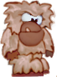 The [Sasquatch](Sasquatch "wikilink") would be like the Yeti, except in the forest. Perhaps he could be the forest boss, not the ghost tree (or the ghost tree could be the ghost forest boss, and the Sasquatch be the normal forest boss). --[Julius\_Freezer](User:Julius_Freezer "wikilink") 23:58, 2 July 2009 (UTC)

*Tick* The tick would hide behind plants and stuff, or in the grass. He attaches himself to Tux, hangs on for a while, and becomes full and drops off, hurting Tux. Tux can then kill it. The tick may be killed by Tux becoming invincible, or when Tux gets hurt by spiky plants, electricity, or lava. --[Julius\_Freezer](User:Julius_Freezer "wikilink") 23:58, 2 July 2009 (UTC)

''' *Water Badguys* '''

*Swimming Fish*

The Swimming Fish is like a fish turned on its side. It swims just below the surface of water and dives at Tux like a Zeekling. It can be killed by jumping on it and by fire shot.

-   I've thought of this several times. I think that it will one day be implemented. --[Julius\_Freezer](User:Julius_Freezer "wikilink") 23:58, 2 July 2009 (UTC)

*Jellyfish*

The Jellyfish is hard to beat because it moves randomly in water. The trailing tentacles (2 spaces long) can kill Tux. It can be killed the same way as a Swimming Fish.

*Shark* Tux can only see the shark's fin. When he's at the surface of the water, the fin will poke out, and the shark will come closer to Tux. It can be forced to submerge by fireballs, and killed by buttjumping or invulnerability. --[Julius\_Freezer](User:Julius_Freezer "wikilink") 23:58, 2 July 2009 (UTC)

''' *Underground Badguys* '''

*Earthworm*

Earthworms slither vertically and horizontally. They are 1 space thick, and therefore would be best in 1- or 2-space-high tunnels. They push Tux back; or, in 2-space-high horizontal tunnels, Tux can ride them. They only kill when they squash Tux against a wall, floor, or ceiling. They cannot be killed.

*Killer Earthworm*

Killer Earthworms move like a Limpy. They look like an Earthworm but are smaller with fangs in their mouth. They can be killed only by fire shot and invincibility.

''' *Ghost Forest Badguys* '''

*Mr. Lightning*

It looks like a small bolt of lightning with eyes and shoots down from a certain point, trying to hit Tux. It moves twice as fast as a diving Zeekling. It cannot be killed, and it hurts Tux when it hits him, after which it disappears.

*Skullymine* I actually implemented this on my computer. It is the mr. bomb of the ghost forest; it can be frozen, carried, detonated, etc. However, its explosion patterns will work differently of those of mr. bomb; different ways of killing it will produce different results from the bomb, as it is encased in a skull. --[Julius\_Freezer](User:Julius_Freezer "wikilink") 23:58, 2 July 2009 (UTC) (P.S. unfortunately, I seem to have lost track of the skullymine files when switching machines; I hope to find where I stashed them soon, and include an article.)

*Mr. Bubble*

Mr. Bubble looks like a very fat ghost with legs and eyes. It mostly walks on the ground, but can also float up to 5 spaces above the ground at random times. Upon spotting Tux, it shoots bubbles at him, and Tux has to dodge them. If he doesn't, he gets caught in the bubble, the bubble shrinks to a tiny dot, there is a pop sound, and Tux dies.

*Mr.Bubble2*

Looks and acts the same as Mr.Bubble,but warps Tux.

##### Castle Badguys

*Walking DartTrap*

Looks like a walking SkullyHop, but shoots darts at preset intervals. Can be killed by squishing and fire shot.

*Suit of Armor*

As high as BigTux, it runs with its sword held in front of it. It can kill Tux, as well as any badguy that can be killed by Tux. When hit with fire shot, it melts and disappears.

#### Mr windows

<small>*Mr windows - normal*</small>

<small>*Mr windows - shield*</small>

<small>*Mr windows - squished*</small>
\*Mr windows sometimes stays and sometimes walks around one place.

-   Mr windows is squishable.
-   When Tux approaches a distance of two tiles, they will turn the shield and become invincible and stay put. Once again, get into a longer distance than two tiles, it will turn back.
-   I can kill him at a distance or it can kill other object.

  
Yet another Logo. See [Rejected\_ideas\#No\_Beastie](Rejected_ideas#No_Beastie "wikilink")

#### Smart eye

|                              |                                      |                              |
|------------------------------|--------------------------------------|------------------------------|
|  |            |  |
|    |  |    |
|  |            |  |
||

<small>*freezed Smart eye*</small>
\*If Tux gets to near a Smart eye, it will haunt him until it hurt. Then Smart eye goes to wanish.

-   Smart eye is not squishable.
-   Smart eye is a bit faster than Tux.
-   His pupil rotates under the direction of movement.
-   Smart eye is freezable.

  
I think it is a bit the same of the the willowisp, no ? --Ypetremann 18:26, 30 January 2011 (UTC)

Willowisp teleporting, but this will kill. --[Hume](User:Hume "wikilink") 19:18, 30 January 2011 (UTC)

With script we can kill with it, or for me the right idea is to create a orange willowisp, like the flames that turn ... I see in the wiki that we will not make lot diferent monster or make the gake so dificult, and I think that the monster you descibe will looks like willowisp --[Ypetremann](User:Ypetremann "wikilink") 19:00, 1 February 2011 (UTC)

Willowisp is not freezable. --[Hume](User:Hume "wikilink") 19:00, 1 February 2011 (UTC)

#### Icecrusher family

|                            |                            |                            |                            |                            |
|----------------------------|----------------------------|----------------------------|----------------------------|----------------------------|
| 
                   
   
                             
 
                   |  |  |  |  |
| 
                   
 Krish                       
                             
 
                   | 
                   
  Krush                       
                              
  
                   | 
                   
   Kresh                       
                               
   
                   | 
                   
    Krosh                       
                                
    
                   | 
                   
     Krash                       
                                 
     
                   |

#### earth badguys

-   All earth badguys is freezable but not burnable
-   captain earth

: Simlary as Captain snowball
\* earthball

: Simlary as snowball
\* earth jumpy
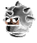
: Simlary as jumpy
\* earthman

: Simlary as snowman
\* flying earth

: Simlary as flying snowball
\* grassball

  
Simlary as smartball

-   kamikazeearth

  
Simlary as kamikazesnowball

-   mr\_earthblock

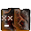

  
Simlary as mr-iceblock

#### Angry Stone

Angry stone is attached to the roof of a level, once Tux gets close to him (one tile to the left or right, he crushes to the ground, trying to kill Tux. Soon after he lifts back up to the ceiling for another attack. Angry stones might come in different sizes, from really small ones, 32x32, to very large ones, 256x256. Angry stones are always a multiple of the tilesize large so that they fit into the tilemap properly. --Mux

### More Objects to Meet

#### Radar Man

 Radar Man moves by disappearing from the square he is in and appearing in one next to it. He does not harm Tux he simply makes Tux have to move like him for a while. Radar Man cannot be harmed.

  
Maybe its my poor English, but i dont understand what radar man is supposed to do.

  
Radar Man is a teleporter type object. He moves around, and if you touch him, you get teleported... that's how I understand it.

  
In that case, it's already been implemented as a Will-O-Wisp. --[DJ Wings](User:Djwings "wikilink")[Freesyle\ here](User_talk:Djwings "wikilink"): N0 PH33R 19:52, 9 July 2007 (UTC)

  
Seems more like an object that forces Tux to move like it for a while. --Shylence 10:10, 10 July 2007 (UTC)

look, it teleports short distances instead of actually moving. if it touches tux then tux will teleport short distances as well. Its up to you if that is good or bad. (this was posted by the guy who invented radar man in the first place

#### Safe

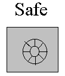 Something is hidden in a safe. If it is touched by Tux then as soon as Tux stops touching it the thing is released. If it is a tile that’s hidden in it then to release it the safe turns into it, if it is a bad guy it appears on top of it.

  
I at least do not like that idea. [84.154.88.23](User:84.154.88.23 "wikilink") 22:14, 25 Sep 2006 (BST)

Every time you use Paint for anything other than pixmapping, God kills a graphics designer. I don't want to die because of you. --[DJ Wings](User:Djwings "wikilink")[Freesyle\ here](User_talk:Djwings "wikilink") 23:15, 26 Oct 2006 (CEST)

I don't like it either. --[Julius\_Freezer](User:Julius_Freezer "wikilink") 23:58, 2 July 2009 (UTC)

#### Sleeping Snowball

Looks like a Mr Snowball with no feet and closed eyes, on contact with him Tux falls over and can't get up for a few seconds, allowing badguys to get him. Might be defeatable.

#### Sitting Spiky

-   looks like a metal dome with spikes
-   hurts Tux on contact

#### Flying Spiky

-   looks like Sitting Spiky with propeller underneath
-   if Tux touches prop. he gets blown away
-   hovers in mid-air

#### Robber

Robber walks around and, on contact steals bonuses and runs off to somewhere. If he steals every kind of bonus, he gets a weapon, allowing him to hurt Tux.

  
As an addition for this idea, it should be possible to pursuit and kill the robber to get the stuff back, though it should be pretty hard to get him. --[Head](User:Head "wikilink") 23:12, 8 Dec 2006 (CET)

great idea.

Needs work... Besides, it sounds kinda cheesy. --[DJ Wings](User:Djwings "wikilink")[Freesyle\ here](User_talk:Djwings "wikilink") 23:12, 20 Dec 2006 (CET)

SuperTux is Jump and run game, but not a shooting game. --[Hume](User:Hume "wikilink") 19:21, 30 January 2011 (UTC)

I think that a monster like that will just rob anything, thing that can be important to the rest of the level, like a box, a key... and could look like a fox, or for antartic level, like a little jumping fish ? --[Ypetremann](User:Ypetremann "wikilink") 19:00, 1 February 2011 (UTC)

#### Scared Cat

-   runs away from Tux
-   would be *nearly* as fast as Tux
-   When he catches one Tux gets a reward-Special bonus?

#### stone bonus blocks:

these would only be activated by bigtux and firetux. depending on whether you are big or firetux, you would get a different powerup.

bigtux powerup: hugetux tux looks like smalltux but is twice the size of bigtux, he is invincible and can kill badguys just by touching them and earn coins doing it. he can also activate bonus blocks from above. this would run out after a certain period of time.

firetux powerup: jet pack tux would act normally but if you press the set “up” button tux flies up slowly, gaining speed. this would disapear after he has flown for a certain ammount of time and used all his fuel.

#### Badguys from Shylence

##### Ghostly Tree

Ghost forest version of MrTree. See [Ghostly Tree](Ghostly_Tree "wikilink").

##### Walking Rock

Unrelated with the “Walking rock” above. A big rock that works like a platform. See [Walking Rock](Walking_Rock "wikilink").

##### Undead enemy

When killed, stays dead for some time and then comes back to life. Could be a zombie penguin or a skeleton alike to SkullyHops. Might be freezable and killed by fireballs or buttjump.

Like Dry Bones in SMW? linuxlove

##### Volcano

Implementation of a Dispenser (took the idea from that page). Spawns rocks and/or flames randomly or at a given interval. Might be frozen and become usable as a platform (or even something like a geyser), but only for a limited time.

##### Icy

Looks like a walking snowball encircled by a cloud of light blue smoke (frozen air). When the smoke touches an enemy or an object, it reacts like it was hit by an icebullet or a stalactite. Can be killed only by invincibility, firebullet, collision with Iceblocks and similar enmies. When Tux touches it he freezes for a short time, and is not hurt.

##### Buzzer

Might look like [MrPlasma](:Image:Mrplasma.png "wikilink"). Generates an electric field that hurts Tux and enemies and electrifies water. This could happen randomly, at fixed intervals or when Tux gets nearby.

##### Fly

A fly that flies around Tux, annoying him and forcing him to move, but without harming him.

  
So it messes up the controls for a bit so that Tux is forced away from it? Original. Me likes! --[DJ Wings](User:Djwings "wikilink")[Freesyle\ here](User_talk:Djwings "wikilink"): N0 PH33R 17:30, 10 July 2007 (UTC)

#### Polar bear

It's been suggested numerous times that a polar bear be used as a bad guy or NPC. Here's some concept art that I made: 
Suggestions for what it could do? Maybe it could pace around like other badguys and charge when it sees Tux? That's probably not a good idea, since it seems like the sort of thing that only a boss should be able to do, and there's already the Yeti. --[DJ Wings](User:Djwings "wikilink")[Freesyle\ here](User_talk:Djwings "wikilink"): N0 PH33R 14:55, 9 August 2007 (UTC)

  
World 1 is [Antarctica](http://simple.wikipedia.org/wiki/Antarctica). That is a far away from polar bears as you can get without leaving the planet. But if we ignore that the bear might make a good boss for a snow world. He is way too big for a ordinary badguy. --[Superdev](User:Superdev "wikilink") 18:38, 9 August 2007 (UTC)

  
Since when have we been all about accuracy? Yeah, the bear is way too big for a normal badguy, and since there's already a boss, that's what I was afraid of. I don't want a clash in interests between me and the development team. --[DJ Wings](User:Djwings "wikilink")[Freesyle\ here](User_talk:Djwings "wikilink"): N0 PH33R 19:45, 9 August 2007 (UTC)

  
How about an NPC? Would that seem like a good NPC? --[80.31.56.230](User:80.31.56.230 "wikilink") 07:06, 11 August 2007 (UTC)

*“Since when have we been all about accuracy?”* I think that we should be more about it ASAP. The ghost forest is unrealistic enough. (No matter *how* cute the skullyhops are) --[Julius\_Freezer](User:Julius_Freezer "wikilink") 23:58, 2 July 2009 (UTC)

#### More Paths for Badguys

There should be more Paths to edit in regard to the Badguys. Maybe for the Flame:

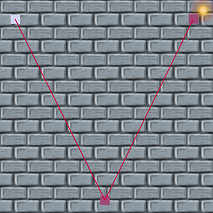

(For the flame, you can create a hurting platform that uses the flame sprite. Kind of cheating, but it works.) [Tuxnut](User:Tuxnut "wikilink") 02:44, 16 June 2010 (UTC)

#### Behaviour of Crystallo

-   When Tux jumps on it: split in some pieces which fly around, destroy Badguys, hurt Tux or break wooden boxes.

<!-- -->

-   When Tux hits him with a fireball: It melts like other badguys with snow.

<!-- -->

-   When a icicled falls on the badguy, it also splits in pieces.

This sounds a bit too much like Mr. Bomb, except that the sprites are very different. Why not have a friendly-ish badguy for once? Tux can jump on Crystallo without harming him, but can use butt jump to kill Crystallo. The sides are sharp and will hurt Tux. Crystallo should also stack onto itself. --[Mathnerd314](User:Mathnerd314 "wikilink") 03:07, 23 January 2008 (UTC)

That's okay, too, but I didn't think about a badguy like MrBomb. The particles should look like the ones when you destroy the poison ivy. They don't touch Tux when he jumps on Crystallo. Well...let me add another behaviour:

-   Only destroyable with a Butt Stomp.

Why not try the Idea of Crystallo doing a thing I think better than moving in a fixed position? Crystello could walk slower than Mr.Snowball, but have protection. The protection should be that a blue sphere should surround him every 3 seconds or more, and when the shield is activated, Crystello cannot move. Also, when super tux gets hit by the Sphere, why not have supertux frozen, or hurt?

#### Water -&gt; Ice

It should be possible for Tux, when he has the ice-flower power up, to freeze water. But he should not freeze a whole lake with one ice-attack... I shalt put that intoeth mine version of Super tux.-Rorikdude

-   I've thought much about this. Perhaps Tux can use the iceflower to manufacture floating ice platforms, which melt when they are touched with fire and fall under his weight (like the unstable tiles). If he hits the tile twice, it will become semi-solid; a third time, completely solid. However, only surface tiles should be able to be frozen. Tux could freeze his was across a body of water if the ice doesn't melt or collapse before he can cross. Also, this **shouldn't** work underwater!

### Some sounds

Could it be possible that there are sound effects when Tux walks on different types of ground, and when he hits the ground? e.g. on snow he makes somewhat like “tsh, tsh tsh” and on grass (forest tiles) he is rustling? (You see, I have some problems translating written sounds from German to English :( )I hope you can imagine what I think.

  
A sound if tux hits the ground should be possible. If someone creates a sound. For “walking” sounds its a bit more tricky since there are no tile attributes that tell the engine what kind of ground tux is on, do we really want that?

<!-- -->

  
  
Well, the tiles could get simple attributes, enabling this and, after some time of fooling around with it, lots of other effects. Deep snow makes you sink in and slower. Put the slickness of ice in there. Alternatively, just let the designer designate regions that have certain specs. [84.154.88.23](User:84.154.88.23 "wikilink") 22:17, 25 Sep 2006 (BST)

### Friendly NPCs(non-player characters)

Perhaps there could be friendly(or at least non-hostile) beings in the world. I would prefer implementation in milestone 3 or longer so as to not put another thing for the developers to do. A yoshi equivalent(seal?) would be neat but may be an entirely different game altogether. Some other ideas: a character who gives tux a quest in exchange for a key, hint for a puzzle etc., a charater who fights with tux for a little while to achieve something against nolok, a character teaches tux certain abilities. -F50

This would be good. Make a 'talking' system that scrolls on the bottom. Maybe some characters could give you extra supplies or even weapons. --[Ajdlinux](User:Ajdlinux "wikilink") 23:23, 30 Sep 2005 (BST)

-   Maybe modify the code for info boxes to let characters talk? Sounds good. --[DJ Wings](User:Djwings "wikilink")[Freesyle\ here](User_talk:Djwings "wikilink") 18:27, 11 Jul 2006 (BST)
      
    Text is evil. The player has to be able to read and understand the language which is a requirement that was not there in MS1. --[WolfgangB](User:WolfgangB "wikilink") 14:21, 12 Jul 2006 (BST)

\*:Stores or some such could just work with numbers and pictures. Having a \_story\_ told in little pictures would even add a very fun element.. [RichiH](User:RichiH "wikilink") 22:42, 25 Sep 2006 (BST)

\*: \* Yeah, that would be nice. If nothing else, a translatable infobox could describe a product and its price...Tux could buy flowers (for Penny? LOL), and the picture thing would be nice on a purchaseable map of a level. --[Julius\_Freezer](User:Julius_Freezer "wikilink") 23:58, 2 July 2009 (UTC)

I think that the Yoshi equivalent, if used, could better be a Polar Bear in stead of a Seal. A Polar Bear can walk a lot faster on land than a Seal.[Tuxenegger](User:Tuxenegger "wikilink") 17:35, 20 January 2006

  
Bad idea, polar bears live in the arctic, penguins live in the antarctic.

what about more then one Yoshi equivalent depending on the world he is in like for ice a polar bear or a walrus and for forest a sloth or some kind of gecko (nothing looking like yoshi of course) and even if polar bears and penguins dont live together i highly doubt there is such things as walking snowballs/icecubes exist and the yeti is debatable [Atomic1fire](User:Atomic1fire "wikilink") 02:05, 1 Jan 2007 (CET)

-   I'll get to work on the graphics. --[DJ Wings](User:Djwings "wikilink")[Freesyle\ here](User_talk:Djwings "wikilink") 18:27, 11 Jul 2006 (BST)

Perhaps Tux could ride a Gnu? -kcfelix

  
[Rejected ideas](Rejected_ideas "wikilink") lists “no FOSS mascots”. I also don't think SuperTux' target audience would understand just why SuperTux would feature a penguin riding a gnu. Let's leave Tux the only reference to anything geeky.

  
Perhaps we could make just this exception, since it is kind of a major character. We could tell it like “Tux went to Grass(???) world and met Gnu, who joined Tux against Nolok because <personal reason>”. --tuxdev

  
Yeah. The gnu's almost as much of a figurehead as Tux. He needs to make *some* appearance. (...maybe he could be in the shops, or an Easter egg) --[Julius\_Freezer](User:Julius_Freezer "wikilink") 23:58, 2 July 2009 (UTC)

Hey, if you wanna see a possible NPC, go to [Salsa](Salsa "wikilink"). --[Penguin Man](User:Penguin_Man "wikilink") 00:55, 19 March 2007 (UTC)

I once used Mr. Fluffy (Pinkish version of Mr. Snowball) as a friendly NPC in my own level - you control him with levers (I might replace them with script triggers)

### Bad guys and Immunity

I suggest that very few bad guys have complete immunity to [FireTux](FireTux "wikilink") or [IceTux](IceTux "wikilink"). For example, instead of no effect, have [Mr. IceBlock](MrIceBlock "wikilink") get extra-ice stopping him in his tracks and making him take more jumps to kill in this state. Eventually (If Tux doesn't kill him first) the ice will melt and Mr. IceBlock will go back to normal. The same with the other bad guys. I think there should also be a downside for the bad guy in all cases. -F50

### New Ideas

A while back I read somewhere here who you Dev people could not add more powers to Tux because then you could never tell what powers he would have when he got to a level thus making it harder for level writers. I was thinking that this was not true if you just make all these power ups have power downs for each one or for all or for some subsets. Thus a level could be made where the only way forward was to hit a power down. Thus the level maker would be in total contol of all of Tux's powers at any given place. Douglas E Knapp, Perspective Project MMORPG. (http://code.google.com/p/perspectiveproject)

I shalt put that intoeth mine version of Super tux.-Rorikdude

### Stage Variety

One thing that SuperTux is missing that Mario had would be stage variety. There are already above and underground stages, but where's the underwater action? Not to mention things like castle stages, stages with rising/falling water, vertically scrolling stages, those really annoying maze stages, autoscrolling stages, et cetera. Not to mention different locales, but I gather that those are already in the works. I refer specifically to some sort of forest. (And, might I add, picturing a penguin in a forest is pretty amusing.)

  
they are going to use a forest in M2

foudre: I dl the alpha for milestone 2, problem being is that in mario and other games they had more variety, ie: smaller worlds and more of them, rather then a long series of same themed levels, the forest is sort of cool, but people need to work on more tile sets, i will try to create a mountain side/volcano one, but the thing about major sidescroolers they had several worlds, and some levels even had their own tileset, so i think there shouldn't be the same fear of extra tile sets here either, i mean keeping it reasonable of course. and of course more enemies, the new set of forest creatures was sort of cool, still needs more variety

See: en.wikipedia.org/wiki/Computer\_and\_video\_game\_settings

  
The wall stone preview could really be a step in the right direction.

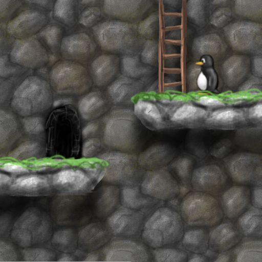

### Alternative worlds

There might be alternative worlds accessible by beating secret levels, e.g. Tux might find a secret exit in a IcyIsland level and go to a volcano world instead of the forest world. Think of Wario Land II. However, I'd reserve this for Milestone 3 or even later, since this would take a lot of designing.

### Female Players

For the female players: You can play Penny and will have to rescue Tux.

  
No that would be unrealistic. Everybody know that Tux is a strong superhero and that Nolok or anyone could never ever kidnap him and that even if they managed to, then Penny could do nothing besides crying and going him and eating until she get fat or suicide!

  
Yeah, right... As you can read in several other places on the wiki, Penny will be a playable character in Milestone 3.

  
Let's not be so harsh on Penny. However, Tux is all-powerful (pretty much! LOL), and Penny is definitely weaker. However, a playable Penny is something everyone is looking forwards to. (And if this doesn't satisfy all you Penny-fanatics \[you know who you are\], then just switch the Tux/penny graphics around :P) --[Julius\_Freezer](User:Julius_Freezer "wikilink") 23:58, 2 July 2009 (UTC)

### Level Start

Enter level with jump button.

  
There's a problem I experienced with this : when you choose Up arrow key as the jump button, you can't move up anymore on the worldmap, since there are two actions for one key. Maybe worldmap movement keys should be customizable or something? ----

<!-- -->

  
  
Why would they not use the same keys for movement as in the levels? Some of us vi and nethack types might like to use hjkl instead.. [RichiH](User:RichiH "wikilink") 22:45, 25 Sep 2006 (BST)

  
LOL RichiH, how did you figure out my SuperTuxKart alternate keyboard configuration??? I think that they should be the same as the level-movement...connected to whatever key. In M2, there is an “up” configuration (for doors and switches), so that's that. However, jump, enter, and action should all allow entry to a level. --[Julius\_Freezer](User:Julius_Freezer "wikilink") 23:58, 2 July 2009 (UTC)

### Hidden Blocks

-   Hidden blocks containing items (power-ups, extra lives, etc) as well as ordinary blocks for stepping stones should exist.
      
    Ordinary blocks are implemented as [Secret Blocks](User_Manual#Secret_Blocks "wikilink"). Hidden bonus blocks are up for discussion. --[84.146.234.2](User:84.146.234.2 "wikilink") 06:21, 18 Sep 2006 (BST)

-   Tux should fall through hidden blocks before they're hit. Another implementation for clouds and elevated platforms should be used. The blocks would be more 'hidden' if you can only find them by hitting them from below.
      
    Implemented as [Secret Blocks](User_Manual#Secret_Blocks "wikilink") --[84.146.234.2](User:84.146.234.2 "wikilink") 06:21, 18 Sep 2006 (BST)

-   Cloud platforms should be able to be jumped onto from below, similarly to how jumping onto platforms in Mario games works.
      
    Implemented as Unisolid [Tiles](Tiles "wikilink") --[84.146.234.2](User:84.146.234.2 "wikilink") 06:21, 18 Sep 2006 (BST)

-   Tux should be able to horizontally and/or diagonally jump through hidden blocks (transparently) before the blocks have been hit from below, as opposed to getting the jumping-against-a-wall effect. The current implementation causes Tux fatalities in some levels.
      
    Already implemented in aforementioned [Secret Blocks](User_Manual#Secret_Blocks "wikilink") --[84.146.234.2](User:84.146.234.2 "wikilink") 06:21, 18 Sep 2006 (BST)

### Object blocks

?-Blocks might contain items like trampolines or rocks, or maybe even enemies.

  
Already implemented. Was used in early version of “down the rabbit hole”.

Note that this isn't good style as users don't expect other things to come out of ?-blocks. You should at least create some replacement images for the blocks then, so that you can see it's something special (this is 1 of the reasons why we don't use that feature anymore in down the rabbit hole). --[MatzeB](User:MatzeB "wikilink") 10:45, 28 January 2007 (UTC)

Up to now everything that comes out of an ?-block is good for you and not required to solve the level. So IMO a trampoline that you can use for a shortcut or to reach a secret area is OK, a badguy or a trampoline that you need to reach the only path to the exit is not. --[WolfgangB](User:WolfgangB "wikilink") 11:24, 28 January 2007 (UTC)

I've read these comments, but nevertheless I made an image. I think objects in ?-Blocks will be more “entertaining”.

perhaps the blocks could be a different colour.

  
The Block could be an ! and not an ?

### Change Blocks

Maybe you know it from Crash Bandicoot Games. It's a block containing different things. Tux has to choose quickly, before the block become empty.

Like Blocks in SMW! linuxlove

  
There should be an option if it goes emty or not.

### Collecting Stuff

I think what makes some games really enjoyable is the possibility of collecting things. One (maybe totally crazy) idea: if Tux could spit bubbles, he probably could catch enemies and carry them to a specific place, like a museum, which is located on the world map. For completing the collection with all badguys of the current world, Tux would get a reward.

  
Crazy Idea o.O Big Coins or Medals would be more realistic. There should be an map where you can see what medals you have, or just how many and when a specific number is reached a door on the world map opens..

<!-- -->

  
  
I love this idea! However, I'm not sure about how it fits into the theme of SuperTux... Maybe instead of bubbles

Tux could somehow freeze enemies in a block of ice and carry them in his feet like real-life male penguins carry there eggs. The challenge would be to get to the end of the coarse without it getting knocked out of your grasp by an enemy and sliding of a cliff. Maybe the igloo that Tux starts out on could be the “Museum”.

### Rotating bridge

Create a rotating bridge, like in Mario.

### Libra

There could also be a libra, like in Mario.

  

  
There are *pneumatic platforms* in [SVN](SVN "wikilink") which look like what you're proposing here. --[octo](User:Octo "wikilink") 08:09, 28 February 2010 (UTC)

### Cheats

Tux wears a little party hat when you type “tux rocks”. When you type “iddqd”, tux shakes his head. When you type the name of a specific badguy, Tux looks like that badguy.

  
iddqd? idkfa! -- [RichiH](User:RichiH "wikilink") 22:47, 25 Sep 2006 (BST)

Pointless, useless, and we already have useful cheats. --[Some Person](User:Some_Person "wikilink") 14:29, 17 March 2008 (UTC)

  
LOL I spelled “Tux” with “rocks” in *Tux the Builder*! I'll have to dig the screenshot out...I saved it as “Tux rocks”. --[Julius\_Freezer](User:Julius_Freezer "wikilink") 23:58, 2 July 2009 (UTC)

IT DOTH COOL!!!!! I shalt put that intoeth mine version of Super tux.-Rorikdude

  
In the mapeditor it should be selectable if the cheats are on or off, maybe for every cheat. Because some cheats will cause a level to malfunction ~,~

  
Or disable cheats altogether. Or, cheats such as ghost() could be built in via the console--sector.Tux.rock(), or sector.Tux.do\_iddqd()? --[Julius\_Freezer](User:Julius_Freezer "wikilink") 23:58, 2 July 2009 (UTC)

### 1.0

I've played an old version of the SVN build, and milestone 2 really looks like a very complete game to me. It features everything what I'd expect in SuperTux. I've had just 1 crash on exiting the program, but I really think that will be fixed when going final. Why not call milestone 2 “SuperTux 1.0”? Most people think when they see “0.2” that it is some crappy beta version, which milestone 2 obviously is not. [Cristan](User:Cristan "wikilink") 00:38, 26 Oct 2006 (CEST)

  
The story with al the versions is kinda creepy^^ I think the devs want supertux “PERFEKT” before name it 1.0..

### Superpower mass effect

Whenever Tux has a powerup (fire/ice/whatever), a key combo may generate a big (almost whole screen) instant burning/frosting/whatever area (fancy graphics) that results in only one fire/ice/whatever shot effect for each enemy/burnable block/item in the area (this includes the potential [bad-side](User_ideas#Bad_guys_and_Immunity "wikilink") effects). Once this ability is performed, Tux will lose the fire/ice/whatever ability and return to the normal bigTux.

I think this won't unbalance the game. The fact that with a fire/ice hat you have an unlimited fire/ice shot supply is pretty much useful than just an instant fire/ice area. You still could just kill every enemy in the screen by shooting and you still keep the powerup. Different ways with different difficulty and rewards will improve the game IMO. This feature could bring more fanciness and originality to the game along with more possible puzzles involving this ability (Ej: you need to burn a block that is out of range so that it makes a rock fall and push a button). --[Ferk](User:Ferk "wikilink") 10:50, 2 February 2007 (UTC)

  
Like a Final Smash from Super Smash Bros Brawl? I'm pretty sure they kept the Smash Balls out of the Subspace Emissary mode of it (which is the closest part of it to Super Tux) for a reason. [Cooljeanius](User:Cooljeanius "wikilink") 21:07, 1 December 2008 (UTC)

<!-- -->

  
  
A “superpower mass effect” actually isn't a bad idea. I thought it was at first, but come to think of it, it just might be better. (We'd just have to rewrite Welcome to Antarctica to include a section with it, and explaining not to use it by accident.) The thing would be, a lot of levels would have to have sections reworked in order to work with it. It isn't a bad notion, though, and would be something to keep in mind. --[Julius\_Freezer](User:Julius_Freezer "wikilink") 23:58, 2 July 2009 (UTC)

### Improved Tux surroundings viewing

With some keypress the camera zooms out (to 175% for example), so everything looks small and you have a wider scope of the surroundings. As long as you keep the key pressed you can use the arrow keys to move the camera between certain limits (Tux should be always visible). This would enhance the usability of puzzle-oriented maps that had big schemes (buttons that had an effect at farther different places) and would make use of the fancy features of OpenGL. --[Ferk](User:Ferk "wikilink") 11:35, 2 February 2007 (UTC)

  
That would make some levels too easy.--[70.153.248.49](User:70.153.248.49 "wikilink") 20:51, 28 March 2007 (UTC)

<!-- -->

  
  
Maybe there could be some Map Blocks. Like info-blocks but these should show just a “roughly scetched map” of te level. Or maybe just a part of it

<!-- -->

  
  
You can make an info blog and show an image of the level.

<!-- -->

  
  
Maybe distant images are blurry to simulate limited visual acuity so the amount of information that is present decreases with distance.

### One-Liners

smallfoot made a page, see [Smallfoot's ideas](Smallfoot's_ideas "wikilink").

  
Are they so bad that they need a separate page?

#### Worlds, scenarios, levels

-   A Glitch world one put somewhere hard to find [Atomic1fire](User:Atomic1fire "wikilink") 02:35, 1 Jan 2007 (CET)
    -   Glitches aren't done on purpose, they are programming mistakes, so we can't do a glitch world on purpose.
-   Water world
-   Cave
-   Lava world
-   Forest
-   Ice world
-   Jungle
-   Desert
-   Space
-   Sky/cloud world?
-   Dark level where it's night!
-   Levels where Tux has to go up rather than forward -- He could be climbing a mountain or a really tall tree.
-   Geeky computer/circuit board world - “Tux decided that the only way to get Penny back would be to hack into Nolok's computer...” well, worth a try.
      
    No. Not another so called “geek game”. Kill evil Bill G. won't work with the existing storyline. --[62.214.246.213](User:62.214.246.213 "wikilink") 21:26, 23 Jul 2006 (BST)

    Someone suggested this on the mailing list, and Marek came up with a concept: An easter egg that makes Nolok look like Bill or Steve (Ballmer, not Jobs). I figure it's at least worth a try, but a complete storyline revision would be imprudent in keeping with this game's general philosophy to be a Mario homage, only. If you want to frag Gates, go play XTux.--[DJ Wings](User:Djwings "wikilink")[Freesyle\ here](User_talk:Djwings "wikilink") 03:08, 28 Jul 2006 (BST)

  
  
What about replacing the powerups by Apples?

\*:Tux could hack Nolok's computer to find out where Nolok will take Penny next?

  
.Great idea. And because Nolok uses M$-Software it is super easy. --[Bernd](User:Bernd "wikilink") 14:28, 9 July 2011 (UTC)

-   Some of these ideas might be better served as minigames? Like the Zelda GB crane game, fishing game etc. and could be added to the shop idea (you either buy the item or try your hand at a minigame to get said item, or a not-for-sale special item). Some of those minigames could be hacked into SuperTux by designing levels in other games (PlanetPenguin Racer, Frozen Bubble etc.) which could reduce development time and needs for new graphics.
    -   Good idea. Minigames sounds like an excellent way to channel the creativity which doesn't necessarily fit with the whole. You could go onto the fan site or something, and put them in a special folder in the Super Tux directory.
-   why not a portal type place where he gets sucked in or a ray gun firing a beam at tux digitizing him or something [Atomic1fire](User:Atomic1fire "wikilink") 02:35, 1 Jan 2007 (CET)
      
    Because they did that in “Tron” already.

-   Where's bonus island III? The current two bonus islands are getting boring. I suggest it to be a forest world and not start collecting levels until the editor becomes available in a version that uses SDL as to provide an opportunity for more people. I, myself am having trouble with OpenGL and the editor. (See Talk:Milestone1.9 under editor error)
      
    Go download “Tux Strikes Back”. That's the closest thing we have. --[DJ Wings](User:Djwings "wikilink")[Freesyle\ here](User_talk:Djwings "wikilink") 18:39, 23 March 2007 (UTC)

      
    How about picking the best user levels in an bonus island 3?

      
    I'm fine with that. Also, the original M1 levels and worldmap might make an interesting bonus island, too.--[Julius\_Freezer](User:Julius_Freezer "wikilink") 23:58, 2 July 2009 (UTC)

#### Other

-   **Diving** - in water?
-   **Flying** - in air?
-   **Sliding** - on his belly - hello, he's a penguin
-   **Hang glider** - to fly!
-   **Low gravity** - extra high jumps, slow fall down

  
you can do that already

-   **Walk on water** - but only if the water isn't deep
      
    He isn't Jesus o.O

      
    Or Peter.

-   **Slippery surfaces** - like a slippery ice where can glide and difficult control Tux.
-   **Pushable/rollable stone** - you roll it over enemies so they die, and can roll it to place so you jump up on it to reach higher.
-   **Moving script triggers** - for example, have a cloud of smoke flying around and if it touches Tux it puts him to sleep for a few seconds.
-   **[Swim](Swimming "wikilink")** in water like ~~Mario~~ a penguin.
    -   Grubmel's grumbling about this already, and it seems justified. See “Grumbel's Grumbles”.
    -   Update: partially implemented in SVN (at latest, rv. 4102). Tux can float, but not swim.
          
        Oh well. Looks like nobody cared about the “**Before** implementing swimming there are some details that need to be specified” on the [Swimming](Swimming "wikilink") page. :-(

          
        Wrong. The SVN version just had some of the hooks added that will be needed to implement swimming, regardless of the final look and feel. Just for demonstration purposes these hooks are now used to make Tux float.
-   **Lava tiles** might be solid, making possible for some enemies (and maybe Invincible Tux) to walk on them. They may also kill even BigTux on touch instead of simply hurting him.
-   **Special blocks** solid for enemies but not for Tux, and maybe vice-versa.
-   **Truly floating platforms**, that actually float on water: if one of these is placed in midair, it will fall down, stopping when hitting solid or water tiles; if the level of water rises/falls, they will automatically rise/fall (SVN currently allows only platforms with a fixed path).
-   **Grouping objects in the editor**, or at least being able to select more than one at a time - this would make it much easier to do levels with many similar objects. Say I have 20 snowballs, and I decide I need only 5 there. It takes 30 clicks to delete 15 snowballs - I should be able to select 15 of them, right click one and delete them all.
-   **Scrolling**: I know we have worldmaps for most level sets, but the test collection could use a scrolling feature. There are many more levels than the screen shows.
-   **More forest world badguys**: It'd be cool to have falling things like the stalactites (monkeys that jump on Tux?) and bouncing things (tumbleweeds?) that fit in with Forest world levels.
    -   I for one thought that monkeys lived in jungles, not forests... --[Julius\_Freezer](User:Julius_Freezer "wikilink") 23:58, 2 July 2009 (UTC)
-   **More sounds** for example, a ringing noise for whenever Tux touches a bell.
-   **Fading tilemaps** without a secret area (i.e. a script)
      
    Could be useful --[AnMaster](User:AnMaster "wikilink") 20:14, 20 January 2007 (UTC)

-   **Fading parts of tilemaps** so you don't have to make a separate tilemap for each secret area. Just fade the part that's covering \*this\* secret area.
      
    That would be illogical, and hard to make it work correctly, having a separate tilemap is simpler and more logical. --[AnMaster](User:AnMaster "wikilink") 20:14, 20 January 2007 (UTC)

      
    What about a tilemap, that always makes the part in front of Tux semitransparent?

      
    Doesn't sound useful for anything. --[AnMaster](User:AnMaster "wikilink") 15:03, 21 January 2007 (UTC)

      
    Did you ever play Short Visit to El Castillo? It would be very useful if the foreground could fade away so you can see tux.

      
    I have played that level of course... (I'm a SuperTux developer after all...) And I don't see what you mean. The trees directly after the start or what? The secret area fades in it iirc (at least it does in trunk, not sure about 0.3.0) --[AnMaster](User:AnMaster "wikilink") 18:04, 21 January 2007 (UTC)

      
    AnMaster, i think it was about the building, like, from the outside you don't see what is inside, but when you fall into the hole in ceiling the from tilemap fades and you see what's inside. Got it?

-   **More options**: Especially being able to switch between the old and new behavior for running with the action key pressed.

  
Problem: You have to test all the options. Every time you change anything. Does it work with ALL combinations? PITA.

-   **Let falling objects press buttons** - for example, burn some burnable blocks to make a rock fall on a button
-   **fall position** if tux falls unexpectedly e.g. runs off an edge without jumping, he doesn't use the jump position but instead a “fall position”, flippers flailing, or just up in the air, looking down, feet spread to absorb the force of landing he might also use the “fall position” when falling at high speed
-   **fly position** when tux flies into the air unexpectedly e.g. he is blown by wind he assumes the “fly position” feet together pointing down, arms by side, looking up.

#### 2-player mode

-   How about 2 player support.Maybe the FreeBSD demon (freebsd.org) or another penguin for player 2.
      
    There's already a project that tries to add a [Multiplayer mode](Multiplayer_mode "wikilink").

      
    Besides, Penny would be a better second player. Alternatively, it could be like SuperTuxKart and support up to 4 players (Nolok and Yeti? Gnu and Wilber?), but I feel that it would be a better minigame and that 2-player with Penny would be the best implementation. --[Julius\_Freezer](User:Julius_Freezer "wikilink") 23:58, 2 July 2009 (UTC)

-   the other penguin could be [fluffy](fluffy "wikilink")
-   +1. I like it.

#### Art

Bubble - float and pop in air

What about a new glossy SuperTux. Or has he to be as all the other objects in wax crayon?

[Supertux](http://toxicbits.bplaced.net/body-walk-0.png)

#### Code

-   This comment (src/player.cpp:493) kind of confused me:

`// TODO: we don't have an animation for firetux backflipping, so let's revert to bigtux`

-   -   There \*is\* a graphic for that. Also, it's been closed as “intended behavior” on the [Bugs](Bugs "wikilink") page that firetux loses his hat when backflipping, I don't think it should be. (Losing powerups for no good reason is annoying)

#### 3D Tux

I think that Supertux would be even cooler in 3D. It could be partially implemented, for example, there could be substages in 3D, or a 3D world later on? Or maybe it would more appropriate in a future spin off game?

-   Are you thinking of tuxaqfh.sourceforge.net, or something more like the 2.5D New Super Mario which uses 3D sprites in a 2D world. --[Tuxdev](User:Tuxdev "wikilink") 22:51, 3 Oct 2006 (CEST)
    -   Like XTux? I don't think 2.5D would work with a completely 2D sidescroller like SuperTux. --[DJ Wings](User:Djwings "wikilink")[Freesyle\ here](User_talk:Djwings "wikilink") 02:19, 10 Oct 2006 (CEST)
        -   No, he means like New Super Mario Bros or Super Smash Bros Melee, where the game is 2D side-scrolling but the graphics are 3D. (I mean tuxdev meant that, not the OP) [67.168.194.207](User:67.168.194.207 "wikilink") 02:12, 11 Oct 2006 (CEST)
-   2.5D approach is cool, maybe the game could be played mostly in 2.5D , and the bosses in 3D like tuxaqfh.sourceforge.net. Just throwing around ideas.--[66.153.31.148](User:66.153.31.148 "wikilink") 06:54, 4 Oct 2006 (CEST)
-   Maybe leave the game itself how it is, and have 3D cutscenes?
    -   It's a good idea. Leave the game how it is, only change the cutscenes. [DirtY iCE](User:DirtY_iCE "wikilink") 10:54, 5 Nov 2006 (CET)
-   This idea may seem a bit wacky, but tux could fall into a hidden hole where he gets virtualized and has to fight virtual enemies in a virtual 3D landscape for a few levels then he has to go through a portal in the last 3D level to take him back to 2D. The only problem is the huge amount of code and graphics that would be required, thus resulting in a huge package size. Perhaps this could be an addon for a new bonus world?
-   Something similar to the original Jazz Jackrabbit style bonus stages perhaps? (For the uninitiated, picking up a large hidden gem in certain stages in JJ would take you to a 3D bonus stage on completion of the level, in which you would navigate a maze to collect a certain number of gems to win an extra life). Not entirely sure of the best way to set this out, certainly don't want to directly copy off JJ, just throwing the idea out there.
-   Sounds a bit too much like TRON. --[Gyroknight](User:Gyroknight "wikilink")
    -   At first I was hoping that somebody would want 3D Tux, but the more I thought about it, the more I thought that the game would lose its atmosphere if it went from 2D drawings to 3D models. --[Julius\_Freezer](User:Julius_Freezer "wikilink") 23:58, 2 July 2009 (UTC)
        -   I wholeheartedly agree. Above all, Supertux \*must\* remain firmly in the second dimension. 3-D models would ruin the game's cartoony, painting-esque charm. --[Mr Eyeball](User:Mr_Eyeball "wikilink") 18:20, 11 October 2009 (UTC)

#### Pirates

Any bad guy pirate with a sword also be fun to the milestone 2.
foudre: yer idea be seconded Me hearties, I bein' with ya, matey. Shiver me timbers, I've dreamed of this since M1, aargh. Cap'n snopwball be here! --[Julius\_Freezer](User:Julius_Freezer "wikilink") 23:58, 2 July 2009 (UTC) (Also, see [Water World](Water_World "wikilink")

#### Collect coins by shooting

It should be possible to collect coins by shooting at them with the fire flower powerup. AFAIR, you can do this in Super Mario games. --[217.235.171.77](User:217.235.171.77 "wikilink") 01:24, 9 Dec 2006 (CET)

-   No, but maybe get coins for killing badguys?
-   Why we turn that not arround and Tux have to pay coins for ever fireboll?
    -   I think both are bad ideas. Free fireballs is better, and coins should only be earned by collecting. (EXCEPTION: Tux can get a 100+ coin bonus like in certain blocks for each boss he defeats?) --[Julius\_Freezer](User:Julius_Freezer "wikilink") 23:58, 2 July 2009 (UTC)
        -   I like the idea of being able to use fireballs to collect coins. Actually, it seems obvious to me.

#### Pay for restart at reset point, not for dying

This has been proposed as Issue 141. It would mean that Tux doesn't have to pay 25 coins as a penalty for dying. Instead he buys the ability to restart at a reset point. In practice, it would mean that Tux doesn't have to pay when he hasn't activated a reset point yet. It would make the cost seem less like a penalty and more like a trade-off. (Plus, restarting from the beginning is always possible from the worldmap.)

#### Seal

Maybe Tux Could ride a seal like mario rides yoshi! that would be fun.

-   Seals eat penguins. --[Julius\_Freezer](User:Julius_Freezer "wikilink") 23:58, 2 July 2009 (UTC)

<!-- -->

-   Dinosaurs eat humans [Anikom15](User:Anikom15 "wikilink") 06:42, 3 January 2010 (UTC)

<!-- -->

-   Correction: smaller carnivorous dinosaurs would probably eat humans until they learned to fear our wrath. That is, if they ever met us.

### More Ideas from <User:Penguin>

#### Some Tile Ideas

''' '' Different Shades of Water '' '''

'' Light Water '' This is easy to see through and should be used in shallow areas (less than 25 spaces deep).

'' Medium Water '' This is darker and a bit harder to see through; it should be used in deeper areas (25-50 spaces deep).

'' Dark Water '' This is nearly black, hard to see through, and suitable for the bottoms of very deep pits and trenches (50-100 spaces deep).

'' SuperDark Water '' This water is jet-black; you can hardly see Tux, and so it is suitable for the deepest oceans and trenches (100+ spaces deep).

-   This idea reminds me of one level in the original Jazz Jackrabbit. They implemented it by lowering the ambient brightness the further down Jazz swam, but they had a bunch of glow in the dark bits on plants and enemies so you could still see where to go (except the secrets they hid, no glowing bits there).

<!-- -->

-   -   I had a similar idea the other day... Maybe adjustable water would work better.

''' '' Decoration Tiles for Water '' '''

'' Kelp '' There are two kinds; the darker immobilizes Tux for 5 seconds, while the lighter is just decorative.

-   Have to be careful with this, 5 seconds is a looooooooooooooooong time to be immobilised, and becomes extremely frustrating to players in situations where it is possible to become immobilised very shortly after regaining movement. It's enough to make me personally put a game down and stop playing it for good.
-   Fine,2 seconds.

'' Black Smokers '' These should be used in Dark and SuperDark water areas. There are two kinds again: one with light smoke and no light coming from its top, and the other with dark smoke and an angry red glow illuminating it.

'' Logs '' These logs are ordinary logs which Tux can jump on.

'' Deco Fish 1 '' These are small, brightly colored fish that just float around in the same place all the time.

#### Powerup Ideas

''' '' Laser Flower '' ''' 

This would be a powerup looking like a fireflower, except that it glows green. When Tux gets this powerup, if the Action button is pressed, a glowing green laser shoots out of Tux's beak and rebounds 3 times before disappearing, killing all badguys that can be killed with fire shot. The laser should be about as slow as Tux's walking speed.

### Stylus control

Why couldn’t one control Tux with stylus? By dragging right Tux would move right and after certain point would change to ctrl-mode.

The height relative to the middle of the screen would determine whether Tux should duck or jump or just move.

Picking things up with tapping the screen once?

Just some thoughts. We should not let the lack of keyboard restrict us.

  
I assume that this would be in a DS version of the game, right? [Cooljeanius](User:Cooljeanius "wikilink") 21:04, 1 December 2008 (UTC)

<!-- -->

  
  
Or a version for phones with touchscreens, or (rare) laptops/computers with touchscreens, or the “tablet” doodad that apple is selling ect... Oh and you can get linux for DS.

### Better levels

The levels in Milestone 1 were ok but in Milestone 2 there are too hard ... :( They may be the same, but Milestone 2 has got a worse control than Milestone 1. --[217.224.71.189](User:217.224.71.189 "wikilink") 18:17, 8 April 2007 (UTC)

  
Hey, for some of us, harder is better! I thought the Mi1 levels were too easy. --[DJ Wings](User:Djwings "wikilink")[Freesyle\ here](User_talk:Djwings "wikilink"): N0 PH33R 19:30, 8 April 2007 (UTC)

-   I think the levesl are ok but maybe a adjustable grade would help
-   For example more/less savepoints, firetux directly becomes little when it's hit
    -   More or less savepoints, sure, but fireTux -&gt; baby Tux = NO. --[Julius\_Freezer](User:Julius_Freezer "wikilink") 23:58, 2 July 2009 (UTC)

### Ice breaking

There are ice tiles or ice ground that can be walked on. They can also be jumped on without break. But if Tux does the “buttjump” then it breaks the tile/ground. Perhaps this can be used to reach other areas or enter secret places.

-   I've implemented that in my own version - I can now smash wooden boxes with buttjump from top. - 500million

  
Or the fireflower could melt them. --[Julius\_Freezer](User:Julius_Freezer "wikilink") 23:58, 2 July 2009 (UTC)

  
There are [Unstable tiles](Unstable_tile "wikilink") which dissolve after a while of Tux standing on them and [Weak blocks](Weak_block "wikilink") which burn when shot with the [Fireflower](Fireflower "wikilink"). --[octo](User:Octo "wikilink") 07:58, 28 February 2010 (UTC)

### Geyser

There can be geysers on levels. That blow up water. Tux can stand on this stream to reach high places which are too high for him to jump upon. Could also be wind or something.

  
There is wind already.

  
Oh, wind is good, I've never seen wind in Supertux yet though. --smallfoot

You could use wind on a waterfall (upside-down) to make that!

### Throw/shoot up

It could be possible to throw objects/shoot fireballs upwards. --Shylence 22:16, 25 February 2008 (UTC)

*I* don't like the idea, but...--[Julius\_Freezer](User:Julius_Freezer "wikilink") 23:58, 2 July 2009 (UTC)

### Teleporter

There are teleporters or some magic force fields that work as teleportation means on the level. When Tux walks into the teleporter he gets teleported to somewhere else.

  
Doors.

  
Yes, doors are good. But maybe have other stuff too like teleporter, magic force field, hole, cave or something. --smallfoot

Can be done already. A door with another sprite or a script trigger. --[WolfgangB](User:WolfgangB "wikilink") 19:47, 7 Sep 2006 (BST)

Plus the willowisps. --[Julius\_Freezer](User:Julius_Freezer "wikilink") 23:58, 2 July 2009 (UTC)

### Diving

Tux can dive in water. Perhaps he need go up to surface to get more air sometimes (limited time underwater). Movement under water is slower than on land. Perhaps there are monsters under water such as sharks, pirayas, “the dopefish” and perhaps even some kind of boss. Can be a underwater tunnel, world, level, cave or something. Maybe need pull a switch/lever under water or do something there to open something on the surface.

  
Time limit sucks.

Uhm.. since when a penguin is faster on land than on water?

  
All the blocks he ran his head in have to have some effect.

  
Ok, I know the game is already unrealistic but there are still things that don't need to be forced. Why should Tux swim slower? its because Super Mario swims slower? Super Tux is another game and I think it has the right to break some non-existent rules on platform games. Been a penguin I think *at least* Tux should have the same speed than on land (though with different acceleration and physics), the underwater enemies could be faster too. I find many platform games too slow when they go underwater.

  
Yes, he could also be faster. But there should be a difference in movement under water and on land. Such as different acceleration or physics. -smallfoot

  
How 'bout make him actually look like he's swimming: - instead of |.

  
Here's what I say: Swimming graphics, MUCH faster, no time limit, and fire/ice don't work (though pecking badguys might). Yes, Tux is a penguin! Penguins fly underwater! --[Julius\_Freezer](User:Julius_Freezer "wikilink") 23:58, 2 July 2009 (UTC)

see [Swimming](Swimming "wikilink") --[WolfgangB](User:WolfgangB "wikilink") 19:48, 7 Sep 2006 (BST)

### Doors / Bridges

Tux needs to enter doors or open bridges to pass to some place. In order todo that, he needs to todo something first. Such as get a key, or pull/push a lever or a switch. Or perhaps place an item (such as an stone or something) on a switch.

  
Can be done with scripting.

  
Good, but I have never seen this implemented in SuperTux yet. The game needs this type of stuff to be dynamic and fun and entertaining. --smallfoot

  
It has been added to SVN. (needs to be moves to Implemented).

### Rollable/pushable stones

These stones can be pushable so they start rolling.

1.  Can be pushed to roll over enemies so they die.
2.  Can be pushed to places and then jumped upon to jump from the stone to reach higher places which are otherwise unreachable.
3.  Can be pushed onto a switch to trigger the switch to trigger something, such as opening/unlocking a door/bridge, etc.

[Rock](Rock "wikilink")

### Pushable crates

Kind of similar to the above mentioned “rollable/pushable stone”. But these can only be pushed and not rolled. Can not harm enemies. Unlock stones, these has the ability to be stacked on top of each other.

  
Seems already implemented as blocks. --[Some Person](User:Some_Person "wikilink") 14:59, 17 March 2008 (UTC)

### Catching background story

SuperTux needs a catching background story that inspires and motivates the player and drags him into the story so that he understands why Tux is doing what he does and why it is important.

  
“The bad guy took the penguins girlfriend, go save her from him!” or “Nolok stole Penny from Tux, you must save her!” doesn't cut it.

It needs be passionate and inspiring like:

  
“The evil Nolok kidnapped Tux beloved girlfriend Penny. Tux was worried he would never see her again, he was scared and upset but knew he would do anything to get his true love back!”.

The player shouldn't just play level, complete level, go next level, in an infinitive loop until the end. As the player plays the game, he should learn more. When Nolok kidnapped Penny, Tux was shocked and confused. He perhaps don't need where Nolok is hiding or where Nolok has taken Penny, this information he can learn on the way. And maybe he learns about other bad stuff that Nolok has done to other people.

I shalt put that intoeth mine version of Super tux.-Rorikdude

Some games have a story that is more interesting than the game itself. Some games you play just because you are so into the story and really needs to know more about it. Kinda like when you started to read a book, you cant put it away. Of when you started watch a movie, it get so exciting you cant switch away channel. :)

= I like the idea of Tux not knowing anything in the beginning. Perhaps at the start - 'Antarctica - the dryest continent on Earth. (shows worldmap) One of the few creatures that can brave the polar winds is the penguin - there's some there...' and zooms in on Tux and Penny. 'Another is the - ' camera shakes, goes funny, ice bush moves and dark shape, blacks out. And when you start level one: 'Tux was confused and upset. Where wass Penny... his Penny... ? He started searching, not really beleiving he would find her, but he had to do something. There were rumours... such rumours... but nothing like that could have happened... could it? And level two: 'Tux caught sight of a peice of paper lying torn and wet under a overhanging ledge of ice. He picked it up carefully, and saw with a leap of his heart that it was only the bottom fragment of a larger sheet. All that was there was a delicately drawn ice flower - the symbol of his beloved Penny' - [User:Poison Ivy](User:Poison_Ivy "wikilink")

`  -hmm... we could say that Nolok lives at the North Pole (the other side of the world!) and Tux has to cross the planet`
`   to find Penny. Or/and maybe we could make Nolok escape continuously, and Tux has to follow him.`

It does need to be more passionate/inspiring, but the classic platform-game atmosphere may be the highest priority. --[Julius\_Freezer](User:Julius_Freezer "wikilink") 23:58, 2 July 2009 (UTC)

### NPC

There should be NPC's (Non-Player Characters) which can interact with Tux. These can provide Tux with information of where to go, or where to find something, or what todo, how to accomplish something, guide Tux in something, teach/learn Tux something. They should have different personalities and different roles. Maybe they can bless Tux and grant him the powers of invulnerability or ice flower or fire flower or make him big if he is small (or perhaps make him small if there are no monsters, and he is too big to enter something). They can also give him keys or other items. Perhaps some NPC does this freely, while other require him to trade an item (perhaps a fruit?), or make a promise, or provide some info to the NPC or answer a question or take some kind of test.

### Breakable walls

Walls that can be broken (in one way or another) in order for Tux to enter into that area. Could be a area which are necessary to be visited or could just be a secret place. A similar concept exists in the game Sonic the Hedgehog where Sonic can break walls by rolling into them.

  
Who the \[censored\] is sonic? There are weak blocks.

-   Watch your mouth.--[DJ Wings](User:Djwings "wikilink")[Freesyle\ here](User_talk:Djwings "wikilink") 18:35, 11 Jul 2006 (BST)
-   Watch your mouth. I think that Sonic is a blue hedgehog from Sega. If that's true, that's all I know about it. --[Julius\_Freezer](User:Julius_Freezer "wikilink") 23:58, 2 July 2009 (UTC)

### Dynamic environment

Perhaps a dynamic environment would be cool where the level reacts/interacts with Tux. Example; in forest levels there are trees, and in the trees there are eyes or holes in the tree with eyes in and the eyes are watching in the direction Tux is.

### Alternative character

A playable alternative character, maybe a secret character that can only be played by using a cheat code or unlocking the char by winning something of doing some impressive feet.

He is quite the opposite of Tux with a complete different personality, instead of a cute little hero, this guy is an antihero (like Spawn or Batman), hes eye glows green or something, he puts everything in its path on fire and make the level a living inferno, hes very fast, strong, malicious, fearful and aggressive. Annihilating anything in his path, leaving only a trail of destruction behind. Maybe he could be a sorcerer and have vast powers of magic, maybe a spell wand. A real badass that roars like a tiger, arrr!

-   In Sonic games, player can play Tales, Amy, Shadow, etc...
-   In Mario games there are many different Yoshi's, and mushroom, princess, Luigi, Wario, etc...

Playing a cute little dragon would be cool too! :D Again,I shalt put that intoeth mine version of Super tux.It will be out in three years-Rorikdude

I think that an alternative character (outside of [Super Tux Smash](Super_Tux_Smash "wikilink")) would be another very bad idea. Penny, of course, ***must*** be playable--that is given--but the whole idea is that you have Tux the penguin and you jump and squish your way through a variety of levels until you reach a fortress. --[Julius\_Freezer](User:Julius_Freezer "wikilink") 23:58, 2 July 2009 (UTC)

### In the sea

In SVN version, you can travel with boat across the seas. Maybe there could be;

-   An iceberg or something.
-   A whirlpool / maelstrom.
-   A sea monster like a sea snake, or Nessie or a hydra with many heads.
    -   Sounds like a boss for a non-existent (as of now :-) water world.

### Broken boat

The boat that goes from ice land to forrest land should be broken, and before Tux can use it, he must fix it somehow, by obtaining some tools like a hammer, saw, sail or something. This would create a new sub-objective in the game, which would make the game more interesting. -- smallfoot

### Anti-lanterns and Glass Walls

#### Glass wall

Now, light permeates through walls. It shouldn't, although I don't know whether it can be done. Then there should be a Glass Block, which would be permeable.

-   This IS possible, but it would either be very difficult or it would make the game run more slowly.

#### Anti-lantern

Another idea, surely easier to implement, are Anti-lanterns. They should produce normal lightmap sprites (with positive colors) but their real lightcolor would be negative. This could be simply a feture of Lantern. In Latern::updateColor, instead of:

`sprite->set_color(lightcolor);`

there would be:

`if(lightcolor.red<0&&lightcolor.green<0&&lightcolor.blue<0){`
`   sprite->set_color(-lightcolor); //Now it's an Anti-lantern`
`}else{`
`   if(lightcolor.red<0||lightcolor.green<0||lightcolor.blue<0){`
`      //At least one component is negative but not every one because it was the first case`
`      //Error - it is neither a Lantern, neither an Anti-latnern`
`   }else{`
`      sprite->set_color(lightcolor);`
`   }`
`}`

As an Anti-lantern would seem to be a normal lantern, it should be marked somehow, possibly with a minus on its top.

Tux could use it when there was an inaccessable Lantern and a Magicblock standing in his way.

--[Špule](User:Špule "wikilink") 06:02, 3 July 2007 (UTC)

### Change language in-game

It would be great if one could change the language settings of SuperTux in-game.

  
It can be changed in SVN version. But what do you need that feature for? All I can think of is change Language to English so you know the name of the level for a bug report.

### Kick?

I was thinking have breakable walls that you have to kick to open. It shouldn't be to hard to do would it?

  
it is already (in idea) implemented as a “kick the badguy and he breaks the wall” - iceblock thing. --Disk 19:44, 6 September 2007 (UTC)

### Supertux 3D

i made a supertux 3D. i am trying to get devel help, and i have a [sourceforge page](http://sourceforge.net/projects/supertux-3d) now, so if anyone knows [blender](http://www.blender.org/) please help! (just tell me if i'm not allowed to make it)--[Disk](User:Disk "wikilink") 22:20, 10 September 2007 (UTC)

Of course you're allowed! It's GPL, for heaven's sake!

I know a bit of Blender. I'm still in the basic tutorials (making jeeps, puppies, and cups), but I may be able to help. You might also want to talk to the SuperTuxKart team about this. --[Julius\_Freezer](User:Julius_Freezer "wikilink") 23:58, 2 July 2009 (UTC)

### Submit level

A very nice way to get the community involved in creating artwork/levels for SuperTux would be to have a submit button in the level editor. Submissions received this way can be put on a website where the community “votes” (for example digg style) the levels.

  
See <http://supertux.info/pmlvls.php> . I don't think a button in the editor would do much good. Too many people would submit everything just because they can. Lets hope uploading manually makes them think a bit about their level. --[Superdev](User:Superdev "wikilink") 09:35, 6 October 2007 (UTC)

### Mistakes in SMB3

I would like to point out some flaws in Super Mario Bros 3 so that the same mistakes aren't made with Supertux.

-   Overuse of random chance; this is found mostly in world 7. Excess elements of chance make the game frustrating. While some random chance is inevitable, if too much is used, the game cannot be fun. Bowser's castle is an example of a good level with very little randomness.
-   Short boss battles; The final boss (Bowser) is actually very well-done and original. However, all of the rest of the bosses (Boom-Boom and the koopalings) are very short and boring.
-   Music; Bowser's castle has the same music as all of the other castles. The last level should ALWAYS have unique music.
-   Magic whistles; shortcuts that can lead the player from the first world to the last world are not a good idea.
-   P-power sound effect; it gets REALLY annoying after awhile.
-   repetitive boss battles; all of the bosses (except for Bowser) are very much the same. I trust that Suppertux won't have this mistake.

### Oxygen

There are underwater platforms in the game. Maybe you can add an indicator of oxygen level? Then oxygen gone, Tux die... Sorry for my English...

  
<http://supertux.lethargik.org/wiki/Talk:Swimming>

Unless you leave the game running while you go out and work in the yard, there would be no way Tux could run out of oxygen. Penguins can hold their breaths for a *very long time*...***very*** long time. --[Julius\_Freezer](User:Julius_Freezer "wikilink") 23:58, 2 July 2009 (UTC)

### Flame sprite

I think that the current flame sprite sucks. I've designed a new one, maybe this could also be used as a meterorite. 

  
I think it's a bad idea for three reasons:

-   **Flame** is always **flame** and never can be meteorite.
-   If the flame should have a tail, the flame would have to draw on all angles.
-   That's how you drew it looks weird.

--[Hume](User:Hume "wikilink") 07:45, 21 February 2011 (UTC)

### Own Sketches

[thumb|center|sketch1](image:ideas1.png "wikilink")

### Carrying Bird

I think there should be a creature (for example a bird?) that can carry you a few time through the air but can let you down unexpected.

### Merchant

I think there should be some sort of merchant in the game where you can spend gold and powerups to buy different things so if you have any money that you can't use you at least you have some use for it!

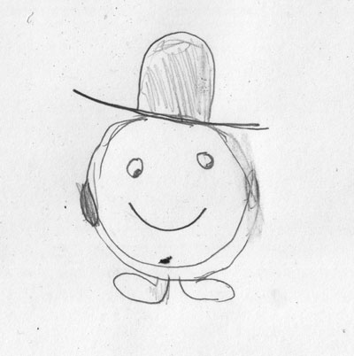

Shops have already been proposed. I rather like the idea. I think that the gnu should be the merchant selling stuff in the shops. --[Julius\_Freezer](User:Julius_Freezer "wikilink") 23:58, 2 July 2009 (UTC)

Really! Where? Thanks! I'm Suprised anyone would answer my ideas! Just tell me where the shops are coz - I've never seen one!

Maybe the coins could be money or something. [UltraTux](User:UltraTux "wikilink") 21:00, 16 August 2009 (UTC)

### Death mound

### Some ideas

I didn't read, I admit, **all** ideas O\_O <small>OMG</small>. Please don't hate me if I add one idea yet inserted. You could insert:

-   a final boss
-   a magic carpet, in order to make Tux go higher
-   flying Tux
-   Tux becoming frozen (as an ice block) in order to float and kill enemies
-   “invisible” enemies (you could see only their eyes or something else)
-   enemies which becomes bigger and longer
-   false enemies (like the block, which are visible but they doesn't exist)
-   climation (if the level is sunny, the ice will melt. If the level is windy, the wind will move Tux)
-   item which inverts the keyboard (if you press a key in order to go left, you will go right)
-   black hole which suck away Tux (he could die or the black hole could work as transporter)
-   transformed Tux which could cheat enemies

--<small style="background:#f00">**[→ A](User:Airon90 "wikilink")[ir](Special:Contributions/Airon90 "wikilink")[on Ĉ](User_talk:Airon90 "wikilink")**</small> 20:36, 2 July 2009 (UTC)

-   -   Personally, I don't think that any of those are good ideas. Not to insult you, but I don't think that any of those fit with the theme. (P.S. I read them all!) --[Julius\_Freezer](User:Julius_Freezer "wikilink") 23:58, 2 July 2009 (UTC)

Hey I saw you Respond to my merchant! I've got an idea: for invisible... maybe you could just see shoes or gloves etc [Crazy\_penguin](User:Crazy_penguin "wikilink") 9:58, 15 July 2009 (UTC)

I think that for a final boss that Nolok could transform into something really powerful, but those ideas are kindof.... strange. [UltraTux](User:UltraTux "wikilink") 21:00, 16 August 2009 (UTC)

Yes,I think too that Nolok could be the final boss.But very bore,like Bowser.I also think that can be an playable player,for who end the game unlock it and when play with Nolok,have another story (Nolok in the place of tux can be a bit strange,it's better that Nolok has an personal treasure and someone steals it).--[Baghogho](User:Baghogho "wikilink") 21:11, 17 April 2011 (UTC)

### Ipod touch?

What about a version for iPod touch/iPhone. I have no idea if this is possible, just a suggestion.

  
GPLed software is not compatible with the app store <http://www.fsf.org/blogs/licensing/more-about-the-app-store-gpl-enforcement>

### Planet Map?

To add a sense of proper geography to the game, after you defeat a world's boss, you could be given a brief cutscene of the game's entire world, with a little Tux icon shown moving between the “Worlds.” Antarctica would be at the very bottom, of course. And this would alleviate a little bit of the “Forest World is a little bit east of Antarctica” stress in the back of my mind every time I play. (Sorry to sound nitpicky.) --[Mr Eyeball](User:Mr_Eyeball "wikilink") 18:27, 11 October 2009 (UTC)

### Power up idea

Maybe, just like mario there would be a shop And what ever you brought would appear In the gadget with a thing that says “click here” And whenever you clicked on that the next box you searched would be the thing that you brought. \[\[User:Crazypenguin|Crazypenguin

### Complaints!

I guess I'll start this section for us all to post our own “Grumbel Grumbles” about the current version. My main complaint would probably be the types of levels in the Forest World. It seems to me that ALL of the levels in there contain a gimmick which is never to be found again. “Bouncy Coils” is the only level to contain the coils. “Crumbling Path” introduces the crumble blocks, which are never seen again. “Tux the Builder” has building blocks which are also never seen again. Call me spoiled, but I'd like to see some more just-plain-levels (Like “Welcome to the Forest”) when Milestone 2 is finally released. --[Mr Eyeball](User:Mr_Eyeball "wikilink") 21:59, 24 October 2009 (UTC)

-   One more thing: Just because it's the Forest World, doesn't mean that there have to be ONLY forest levels included in there. The Mario series has Grassland Levels in the Sky World, Sky Levels in the Forest World, Volcano Levels in the Grassland World, etc. After 23 levels of *only*forest, I got a little bored of the theme. You might say the novelty wore off. I'd also like to see certain enemies (Like the Goomba in Mario) that appear in every world. And I think the castles in each world should have the same (or somewhat similar) tileset to add a sense of uniformity to Nolok's designs. --[Mr Eyeball](User:Mr_Eyeball "wikilink") 22:03, 24 October 2009 (UTC)

  
This is why 0.3.\* is called a “development version.” It is intended to preview new features. The levels are the demos for these features. This is also why you can get the editor for these levels. (See [Download/Unstable\#Release\_0.3.0](Download/Unstable#Release_0.3.0 "wikilink")) If you do not like the current levels, please create some. Nobody else is working on SuperTux; you'd probably be the first to make some. Submit them according to the instructions in [Contributing](Contributing "wikilink"). --[Mathnerd314](User:Mathnerd314 "wikilink") 23:31, 24 October 2009 (UTC)

  
Ah, thanks. Perhaps I should. I have only one thing left to say for now, then. (Although this probably doesn't belong under “Complaints”.) The mere thought of glowy light-effect lava like that makes me drool. I hope somebody figures out some way to implement that in the near future.

<!-- -->

  
  
--[Mr Eyeball](User:Mr_Eyeball "wikilink") 06:03, 2 November 2009 (UTC)

### Keys and Locks and Secret Levels

I think it would be awesome if there were keys, locks, and secret levels in SuperTux like in Super Mario World.

### Collectibles

Maybe we could have big coins you could collect (like New Super Mario Bros Wii.), and unlock a bonus World (World 9 in NSMB Wii).

  
Collectibles on a per-level basis are planned in *Milestone 2*, see [Milestone 2 Design Document/Objects\#Collectibles](Milestone_2_Design_Document/Objects#Collectibles "wikilink"). --[octo](User:Octo "wikilink") 07:52, 28 February 2010 (UTC)

### Graphical help

The current help in *Welcome to Antarctica* is mostly text-based. To enable players without reading skills to understand the information, I propose replacing the textual info screens with graphical ones. I have created a few mockups (heavily inspired by chemical formulae): [bonus block](:Image:GraphicalHelpMockup-bonusblock.png "wikilink"), [fire flower](:Image:GraphicalHelpMockup-fireflower.png "wikilink"), [checkpoint](:Image:GraphicalHelpMockup-checkpoint.png "wikilink"), [checkpoint - second attempt](:Image:GraphicalHelpMockup-checkpoint-v2.png "wikilink")

### More effects when Badguys are Killed

It will be nice if there are more effects when badguys get killed. Like when Iceblock is attacked with fireball it melts down. Or if Tux can throw a snowball The badguys freezing down for some time. Not just getting thrown off from screen...

### Don't kill the forest world

I just read the Milestone 2 Design Document and I cannot believe that the forest world should be deleted! I really like it (more than the ice world). People worked much on the forest world, should that work be destroyed? Save the forest world!

### New powerups and bonus blocks

#### Colorpile

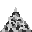
They can be of different colors. When Tux eats a colorpile, Tux begins to shine color, what color has colorpile, what Tux ate.

#### Bonus-block: dummy

<small>*editor-image*</small>
Normally looks like any other bonus-block, but does not give any bonus.

#### Scripted-bonus-block

It makes no bonus, but it calls a script.

#### Fire escape

Behaves like “sequence-trigger” with parameter “sequence” set to value “stoptux”.

#### Wanishing bonus

<small>*editor-image*</small>

##### Version A

Similarly, a dummy, but after the bump will disappear.

##### Version B

As a bonus, gives a coin, but after the bump will disappear.

  
it will look like a crate --Ypetremann 06:27, 28 January 2011 (UTC)

#### Ten-coin

You gain 10 coins.

  
I think that for this, we should just copy the originals but in other color like argent, because it will be the same and different, when I play Supertux, I don't want to see text, just symbols, like a flower for the fire flower power ... --Ypetremann 18:26, 30 January 2011 (UTC)

#### Powerup: Gem

<small>*different colors of gems*</small>
This is a powerup **without any specific features**, allowing that their function can not confused with something else. It would be appropriate if I want to do unusual powerup, which would call a different script than the usual like egg, fireflower ... and it wouldnt to powerup the confused with somewhat usunal. Gems could be a different color.

#### Thunder flower

-   ThunderTux would have head ruffled feathers and sparkles.
-   Tux would shot thunderbolts.
-   ThunderTux would kill just as FireTux, but something else.

#### New properties for powerup

##### flying

\#t: PowerUp will float in the air.
\#f: Poverup will lie on the ground and possibly fall.
===== stacking =====

    (stacking
     (on_flying <boolean>)
     (on_non_flying <boolean>))

*on\_flying*
Powerup can lie on anything else powerup with flying.
*on\_non\_flying*
Powerup can lie on anything else powerup withoult flying.

### Throwobject

|                                        |                                |
|----------------------------------------|--------------------------------|
| Big                                    | Small                          |
|              |        |
|  |      |
|              |  |
||

<small>*If someone suggests another form, you can add it to this table.*</small>
Throwobject can pick up, point and throw it. If you do that, and hit into a badguy, so it dies. Throwobjects are **big** and **small**.

    (throwobject
     (x <x-pos>)
     (y <y-pos>)
     (sprite <sprite fileneme>)
     (type <"big" or "small">))

#### Small throwobject

-   If you miss the target and falls to the ground, I can throw it more.
-   If you hit, the throwobject is destroyed.

#### Big throwobject

-   Small Tux can not use it (because it can not carry).
-   Once it reaches the target or falls to the ground, broken into four small throwobjects the same type.

### Overload light

|                                                                                               |                                                                                                  |                                                                                            |                                                                                                  |                                                                                      |
|-----------------------------------------------------------------------------------------------|--------------------------------------------------------------------------------------------------|--------------------------------------------------------------------------------------------|--------------------------------------------------------------------------------------------------|--------------------------------------------------------------------------------------|
|                 | 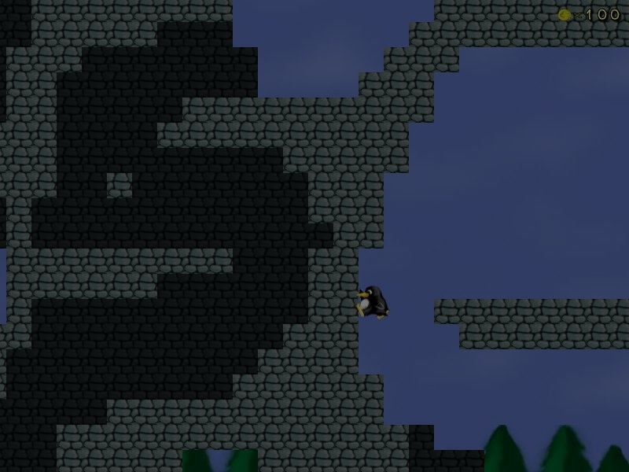 |  |  | 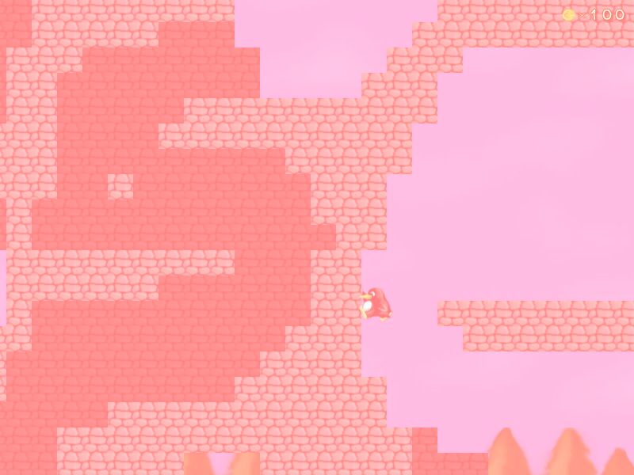 |
| Ambient light 0;0;0                                                                           | Ambient light 0.5;0.5;0.5                                                                        | Ambient light 0.5;1.5;1                                                                    | Ambient light 1.5;1.5;1.5                                                                        | Ambient light 1.5;1;1                                                                |
|  |                    |              |                    |        |
| Ambient light 1.5;1;1.25                                                                      | Ambient light 1;1;1                                                                              | Ambient light 1;2;1                                                                        | Ambient light 2;0;0                                                                              | Ambient light 2;2;2                                                                  |

### New methods and properties

#### Globals

-   methods

:\*get\_pos\_x(object)

::return the x-pos of target object

:\*get\_pos\_y(object)

::return the y-pos of target object

:\*call\_script(script)

::call target script

:\*create\_object(type,properties)

  
  
create a object

#### Lantern

-   properties

:\*brightness

  
  
times the value of lightmap on site one tile away from lantern and color of lantern

-   methods

:\*get\_color\_red()

::return red component of color of the lantern

:\*get\_color\_green()

::return green component of color of the lantern

:\*get\_color\_blue()

::return blue component of color of the lantern

:\*get\_brightness()

::return brightness of the lantern

:\*set\_color(red,green,blue)

::set color of the lantern

:\*float\_to\_color(red,green,blue,time)

::float color of lantern to target

:\*set\_brightness(brightness)

::set brightness of the lantern

:\*float\_to\_brightness(brightness,time)

  
  
float brightness of lantern to target

#### Candle

-   properties

:\*color

::color of candle

:\*brightness

  
  
times the value of lightmap on site one tile away from lantern and color of lantern

-   methods

:\*get\_color\_red()

::return red component of color of the lantern

:\*get\_color\_green()

::return green component of color of the lantern

:\*get\_color\_blue()

::return blue component of color of the lantern

:\*get\_brightness()

::return brightness of the lantern

:\*set\_color(red,green,blue)

::set color of the lantern

:\*float\_to\_color(red,green,blue,time)

::float color of lantern to target

:\*set\_brightness(brightness)

::set brightness of the lantern

:\*float\_to\_brightness(brightness,time)

  
  
float brightness of lantern to target

#### Willowisp

-   properties

:\*color

  
  
color of willowisp

#### Kugelblitz

-   properties

:\*lenght\_of\_live

  
  
lenght of kugelblitz's live

#### Spidermite

-   properties

:\*radius

  
  
radius, where spidermite stay

### Laser

 Not a laser, as you might think. This laser can not hurt anyone and always lights up. Lights are still in one direction and the beam ends where the wall stops. Bonus blocks laser beam can pass too. It also has the ability to light up the magic blocks. Tux can carry it.
{| border=1 cellspacing=1 | |- |laser's light |}

    (laser
     (color <red> <green> <blue>)
     (side <"up", "right", "down" or "left">)
     (portable <boolean>)
     (x <x-pos>)
     (y <y-pos>))

=== mirror === This would reflect all the light produced from the objects away. Some mirrors Tux can carry.

    (mirror
     (x <x-pos>)
     (y <y-pos>)
     (angle <mirror's angle>)
     (portable <boolean>))

### restart and rewind level

It would be good if in pause can restart the level. Sometimes it happens that we commit a fatal mistake and turn off and re-on level it takes too long and it's very frustrating. It would also be good if holding down the “v” rewind all the action back and Tux would it cost coins, but it was not rewind more than 10 seconds. Action “rewind” could call with script “Rewind (seconds);”.

### Extro in IcyIsland

When you solve level “The castle of Nolok” Tux remains in place and nothing happens to him. Therefore I suggest: Tux roots and blooms there.
<big><big><big>**--&gt;**</big></big></big>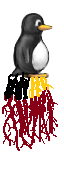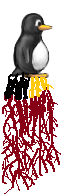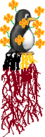
<small>*Think it as a joke but not as an insult. I want to point out on this error, which should be solved. This error should be solved in another way than this.*</small>

### External badguys definiton files

I thing, it should be possible to define custom badguys without changing the source code. i could be implemented in milestone 3. Writing in the level would look like this:

    (badguy
     (object "path of object definition file")
     (x int x_pos)
     (y int y_pos)
     (others struct other_parameters)
     (sprite UnicodeString sprite_path) ;optional
    )

Objects should be located in their own files. They would look like this:

  
  
compound **supertux-badguy** The root tag for whole structure.

-   UnicodeString **default\_sprite** The sprite, that the badguy will use, when it won't be defined.
-   bool **gravity** Set on, when the badguy will be affected by the gravity.
-   UnicodeString **center** The center of the badguy. **center** means the badguy's hitbox center point, **border** means the point of badguy's hitbox border, that is closest to Tux.
-   struct **others** The properties, that can be changed via the **others** tag in the badguy calling tag. They are accessible via the “others” variable in scripts.
-   compound **events** A compound of names of scripts, that will be called when...
    -   UnicodeString **on-hit-top** ...Tux hits the badguy from top.
    -   UnicodeString **on-hit-side** ...Tux hits the badguy from side.
    -   UnicodeString **on-hit-bottom** ...Tux hits the badguy from bottom.
    -   UnicodeString **on-reach-edge** ...the badguy reaches an edge of platform and the badguy can't fall under the sector, when the badguy falls off the platform.
    -   UnicodeString **on-reach-pit** ...the badguy reaches an edge of platform and the badguy will fall under the sector when he falls off the platform.
    -   UnicodeString **on-hit-ground** ...the badguy hits a solid ground.
    -   UnicodeString **on-hit-ceiling** ...the badguy hits a solid ceiling.
    -   UnicodeString **on-hit-water** ...the badguy hits a water tile.
    -   UnicodeString **on-hit-wall** ...the badguy hits a solid wall.
    -   UnicodeString **on-hit-hurts** ...the badguy hits a hurting tile.
    -   UnicodeString **on-fire** ...the badguy hits a fireball.
    -   UnicodeString **on-freeze** ...the badguy hits an iceball.
    -   UnicodeString **on-grab** ...Tux tries to grab the badguy.
    -   UnicodeString **on-relase** ...Tux tries to relase the badguy.
    -   UnicodeString **on-exist** The name of script, that will run each 100ms, when the badguy exists.
-   compound-array **scripts** The scripts, that the events call.
    -   compound **script** One of the scripts. Note: there will be possible to add scripts, that the events wouldn't use.
        -   UnicodeString **name** The script's name, that the events use.
        -   UnicodeString **content** The content of the script, that the events call.

methods:

-   **fade()** The badguy will fall under the screen.
-   **set\_velocity(int x, int y)** Sets the badguy's velocity.
-   int **get\_velocity\_x()** Gets the badguy's X velocity.
-   int **get\_velocity\_y()** Gets the badguy's Y velocity.
-   **set\_pos(int x, int y)** Sets the badguy's position.
-   int **get\_pos\_x()** Gets the badguy's X position.
-   int **get\_pos\_y()** Gets the badguy's Y position.
-   bool **on\_ground()** Will return true, when the badguy is on a solid ground.
-   **grab()** The badguy will appear in Tux's hands.
-   **release()** Tux will release the badguy.
-   bool **is\_carried** Returns true, when Tux carrys the badguy.
-   **set\_action(UnicodeString action)** Sets the sprite action. The default action is “default”.
-   **call\_member\_script(UnicodeString script\_name)** Calls a script defined in the “scripts” tag.
-   int **get\_tux\_distance()** Gets the distance between Tux and the badguy's center point.
-   int **get\_tux\_angle()** Gets the angle, in which Tux currently is. When is Tux above the badguy, the function will return 0. When Tux is under the badguy, it returns 180.
-   **mark\_as\_killed()** The number of killed badguys on scoreboard will be incremented.
-   **despawn()** Despawns the badguy.

More badguy ideas
-----------------

-   **SpinningSnowball**: Just like the original except that it spins and throws off bits of snow at you.
-   **Dragon**: A castle boss that flies around the top of the room, spitting fire.
-   **SnowBomb**: it could be rolled down a hill to explode when it comes in contact with anything, or could be dropped from a Dispenser to explode on contact with the ground.

`     -updated 4-15-10 by fyretux`

SnowBomb is a bit like SkyDive, although SkyDive is for the forest world... [TUX/√UT](User:Tuxnut "wikilink") ([plz talk 2 me internets](User_talk:Tuxnut "wikilink") | [view horrendous deeds](Special:Contributions/Tuxnut "wikilink")) 17:28, 21 June 2010 (UTC)

Some cool ideas
---------------

-   **BouncingGlassball**:

Kind of like the BouncingSnowball but it bounces 3 tiles higher and is for the forest world.

-   **Vinehat**:

Just like the Icehat except it fires vines so it works for the forest world.

-   **SpikeyBoss**:

A big version of the stay-on-platform spikey bad-guys(64x64). When he reaches an edge of the platform, he pauses, soots a ball that blows up on contact, and repeats on the other side. You guys decide how to kill.

-   **SpikeheadSnbowball**:

Exactly like the Snowball, but after a configurable amount of spaces it jumps and lands 5 spaces foreward on it's spike. After a moment, it jumps back up and repeats.

-   **WaterHeater**:

Like Lightning except you can tell when you need to get out of the water because you slowly turn red.

-   **TileChanger**:

Changes everything in the level into SnowTiles(if Snowcone), GrassTiles(if Leaf), and CastleTiles(if Stone).

-   **FrozenWater/Iced-water**:

Just a frozen version of water where Tux skids 6 tiles when turning around after running.

-   **Lightnincloud**: Looks like the normal cloud except gray. Every 7 time measurements, it blasts lightning down at Tux. Every 3rd blast is slower.

<!-- -->

-   **DesertTiles**:

Like Grass and Snow tiles, except with only the flat, and sloped parts for Desert.

-   **QuickSand**:

When added, QuickSand would beam Tux to a new sector called ”UNDERGROUND” that gets added when QuickSand was.

-   **Ape**:

An Ape that is stay-on-platform. When big Tux touches it, the Ape would squeeze Tux to hurt him. When smallTux, the Ape would throw Tux.

-   **OceanTileset**:

contains; Ship tiles(big and small) and all water tiles.

-   **Right/Left-jump-Fish**:

A fish that jumps up to 7 tiles right or left.

  
<small>Comment: “Flying fish?” [TUX/√UT](User:Tuxnut "wikilink") 20:11, 17 June 2010 (UTC)</small>

-   **Shark**:

Just a huge version of the original fish made to look like a shark.

-   **Waterflow**:

a foaming right/left edge of the water so you can make it so the water looks like blockade in the river was removed.

`        `**`-updated:`` ``4-15-10`` ``by`` ``fyretux`**

New Tile Ideas
--------------

### New Air Tiles

### Have an automatic mode in the editor

Just draw in a tilemap where you want tux walk with a type of tile, where you want a tile apear but not walkable, and after, select a tile style and the editor will create the map with that it was maked. after you can have the ability to draw on ...

If the creator want to create with more than 1 type of tiles, just make 2 tilemap and apply them on one ...

  
Like the magic brush from supertux editor?

  
Oh sorry, I don't see it because I doesn't know how it run and that because I haven't any bruxh... But instead of changing 9 block that depending of 25 blocks ( because the blocks around the patern ), that has 33554432 possibility to resolve, just changing the center block that depend of 9 block, it will have just 512 paterns to resolve for a good look.

### Have a more complete tileset for each style of tiles

I see that I can't do what I wan't in the editor because there are a lot of tiles that where not implemented Like in the image below

( the tile in the center don't corespond with the tile on the left )

Here I make a lot of snow tiles that were not created. With it and with the originals you can make up to 512 paterns that 3x3 sized 

--Ypetremann 13:00, 23 January 2011 (UTC)

Some badguys and objects
------------------------

These are some rough sketches of badguy and object behaviors. They don't have to be snowballs, either.

-   **Climbing snowball**: Snowball that can climb up walls and ceilings, not affected by gravity.
-   **Ninja snowball**: Snowball that leaps at Tux if he is in range.
-   **Rolling snowball**: Large snowball that rolls around, destroying other badguys and hurting Tux on contact. Think Indiana Jones...except frozen. Could be a kind of boss level, although we've already got one for Icyisland :/
-   **FreezeBall**: a kickable (but not portable) object that can be used to squish badguys. If the FreezeBall lands in a particular area (let's call it a goal) then a script is activated, possibly opening a door to a secret area...

[Tuxnut](User:Tuxnut "wikilink") 00:23, 15 June 2010 (UTC) - updated 17:26, 21 June 2010 (UTC)

The infinite patern
-------------------

An idea to have the graphic not break. All tilemap that have a name becoming with \* where an infinite patern tilemap, it make the graphic to be repeated if that the player see is out of the world For example, I make a very small level to demonstrate how to make a good mario like pipe effect:  

For now we can make this effect by creating a tilemap that have an offset and that the size is over the most large screen size divided by 32.

--Ypetremann 13:00, 23 January 2011 (UTC)

An one idea for Tux
-------------------

Big Tux can slam the badguys. If Big Tux gets so close to badguy press Action and he can slam it from left to right. like in most beat'em up games. sample of this can be viewed here <http://i44.tinypic.com/59zfh1.jpg> [89.251.107.53](Special:Contributions/89.251.107.53 "wikilink") 15:37, 30 October 2011 (UTC)

[Hume's](User:Hume "wikilink") ideas
------------------------------------

See [Planned features](Planned_features "wikilink")

<Category:Design> [Category:For Users](Category:For_Users "wikilink")

Crystal Cave
------------
<Template:template:planned> The crystal cave

[thumb|right|The concept art of the crystal cave](image:crystalcave-concept.png "wikilink")

Story
-----

Tux will go into the mountain to the crystal cave. Tux will go trough miscelaneous lifts and mineshafts and cave rooms still deeper and deeper to the cave. There will be dark, so magic blocks and lanterns won't be rare. Then will Tux enter a big room with Nolok's castle. Tux will only pass trough the castle, because Penny is in the [Lavaland](World_5 "wikilink") castle. After that Tux will defeat a crystal boss and then Tux will take a lift leading on the surface of [Lavaland](World_5 "wikilink").

Badguys
-------

Some of crystal cave badguys are implemented jet, but there will be also some new badguys. These badguys aren't all, that will be in the crystal cave. There will be also some badguys from other worlds such as [Mr.Bomb](MrBomb "wikilink") and [haywire](haywire "wikilink").

### Crystallo

see [crystallo](crystallo "wikilink")

### Cave fish

Just a normal [fish](fish "wikilink"), but with another sprite.

### Minecart

Tux will be able to ride on it, but it will hurt from sideways. It will be freezable, but not flameable.

### Running candle

This badguy will hurt on touch. It will light in a color. It will stop lighting on hit by an iceball and it will light again on hit by a fireball. It will fall down, when it reaches an edge of the platform.

### Falling crystal

It will just fall down until a it will reach solid ground and hurt on touch.

Objects
-------

Crystal cave won't use many new badguys only for it, but it will use some new objects only for crystal cave.

### Weak stone

Only explosions will be able to break these solid blocks.

### TNT

Tux will be able to grab this object. It will start ticking and then explodes, when dropped.

Melon BadGuy
------------

Proposed Badguy: Melon 
Found In: Tropical Island

Pogonia
--------

[[Image:Base.png]][[Image:Pogonia-1.png]][[Image:Pogonia-1-flip.png]] 
IDs: 1569, 1570, 1571, 1572, 1573, 1574 
The stem acts as a background and flower is hurting.

Rejected_ideas
--------------

A system supplementing the current power-ups, this is basically a way to allow large and powerful effects without letting the player use them all the time. The meter could be increased by collecting coins, killing enemies, or getting points. When the meter is full the player can enter a specific control sequence (this is so the player can still use the power normally when the meter is full) to use a super-powerful attack, which would usually wipe out all the normal enemies onscreen and might have other effects as well (such as opening secret areas in the level).

== Concept Art ==
[[Image:no-power.png]] [[Image:firemeter-half.png]] [[Image:firemeter-full.png]]

Rukush
------

[[Template:Proposed]]

A friendly NPC. Rukush the Crystallo could live in the bonus level of icy island, where it would have a garden of tree saplings, fireflowers, and iceflowers.

Bigfoot
-------

[[Image:Bigfoot.png|right|thumb|It's Chewbacca!]]
I now propose a forest boss (which I think is better than ghost tree)...Sasquatch:

He would function like the [[Yeti]], except have more of a roar than a gna. As Sasquatches and Yeti are very similar (both mythical creatures of the same family), I think that this would be a fun addition to the forest. Please discuss it on its talk page.

[[Julius_Freezer]]

Water World
-----------

A possibility for another world is Water World or something like that.

Tux boards a ship, sails to a level in the middle of the ocean, and
starts it by opening a bonus box and get a pirate hat and a pistol.
The badguys are fish, seagulls, and pirate seals. Once Tux conquers
the ship (in one level or a load of them) he can fight other ships, or
stuff like that. It would be a great way to go between islands.
Finally, after beating all the islands, he sails to wherever Nolok is.

The idea needs some more work, but feel free to build upon it. (And if
the idea is used, I get to make at least one level in it, please?)

