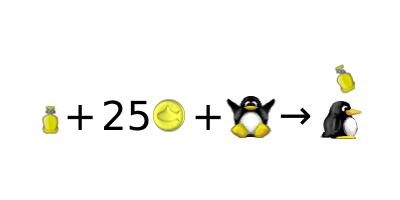

We do listen to user feedback occasionally. This page functions similarly to a changelog but lists implemented features that non-developers have proposed.

### Pre/Post story movie

Instead of showing scrolling text, movies can be shown stating Penny's kidnap... and at-last the re-union. Wouldn't that be nice?

I still remember the old SuperTux intro with Penny being kidnapped by the helicopter... as far as I know, cutscene support is on the TODO list, and I guess it will be used for the story intro. --[Ravu](mediawiki/Users/ravualhemio) 14:30, 7 Apr 2005 (BST)

Wrong! The story was Tux and Penny were having a picnic, when a creature jumped from behind an ice bush, there was a flash and Tux fell asleep when he woke up there was a note from Nolok saying he had Penny and not to try and save her. So Tux looks sees Nolok's castle and sets off.

I think in the story was: “A creature jumped from behind an ice bush, Tux...” ;-)- penma -

The \*old\* (as in 0.0.5) cutscene involved the helicopter. The new SVN cutscene is the picnic scene. --[Tuxdev](mediawiki/Users/tuxdev) 22:00, 1 Oct 2006 (CEST)

Now we have the demos feature in SVN, and it shouldn't be too hard to make a 'movie' level for showing a demo mid-story. --[Ajdlinux](mediawiki/Users/ajdlinux) 23:20, 30 Sep 2005 (BST)

### Add a gamepad configuration

It's currently possible to use a gamepad, but the setup must be done by manually editing the SuperTux configuration file.

This has been improved in the development version. supertux now uses all available joysticks and allows to configure the actions for the different joystick buttons.

### More starting points

Some levels are very hard in the middle and in the ending. Is there a way to make more starting points? So you haven't to start everytime at beginning of the level. Sometimes I need ten and more trials to cope a situation. It will be very useful. Thanks for the good game! Martin (pmw(at)web(dot)de)

Reset points are also being planned. ~~[Ravu](mediawiki/Users/ravualhemio) 17:28, 8 May 2005 (BST)

perhaps it should be possible to see that you are passing a resetpoint!

Restart points exist in the SVN version, they are marked by butterfly.

<!-- -->

also in the virsion on the download page, “unstable”, 0.1.9, or 0.3.0 (&lt;-all the same)

### New tiles for the worldmap

I already designed some additional worldmap objects for Supertux 0.1.2, e.g. paths through the forest or something like “water ways”. Maybe in MS 2 some kind of swimming tux in worldmap could be possible, or walking over a bridge. (For my current solution I only added something to my antarctica.stwt.) - penma -

In svn: bridges, boats

### One-way platforms

<small>(An idea from Stephen2985, taken from lists.berlios.de/pipermail/supertux-devel/2005-August/000570.html the Supertux-devel archives)</small>

I would recommend platforms that could be jumped through from the bottom but you can't fall through them if you are on top. SSB has this, as well as many mario and platforming game. This allows for Points of No Return, and would make the game capable of better and less redundant level design

In svn: unisolid tiles

also in “unstable” download

### Better rewards

<small>(An idea from Stephen2985, taken from \[lists.berlios.de/pipermail/supertux-devel/2005-August/000570.html the Supertux-devel archives\])</small>

A more fitting reward should be accomplished for collecting coins. Yoshi's Island had red coins, Super Mario Sunshine had Extra Shines, etc.

In svn: 25 coins let Tux respawn from the latest firefly

also in “unstable” download

-   Maybe teleports (or something) that cost a certain number of coins to get through?
-   How about the shops on Super Mario 3? they were really a good idea.. I don't understand why they dropped it for Super Mario World --[80.174.65.16](mediawiki/Users/80.174.65.16) 21:16, 11 Aug 2006 (BST)

Supertux might be inspired Super Mario. (Basicly because Mario did almost everything you can do in a sidescroller) But that does not mean we have to clone everything Mario ever did.

However, shops are not so typical in Super Mario games and appear in many other games, it is a coherent use for coins. There are a lot of things from Super Mario not strictly necessary for Super Tux that were mentioned here without complain ([Yoshi-like NPC](User_ideas#Friendly_NPCs.28non-player_characters.29 "wikilink"), the [BowserKoopa-clonic final boss](Nolok "wikilink") and even the kidnapping storyline)

### One-liners

-   **Pulling levers** - activate/deactivate/open/close things. Added in SVN today thanks to me (mmiikkee12) :-) (they're called switches but they're more like levers)
-   **Standing on switches** - activate/open things.
    -   In svn (not sure what revision) - just put a script trigger over the platform
-   **Wind** - make it difficult for Tux to move, push him back, and push him much back if he jump.
    -   In svn (since r3640). --[AnMaster](mediawiki/Users/anmaster) 11:08, 30 Jun 2006 (BST)
-   **Ice pick** - to crush blocking ice in order to enter closed areas.
    -   In svn (since 3468): Straw Blocks that can be destroyed with fire shot
-   **Falling bridge** - when walk on it, it fall apart, so cant go back and must hurry.
    -   In svn (since 2296): Blocks that crumble when Tux steps on them
-   **Bounce pad**, thing or something that when Tux jump on it, he bounce up and jumps really high! :D
    -   SVN has [trampolines](Trampoline "wikilink").
-   **Falling bounce pad**- once bounced on falls down so you must use it well.
-   **Pushable crates** - you push the crate to another place where you need it to jump on it so you can reach higher or something.
    -   SVN has carriable [rocks](Rock "wikilink").
-   **Switches** might also rise water level.
    -   Already in SVN (see level “Knee-deep in the depth”)
-   **Helmet**Tux could wear a helmet, stopping attacks from above, when he ducks he pulls it over himself, making him invincible
-   **Scrolling** in menu so that we can access all the test collection directly from the game. Currently it just overflows outside the screen and can only be accessed blindly through keyboard.
    -   This is a must. I don't understand why isn't it still here..

You did not implement it. I don't think it is that urgent. Real worlds have a worldmap, to test something you can use command line or call level from editor anyway. --[Superdev](mediawiki/Users/superdev) 22:14, 7 February 2007 (UTC)

In SVN since revision 5420.

-   **Slippery surfaces** - like a slippery ice where can glide and difficult control Tux.
-   **Low gravity** - extra high jumps, slow fall down
    you can do that already, see gravity in the sector settings
-   **Fading tilemaps** without a secret area (i.e. a script)

    Could be useful --[AnMaster](mediawiki/Users/anmaster) 20:14, 20 January 2007 (UTC)

### Greek fonts

You should add these greek letters to the game. How you can add Greek letters to the game? There are no greek letters in the game. They have a F33 so they are accessible. So they have a Ransom font that has to be accessible in DOSBox. Letters not changed: 1, 4, 6, 8, 9, !, @, \#, $, %, ^, &, \*, (, ), ~, \`, etc. were having greatest. Letters changed: 0, 2, 3, 5, 7. A-Z, a-z. No-break space was filled in with JD. Capital R is vertical, 0, 2, 3, 5, 7 were made from different fonts. A, B, C, D, E, F, G, H, I, J, K, L, M, N, O, P, Q, S, T, U, V, W, X, Y, Z, a, b, c, d, e, f, g, h, i, j, k, l, m, n, o, p, q, r, s, t, u, v, w, x, y, z, were captured from different fonts. Yeah, you don't speak albanian, but you speak korean. The letter you should be added will be: Ë. It's defined as U+00CB.--[Sixtyfour](mediawiki/Users/sixtyfour) 10:36, 16 January 2009 (UTC)

What are you talking about? You sound like that guy who was spamming the fansite recently. And no, I don't speak Korean. --[Superdev](mediawiki/Users/superdev) 18:48, 16 January 2009 (UTC)

### Swimming ability

-   **[Swim](Swimming "wikilink")** in water like ~~Mario~~ a penguin.

> Also I think Tux should be able to swim in water, as penguins do swim in water.

This has been suggested numerous times and is finally implemented.

## Supertux Forum

https://forum.freegamedev.net/viewforum.php?f=66

### Light in the dark

> A level which is (quite) dark, where you can't see something. Almost. Tux has got something like a torch and you can see a little bit around Tux.

> I liked Aquaria's implementation of light and dark, when you get the light form, you have both a light cone in the direction you're looking and a circle of light around you. Maybe in SuperTux, he could be wearing a miner's helmet which points forward and/or be carrying a lantern which makes the circle of light around him.

You can play the level "I Go With My Lantern" in niso's addon Yeti's Revenge

### (Supertux Editor) Easier compilable

The editor is once again included in-game.

### Hidden Blocks

-   Hidden blocks containing items (power-ups, extra lives, etc) as well as ordinary blocks for stepping stones should exist.

    Ordinary blocks are implemented as [Secret Blocks](User_Manual#Secret_Blocks "wikilink"). Hidden bonus blocks are up for discussion. --[84.146.234.2](mediawiki/Users/84.146.234.2) 06:21, 18 Sep 2006 (BST)

-   Tux should fall through hidden blocks before they're hit. Another implementation for clouds and elevated platforms should be used. The blocks would be more 'hidden' if you can only find them by hitting them from below.

    Implemented as [Secret Blocks](User_Manual#Secret_Blocks "wikilink") --[84.146.234.2](mediawiki/Users/84.146.234.2) 06:21, 18 Sep 2006 (BST)

-   Cloud platforms should be able to be jumped onto from below, similarly to how jumping onto platforms in Mario games works.

    Implemented as Unisolid [Tiles](Tiles "wikilink") --[84.146.234.2](mediawiki/Users/84.146.234.2) 06:21, 18 Sep 2006 (BST)

-   Tux should be able to horizontally and/or diagonally jump through hidden blocks (transparently) before the blocks have been hit from below, as opposed to getting the jumping-against-a-wall effect. The current implementation causes Tux fatalities in some levels.

    Already implemented in aforementioned [Secret Blocks](User_Manual#Secret_Blocks "wikilink") --[84.146.234.2](mediawiki/Users/84.146.234.2) 06:21, 18 Sep 2006 (BST)

### Object blocks

?-Blocks might contain items like trampolines or rocks, or maybe even enemies.

Already implemented. Was used in early version of “down the rabbit hole”.

Note that this isn't good style as users don't expect other things to come out of ?-blocks. You should at least create some replacement images for the blocks then, so that you can see it's something special (this is 1 of the reasons why we don't use that feature anymore in down the rabbit hole). --[MatzeB](mediawiki/Users/matzeb) 10:45, 28 January 2007 (UTC)

Up to now everything that comes out of an ?-block is good for you and not required to solve the level. So IMO a trampoline that you can use for a shortcut or to reach a secret area is OK, a badguy or a trampoline that you need to reach the only path to the exit is not. --[WolfgangB](mediawiki/Users/wolfgangb) 11:24, 28 January 2007 (UTC)

I've read these comments, but nevertheless I made an image. I think objects in ?-Blocks will be more “entertaining”.

perhaps the blocks could be a different colour.

The Block could be an ! and not an ?

### Libra

There could also be a libra, like in Mario.

  

There are *pneumatic platforms* in [SVN](SVN "wikilink") which look like what you're proposing here. --[octo](mediawiki/Users/octo) 08:09, 28 February 2010 (UTC)

Or they could be falling platforms, which are also implemented.

### Geyser

There can be geysers on levels. That blow up water. Tux can stand on this stream to reach high places which are too high for him to jump upon. Could also be wind or something.

There is wind already.

Oh, wind is good, I've never seen wind in Supertux yet though. --smallfoot

You could use wind on a waterfall (upside-down) to make that!

### Bonus Island III

-   Where's bonus island III? The current two bonus islands are getting boring. I suggest it to be a forest world and not start collecting levels until the editor becomes available in a version that uses SDL as to provide an opportunity for more people. I, myself am having trouble with OpenGL and the editor. (See Talk:Milestone1.9 under editor error)

    Go download “Tux Strikes Back”. That's the closest thing we have. --[DJ Wings](mediawiki/Users/djwings "wikilink")[Freesyle\ here](User_talk:Djwings) 18:39, 23 March 2007 (UTC)

    How about picking the best user levels in an bonus island 3?

    I'm fine with that. Also, the original M1 levels and worldmap might make an interesting bonus island, too.--[Julius\_Freezer](mediawiki/Users/julius_freezer) 23:58, 2 July 2009 (UTC)

### Backflip animation

-   This comment (src/player.cpp:493) kind of confused me:

`// TODO: we don't have an animation for firetux backflipping, so let's revert to bigtux`

-   -   There \*is\* a graphic for that. Also, it's been closed as “intended behavior” on the [Bugs](Bugs "wikilink") page that firetux loses his hat when backflipping, I don't think it should be. (Losing powerups for no good reason is annoying)

The behavior has changed.

### Breaking walls by kicking

Walls that can be broken (in one way or another) in order for Tux to enter into that area. Could be a area which are necessary to be visited or could just be a secret place. A similar concept exists in the game Sonic the Hedgehog where Sonic can break walls by rolling into them.

Who the \[censored\] is sonic? There are weak blocks.

-   Watch your mouth.--[DJ Wings](mediawiki/Users/djwings "wikilink")[Freesyle\ here](User_talk:Djwings) 18:35, 11 Jul 2006 (BST)
-   Watch your mouth. I think that Sonic is a blue hedgehog from Sega. If that's true, that's all I know about it. --[Julius\_Freezer](mediawiki/Users/julius_freezer) 23:58, 2 July 2009 (UTC)
### Kick?

I was thinking have breakable walls that you have to kick to open. It shouldn't be to hard to do would it?

it is already (in idea) implemented as a “kick the badguy and he breaks the wall” - iceblock thing. --Disk 19:44, 6 September 2007 (UTC)

### Keys and Locks and Secret Levels

> I think it would be awesome if there were keys, locks, and secret levels in SuperTux like in Super Mario World.

These can all be implemented with scripting.

### Graphical help

The current help in *Welcome to Antarctica* is mostly text-based. To
enable players without reading skills to understand the information, I
propose replacing the textual info screens with graphical ones. I have
created a few mockups (heavily inspired by chemical formulae):

We use signboards now, similar to these.

### More effects when Badguys are Killed

> It will be nice if there are more effects when badguys get killed. Like when Iceblock is attacked with fireball it melts down. Or if Tux can throw a snowball The badguys freezing down for some time. Not just getting thrown off from screen...

There is a melting effect now.

### Don't kill the forest world

> I just read the Milestone 2 Design Document and I cannot believe that the forest world should be deleted! I really like it (more than the ice world). People worked much on the forest world, should that work be destroyed? Save the forest world!

It was never going to be killed, only moved to Contrib levels. But now it's back.

### Bonus blocks

- Dummy  <small>*editor-image*</small>
Normally looks like any other bonus-block, but does not give any bonus.

- Scripted-bonus-block  It makes no bonus, but it calls a script.

The scripted bonus block is implemented and you can make a dummy block by creating a scripted bonus block with no script.

### Vanishing bonus block

<small>*editor-image*</small>

Version A: A dummy bonus block that gives nothing, but after the bump will disappear.
Version B: Similar but as a bonus, gives a coin

Version A is just a crate, you can break it if you're BigTux. Version B is not implemented but not meaningfully different.

### TileChanger

Changes everything in the level into SnowTiles(if Snowcone), GrassTiles(if Leaf), and CastleTiles(if Stone).

This can be implemented using multiple tilemap layers for the various styles. There's a ghost forest level that switches between normal forest and ghost forest.

### Have an automatic mode in the editor

Just draw in a tilemap where you want tux walk with a type of tile, where you want a tile apear but not walkable, and after, select a tile style and the editor will create the map with that it was maked. after you can have the ability to draw on ...

If the creator want to create with more than 1 type of tiles, just make 2 tilemap and apply them on one ...

Like the magic brush from supertux editor?

Oh sorry, I don't see it because I doesn't know how it run and that because I haven't any bruxh... But instead of changing 9 block that depending of 25 blocks ( because the blocks around the patern ), that has 33554432 possibility to resolve, just changing the center block that depend of 9 block, it will have just 512 paterns to resolve for a good look.

Autotiling is implemented in the editor now.

### BG, a bit smarter than Poision Ivy

To put badguys eg. on a branch or a ledge i'd like to have a Forest World Bad Guy, about one tile in size, easy to be killed (squished, shot, whatever) but does not jump off his ledge.

Something like Poision Ivy but smart enough not to commit suicide. Maybe a autumn version of the walking leaf. Since it's more careful it might walk a bit slower. --[WolfgangB](mediawiki/Users/wolfgangb) 18:20, 26 Jul 2006 (BST)

Btw, i could just grab the Ivy image and add some red, but maybe there is another BG that matchs the description but looks different. --[WolfgangB](mediawiki/Users/wolfgangb) 18:44, 26 Jul 2006 (BST)

Done. [WalkingLeaf](WalkingLeaf "wikilink") --[WolfgangB](mediawiki/Users/wolfgangb) 15:59, 13 Aug 2006 (BST)
