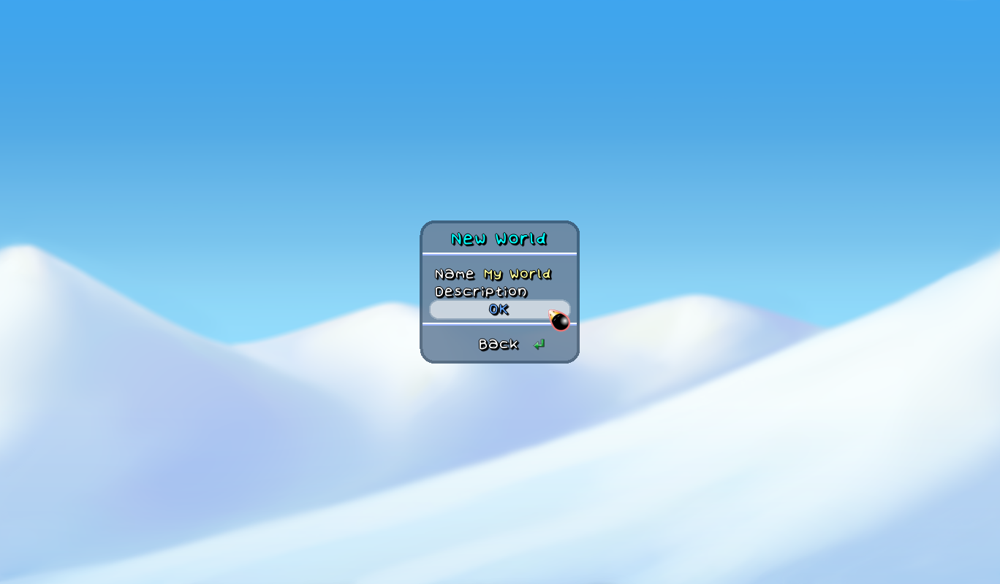
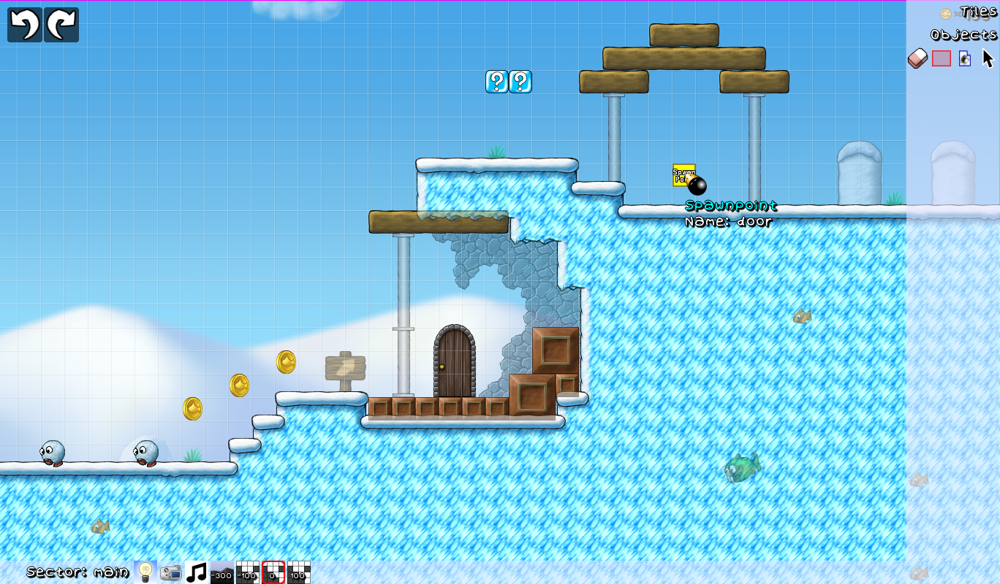
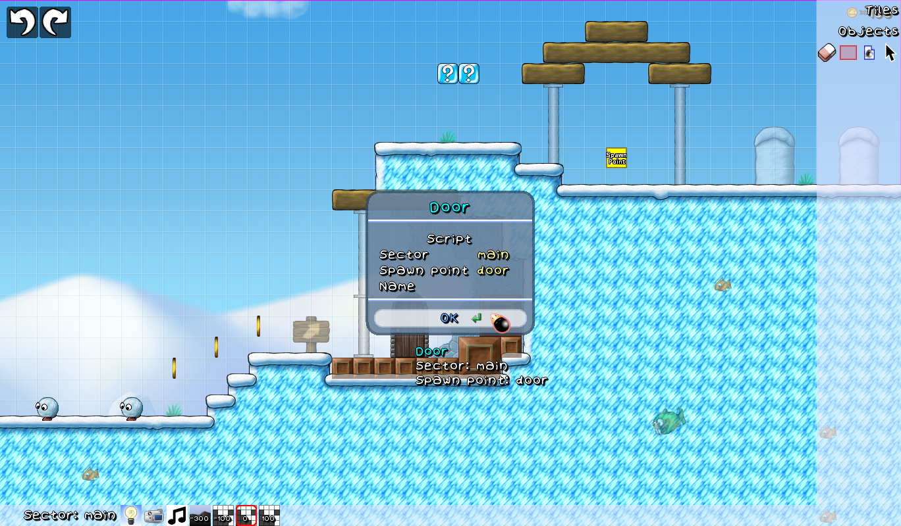
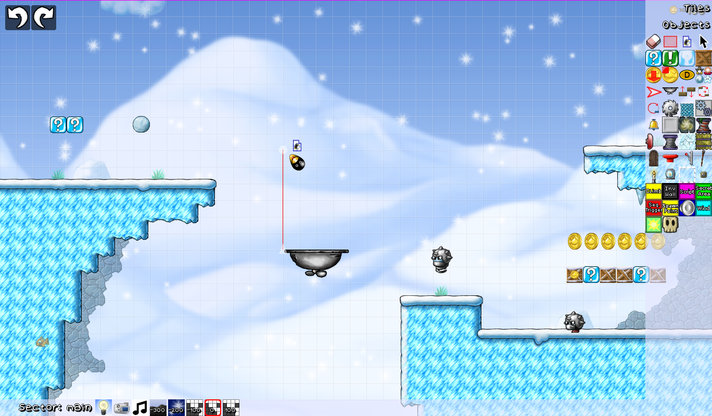
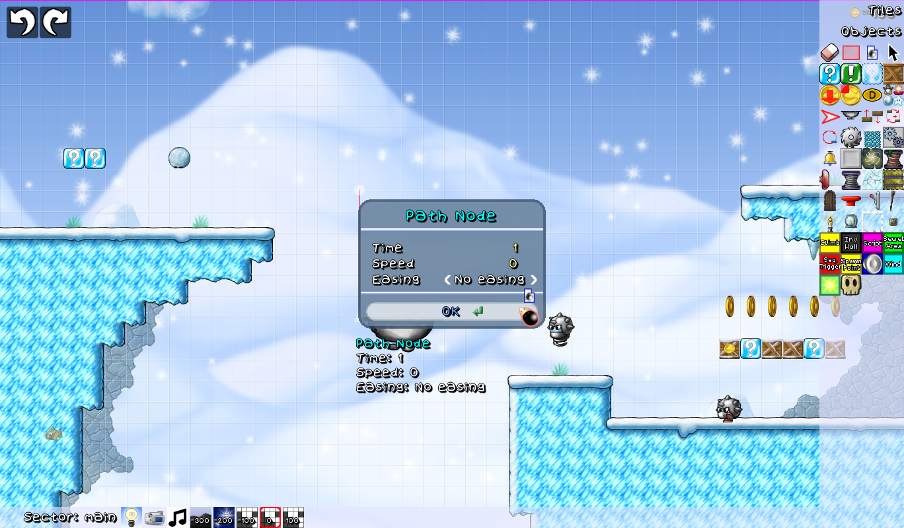
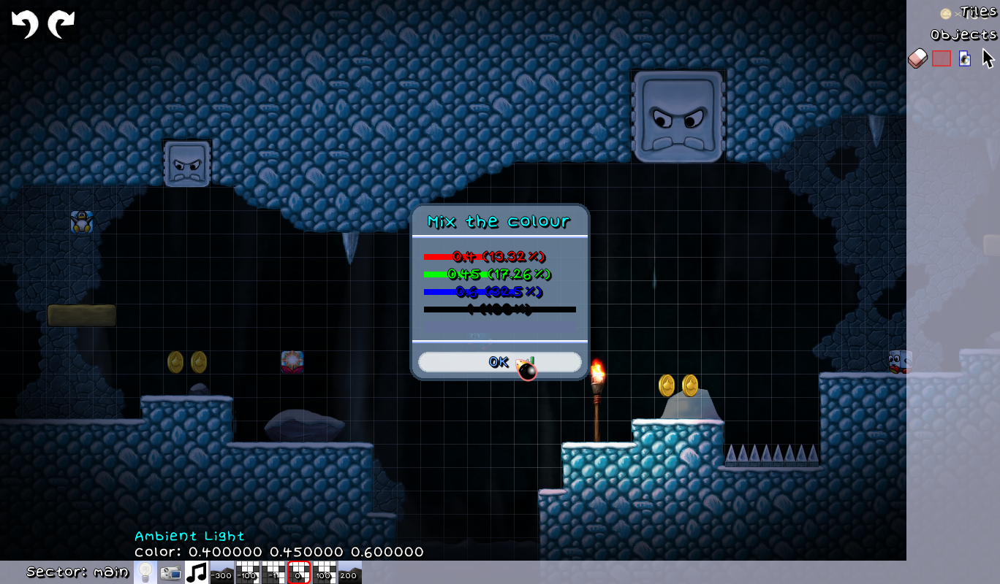
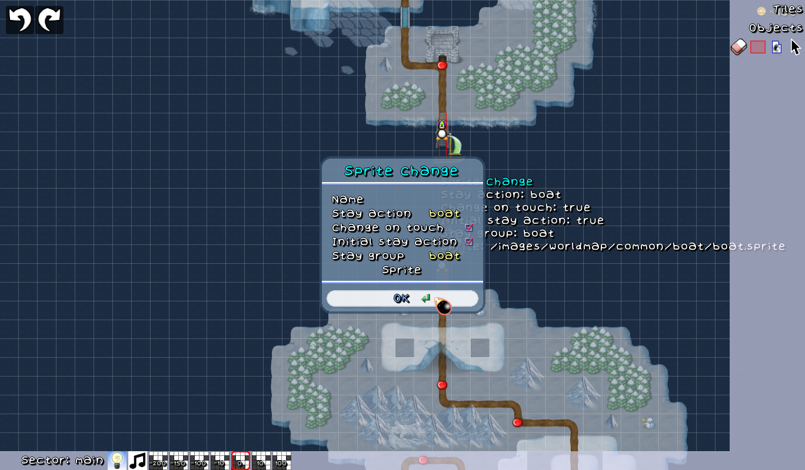

# How to use the Level Editor

Beginning Steps
===============

Upon opening the Level Editor you have the option to open an existing world/levelset or create one of your own.
For this Guide we will start fresh and create a new one.

Select `Create World` and enter a name and description for your new world. The description is optional so if you
are unsure what to write, just skip it and select `OK`.

Now you can begin to create your first level (or worldmap).

## Contents

### For making Levels
1. [Setting up your Level](#Setting-Up-Your-Level)
2. [Tiles and Tilemaps](#Tiles-And-Tilemaps)
3. [Objects and Badguys](#Objects-And-Badguys)
4. [Using Pathnodes](#Using-Pathnodes)
5. [Ambient Light](#Ambient-Light)
6. [Scripting](#Scripting)

### For making Worldmaps
1. [Setting up your Worldmap](#Setting-Up-Your-Worldmap)
2. [Using Teleporter](#Using-Teleporter)
3. [Using Sprite Change](#Using-Sprite-Change)

---

Setting Up Your Level
=====================

You are now presented with a snowy background and a lot of empty space.

On the right you see the Tile Select, Object Select and your general tools. On the bottom you will find several
means to edit the level sector.

General Tools
-------------

- 
  The **Red-Selection** is the most basic tool. It allows you to place tiles and Objects.
- 
  The **Green-Selection** allows placing multiple instaces of a tile or group of tiles by holding the Left-Mouse.
- 
  The **Fill-Bucket** let's you fill an area with the selected tile.
- 
  The **Eraser** simply removes tiles and objects from your level.
- 
  The **Selection** tool is used to select objects from your level.
- 
  The **Duplicator** can be used to duplicate an object on the spot.
- 
  The **Pathnode** tool allows drawing pathnodes for moving objects, see [Using Pathnodes](#Using-Pathnodes).

Unlike the other tools you only find the Pathnode tool under `Objects` -> `Environment`.

Tiles and Tilemaps
==================

Let's make a basic level. First, select the drop down menu labeled `Tiles` in the top right corner and select
a category. For example `Snow`.

Select the tile you would like to use by clicking on it. You can select multiple tiles at once by holding the
Left-mouse button and dragging your mouse over the tiles you want to select. Your selection is now displayed
besides the cursor, moving across the grid. By left clicking you can place them now was many times as you want.

Note: Right clicking on a tile inside your level, you can copy it. This can save you time if you don't want to
frequently switch back and forth between categories.

To make sure Tux is able to stand on the tiles you place must make sure that you are placing them on a solid tilemap.

Tilemaps
--------

A tilemap is where all tiles of a level are drawn. They help organizing your tiles and allow for using multiple layers.
You can add a tilemap through the `Sector` category in the Objects menu. The default solid tilemap is marked `0` in
the bottom bar. You can edit pre-existing tilemaps by right clicking on their icon.

Every newly created level comes with three tilemaps by default. One for background elements, one for forground elements
and one for solid ground. Their marked number is defined by their Z-postion. Is it set below 50, it is behind Tux and
everything above 50 has it be in front of Tux. The default background tilemap is marked `-100` and the default foreground
tilemap is marked `100`.

In the tilemap settings you can change their size, their solidity, Z-position, as well as colour you the tiles inside
using **RGBA** values (Red, Green, Blue, Alpha).

You can also use tilemaps to darken or brighten tiles. Add a new unsolid tile map and set the alpha value to a number
between 0 (0%) and 1 (100%). Under the `Lightmap` category of the Tiles menu you find tiles best suited for this.

By enabling `Following path`, reselect the tile map and you will see a small grey circle on the top-left of the tilemap
border. You can now click and move the tilemap around as well as have it move. See [Pathnodes](#Using-Pathnodes) for
more info!

Adding Objects and Badguys
==========================

Now that you have build your level, let's take a look at how to place objects, such as enemies (Badguys), moving platforms,
ladders, script triggers, and more. While in **Object Mode** you cannot interact with tiles!

First, select the drop down menu labeled `Objects` and select a category. The categories `Enemies` and `Bosses` contain all
available Badguys and Bosses you can use for your level. Upon placing an enemy you can edit some of their properties by right
clicking on the enemy.

Using Doors
-----------

For a door to work properly you must first define a destination. This is done by adding another spawnpoint and naming it.
Now everything left to do is enter the names of the sector and the spawnpoint you want to Tux to go when using the door,
et voilà!

 

Using Info Blocks
-----------------

Info Blocks can be given messages, such as explanations. Right click the info block to add a message. The first character
of a paragraph can be used for formatting. This character will not be displayed in the actual message:

- A hash `#` is usually used for normal text
- A hyphen-minus `-` is used for headlines.
- An exclamation mark `!` alongside an image path `images/...` displays the image in the text.
- An asterisk `*` displays the text blue and centered.
- <kbd>Space</kbd> makes the text small.

---

Using Pathnodes
===============

Pathnodes are used to form a path for a platforms, coins, tilemaps etc. to move on.

To do this, selected the object and click with the **Pathnode tool** on the small grey circle on its top-left. If you now
click anywhere else in your level, you will draw a new path node between it and the last node you selected. For coins and
tilemaps, make sure you have `Following path` enabled!

You can find the tool under `Environment` in the Objects menu as a red arrow pointing to the right.

After setting up your pathnodes you can now edit each nodes property by right clicking each individual node.

Ambient Light
=============

To use things like lanterns, magic blocks or anything else that can emit light and have it shown, you must darken the
sector beforehand. Right-click the lightbulb icon next to your tilemaps and define the sector's ambient light using **RGBA**.
Give each value a number between 0 (0%) and 1 (100%).

Scripting
=========

Scripting allows for much more dynamic elements to be used in level creation. Scripts are written in **Squirrel** and
can be trigger in many different ways:

- A common one is the **Script trigger** object. It marks the area in which the script will be executed with a pink
  square and can be resized as desired. The script gets trigger when Tux enters this area.
- If you wish to execute a script immideatly after entering a sector you can do that with the **Initialization script**.
  You will find it in the settings of your sector. Mind you, the script will also be executed everytime you restard from
  a checkpoint in that sector!
- Badguys may also serve as a way to use scripts. Each badguy can be given a **Death script** that is executed upon
  the enemy's defeat. This methode is commonly used for Bosses, for example `sector.Tux.trigger_sequence("fireworks");`
  for the Yeti Boss in Icy Island.
- Other prominent methodes for scripts are buttons/switches, picking up powerups or running into Will ’O’ Wisp.

**For a list of commands that can be used in scripts, take a look at the [scripting reference](https://github.com/SuperTux/supertux/wiki/Scripting_reference).**

---

Setting Up Your Worldmap
========================

You are now presented with a tilemap that is filled with dark blue tiles, representing the ocean. We recommend you to
change the tileset in your worldmap settings from `worldmap.strf` to `ice_world.strf` as it grants much more and
fleshed-out tiles.

Worldmap creation works similar to level making. The biggest difference stems from the objects which there is only
a small amount. Instead of Badguys, Moving Platforms and Blocks you only have Leveldots, Teleports, Special Tiles
and Sprite Changer.

- 
  A **leveldot** let's you set a level which to be entered from your worldmap.
- 
  A **teleporter** moves Tux from one place to another in an instant.
- 
  A **special tile** can be used to initiate scripts or show messages.
-  
  A **sprite change** let's you change Tux's sprite on the worldmap when touched.

Using Teleporter
================

The teleporter is set up similarly to a door in a level. First, you need an additional spawnpoint for where you want Tux to
teleport to and name it. Then you enter the name of the spawnpoint in the teleporter's settings. You can also select a target
worldmap, if you want it to teleport Tux to a completely different worldmap.

Enabling `Automatic` will cause it to teleport Tux instantaneous upon touching the teleporter.

Using Sprite Change
===================

For a simple sprite change select the sprite you want Tux to change into and make sure `Change on touch` is enabled.

To have something like a boat present on your worldmap you must also enable `Initial stay action` and name the **stay action**
and **stay group**. For the boat, simply name both of them `boat`.

Note: Do not forget to add another sprite changer that does change the sprite back to Tux if the sprite change is only meant
to be temporary!
