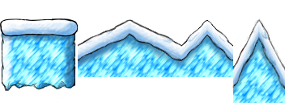
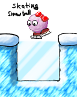

Actions
=======

The major change in the basic actions will be making running
automatic. Running will automatically happen when you have walked
continuously into a certain direction and will be different by a new
animation. The acceleration phase will be long enough to be able to
make walking-jumps. The jump height should be similar to what it is
now with different height for run and jump. The current implementation
of having a walk-key and [Milestone-1](Milestone_1 "wikilink")-style
running by default is *not* the intended final behavior.

What means “current” here? Which [SVN](SVN "wikilink") revision are
you referring to? --[octo](mediawiki/Users/octo) 08:38, 6 March 2010
(UTC)

Rationale: The run key is overlooked by many people making the game
extremely frustrating and annoying for them, since it isn't obvious
that there is one, the tutorial situation in the form of a high wall
in Milestone1 didn't really fix the problem, since we got still plenty
of questions about the situation. It also serves little purpose since
more experienced players will basically always press it down, i.e.
almost nobody actually walks through the game on purpose.

Jumping
-------

When standing or walking, [Tux](Tux "wikilink") can jump *four tiles*
high. When running or using the [backflip](backflip "wikilink") jump,
*Tux* can jump *five tiles* high.

*(This if from the top of my head. Please correct if this is wrong.
--[octo](mediawiki/Users/octo) 08:33, 6 March 2010 (UTC))*

**FIXME:**

- How high, how is it influenced by running?
- How far can Tux jump, i.e. what is the widest “normal” gap width that should occur in levels?

Running
-------

Walking and running velocity and acceleration are defined in
[src/object/player.cpp](Template:SvnFile "wikilink"). Currently those
values are:

| Name                  | Value | Description                                       |
|-----------------------|-------|---------------------------------------------------|
| `WALK_ACCELERATION_X` | 300   | acceleration in horizontal direction when walking |
| `RUN_ACCELERATION_X`  | 400   | acceleration in horizontal direction when running |
| `MAX_WALK_XM`         | 230   | maximum walk velocity (pixel/s)                   |
| `MAX_RUN_XM`          | 320   | maximum horizontal climb velocity                 |
| `WALK_SPEED`          | 100   | instant velocity when tux starts to walk          |

**FIXME:**

-   How fast, how does it influence jump, how long is acceleration?

Backflip
--------

The backflip is a special jump which gives Tux some extra height
compared to a normal jump.

Flapping
--------

By flapping his wings Tux is able to get a short amount of additional
time in the air as well as gain a tile in height.

Reasons to have it: fits the penguin, interesting gameplay mechanic,
has a reference implementation in the form of Yoshi Island

Reasons to not have it: Has been tried with not so much success

Problem: Its a “now or never” game mechanic, it changes the game to
much to be introduced at a later point.

**Will be ignored for now**

Butt Jump
---------

 The Butt
Jump is activated by pressing down while in the air. It causes Tux to
crush down on the exact spot over which he currently is. The butt jump
provides additional force that allows him to crush blocks and some
kind of armored enemies.

Blow Flyer
----------

Tux body catches a lot of hot air and thus starts to float. This
action is triggered by objects in the game world and automatically
terminates after some amount of time.

Can interact with wind.

**Will be implemented later, not a high priority item**

Sliding down Slopes
-------------------

When on a slope you can press 'duck' and then slide down the slope,
killing enemies in your way.

Controls
========

The game needs to take special care to distinguish between jump-with-up and jump-with-button. Running is automatic in this game.

Configuration 1 (jump with button)
----------------------------------

### Level

-   walk/run: left/right
-   duck: down
-   jump: button1
-   grab: button2
-   backflip: down+button1

### Worldmap/Menu

-   walk: left/right/up/down
-   enter level: button1

Configuration 2 (jump with up)
------------------------------

### Level

-   walk/run: left/right
-   duck: down
-   jump: up
-   grab: button1
-   backflip: down quickly followed by up

### Worldmap/Menu

-   walk: left/right/up/down
-   enter level: button1

Notes:

-   backflip must work even when the user can't press duck and jump at the same time
-   worldmap level entering is in one configuration done with the grab key and in the other with the jump key, this must be allowed
-   escape/return aren't remappable in-game and hard bound to showing/hiding the menu
-   peeking left/right handling stays as is
-   a Start-button might be a worthy consideration, since its semantics are different from Escape
-   allowing hot-plugging of joystick would be nice (calling 'Setup Joystick' should query the joysticks in the system)
-   ladders behavior must be compatible with both configurations

Engine
======

Screensize/Aspect-Ratio
-----------------------

Milestone2 will allow near total freedom in setting the screensize and the size of the projected area:

`./supertux -g 1280x1024:1680x1050`

This command for example will give a Window of 1280x1024, but with the visible area of a level being 1680x1050.

This means that level design must not focus on 800x600, but should be flexible enough even when the user has a much larger visible area. However all levels should remain playable even as low as 640x480.

The maximum resolution to deal with is 1920x1200 (HD-TV Monitor), 2560x1600 (Apple 30" Cinema Display) can't be handled since that would cause issues with enemy respawning, the respawn distance is currently 1600x1200, relative to Tux.

Maximum resolution might be limited to 1280x800, with everything larger getting upscaled.

-   with a windows larger then 1280x800 the content will be scaled up, letter boxes will be used where useful
-   with a window between 640x480-1280x800 the visible playfield will resize
-   with a window smaller then 640x480 the content will be scaled down

Questions
---------

Might 1280x1024 be a better choice then 1280x800, as its a common LCD resolution?

Maybe, if levels would have build in verticallity, at the moment they are just scaled to 25 tiles, which isn't enough for 1024, thus letterboxing. -- [Grumbel](mediawiki/Users/grumbel) 11:11, 26 February 2010 (UTC)

Levels
======

[Template:Navbox Milestone 2 Design Document](Template:Navbox_Milestone_2_Design_Document "wikilink")

General
-------

There are 4 axes of achievement: completion, collection, speed-run, and rampage, all 4 must be considered when designing levels.

Themes/Tilesets
---------------

[1](http://pingus.seul.org/~grumbel/tmp/md5/6c54813834f98bdf9abd9d7564ccff05-galapix-screenshot-0000.png) [2](http://pingus.seul.org/~grumbel/tmp/md5/677e174d88b851844d7fc73570667109-galapix-screenshot-0001.png) [3](http://pingus.seul.org/~grumbel/tmp/md5/c72a01dde4b0bd614600f82a41559b2a-galapix-screenshot-0002.png) [4](http://pingus.seul.org/~grumbel/tmp/md5/c7d6262a3f24ce3c497139f58c13702a-galapix-screenshot-0003.png) [5](http://pingus.seul.org/~grumbel/tmp/md5/66b2b53b8ae6e12148bef83c42b3f946-galapix-screenshot-0004.png) [6](http://pingus.seul.org/~grumbel/tmp/md5/9b6a1bc3acc77093b7ab2764ab1014da-galapix-screenshot-0005.png) [7](http://pingus.seul.org/~grumbel/tmp/md5/c58c334c7bc2e3e825c67b9274b490b6-galapix-screenshot-0006.png)

Levels
------

[Template:Level list Icy Island](Template:Level_list_Icy_Island "wikilink")

Objects
=======

Billboards
----------

**Billboards** are in-game explanations of game mechanics, such as the [Fireflower](Fireflower "wikilink") or reset points.

[Info Board Example](http://pingus.seul.org/~grumbel/tmp/md5/ca5c98b54e92b1317776c49970f2bbbe-info-boxes-done-right.png)

Extra Items
-----------

Egg needs a new graphic, Fireflower/Iceflower -&gt; ?

Unstable tiles
--------------

Change [unstable tiles](unstable_tile "wikilink") to be have like one of those:

-   [Crumbling ground in Giana Sisters DS](http://www.youtube.com/watch?v=22RH2auraFs#t=3m40s)
    -   Blocks crumble until they disappear. Then the player falls through.
-   [Donut Blocks in Super Mario World](http://www.youtube.com/watch?v=n_SqtR3xFpM#t=1m20s)
    -   Blocks fall down without crumbling first. The player can still jump off of them.

Since [6492](Template:Revision "wikilink"), either behavior is
possible, depending on the actions available in the sprite. The exact
behavior is documented on the [Unstable tile](Unstable_tile
"wikilink") page.

Slope Tiles
-----------

Slope tiles should be integrated.

Aren't they? —[octo](mediawiki/Users/octo) 22:23, 26 February 2010 (UTC)

Ice Tiles
---------

Make Tux skid around and harder to control

Deep Snow Tiles
---------------

Slow Tux down, cause him to sink in half

**Will be implemented later**

Icefloe
-------

Problem: We don't have good water behavior.

**Will be implemented later**

Reset Points
------------

There shall be no reset points in the game, instead it should be made
sure that levels are small enough to not require them.

No Lives
--------

There will be no lives and no punishment for death aside from having
to restart the level, due to the lack of reset points there simply is
no need for lives.

Collectibles
------------

The game shall provide some form of special collectibles per level (5
special coins, 5 pieces of a crystal or stuff like that). How many of
those collectibles are found is displayed in a prominent manner, not
just part of the statistics. The Tux-doll (ex-1up) could be recycled
for this purpose.

Obsolete
========

Obsolete things from other pages. Note however that obsolete doesn't
mean its useless, sometimes things are already done while other times
they just haven't been properly integrated into the Milestone 2 Design
Document yet and got moved here as a result of cleanup.

For the old forest page, see [Milestone 3 Design Document](Milestone_3_Design_Document "wikilink")

For the last voice meeting see: [SuperTux Meeting 18. August 2007](SuperTux_Meeting_18._August_2007 "wikilink")

Things unknown
==============

-   Who is running backups of the Wiki and SVN repository?
-   Shall we switch to GPLv3? **Not now, but maybe later**

*I**n**s**e**r**t**f**o**r**m**u**l**a**h**e**r**e*

Next Meeting Agenda (7. August 2008, 18:00 GMT)
===============================================

-   supertux.info status? integrate in main page?
-   GP2x updates
-   music submission: BlastOffTek music pack for Supertux.rar
-   badguy name cleanup
-   GP2x status
-   large level, establishing milestone 2 'gold standard'
-   editor news
-   compiled data formats
-   editor gui restructure

older stuff
-----------

-   present newly build levels
-   what to do with Badguy::freeze()?
-   what to do with level flipping (suggestion: ignore it)
-   Wiki & SVN backup again

Meeting Notes
=============

    Code:
    - engine problems blending
    - monster activation should be dependent on tux position and
      not on screen position (like it is now) because it should
      be independent from aspect ratio
      (Note for level designers: Think that potentially the user
      can see the whole level in front of him)
    - Code for butt jump

    Objects:
    - new object to place images into levels (to replace info boxes):

    http://pingus.seul.org/~grumbel/tmp/md5/ca5c98b54e92b1317776c49970f2bbbe-info-boxes-done-right.png

    Menu System Rework:
    - Scrolling level selection list
    - Buttons in menus
    - Add info box below menu (with explanations)

    Profile system:
    - create profiles
    - delete profiles
    - load default profile on startup

    - Restart game on language change (do not put language change menu into
    the
           Pause-Options menu)

    Graphics:
    - running animation
    - butt jump animation
    - improve egg graphics, so it does not seem like a "snowball"
    - graphics for the stuff in "Creatures"

    Behaviour:
    - Angry Iceblock: like the mario blocks (in the castles)
    - Owl: unclear... Carriers objects and drops them at tux somehow, but not clear.
    - Canon: like in mario: shoots left/right
    - MiniBomb: accelerates, follows tux (but does not jump)
    - Eater: ?

    Snowmen:
    - take the jogger one for fall-down snowball
    - take the japanese one for the gun
    - take the "normal" one for stay on platform
    - take the "ninja" for following tux

    Enemy Code:
    - support for spawning k-children in an enemy (for spitter for example)

    Mods:
    - we might want to support "mods". A mod is defined in that it replaces
    stuff
    that is already there (instead of only adding new stuff). Undecided if
    we want
    it and how exactly.

    Controls:
    - we need to support jump with up and jump with button
    - support binding for left,right,up,down. allow double up+jump config

    Game mechanics:
    - no costs for reset points
    - Mailinglist discussion: do we want reset points?
    - Remove global coin counter, coin count is only per level now  (similar to collectibles)
    - Add collectibles: per level, show them in the screen while playing the level
    - When you find a collectible, fade in collectible count for a short time
    - In pause mode show all collectible as once

    Mailing lists:
    - We want a separate team mailing list.
      Proposal: create supertux-user and supertux-team. make forward
      supertux-devel mails to supertux-user. supertux-team read everyone but write
      only for people with svn access...

    World1:
    - levels will be changed, and reworked to make use of the new features

    Yeti:
    - Sequence at end of castle: Tux find Yeti, Yeti jumps out of the window and  flees

2008-01-31
----------

Code:

-   New Badguy “Ice Crusher”, falls down to crush Tux, then rises back up. Has a platform on its top
-   Remove old Cannon, Dropper graphics and use new Cannon instead. Only shoots left and right
-   Butt-Jump should easily be possible. Press down in midair to make Tux stop in mid-air and drop down vertically. Current effect is just fine. Don't forget to shake the camera.

Game:

-   Figure out which Russian Translation to use (contact translators).
-   Build test level using snow slopes.
-   Do not use Ice Flower. It's not finished yet.

Graphics:

-   Fix jumping Tux animation. It has weird black marks.
-   Make Tux backflip animation smoother.
-   New tileset for above-ground levels.
-   New decorative tiles. Ice cracks, snowmen, cavemen, areas with more transparency, ...
-   Frozen tree.

Misc:

-   The forum of supertux.info is currently broken or unmaintained. Should we shut down the server? Contact maintainer.
-   Sounds for Ice Crusher, Flying Snowball, Snowball splashing against wall. Sound of rockets exploding is too loud.

Tasks
=====

<Template:nextversion>

Code Tasks
----------

-   properly GPL'ify the supertux-editor (COPYING file, GPL headers, etc.)
-   SDL2 migration (and all related side effect)

Sound and Music Tasks
---------------------

-   Improve the sounds
-   Compress music more. The 40 MBytes of music make up two thirds of the source tarball.

Graphics / Sprites
------------------

-   Create SuperTux idle animations (~~stage1: blinking with the eye,~~ stage2: tipping with the foot, stage3: scratching the head)
    -   <small>I've added the code for idle animations, we just need the graphics now. The blinking animation already exists, but it needs some tweaking - [sik0fewl](mediawiki/Users/sik0fewl) 06:25, 16 June 2008 (UTC)</small>
    -   [8](https://supertux.lethargik.org/bugs/view.php?id=681)
-   when Tux dies he can fly behind blocks instead of in front of them, drawing order bug
-   Tux isn't centered properly to his collision box
-   repair jump Tux sprite (to dark black) (Grumbel)
-   do a 32x32 top-down water animation for the worldmap
    -   use these tiles [9](https://supertux.lethargik.org/bugs/view.php?id=852)
-   finish [cannon](cannon "wikilink") graphics, also snowball graphics, death, etc (Grumbel)
-   [Snowman](Snowman "wikilink") graphics (death animation, turn-around graphics) (Grumbel)
-   [Owl](Owl "wikilink") graphics (basically placeholder graphics right now) <small>—[octo](mediawiki/Users/octo) 07:53, 9 March 2010 (UTC)</small>
-   some decor for ice tiles, cracks and stuff (Grumbel)
-   finish icecrusher graphics
-   deep snow tiles
    -   [10](https://supertux.lethargik.org/bugs/view.php?id=911)
-   icicle graphics for decoration purpose
    -   [11](https://supertux.lethargik.org/bugs/view.php?id=911) an okay job, but not the best -CT.da'Bomb
-   animate minibomb
-   think of a new way to represent the exit area (snow molted with smooth ground below or so)
-   add turn-around animation for smart-snowball

Editor / Developer Conveniences
-------------------------------

\*\# directly accessible powerups

-   finish editor improvements (MatzeB)
-   editor doesn't align [Cannon](Cannon "wikilink") and [Krush and Krosh](Krush_and_Krosh "wikilink") properly (grid is wrong)
    -   I think it's using the 0,0-position of the *image* to align objects, not the *hitbox*. —[octo](mediawiki/Users/octo) 07:50, 9 March 2010 (UTC)

Meta / Organization
-------------------

-   create a timeline what shall be done and when — [Milestone 2 Design Document/Timeline](Milestone_2_Design_Document/Timeline "wikilink")
-   discuss in the meetings what shall be done over the coming week — [Next Meeting Agenda](Next_Meeting_Agenda "wikilink")

Menu System / Game Configuration
--------------------------------

-   add gamma control to the option menu, see: int SDL\_SetGamma (float redgamma, float greengamma, float bluegamma);
-   make aspect ratio option menu thing work
-   need to properly auto-detect and set aspect ratio on games first startup (i.e. on a 1280x1024 screen aspect must be set to 5:4, not 4:3)
-   option menu entries are currently not in sync with gameconfig
-   add scale-with-window option to magnification or something like that
-   make left/right change an option in the menu, let enter apply it (needed for fullscreen)

Levels / Scripting / Gameplay
-----------------------------

-   level startup needs a fade-in, so does game startup, level abort and a few other places
-   add all fade-in/out effects to DisplayEffect
-   camera vertical scroll doesn't work properly in a small window (i.e. it doesn't move at all)

Other
-----

-   aspect ratio init code (Grumbel)
-   think about peeking in relation to large screen size
    -   <small>Maybe disable peeking if the resolution is at a certain size or greater? Tux would just be centered. [sik0fewl](mediawiki/Users/sik0fewl) 18:34, 30 April 2009 (UTC)</small>

Enemies
-------

-   fix and cleanup all the enemy names - see [Milestone 2 Design Document/Enemies](Milestone_2_Design_Document/Enemies "wikilink") for new names
    -   A beginning has been made by renaming *Kamikaze Snowball* to [Snowshot](Snowshot "wikilink"). There's not much consensus about the other changes though, see [Meeting 2010-02-27](Meeting_2010-02-27 "wikilink"). --[octo](mediawiki/Users/octo) 07:01, 5 March 2010 (UTC)
-   AngryBonusBlock: Have a bonus block type that comes to life when tux jumps against it and then chases Tux

Break the “only good stuff from bonus blocks” and “same look same behaviour” rules? --[WolfgangB](mediawiki/Users/wolfgangb) 01:27, 25 May 2008 (UTC)

Secret Maryo has a poisonous mushroom... if they break the rules, why not us? Also, bonus blocks already have varied behaviors. --[Mathnerd314](mediawiki/Users/mathnerd314) 04:23, 7 September 2008 (UTC)

-   create an enemy type that doesn't just walk straight into one direction, but does something different depending on Tux direction (ninja)
    -   <small>Is this a dupe of the Crystallo proposal for week 4? - [sik0fewl](mediawiki/Users/sik0fewl) 19:58, 15 May 2008 (UTC)</small>
        -   <small>No, this enemy is intelligent (reacts to Tux) --[Mathnerd314](mediawiki/Users/mathnerd314) 20:43, 19 March 2010 (UTC) </small>
-   [Mr. Bomb](Mr._Bomb "wikilink"): let the fuse burn after one touched it
-   [Flying Snowball](Flying_Snowball "wikilink"): Remove randomness, should be periodic and predictable
-   [Flying Snowball](Flying_Snowball "wikilink"): Change timings to match that of Milestone1
-   [Flying Snowball](Flying_Snowball "wikilink"): smoke effect for the motor seem to be to seldomly triggered
-   [Icecrusher](Krush_and_Krosh "wikilink"): gravitation instead of linear, facial expression.

    Gravitation has been done in [6403](Template:Revision "wikilink"). —[octo](mediawiki/Users/octo) 19:19, 26 February 2010 (UTC)

-   [Krosh](Krosh "wikilink") (big icecrusher): add a larger version of [Krush](Krush "wikilink") (the icecrusher), twice the size (4x4 files)

Postpone to Milestone 3
-----------------------

These are items that can be postponed until milestone 3, but are still welcome for milestone 2.

### Code Tasks

-   separate lisp reader, tinygettext and other libraries properly out of SuperTux

### Editor / Developer Conveniences

-   optimize the build process, building SuperTux currently takes ages (I don't see how we could speed it up..., MatzeB)

### Levels / Scripting / Gameplay

-   fix console command set\_game\_speed() so that it doesn't slow down the console
-   replace “you found a secret area” with a special sound (Wansti)
    -   why I like it the way it is. -ctdabomb
-   General: Do something about the walking speed, feels wrong at the moment, maybe a bit slower

### Other

-   create SuperTux .xo Activity for OLPC (Grumbel)
-   Have particle throwing starting enemies (fireflower like)
-   add sprite scaling

Finished
--------

-   document the behaviour of all badguys to be used in Milestone2 along with how they interact with each other - [Milestone 2 Design Document/Enemies](Milestone_2_Design_Document/Enemies "wikilink")
-   reorganize the editor to something more like this [SuperTux-Editor MookUp](http://pingus.seul.org/~grumbel/tmp/md5/68413a9004b402c38a8dd24bf785e2f0-supertux-editor-mockup.png)
-   Editor: show tile attributes in editor, especially for non-solid and unisolid there is often a very similar solid tile. Either add special editor-images for unisolid, some overlay icon for the tile selector ~~or at least a hint in the status bar~~. (status bar done)
-   General: Get rid of enemies stacking on top of each other
    -   <small>What does that mean? —[octo](mediawiki/Users/octo) 07:45, 9 March 2010 (UTC)</small>
    -   <small>I'm not sure if this issue still exists, but when one badguy falls on top of another and can't move left or right he will get stuck on top. - [sik0fewl](mediawiki/Users/sik0fewl) 16:53, 19 March 2010 (UTC)</small>
-   SuperTux should stand on the ground when a level starts, not fall down (move all spawnpoints to 1 tile above ground)
-   paint tutorial board for backflip
-   draw a bigger arrow for when Tux is jumping out of the screen
    -   
-   Create more music tracks for IcyIsland or add BlastOffTek's pack or the music by semaJD [12](https://supertux.lethargik.org/bugs/view.php?id=875).
    -   semajd's music is added, we just need to add the music to levels
-   [Mr. IceBlock](Mr._IceBlock "wikilink"): transparency looks horrible on dark backgrounds, Wiki had a better looking version floating around
-   [Haywire](Haywire "wikilink"): new bomb type (crazy pink bomb) that runs around after being touched
    -   Initial version is done. Waiting for feedback and improvements. See [Milestone 2 Design Document/Enemies](Milestone_2_Design_Document/Enemies "wikilink") --[octo](mediawiki/Users/octo) 07:08, 5 March 2010 (UTC)
-   [Mr. Bomb](Mr._Bomb "wikilink"): Roll back to behavior of [Milestone 1](Milestone_1 "wikilink"), get rid of particle effects
    -   Particle effects are currently deactivated in [src/object/explosion.cpp](Template:SvnFile "wikilink"). --[octo](mediawiki/Users/octo) 07:08, 5 March 2010 (UTC)
-   add PNG support for screenshots, BMP support currently broken
    -   <small>What's wrong with BMP support? It seems to work for me - [sik0fewl](mediawiki/Users/sik0fewl) 06:11, 13 June 2008 (UTC)</small>
        -   ACK, BMP-based screenshots work, at least with the SDL renderer. --[octo](mediawiki/Users/octo) 06:53, 5 March 2010 (UTC)
-   at large resolutions frame rate starts to sucks, but CPU usage continues to stay very low, is that a artifact of GPU use or something wrong with our timing/frameskipping code?
    -   <small>Fixed?</small>
-   bug: can't walk left and jump while pressing ctrl, when going right the same works, might be keyboard specific (Microsoft Natural Ergonomic Keyboard 4000 USB suffers from it, on the same PC a PS/2 keyboard works, maybe kernel driver bug), capslock is bound to ctrl and ctrl is bound as action key, using space for action works as workaround (Grumbel)
-   peeking should stick instead of jumping back or jumping back should be limited to normal range that the camera can do
    -   <small>I think this is fixed or at least better now? - [sik0fewl](mediawiki/Users/sik0fewl) 18:34, 30 April 2009 (UTC)</small>
-   ~~add an cmd option --default~~ and/or a menu entry “Reset to Default” to reset any changes to resolution or aspect ratio (or something along those lines) (cmd done, WolfgangB)
-   ~~create an overview of the current levels~~ — [Milestone 2 Design Document/Levels](Milestone_2_Design_Document/Levels "wikilink")

    —[octo](mediawiki/Users/octo) 07:24, 11 January 2011 (UTC)

    1.  ~~New unisolid snow tiles~~
    2.  Parallax backgrounds

        <small>That's heavily used in *Above the Arctic Skies*. —[octo](mediawiki/Users/octo) 07:22, 11 January 2011 (UTC)</small>

    3.  ~~Sector/Scripting use~~
    4.  ~~Crystallo and IceBlock badguys~~
    5.  ~~Add-ons + manager (To distribute these new levels, of course!)~~

        [Incubator Island](Incubator_Island "wikilink") and [octo's levels](http://verplant.org/supertux) should do most of this

    6.  ~~Slopes and background tiles~~
    7.  Moving platforms ~~(ice platforms haven't been used yet...)~~
    8.  ~~Climbable ladders~~

        <small>Ladders are not in the Milestone 2 document, but in Milestone 3. —[octo](mediawiki/Users/octo) 07:22, 11 January 2011 (UTC)</small>

-   try to fix white-lines around graphics problems (MatzeB)
    -   Where? -CT. da'Bomb
-   butt jump animation (Grumbel)
-   backflip animation (Grumbel)
-   Crystallo dead/dying sprites
-   Empty top/middle/bottom background image string should be handled as transparent image (more parallax backgrounds)
-   write TexturePacker to place multiple images on a single texture (better use of texture space and fixes bug with tiles having junk on the edge)
    -   <small>Fixed with non\_power\_of\_two? --[Mathnerd314](mediawiki/Users/mathnerd314) 20:43, 19 March 2010 (UTC)</small>
-   Malformed UTF-8 sequences should not be handled as fatal error, just insert '?' instead (happens with German translation) (fixed? MatzeB)
-   create some playable test levels for new stuff
    -   <small>Anything in particular? - [sik0fewl](mediawiki/Users/sik0fewl) 20:07, 15 June 2008 (UTC)</small>

    Try these, since they're probably most noticeable to Milestone1 users: --[Mathnerd314](mediawiki/Users/mathnerd314) 04:23, 7 September 2008 (UTC)

-   remove border from menu screen or make it scalable for different resolutions
-   remove pictures from credits, looks to uneven that way

<small>Really? I like the pictures. --[WolfgangB](mediawiki/Users/wolfgangb) 19:00, 29 April 2008 (UTC)</small>

<small>I do too. --[Mathnerd314](mediawiki/Users/mathnerd314) 00:05, 6 July 2008 (UTC)</small>

-   replace old bomb with new bomb sprite
-   ~~change game back to use Milestone1 single-sprite SuperTux (done)~~
-   ~~switch supertux-editor over to CMake? (done, is now a simple Makefile)~~
-   ~~when BigTux ducks, the camera moves/jumps, but should stand still (fixed, MatzeB)~~
-   ~~there should be an script command to change the game speed (i.e. run in slowmotion)~~
-   ~~Tux isn't animated when he dies (caused by “grow-right” and then “gameover” being set over and over again, so framecount is always 0) - sik0fewl~~
-   ~~bring back single-sprite SuperTux (done)~~
-   ~~jump with keyboard up (done, WolfgangB)~~
-   ~~figure out a Jumpy replacement (Grumbel)~~
-   ~~rename trunk/supertux-sharp to trunk/supertux-editor to make it clear that it is the primary editor (MatzeB)~~
-   ~~Stay-on-platform snowball (done, WolfgangB)~~
-   ~~snowball-launcher (done. WolfgangB)~~
-   ~~integrate snowjumpy~~
-   ~~use pink snowball for stay on platform, use normal snowball for straight forward walk~~
-   ~~add a “scan for joysticks” to the “No Joysticks found” in “Setup Joystick” to allow hotplugging (done, WolfgangB)~~
-   ~~peeking should work in in both X and Y at the same time (for use with second analog stick on todays gamepads) (done, WolfgangB)~~
-   ~~add a way to enable the console from within the game~~
-   ~~the menu should shrink instead of just disappear - sik0fewl~~
-   ~~add a set\_gamespeed() so that the game can run in slow motion for debugging **\[done\]**~~
-   ~~fix default peek keybindings, seem to be wrong~~
-   ~~Esc should pop the current menu (ie, back), not escape the entire menu - sik0fewl~~
-   ~~bomb can't be carried, but should be able to~~ - sik0fewl
-   ~~make F10 toggle print-fps~~ - sik0fewl
-   ~~Spiky: Shouldn't alway sleep, either make it an option or better make a new enemy type for sleeping behaviour~~ (Thats already done that way, there is [Spiky](Spiky "wikilink") and [Sleeping Spiky](Sleeping_Spiky "wikilink")).
-   ~~Spiky: Walkcycle animation looks broken, there is a frame missing~~
-   ~~Snowball(normal): Animation ruined~~
-   ~~Snowball(stay-on-platfrom): Replace with female snowball graphic~~
-   ~~Bomb: Replace graphic with new bomb graphic~~
-   ~~fix editor so that it works without a mouse wheel~~ (done, WolfgangB)
-   ~~Translations for Chinese and Russian (Cyrillic)~~
-   ~~InfoBox crashes when Text doesn't start with a marker character~~
-   ~~create ice-spikes graphics (Grumbel)~~
-   ~~create ice-tiles graphics (Grumbel)~~
-   ~~create angry ice-block graphics (Grumbel)~~
-   ~~Editor: sort (new) layers by z-value~~
-   ~~peeking up/down keys seem to be unbound by default~~
-   ~~fix/add/cleanup menu entry names and descriptions to be better understandable~~ - **\[done, but should probably be reviewed before release\]**
-   ~~create mountain and night background~~
-   ~~create proper background tiles for level22~~ - all you need are the blue bg tiles and maybe some unisolid ones
-   ~~new enemy type with more interesting walking pattern (follows Tux as long as Tux doesn't look, walks forward and backward, etc.), see Crystallo for a possible sprite~~
-   ~~add 'recent files' to level editor~~
-   ~~can't run while carrying an object, but should be able to~~

No, that is on purpose: Tux can't run when carrying heavy objects. So you can control where the player can not bring eg. the trampoline without a artificial “no stuff behind this line” object. Any reason why Tux should be able to run when lugging objects almost as big as himself? --[WolfgangB](mediawiki/Users/wolfgangb) 01:22, 25 May 2008 (UTC))

With \*large\* objects I might agree, but an Iceblock or any other 32x32 one isn't a large object, it just robs the gameplay from being dynamic. -- [Grumbel](mediawiki/Users/grumbel) 17:13, 28 May 2008 (UTC)

The speed limiting code has been deactivated in [6540](Template:Revision "wikilink"). --[octo](mediawiki/Users/octo) 06:51, 5 March 2010 (UTC)

-   ~~General: Get rid of bouncing snowballs killing normal snowballs and other unintended behaviour~~
    -   Fixed in [6554](Template:Revision "wikilink") —[octo](mediawiki/Users/octo) 07:35, 9 March 2010 (UTC)
-   ~~[Flying Snowball](Flying_Snowball "wikilink"): Add acceleration/deceleration instead of linear up and down~~

    Isn't this the current behavior ([6402](Template:Revision "wikilink"))? —[octo](mediawiki/Users/octo) 18:22, 26 February 2010 (UTC)

-   ~~background graphics glitch at non-800x600 resolutions (black line where background tiles), reason for this is that background gets copied to a 1024x1024 texture with a black border, at non 800x600 resolutions the right edge becomes blended with this black border, need to add 1px border around the texture to fix this blending bug (alternative: use GL\_NEAREST instead of GL\_LINEAR)~~

Timeline
========

Most releases have been in December on or near the 25th. The current
goal is to get something cool, playable, and user-friendly out by
then. The tasks are split into 3 phases, one for each month, though
not necessarily in the order.

Phase A - Graphics (October?)
-----------------------------

The ice tileset needs more variety. The current is a good start, but
more types of plants are needed. Decorative glaciers, more things
trapped in ice, molds, tundra, unisolid tile variants, and ice spikes
should get created, so that levels can include them. The forest
tileset has twice as many tiles as the ice world does, so copy if
needed ideas from there. Also, fix the slope tiles.

Phase B – Levels (November?)
----------------------------

Once some tiles are added, people can start making pretty levels with
ideas from all the previous ones. Reuse freely but don't constrain
because the original had limited height. The
[Styleguide](Milestone_2_Design_Document/Styleguide "wikilink") should
be followed. Levels should be more than 60 tiles wide and more than 38
tiles tall to support the largest screen resolution we want to have.
(1920 x 1200) As many levels as possible should be created so that we
can mash ideas together and improve upon them.

Phase C – Code (Anytime)
------------------------

Various bugs have been uncovered and need to be fixed, so people can
create parallax backgrounds and other useful designs. Ice tiles should
get implemented so Tux can skid around. We might want slope-sliding,
except that requires OBB's... Some new enemy behaviors should be added
so people can have variety in playing.

Other Phases
------------

Some other phases exist that aren't key to playing the game or creating content for it:

Phase D – Sounds and Music (Before release)
-------------------------------------------

The skid sound, grow-up, and some others don't sound quite in line
with the rest. They should get tuned up to sound better... The music
is also rather monotonous, as there are only 3 or so songs that levels
can use. More could/should get created...

Phase E – Editor (Before level phase begins)
--------------------------------------------

Some people have lots of trouble running the C\# editor, as evidenced
by the large numbers (22) of bugs resulting in the complete inability
to edit and create levels. Either some other language should be used,
or a full-time support team (person?) should be around...

Milestone\_2\_Design\_Document%2FUser\_Interface
================================================

[Template:Navbox Milestone 2 Design Document](Template:Navbox_Milestone_2_Design_Document "wikilink")

Menu System
===========

Menu system of Milestone1 is rather ugly and could need a rewrite as well as a reorganization of some things:

-   displaying the level name in/above/below the pause menu would be nice
-   there should be an option to display the full GPL in the menu
-   the menu system shall use icons to make it easier to find things even with no reading skills

Profile
-------

-   Create new profile
-   Delete profile
-   Profile1 -&gt; Main Menu
-   Profile2 -&gt; Main Menu
-   ...

Options
-------

-   Language
-   Fullscreen: yes/no
-   Fullscreen Resolution: 800x600, 1024x768, ... (automatic list from SDL)
-   Magnification: 100% (pixel perfect), 75%, 50%, ..., Full Screen (zoom till the screen is filled), Letterbox (zoom till all of the 1280x800 game area is visible)
-   Aspect Ratio: 16/9, 16/10, 5/4, 4/3
-   Sound Volume: off/0-100
-   Music Volume: off/0-100
-   Setup Keyboard:
-   Setup Joystick:
-   Use Profiles: yes/no

Contrib Levels
--------------

-   Check for new stuff online
-   complete contrib worlds
-   browse folders with level stuff

Configuration
=============

The games configuration (fullscreen, aspect ratio, geometry, etc.) shouldn't be saved when supplied by command line.

Milestone 2 Design Document
==============================

[Template:Navbox Milestone 2 Design Document](Template:Navbox_Milestone_2_Design_Document "wikilink") \_\_TOC\_\_

This document is meant to give a reasonably detailed guide on what
shall and shall not happen in Milestone 2. It is also intended as a
complete replacement of other, incomplete or otherwise flawed,
Milestone 2 documents floating around in this Wiki. This design
document is written by [Grumbel](mediawiki/Users/grumbel), question
and comments are welcome, use the [talk
page](Talk:Milestone_2_Design_Document "wikilink") or the [IRC](IRC
"wikilink") channel for that. At the moment this document is a
work-in-progress, meaning goals might change as time progresses. This
document has not yet been approved by any other member of the
*SuperTux* [development staff](Team "wikilink").

Motivation
==========

Development of the forest world hasn't made much progress over the last few years. Milestone 2 is a try to bring development back up to speed by setting more reasonable goals and by cutting out a lot of allocated cruft, reducing the game back to a maintainable state that allows further development. This means the [forest world](Forest "wikilink") will be cut out completely and focus will be given to the [Iceworld](Iceworld "wikilink") of [Milestone 1](Milestone_1 "wikilink"). The core goals of Milestone 2 are:

-   cleanup the engine and fix long standing issues (broken OpenGL texturing, broken collision detection, etc)
-   enhance and adopt the levels of [Milestone 1](Milestone_1 "wikilink") to use new engine features
-   stabilize the engine to the point that new stable released can be rolled out much faster
-   create a polished boss fight

Optional goals (might wait for [Milestone 3](Milestone_3 "wikilink")):

-   create new levels, tile sets and enemies

The Milestone 2 Design Document lists a lot of additional features for the iceworld, which should maybe wait till the next release.

General
=======

-   uni-solid tiles shall be provided for all tilesets

    Should the graphics of unisolid tiles differ from those of solid tiles? If not, using invisible unisolid tiles in the interactive tilemap and solid tiles in a non-solid background tilemap works just as well and doesn't duplicate tiles a hundredfold. --[octo](mediawiki/Users/octo) 07:06, 2 March 2010 (UTC)

-   multi-layer parallax scrolling background tilemaps shall be used in all levels
-   menu system should be replaced/reworked
-   save system could need a rework as well
-   language shall be changeable via the option menu, LANG environment variable shall only be used as default setting

    I think this is how it is currently behaving, isn't it? --[octo](mediawiki/Users/octo) 07:06, 2 March 2010 (UTC)

-   worldmap Tux sprite should get animations for left, right, up, down directions, not just a single one as now

Levels
======

The levels of Milestone1 lack verticality as well as unisolid tiles, Milestone2 should fix that by adding those elements. Also the levels should be shortened/split to avoid the need for reset points. Another important point is that each level should try follow a clear design premise instead of being more or less random collection of tiles and enemies. The levels from Milestone1 should be taken as a point of inspiration and starting point, not as something that is verbatim copied over to Milestone2.

The *worldmap* should be rolled back to that of [Milestone 1](Milestone_1 "wikilink"), i.e. a mostly linear map, but additional optional paths shall be added.

This has been done in [6424](Template:Revision "wikilink") and is included in this form in *version 0.3.3*. The only additional path is to the bonus level, though. --[octo](mediawiki/Users/octo) 07:12, 2 March 2010 (UTC)

See [Milestone 2 Design Document/Levels](Milestone_2_Design_Document/Levels "wikilink") for a more detailed analysis of the current levels.

Cleanup
-------

The test/ levels are currently quite a big mess, there needs to be cleanup to reduce them to those that are really needed otherwise its to easy to miss the ones that are important.

[Mathnerd314](mediawiki/Users/mathnerd314 "wikilink") has cleaned up test levels a bit in [6477](Template:Revision "wikilink"). --[octo](User#octo) 07:09, 2 March 2010 (UTC)

World 1 - Icyisland
===================

World 1, the icyisland, was released with Milestone 1, the intend of Milestone 2 is to adapt it to the new engine features as well as improving it by adding new enemies and new gameplay elements. While level structure might be recyclable in many places, it will often need structural improvements to provide real use of vertical and horizontal scrolling, instead of just locking the player in a horizontal-only scrolling level. Things that need to be done: 

-   Jumpy shall be replaced with an enemy that fits better into the snow landscape, Jumpy himself shall be reused in a lava-like setting or in the bosses castle

    Are you referring to the old *Milestone 1* jumpy? The current snowball-with-a-spring look fits the snowy landscape well, IMHO. --[octo](mediawiki/Users/octo) 07:18, 2 March 2010 (UTC)

-   the walrus salesmen shall be added to the island
-   some levels shall be separated out into optional paths, to provide a less linear path
-   iceblocks which will melt on contact with fire shall allow to lock paths in a level or lock secrets

    Code is there, see [weak blocks](weak_block "wikilink"). Needs graphics to fit into [Icy Island](Icy_Island "wikilink"). --[octo](mediawiki/Users/octo) 07:18, 2 March 2010 (UTC)

-   balanced platforms that start to rotate or move when Tux stands on them shall be provided
-   water, in its simplistic tile form, shall be removed from all levels
-   uni-solid/half-tiles shall be used to enhance the levels and provide optional paths
-   bottom-less pits shall be either replaced by pits with spike at the bottom or allow Tux to climb back out of the pit

<!-- -->

-   there shall be auto-scrolling levels that force Tux to run by having a avalanche coming down behind him, the avalanche might either be simple snow or a large group of enemies
-   the castle tileset shall be replaced with something that looks colder and features both snow and ice
-   cave tileset shall be replaced with something that has a larger pattern, thus looks less ugly when tiled
-   tiles picturing deadly spikes build out of ice shall be created

Intro/Credits
=============

 The text based intro and credits shall be replaced with cutscenes, showing the events that are described in the text. Instead of auto-scrolling text the game shall provide text that doesn't scroll, but instead only continues up on user interaction (i.e. press action button to see the next page of text). Text in cutscenes shall get printed letter by letter to the screen to provide a sense of 'motion'. Voice over from a story-teller might be consideration, while Tux, Penny and Nolok itself shall remain without speech.

**Later in the development of Milestone2**

Things to know
==============

-   [data/levels/test/unisolid.stl](Template:SvnFile "wikilink") shows a few new features of Milestone 2 (parallax scrolling, unisolid snow tiles, new water)
-   [News](News "wikilink") is there to be used, so if something interesting happens, write it down there

<Category:Development> <Category:Development> [Category:Milestone 2](Category:Milestone_2 "wikilink") <Category:Development> <Category:Development> <Category:Development> <Category:Development> <Category:Development> <Category:Development> <Category:Development> <Category:Development>
