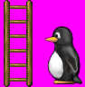
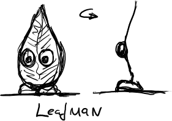
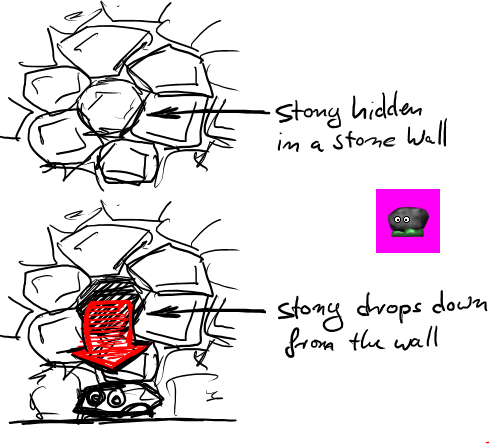
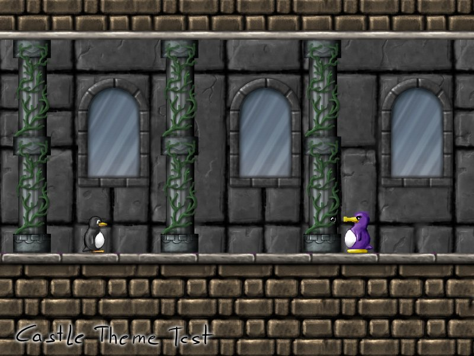

**About this document:** This document's content should in no way be regarded
as a final decision for any feature. Any idea might be changed during its
implementation, during an IRC meeting or as a result of a bug report. However,
this will serve as a reference for potential and existing contributors.

### Overview

The main goal of Milestone 3 is to continue the story of SuperTux by improving
the Forest Island and possibly adding another world (e.g. Tropical Island) to
the game. It has also been proposed to add custom features to the levels, making
the game more interesting.

### Story

The main idea is to continue the story after Icy
Island by giving the player access to some object, like a ship, that will allow
them to continue to some smaller island in the ocean. In progress of solving
these levels, the player can collect another item (a raft has been proposed),
making it possible for the player to continue their trip to Forest Island.

However, using the raft to get to another island won't be possible as there
might be heavy currents in the ocean, causing it to sink.

Similar, but different, scenarios for other worlds are possible: using a plane
to reach a mountain range, but not being able to fly over because it's too
high, ...

### Shop

A shop could be accessible via the worldmap, being located on every big island
once or twice. The shop could be implemented as a lighthouse on the coast of the
island. The shopkeeper (e.g. an old walrus with a beard) will provide the player
items (power-ups limited to the shop) and services (unlock a level) in exchange
for coins or items that can be collected only one time in secret areas of levels.

### Swimming

Swimming is a feature which has been planned for a while. The intention is to
avoid cloning Mario's swimming mechanics, and come up with something similar,
but unique in its own way.
Tux will wear goggles while swimming, and will still be able to use his flowers,
while underwater.
Tux will begin swimming immediately as he enters the water. (needs discussion)
Two ideas have been propsed (loosely) for the implementation of this feature:
 - Tux moves in a curve through the water, at high speed, like a penguin might
   in real life
 - The player presses up/down/left/right, and Tux moves in that direction. When
   the player presses the jump key, Tux will get a boost in the current direction
   he is facing
   
 **Note: Swimming has been fully implemented in the current game, and it functions very different to this, making this extremely outdated.**
   
### Underwater Enemies
Of course new underwater enemies are needed once Tux is able to swim. This is a list
with some proposed enemies and their behaviour. 
Underwater enemies will die if they should leave the water.
#### Jelly Fishes
Jelly fishes are the most basic underwater enemy. They just swim around and are not 
hurt when Tux touches them. When they hit a wall, they will turn around. 
Fire jelly fishes are different, because they are able to hurt Tux. 
#### Dolphins (Poki)
The dolphin is a curious animal who wants to get to know Tux. When he encounters Tux,
he will poke Tux. This results in Tux floating in the water.
From time to time Poki has to dive up to fetch new air. If Tux is nearby, when he dives up, he might take Tux up to the surface.
(He can swim in cold waters because he was genetically modified by Nolok)
#### Leopard seal
Leopard seals chase after Tux and are able to kill him. They are able to swim faster than Tux 
for short durations of time. After swimming very fast, they can not attack Tux for some specified time.
#### Blowfish
 Blowfishs will blow up in certain time intervals / when Tux is nearby. When blown up,
 they might shoot deadly spikes and collisions with the blowfish will lead to Tux being hit.

About this Document
===================

This document is a work in progress, nothing here is considered even remotely final.

Overview
========

The goal of Milestone 3 is to add another island/theme to the world of SuperTux, namely the forest island, as well as improving on the short commings that where present in [Milestone 1](Milestone_1_Analysis "wikilink"). Together with the forest island the game will provide additional enemies and items that fit the forest islands look and setting. New actions for Tux might be provided as well, namely the backflip, butt-jump and the iceflower powerup.

Story
=====

The SuperTux game starts with Penny, Tux's girlfriend, getting captured by Nolok. After those events are shown in the intro the player takes control over Tux and has to guide him through around two dozen levels on a snowy island. At the end of the path on the island is a castle, which however doesn't contain Nolok, instead a Yeti will be provided as a final boss battle. After Tux has defeated the Yeti and received a secret letter from Penny explaining where the got taken, Tux continues his journey over the sea to another island, one filled with forests, grass and green stuff.

 On arrival on the forest island Tux will be welcome by the Granitos, which happen to be the native inhabitants of the island. They explain Tux in a cutscene that Nolok has taken control over their island and its magic castle, thus turning a large part of the island into a ghost world. To enter the magic castle five keys are needed, those are however scattered across the island. After hearing their story Tux tells them that he will help and proceeds deeper down into the forest world. On his journey through the forest island Tux will meet both more friendly Granitos as well has a salesman in the form of a walrus which will either tell some more story or help Tux with extra items or guide him through a level (Granitos can walk over spikes, while Tux can't).

 After having collected the five keys Tux is able to enter the magic castle where he will face the final boss in form of a magic Totem. After defeating the Totem, Tux will yet again receive a letter from Penny telling him on how to continue his journey.

Shop
====

The shop is a little house accessible via the worldmap, it provides the player with items, mini-games or other useful things. The shopkeeper is an old walrus with a beard. Different islands might provide different looking shopkeepers, all walrus, but adopted to the local environment.

Actions
=======

Swimming
--------

Since Tux is a penguin he has a good ability to swim. Water will not harm him. Swimming works by basically having two modes:

- 'standing': Tux stands still in the water, via the directional controls he can move up/down/left/right, this mode is very slow, but exact
- 'swimming': by pressing a button Tux can go into swim mode, in this mode he swims at fast speed, can crush blocks with ramming them and perform jumps out of the water

World 2 - Forest
================

The forest island is split into different section, one being a classical forest, one being tree-tops, then a stone based section, followed by a dark ghost forest and finally the boss castle. Each section might feature separate tilesets for above or below ground action.

- enemies: owl, snail, greeny, plant, eater, spitter, mr tree, leafman, [Cannon](Cannon "wikilink"), spider, ladybugs, stony, walking bush, drop-down oak
- boss: totem

Ghost Forest
------------

The ghost forest is a world that exists in parallel to the normal forest. Instead of a living forest, it as a dead one. Instead of cute little enemies, it has ghosts and skeletons. Portals connect the ghost forest with the normal one, both on the worldmap as well as in the levels themself.

The worldmap shall exist in both the ghost as well as the normal mode, paths might differ, so that walking around might require to transit from one world to the other.

Color Castle
------------

Game Elements
-------------

### New Pipes

Pipes in Milestone2 should differ from both Mario1 and Milestone1. Instead of being objects that lead to new levels/section, they shall contain water and allow Tux to swim around in them. There shall not be a specific enter/leave animation, instead the behavior of Tux in pipes will be similar/equal to that in water. To accomplish this tiles might need to change in size and there design need to change to either include a little window to see tux through it or alternatively they need to be designed multi layered so that the foreground layer fades away when entering them.

### TileMap Dimming

Each tilemap should have an ambient-light/color setting (tilemap\_color \* ambient\_color). This should be relativly easily be implementable via a glColor() or a Surface::set\_color() at the right place. It is meant to be used in levels with multiple parallax scrolling backgrounds, so that the backgrounds further away can become darker then the ones in the foreground. The ambient-light setting is meant to be specific to the single tilemap only and has nothing to do with the global ambient-light setting.

### Rising Lava/Water

The water or lava that will be in some levels will be able to rise. Rising will either be automatic or triggered by switched. The rising lava will lead to drastic increase of danger and force Tux to make it quickly through some areas before the lava reaches him. While water will allow Tux to swim up to places which would otherwise unreachable.

Windstille contains in file trunk/windstille/src/liquid.?pp an implementation of simply physic based 2d water, that implementation could/should be used in SuperTux.

### Ladder

Allows Tux to climb up.

Status: Implemented as GameObject, not via TileMap, which has its advantages (easier to z-sort) as well as disadvantages (harder to handle in editor)

### Butt-Jump rotating tiles/objects

Butt-Jump on such a object to fall through/let it rotate, normal jump does nothing. Might be one way, so that you can't jump from the other side.

World 2 Enemies
---------------

### Snail

When jumped up on the snail rolls into her house and thus becomes invincible as well as portable. Snail is a slow moving enemy. Snail might come in different sizes, especially larger ones then the standard 32x32 enemies.

### Fluffy

Fluffy is a small enemy that moves around via little hop motions, jumping on him will kill him.

### Greeny

Basic forest enemy, for most part just a simple snowball replacement.

### MrTree

In its basic version MrTree behaves similary to the Iceblock and thus acts as its replacment in the forest world. He might however also come in stacked-versions, movment stays the same, but its height varies. When jumped up-on a stacked MrTree only the top most one is killed, the others stay untouched. Another variant to MrTree is the toupee one, he has 'green stuff' on its head which might protect him against a single jump, after that jump his green protection is destroyed an he becomes a basic MrTree.

A last version of MrTree might come in large size.

### Leafman

A basic enemy which however gets near invisible when walking. Every few steps he stays still and thus becomes visible. He might interact with wind.

### Colory

A enemy specifically for color castles, it can glow in different colors and thus influence the color-tiles. It might also be influenced by lamps itself.

### Spider

The Spider hangs at the side of a tilemap, either a hard one or an unisolid one. At regular intervals the Spider 'charges up' and performs a jump. After the jump it falls back to the tilemap and attach back to it. The spider can walk on the side of the tilemap, but can't walk on normal ground like a Snowball.

### Ladybug

The Ladybug is a simple flying enemy that flies in a sinus-curve motion.

### Stony

Stony hides himself in stone walls and is invisible, only when one gets closer he becomes alive and drops down. Multiple Stonies might come as group and drop down at irregular intervals.

### Walking Bush

The Walking Bush is an enemy that looks just like an background object, when inactive it also behaves like one, i.e. neither can Tux kill it nor can it kill Tux. When active it might change its color a bit and have eyes, it will walk around a bit to then become inactive again. Jumping on it when active will kill it.

### Oak

 The Oak hangs in trees and doesn't move until Tux approaches, once Tux gets close enough the Oak drops down and slowly floats to the ground.

### Flamey

Flameies are little enemies build out of fire. They are invulnerable
against jumping and when to small ones collide, they turn into a large
one. Flameies stays near its starting position and moves a bit around
to the left or the right, they don't do walks into one direction like
many other enemies. After a while Flameies might shrink and die
automatically.

Special Flamey dispensers (volcano, pot with fire) might throw new
Flameies onto the playfield at regular intervals.

Flamey might react special to the ice-flower.

### Water Droplet

Water Droplet might behave similarly like Flamey, only instead of fire, they are build out of water. Ice-flower might turn them into an ice-enemy. Multiple water droplets can merge and they can be dispensed from a leaking pipe.

How they interact with Tux is open for discussion.

### Ghosts

 Basic ghosts float around on a fixed path in a sinus-wave like pattern. There may be different kinds of ghosts that follow different patterns as well as ghosts that are inflatable and grow in size on specific events.

### Angry Stone

Angry stone is attached to the roof of a level, once Tux gets close to him (one tile to the left or right, he crushes to the ground, trying to kill Tux. Soon after he lifts back up to the ceiling for another attack. Angry stones might come in different sizes, from really small ones, 32x32, to very large ones, 256x256. Angry stones are always a multiple of the tilesize large so that they fit into the tilemap properly.

### Carnivorous Plant

Plant is fixed on the ground, when Tux gets close it starts to reach for him. When walking slowly it might be possible to walk by a plant without waking her and thus getting killed.

### Lava Animal

A creature that lives in the lava and jumps at Tux every now and then.

Editor
======

- editor needs a minimap, like Flexlay
- editor needs a grid, like Flexlay

Open Questions
==============

Do we need a tree-top setting? Does it fit into the forest world (deciduous forest vs coniferous forest)?

Should stone tiles be separate from the rest or merged into the main forest tileset (as unisolid tiles)?

What contrib levels contain ideas that might be worth to recycle?

Disfavored Features in the current Development Version
======================================================

- Pogonia graphics: simply don't look as if they are dangerous, shall be removed or ignored for official M2 level
- Scripting: scripting shall be limited to cutscenes (intro/credits), boss fights, normal levels shall not feature scripting. If scripting is used it should be invisible, i.e. no “I push this trigger, watch that stupid cutscene and then move on stuff”, instead use scripting for rising water/lava, creatures with pseudo intelligent behavior or whatever, make it so that scripting doesn't interrupt gameplay, make it so that scripting provides gameplay
- Enemies: plenty of them look pretty poor and should get removed/ignored
- bitmaped backgrounds: shall be replaced with parallax scrolling ones.
- main menu: could use some serious polishing, simply fill-rect background looks ugly
- save system: very counter intuitive to get asked for a new save state for contrib levels
- Tux rap in the intro: must not make its way into Milestone2
- Coin handling as extra life: punishes the weak, doesn't add any gameplay and for most part just doesn't feel good, Tux should simply have infinitive lives
- Reset Points: they don't look good and for most part don't do anything good, instead of having reset points levels should simply be made small enough so that they don't need reset points
- Tux superpowers: hat is *really* ugly and shall go, even old red-Tux was way better
- Tux split sprite: shall be rolled back to the single-image one of Milestone1
- Level flipping: It might have some place in a ghost castle, but in the end I prefer it to not be used much at all.

Disfavored Practices in Current Development
===========================================

- Bug fixing: while some is obviously necessary, to much time is spend fixing bugs in levels or code that might be removed later in the development of Milestone2
- Feature addition without discussion first
- Disorganisation: hard to figure out who works on what, when and how. Hard to get enough people together to have a meaningful discussion
- Mailing list often overrun by non-development people, making it hard to discuss core game features
- Discussion over details, while leaving the whole game totally out of the picture
- nobody ever uses [News](News "wikilink")

Tasks
=====

- develop two showcase levels, one for the ice world another for the forest world, that demonstrate graphics, enemy and objects that will be featured in Milestone2

Miscellaneous
=============

[Some ideas on paper](http://pingus.seul.org/~grumbel/tmp/supertux-2006-08-13/)
