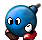
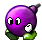

## Miscellaneous Badguys of SuperTux

A badguy in SuperTux is a foe of Tux. They may not be "bad" in the way
that a hedgehog isn't really bad, but they can certainly hurt Tux.
Most of the badguys are creatures, like Snowballs with varying
characteristics, but some are more like objects (Stalactite for
example) or phenomena like Flame.

Tux will try to avoid approaching badguys if possible. If he runs into
one or one drops on his head, he is hurt. When hurt Tux will lose a
powerup or, if Tux has no powerups left, he will be killed.

Many of the badguys Tux can knock out by jumping on them and squishing
them. Others are only stunned by this for a short while or are
insusceptible to this and hurt Tux instead. As a rule of thumb,
badguys with a spiky head or helmet can usually not be jumped on. For
a list of badguys that can be squished take a look at the squishable
badguys category. Most badguys can be killed with the fire- or
iceflower power up.

This page shall describe all enemies, old and new, in as much detail
as possible. We also need to settle down on proper names for enemies,
since currently there is a lot of confusion. If you want see on real
names, click [here](real_badguys_names "wikilink").

##### Further references

* [Milestone 2 Design Document/Enemies](http://supertux.lethargik.org/wiki/Milestone_2_Design_Document/Enemies)
* [Proposed badguys](http://supertux.lethargik.org/wiki/Proposed_Badguys)
* [Badguy concept art](http://supertux.lethargik.org/wiki/Badguys_concept_art)
* [Worlds](https://github.com/SuperTux/supertux/wiki/Worlds)
* [Bosses](http://supertux.lethargik.org/wiki/Bosses)

Mr. Bomb
========

The base behavior of Mr. Bomb is walking around forward but turns around when reaching the edge. When hit he doesn't get squished, but knocked out and his
fuse starts burning. While the fuse is burning he doesn't move, but instead can be carried around like an iceblock. After ~5 seconds he then explodes, killing nearby badguys as well. The presence of other Mr. Bombs during explosion may cause a chain reaction of explosions. He also explodes if he is hit by one of Tux's fireballs, but if hit by an iceball, he freezes without exploding.

| Property       | Status |
|----------------|--------|
| Squishable     | yes    |
| Buttjumpable   | yes    |
| Burnable       | yes    |
| Freezable      | yes    |

### Comments

> Grumbel: "Time to explosion is too short, blinking
> doesn't signal time to explosion well enough, making it almost
> impossible to carry it around to do anything. Fuse doesn't actually
> burn when activated."

Short Fuse
==========

Shortfuse is a small version of Mr. Bomb, who most commonly approaches Tux in groups. Since their fuse is so short they will "pop" immediately upon contact. They however are non-lethal to Tux and only work to either distract him and throw him back or push him into other obstacles.

| Property       | Status |
|----------------|--------|
| Squishable     | yes    |
| Buttjumpable   | yes    |
| Burnable       | yes    |
| Freezable      | no     |

Haywire
=======

A purple walking bomb behaving just like Mr. Bomb, happy to be around until touched without its consent. When jumped on Haywire his fuse gets activated. This causes him to start chasing Tux at a much faster speed until he explodes. He can't be carried around but jumping on him when the fuse is burning will cause Tux to bounce and
Haywire to be stunned for a very short moment (fraction of a second). When shot with a fireball Haywire explodes immediately.

| Property       | Status |
|----------------|--------|
| Squishable     | yes    |
| Buttjumpable   | yes    |
| Burnable       | yes    |
| Freezable      | yes    |

### Comments

> Grumbel: "Visually not distinct enough. Sound
> effects terrible. Behaviour change when jumped uppon not dangerous
> enough. See [Concept Art](images/Milestone2-sprites.png)."

Gold Bomb
========

The Gold Bomb has the same behavior as *Mr. Bomb*. The only difference being that upon exploding 10 coins will drop.

| Property       | Status |
|----------------|--------|
| Squishable     | yes    |
| Buttjumpable   | yes    |
| Burnable       | yes    |
| Freezable      | yes    |

SkyDive
=======

A Skydive is a bomb in the shape of a fish that is usually carried around and dropped by *[Owl](https://github.com/SuperTux/supertux/wiki/Forest-Badguys#Owl)* but can also spawn from droppers. They fall down to the ground once dropped and explode.

| Property       | Status |
|----------------|--------|
| Squishable     | yes    |
| Buttjumpable   | yes    |
| Burnable       | yes    |
| Freezable      | no     |

Flame
=====

  

Flames are glowing spheres that rotate around in a circle at a set radius, hurting Tux when he gets too close. They are usually found in castles. Flames are mostly indestructible. However, while only the ghost flame variant is fully indestructible the normal flame can be destroyed with an ice ball and the ice flame variant with a fire ball. 

| Property       | Status |
|----------------|--------|
| Squishable     | no     |
| Buttjumpable   | no     |
| Burnable       | varied |
| Freezable      | varied |

Cannon (dispenser)
==================

 

While not a badguy in its own right the cannon most commonly spawns badguys like *[Kamikaze Snowball](https://github.com/SuperTux/supertux/wiki/Icy-Badguys#Kamikaze)* or *[Leafshot](https://github.com/SuperTux/supertux/wiki/Forest-Badguys#Leafshot)*. The cannon can be mounted on either static or rotatable pedestal. It is also possible for the cannon to shoot inanimate, non-badguy objects.

Despite its cannon form, there also exists a dropper and invisible variant.

| Property       | Status |
|----------------|--------|
| Squishable     | no     |
| Buttjumpable   | no     |
| Burnable       | no     |
| Freezable      | yes    |

### Comments

> Grumbel: "Overly complicated and configurable. It
> should focus on one thing and doing it well (i.e. shooting
> snowballs) instead of doing everything and than some. Might be best
> to discard the current `Dispenser` class and replace it with a Canon
> class."

Ispy
====

-   Appearance=A spying eye.
-   Behaviour=Static, looking towards the nearest player.
-   Squish=no
-   Buttjump=no
-   Freeze=yes
-   Burnable=no

Ispy is an eye embedded  in a stone housing that works similar to a photoelectric sensor. When Tux can be seen by the eye it will activate a mechanism, like a door closing or a trap activating.

List of miscellaneous badguys as of SuperTux 0.6.2
-------------------------------------------------

-   Mr. Bomb
-   Shortfuse
-   Haywire
-   Gold Bomb
-   Skydive
-   Flame
-   Cannon
-   Ispy

List of icy island's badguys in SuperTux 0.1.3
----------------------------------------------

-   Mr. Bomb
-   Flame

See also
--------

-   [Proposed Badguys](https://github.com/SuperTux/supertux/wiki/Current-Design-Document)
-   [Badguys concept art](Badguys_concept_art "wikilink")
-   [Bosses](https://github.com/SuperTux/supertux/wiki/Bosses)
-   [Worlds](https://github.com/SuperTux/supertux/wiki/Worlds)

[Category:For Users](Category:For_Users "wikilink") <Category:Design> <Category:Badguy>
