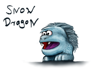
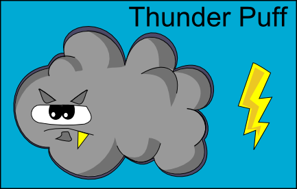
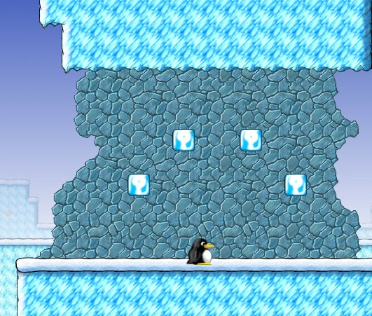
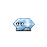
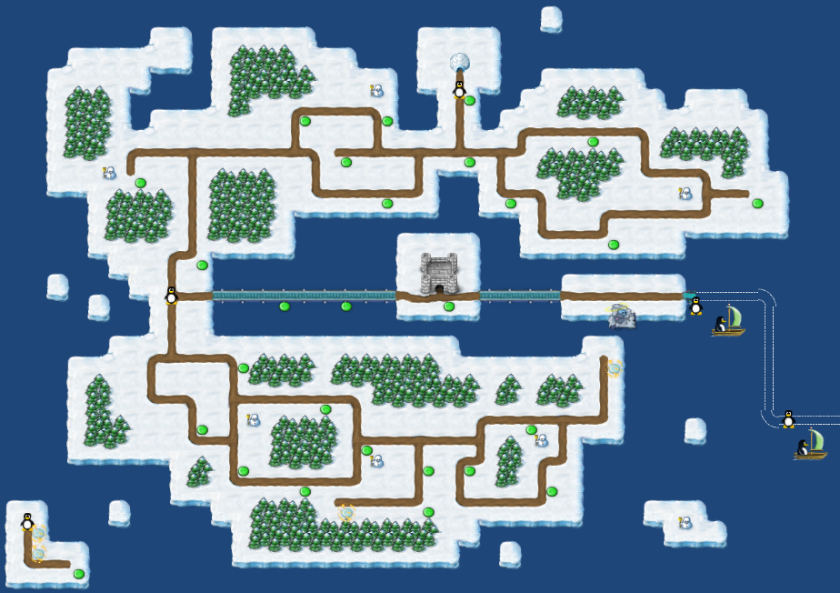
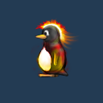
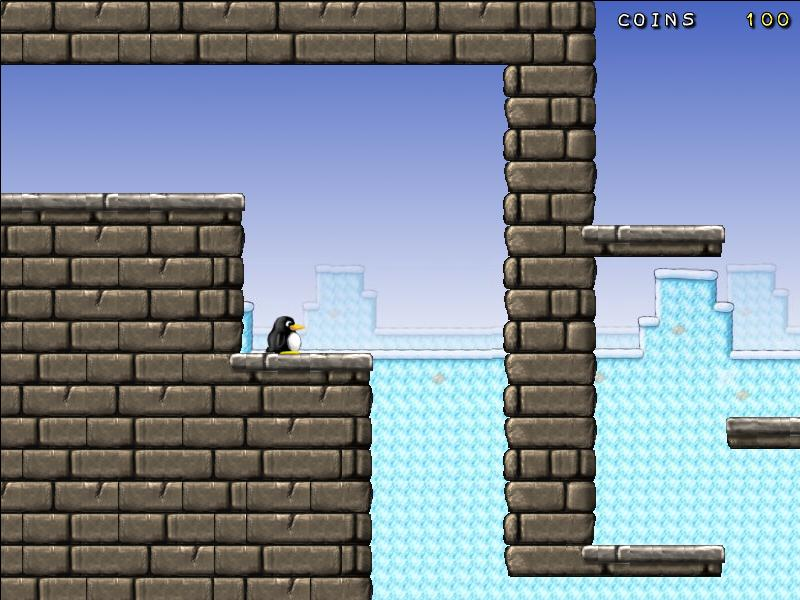

2018
====

- Wiki has finally been transfered to Github proper
- TileMaps are now draw in batches, drastically improving framerates

2015
====

- SuperTux moved from GoogleCode to GitHub, new location is <https://github.com/SuperTux/>
- SuperTux 0.3.5 has been released.

2013
====

- SuperTux 0.3.4 has been released.
- Development of [Forest island](Forest "wikilink") continues.

*“Deleting Forest island and the forest badguys is a step backwards. We
must continue in its development now instead in Milestone 3!”\
--Hume*

2012
====

- The official add-ons are kept in a repository on Google Code now;
  various new ones have been created out of levels sitting on the bug
  tracker.

2011
====

- We switched our repository to Git (on Google Code)
- Forum at <http://forum.freegamedev.net/viewforum.php?f=66>

2010
====

2010-08-09
----------

- <https://supertux.lethargik.org> is now supported; currently it is
    required for the bug tracker.

2010-03-14
----------

- [Incubator Island](Incubator_Island "wikilink") has been added. It
  contains possible new levels for the main game. Please test
  thoroughly and tell us what you think.

2010-03-06
----------

- Since [6556](Template:Revision "wikilink") spawning at *reset
  points* is “for free”, i.e. you won't lose any coins if you die and
  start at a bell.
- The [Owl](Owl "wikilink") and [SkyDive](SkyDive "wikilink")
  [badguys](badguy "wikilink") from the [Milestone 2 Design
  Document](Milestone_2_Design_Document "wikilink") have been
  implemented.

2010-03-02
----------

- The images and code for the [Short Fuse](Short_Fuse "wikilink") has
  been added to the [SVN](SVN "wikilink") repository. For testing
  purposes, it has been added to level 12 of [Icy Island](Icy_Island
  "wikilink"), *Into the Stars*.

2010-03-01
----------

- *Version 0.3.3* has been released. The source tarball can be
  downloaded from either BerliOS or Google Code. Enjoy! :)

2010-02-27
----------

- The minutes of today's meeting can be found at [Meeting
  2010-02-27](Meeting_2010-02-27 "wikilink").

2010-02-26
----------

- There'll be another *developer's meeting* tomorrow as we're
  preparing for a release or development snapshot. The agenda, time
  and place is at [Next Meeting Agenda](Next_Meeting_Agenda
  "wikilink"). Everybody who is interested is invited to join.
- [Krush](Krush "wikilink") has been added to some [Icy
  Island](Icy_Island "wikilink") levels. Please test thoroughly!

2010-02-14
----------

- Today, a *developer's meeting* has been held. The minutes are
  available on the [Meeting 2010-02-14](Meeting_2010-02-14 "wikilink")
  page. The next meeting has been scheduled for *Saturday,
  February 20^th^*, at *15:00 UCT*. More information is available on
  the [Next Meeting Agenda](Next_Meeting_Agenda "wikilink") page.

2010-01-28
----------

- The *Milestone 2* branch has been created. This branch will be used
  to clean up features and badguys that have been committed to SVN but
  which are not part of the [Milestone 2 Design
  Document](Milestone_2_Design_Document "wikilink"). The goal is to
  overcome our current paralysis due to feature creep and, eventually,
  to create a new release.

2009
====

2009-11-27
----------

- update supertux-coop.diff

2009-11-17
----------

- Lots of refactoring
- Use scons to build Supertux

2009-11-15
----------

- New grow and skid sounds

2009-11-14
----------

- new music by remaxim

2009-10-29
----------

- Tux can buttjump bonus blocks

2009-09-03
----------

- command line option --renderer to select video renderer

2009-07-26
----------

- builds with g++ 4.4

2009-06-13
----------

- New upgrade sound

2009-03-21
----------

- Chinese fonts and translation from Liu Sizhuang

2009-01-23
----------

Moved tinygettext to <http://tinygettext.googlecode.com>

2008
====

2008-10-18
----------

- builds with g++ 4.3

2008-09-19
----------

- sound errors are now non-fatal

2008-09-06
----------

- The SuperTux skin now works (mostly) - see
    [1](http://supertux.lethargik.org/wiki/index.php?title=News&useskin=supertux)
    for a preview
- Changed jump behaviour: Tux will now jump even if the button was
    pressed (up to) 250ms early

2008-08-28
----------

- Code for
    [Crystallo](Milestone_2_Design_Document/Enemies#Crystallo "wikilink")

2008-05-06
----------

- menu got a new effect when changing the menu
- menu can scroll
- circular fade got added
- main menu got a frame (not sure if we gonna keep that
- 
- 
- 

2008-04-29
----------

- 

2008-03-09
----------

- [The SuperTux Bug Tracker](http://supertux.lethargik.org/bugs/) is now running Mantis 1.1.1

2008-03-06
----------

- [Pencil Sketches 1](http://pingus.seul.org/~grumbel/tmp/md5/2bc8353b1b81dd5dcf9ea63aa861c36e-supertux-1.jpg)
- [Pencil Sketches 2](http://pingus.seul.org/~grumbel/tmp/md5/00adad8a03f9780626f8eba5b4d82383-supertux-2.jpg)
- [Pencil Sketches 3](http://pingus.seul.org/~grumbel/tmp/md5/3973c6805b84759004673cf07fed4574-supertux-3.jpg)
- [Pencil Sketches 4](http://pingus.seul.org/~grumbel/tmp/md5/5c6f14f16ef7adc0cf7caaae31730c3e-supertux-4.jpg)

2008-02-28
----------

- [Another Pattern](http://pingus.seul.org/~grumbel/tmp/md5/a55d511d17cec33f1142d776a70d29a1-darksnow3.jpg)
- [IceBlock Pattern](http://pingus.seul.org/~grumbel/tmp/md5/73138dc3af9ad80f653e353cb6e4b05c-iceblocks.png)
- [Owl Animation](http://pingus.seul.org/~grumbel/tmp/md5/8452c75556a71ed76a05aa7ad7177316-owl.gif)
- [Snow Pattern 1](http://pingus.seul.org/~grumbel/tmp/md5/b5d86718b62586f2bdbffaba574eede9-darksnow1.jpg)
- [Snow Pattern 2](http://pingus.seul.org/~grumbel/tmp/md5/8ecc257b4c08712653bce40870597e97-darksnow2.jpg)
- [Experimental Dark Snow Replacement](http://pingus.seul.org/~grumbel/tmp/md5/c3a4712fd0eecea3bf74590fe76aaf54-convex2.png)

2008-02-26
----------

- [updated IceCrusher](http://pingus.seul.org/~grumbel/tmp/md5/0b35f68f880c43bab0eb11e60f8d2cd4-iceblock.png)
- [SnowJumpy](http://pingus.seul.org/~grumbel/tmp/md5/34e65e9f8a36f5d2f24dc6a18c9089ad-snowjumpy.jpg)
- [New Bell](http://pingus.seul.org/~grumbel/tmp/md5/d8e494a578203dcf67c8908a2e1f036f-bell.png)

2008-02-25
----------

- 
- [Menu got a little graphical change](http://pingus.seul.org/~grumbel/tmp/md5/c3858765733eb50d18a7857315dec96c-supertux-newmenu.jpg)
- [Night Sky Background](http://pingus.seul.org/~grumbel/tmp/md5/124f23ee49d6162fb84b2e6420b7d610-supertux-nightsky.png)

2008-02-14
----------

-  [Captain
    Snowball](Captain_Snowball "wikilink")

2008-02-13
----------

- [SuperTux turn animation](http://pingus.seul.org/~grumbel/tmp/md5/7ea1eb580d6c66743ca68655d1a412c1-supertux-turn.gif)
- [Snowman Test Animation](http://pingus.seul.org/~grumbel/tmp/md5/345e702f5d4a6b6d45683dff215baaaf-snowman-anim.gif)
- Test level for new tiles: data/levels/test/snowslope.stl
- Test level for Icecrusher: data/levels/test/icecrusher.stl
- Test level for decal: data/levels/test/decal.stl

2008-02-08
----------

- Test level for new tileset: data/levels/test/snowair.stl

2008-02-01
----------

- [Snow Air Tiles](http://pingus.seul.org/~grumbel/tmp/md5/93f5aeab32f7f5ce2092ffa323ded9f7-snowicetiles.png)
- [Snow Air Tiles 2](http://pingus.seul.org/~grumbel/tmp/md5/0ee885f14127b2f5ebfe0028de64e851-snowicetiles.png)
- [Canon and Ice Tiles](http://pingus.seul.org/~grumbel/tmp/md5/db945389c00b39ef6012614735aaa154-supertux-news.png)
- [Some enemies](http://pingus.seul.org/~grumbel/tmp/md5/8f0be0f656730a691f34cf4963b7c01d-minibomb-and-stuff.png)

2008-01-08
----------

- Talk is under way to restart development. [Milestone 2 Design
Document](Milestone_2_Design_Document "wikilink") is slowly coming
into shape.

2007
====

2007-08-18
----------

- First Voice-Chat meeting was a very good start, results are available at [SuperTux Meeting 18. August 2007](SuperTux_Meeting_18._August_2007 "wikilink")

2007-06-26
----------

- Enough is enough. I added the following lines to /wiki/.htaccess

    order allow,deny
    deny from 222.120.74.0/24       # Korea Telecom (Shadowkirby2007, Taxidriver666br, Nintendo, The Halford, Cotarelo, Elgazin, ...
    deny from 221.155.127.0/24      # Korea Telecom (Alphamariox, Old Square Wheels, JValtone, ...
    allow from all

2007-03-03
----------

- [Mockup of things that should change in the level editor](http://pingus.seul.org/~grumbel/tmp/md5/68413a9004b402c38a8dd24bf785e2f0-supertux-editor-mockup.png)
- New configurable camera in svn. So far a Metroid Style Camera seems to work best.

2007-02-18
----------

- Added contrib/supertux-coop.diff, a somewhat hacky patch for two-player cooperative play

2007-02-15
----------

- 

2007-01-31
----------

- Tux can climb ladders now.

2007-01-24
----------

- [Snowman Variations for stay-on-platform or other uses](http://pingus.seul.org/~grumbel/tmp/md5/e1a3a9c4239b751be08700ad2a27ed15-snowman-variations.png)
- [Avalance - A possible replacement for classic auto-scrolling](http://pingus.seul.org/~grumbel/tmp/md5/ff8c6a8bbe15a3f621940c53b421f9b1-avalance.png)

2007-01-23
----------

- the [Download/Installation](Download "wikilink") page got split into
  stable/unstable pages to remove some confusion it has caused in the
  past
- SVN contains now a bunch of new images from Grumbel

2007-01-20
----------

- Console also autocompletes full common prefix on multiple matches.
- In Tux starts running automatically when he reached max walk speed.
  As before, if he is carrying something Tux can only walk. To reduce
  the speed to 'walk', hold the 'Action' key.

2006
====

2006-12-18
----------

- [Mission to Snowdriftland](http://www.mission-in-snowdriftland.com/)
  is a very SuperTux'ish Flash Jump'n Run used for advertisement by
  Nintendo, it features 24 levels and great level and secret area
  design, everybody should have a deep look at this game to get some
  inspiration for Milestone2

2006-10-27
----------

- 

2006-10-03
----------

- [Sketches 1](http://pingus.seul.org/~grumbel/tmp/md5/b562ad828e03c201ae9d52310a4d2497-supertux-sketches1.jpg)
- [Sketches 2](http://pingus.seul.org/~grumbel/tmp/md5/31e75e5a61bfd718e5bd9cd8e8dea2fa-supertux-sketches2.jpg)
- [Sketches 3](http://pingus.seul.org/~grumbel/tmp/md5/ad30d2421e909928a94419d2d6a88fdd-supertux-sketches3.jpg)
- [Sketches 4](http://pingus.seul.org/~grumbel/tmp/md5/d4896e85cfc31a307c3b66d622f15502-supertux-sketches4.jpg)
- [PacMoon](http://pingus.seul.org/~grumbel/tmp/md5/adad82890f5a0dbd4a20ca09b5151ad4-pacmoon.gif)

2006-10-01
----------

- [Bouncing Ball](http://pingus.seul.org/~grumbel/tmp/md5/32949d6d50ef3b377dde2514e18b93ef-bouncingball.gif)
- [Evil Ball](http://pingus.seul.org/~grumbel/tmp/md5/9c6958c3a5f2814a59d68aa1e30d34a6-evilball.gif)
- [SuperTux Flap](http://pingus.seul.org/~grumbel/tmp/md5/18a3904caf4b54393f7ce7f79573ae3d-supertux-flap.gif)
- [SuperTux Buttjump](http://pingus.seul.org/~grumbel/tmp/md5/33a935cbbdb32192daba4661abfbfe82-supertux-butt.gif)

2006-08-13
----------

- [Some of Grumbels Milestone2 Ideas](http://pingus.seul.org/~grumbel/tmp/supertux-2006-08-13)

2006-08-09
----------

- 
- 

2006-08-03
----------

Some links to 2D physics stuff:

- <http://www.gphysics.com/>
- <http://www.sjbaker.org/Box2D/>

2006-07-26
----------

- [Secret Area](Secret_Area "wikilink") Proposal

2006-07-21
----------

- 
- 
- 
- 
- 
- 

2006-07-18
----------

- 
- 
- 
- 
- 

2006-07-16
----------

- 

2006-07-15
----------

- Working Trampolines have been added back in.
- 

2006-07-14
----------

- 

2006-07-13
----------

- 
- [Concepts for Worldmap](http://pingus.seul.org/~grumbel/tmp/md5/6617ea630fc0e2c4406c92ba6638cd6f-worldmap2_concept.png)
- [Concepts for Worldmap 2](http://pingus.seul.org/~grumbel/tmp/md5/8ec5657e72066c656f71eef57e62bcb8-worldmap2_concept2.png)
- 
- 
- 
- 
- 
- 
- 
- 
- 
- 
- 
- 
- 
- 
- 
- 

2006-07-10
----------

A bottom and top section was added to Grumbel's blue mountain background
(snow background). The 23-Airborne level was extended to use this new
background set.

- <http://gluebox.com/images/grumbels_blue_mountain_background_small.png>

2006-07-09
----------

- New collision detection code has been merged into trunk. Highlights:
    - Handling of slopes and platforms should be more robust now
    - You can break multiple ?-boxes with 1 jump again
    - Code is simpler and faster
    - You can realistically jump through 1 tile holes (the engine
        shifts you up to 5 pixels into the correct place where you can
        pass through the hole)

2006-07-07
----------

- 
- 

2006-07-06
----------

- [Snow background](http://pingus.seul.org/~grumbel/tmp/md5/47a7c425d7e3a7116309ab8b68940e08-bla.png)

Mr.Bomb can now use multiple sprites for themed images.

- <http://gluebox.com/images/bombs.png>
- <http://gluebox.com/images/juicebox.png>
- <http://gluebox.com/images/cherry_bomb_Large.png>

2006-07-05
----------

- Flexlay is somewhat usable again, ClanLib has been imported into the
    Flexlay repository, no need to have it seperatly any more

2006-07-03
----------

- 

2006-07-02
----------

- [Grumbel grumbles](Grumbel_grumbles "wikilink")

2006-07-01
----------

- [Lighting](Lighting "wikilink") page
- 
- 
- 
- 
- New collision detection code can be found in the
    new-collision-detection branch

2006-06-28
----------

- 

2006-06-25
----------

Here a little collection of those stuff that didn't make it onto the
list in the past month:

- <http://img507.imageshack.us/img507/2129/notux4wo.png>
- <http://gluebox.com/images/exit_sample2.png>
- <http://gluebox.com/images/forest_plan.png>
- <http://gluebox.com/images/forest_plan2.png>
- <http://img236.imageshack.us/my.php?image=bombsketch9ds.png>
- <http://gluebox.com/images/tumbleweed_sample3.png>
- <http://gluebox.com/images/tumbleweed_sample3.png>
- <http://pingus.seul.org/~grumbel/tmp/supertux-keys.png>
- <http://gluebox.com/images/icecave_3.png>
- <http://gluebox.com/images/key_18.jpg>
- <http://pingus.seul.org/~grumbel/tmp/md5/36a9b9a19d553e22b7eac9b666071e9a-tilemaps.png>
- <http://gluebox.com/images/zeekling_screenshot.jpg>
- <http://gluebox.com/images/potion_screenshot.jpg>
- <http://gluebox.com/images/nolok5.jpg>
- <http://gluebox.com/Grumbels_Plant.jpg>
- <http://pingus.seul.org/~grumbel/tmp/md5/c9ab775a9376106427b4c87d35fa9feb-nolok.png>
- <http://screamingduck.fileburst.com/Cruft/CoinPickup.png>
- <http://lingocomic.com/gfx/goodies/supertux/nolokbig2.png>
- <http://gluebox.com/images/yeti_hit.png>
- <http://gluebox.com/images/exit.png>
- <http://gluebox.com/images/Ms_SunShine.png>
- <http://gluebox.com/images/ghost_tree.png>

2006-06-24
----------

- SVN contains now a little script to ease uploading of files into the
    Wiki
- 
- 
- [new pipe with blueish color pipe](images/Newpipe_blue.png "wikilink")
- 
- 
- 

2005
====

2005-11-02
----------

- 

2005-10-28
----------

- [Pumpkin Enemy](http://pingus.seul.org/~grumbel/tmp/md5/5bcce7aaed4af91bca8f96676761077d-kirby.png)
- [Waterdrop Enemy](http://pingus.seul.org/~grumbel/tmp/md5/13dfddfa781d1641488dc24fac7a6043-waterdroplet.png)
- [Color Enemy](http://pingus.seul.org/~grumbel/tmp/md5/6dac4bd25773323b88396e8987a62559-colory.png)
- [Ladder Tiles](http://pingus.seul.org/~grumbel/tmp/md5/408a248755cc8a356c025f603d952378-ladder.png)

2005-10-26
----------

- [A Ghost](http://pingus.seul.org/~grumbel/tmp/md5/ca38c3bc33e254e31d391ee9ddf65714-ghost2.png)
- [Another Ghost](http://pingus.seul.org/~grumbel/tmp/md5/a18031935bc7e3fbf199d8aa9a8fd3e5-ghost3.png)
- [A rotating spotlight](http://pingus.seul.org/~grumbel/tmp/md5/34e9c5af477ffa76f2428fb8c342c10b-spotlight.png)

2005-10-24
----------

- [Castle Theme Test](http://pingus.seul.org/~grumbel/tmp/md5/f4543c40695925e43e85e727fa1791e4-castletheme.png)
- [Brown Castle Stone](http://pingus.seul.org/~grumbel/tmp/md5/e84b8b58ca38e865605575c8e7213cfb-brown.png)

2005-10-23
----------

- [a bush](http://pingus.seul.org/~grumbel/tmp/md5/8d59c6940686b2a910e2bd738334d4b4-bush.png)
- [some blocks to be colored by a specific color, thats why they are all grey](http://pingus.seul.org/~grumbel/tmp/md5/7464df575a9c572c3c816401184e7ef9-coloredblocks.png)
- [a snowball](http://pingus.seul.org/~grumbel/tmp/md5/2115e39d9be2ff5c1f3c09470e84634f-snowball.png)
- [stone tiles](http://pingus.seul.org/~grumbel/tmp/md5/afba4334135d5aff984293d90931c0f0-stones.png)
- [waterfall](http://pingus.seul.org/~grumbel/tmp/md5/82cf2c90b9a41505b401c4643bc4203a-waterfall.png)
- [woodthing, maybe a pipe](http://pingus.seul.org/~grumbel/tmp/md5/dfabe51df57407377b6470cf792efc1a-woodthing.png)

2005-10-22
----------

- [Stone Tile](http://pingus.seul.org/~grumbel/tmp/md5/96646b80d35405b090992d4bc193039b-stone.png)

2005-10-21
----------

- [Lamp](http://pingus.seul.org/~grumbel/tmp/md5/36e2ac4fa2f4e2982465ebe5b7389cb8-lamp.png)
- [Another stone texture](http://pingus.seul.org/~grumbel/tmp/md5/3fddaae471a3ad94ea017ab2e6954b8e-stone2texture.jpg)
- [Evil Penguin](http://pingus.seul.org/~grumbel/tmp/md5/ab14628110bb54e1464c653607ecb56a-evilpenguin.png)
- [Stone Texture](http://pingus.seul.org/~grumbel/tmp/md5/34d2a1eb2495571597712ce46177bc65-stonetexture.png)
- [Plant Color](http://pingus.seul.org/~grumbel/tmp/md5/7aee2a1f3b506823ba31caf68c04cb18-plant.png)
- [Angry Stone](http://pingus.seul.org/~grumbel/tmp/md5/5901a522af4b7efbf81e76c0b0bdbf84-angrystone.png)
- [Fluffy](http://pingus.seul.org/~grumbel/tmp/md5/0f106a0ae0b3b9953fd821f1bf85ce18-fluffy.png)
- [SuperTux Poses](http://pingus.seul.org/~grumbel/tmp/md5/23078c49793c6f069e1584c55ec3d167-poses.png)

2005-10-20
----------

- [Plant Sketch](http://pingus.seul.org/~grumbel/tmp/md5/6a2f1a1bb12639752255c46edbe4fc3b-plant.png)
- [Collection of new gfx](http://pingus.seul.org/~grumbel/tmp/newstuff-2005-10-20.png)
- [A different version of MrTree](http://pingus.seul.org/~grumbel/tmp/md5/09afcffc2cc6d690f87527e472c8d800-mrtree.png)
- [Experimental template for castle foreground (maybe background)](http://pingus.seul.org/~grumbel/tmp/md5/483e3f71b65042cb11c85fc0bee8350c-foreground.png)
- [Experimental C\# Implementation of the some of the WorldMaps code](http://www.stud.uni-karlsruhe.de/~uxsm/supertux-sharp.tar.bz2)

2005-10-18
----------

- Penny Sprite Test: <http://pingus.seul.org/~grumbel/tmp/supertux-penny-2005-10-18.png>
- [Ghost Sketches 1](http://pingus.seul.org/~grumbel/tmp/ghost2.png)
- [Ghost Sketches 2](http://pingus.seul.org/~grumbel/tmp/ghosts.png)
- Littletree: <http://pingus.seul.org/~grumbel/tmp/supertux-littletree-bush.png>
- Littletree2: <http://pingus.seul.org/~grumbel/tmp/supertux-littletree.gif>

2005-10-17
----------

- New, more compact, format to define multiple tiles in one image is
  available. width/height are the size of the image in tile units,
  'ids' are the ids you want to assign to each 32x32 region of the
  image (left to right, top to bottom), 'attributes' the attributes
  you want to assign (solid, lava, water) in integer format, image is
  the image you want to use. This syntax doesn't support animation or
  'data', that however shouldn't be a problem for most multi-tile
  images.

    (tiles (width  2)
           (height 2)
           (ids 137 138
                139 140)
           (attributes 0 0 0 0)
          (image “`foo.png”))

- [Backflip Animation test](http://pingus.seul.org/~grumbel/tmp/supertux-backflip-2005-10-17.gif)

2005-10-13
----------

- A first 'playable' (not really, just a little tech demo) version of
  [SuperTux Portable](http://pingus.seul.org/~grumbel/tmp/supertux-2005-10-13.gba)

<Category:Development>
