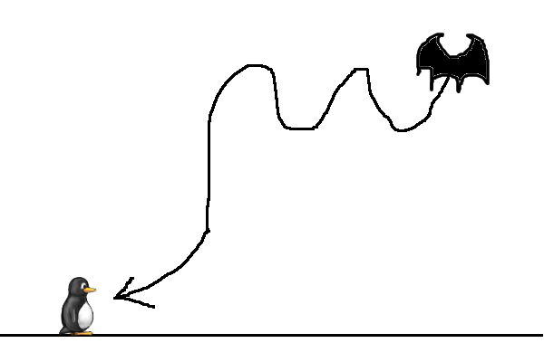
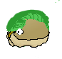
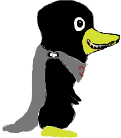

See \[:Category:ProposedBadguy\](:Category:ProposedBadguy “wikilink”)

- Generic

`   -   [Walking Rock](Walking_Rock `“`wikilink`”`)`

- \[Icyisland\](Icyisland “wikilink”)

`   -   [Surprise Snowball](Surprise_Snowball `“`wikilink`”`)`\
`   -   [Jumping Spiky](Jumping_Spiky `“`wikilink`”`)`

- \[Light Forest\](World\_2 “wikilink”)

`   -   [Ant](Ant `“`wikilink`”`)`\
`   -   [Anteater](Anteater `“`wikilink`”`)`\
`   -   [Bat](Bat `“`wikilink`”`)`\
`   -   [BouncyBall](BouncyBall `“`wikilink`”`)`\
`   -   [Cat](Cat `“`wikilink`”`)`\
`   -   [EvilPenguin](EvilPenguin `“`wikilink`”`)`\
`   -   [Gator](Gator `“`wikilink`”`)`\
`   -   [HeliBall](HeliBall `“`wikilink`”`)`\
`   -   [Igel](Igel `“`wikilink`”`)`\
`   -   [Logger wielding/throwing`\
`       axe](Logger_wielding/throwing_axe `“`wikilink`”`)`\
`   -   [MudBall](MudBall `“`wikilink`”`)`\
`   -   [Primate](Primate `“`wikilink`”`)`\
`   -   [Rabbit](Rabbit `“`wikilink`”`)`\
`   -   [Ray](Ray `“`wikilink`”`)`\
`   -   [Sasquatch](Sasquatch `“`wikilink`”`)`\
`   -   [Snake](Snake `“`wikilink`”`)`\
`   -   [Spider](Spider `“`wikilink`”`)`\
`   -   [Tumbleweed](Tumbleweed `“`wikilink`”`)`\
`   -   [Huey](Huey `“`wikilink`”`)`\
`   -   [Electric eel](Electric_eel `“`wikilink`”`)`

- \[Ghost Forest\](World\_2 “wikilink”)

`   -   [Bjella](Bjella `“`wikilink`”`)`\
`   -   [Doodle](Doodle `“`wikilink`”`)`\
`   -   [Ghost, Type I](Ghost,_Type_I `“`wikilink`”`)`\
`   -   [Ghost, Type II](Ghost,_Type_II `“`wikilink`”`)`\
`   -   [Ghost, Pickpocket](Ghost,_Pickpocket `“`wikilink`”`)`\
`   -   [Ghostly Tree](Ghostly_Tree `“`wikilink`”`)`\
`   -   [Igor](Igor `“`wikilink`”`)`\
`   -   [Living Stump](Living_Stump `“`wikilink`”`)`\
`   -   [Wanderer](Wanderer `“`wikilink`”`) (Implemented as Will-O-Wisp)`\
`   -   [Rat](Rat `“`wikilink`”`)`

- \[Dark Forest Keep\](World\_2 “wikilink”)

`   -   [Dart Trap](Dart_Trap `“`wikilink`”`)`\
`   -   [Mounted Axe](Mounted_Axe `“`wikilink`”`)`\
`   -   [MrAncestor](MrAncestor `“`wikilink`”`)`\
`   -   [Pyro](Pyro `“`wikilink`”`)`\
`   -   [Ember](Ember `“`wikilink`”`)`\
`   -   [DarkWolf](DarkWolf `“`wikilink`”`)`

- \[Beyond Milestone 2\](Beyond\_Milestone\_2 “wikilink”)

`   -   [Tropical Island](Tropical_Island `“`wikilink`”`)`\
`       -   [Hungry Parakeet](Hungry_Parakeet `“`wikilink`”`)`\
`       -   [Mr Palm Tree](Mr_Palm_Tree `“`wikilink`”`)`\
`       -   [Nutty](Nutty `“`wikilink`”`)`\
`       -   [Melon](Melon `“`wikilink`”`)`\
`   -   Desert`\
`       -   [Cactus](Cactus `“`wikilink`”`)`\
`       -   [Dillo](Dillo `“`wikilink`”`)`

Concept art

------------------------------------------------------------------------

- \[Badguys concept art\](Badguys\_concept\_art “wikilink”)

<Category:Design>

Anteater
=======================

Behaviour: walks, runs if ants are in front of it... grows by eating
ants

Look: An Anteater

Hurt Tux: if he is smaller than it. Perhaps the front of anteater (Mr
Anteater?) is harmless, but pushes Tux along, thus pushing him off edges
or into other badguys. The tail of Anteater could swish from side to
side and hurt Tux.

Hurt it: jump or spit

Ant
=======================

Behaviour: Walks or climbs. Runs away from Anteaters

Look: An Ant

Hurt Tux: like Snowball

Hurt it: jump or spit - however jumping may make other ants swarm to
attack Tux

Bat
=======================

Behaviour: zigzag flight, eats Ants - Can zero in on Tux

Look: A Bat

Hurt Tux: like Snowball

Hurt it: jump or spit

Alternative
-----------

Flutters up and down, upon seeing Tux dives and tries to catch him (much
like [Zeekling](Zeekling "wikilink")).

:   is'nt [Zeekling](Zeekling "wikilink") enough???
    --[Disk](User:Disk "wikilink") 18:40, 30 August 2007 (UTC)

Perhaps in Ghost Forest, a Spooky Mr Tree could, when jumped on, release
bats instead of Poison Ivies. They could fly straight up into the air,
then zoom in on Tux. If Tux dodges the could hurt they ground and get
stunned, ay which point Tux could jump on them.

Alternative
-----------

This would work if [Ghostly Tree](Ghostly_Tree "wikilink") was to
release two bats. They could fly up to the top of the screen and then
fly straight down at Tux, who would have to dodge at the last moment. If
he succeeds, the bats would be 'stunned,' at which point they could be
squished. Diagram:  

Bjella
=======================

Copied from [User ideas](User_ideas "wikilink").

Bee. Shoots stingers.

BouncyBall
=======================

Behaviour: jumps back and forth in one place

Look: A bouncy rubber ball that has eyes

Hurt Tux: like Jumpy

Hurt it: like Jumpy

Cactus
=======================

#### Infobox Badguy

-   Image=Cactus.jpg
-   Name=Cactus
-   FoundIn=Nowhere Yet
-   Appearance= A potted cactus with legs and eyes.
-   Behaviour= Walks around back and forth, will shoot spikes up left
    and right when disturbed.
-   Squish=no
-   Buttjump=no
-   Freeze=yes
-   Burnable=somewhat

Behavior
--------

Cat
=======================

Behaviour: Drop from trees or have pouncing movement like wolf
suggestion

Look: A Jaguar or Ocelot

Hurt Tux: like Bouncy Snowball or Icicle

Hurt it: spit

### Proposed Variant

1.  When the Cat walks forward on the ground and is less than 3 tiles
    from a wall or less than 6 tiles from Tux, she will jump forward and
    fly through the air curled up as a ball.
    1.  When she hits Tux, he will get hurt.
    2.  When she hits a wall, she will start walking up the wall.
        1.  she reaches a convex edge while climbing, she will jump
            upward, advancing some px on the apex and landing feet down
            on the edge.
        2.  she approaches a concave edge while climbing, she will stop
            and wait for Tux to get behind her.
            1.  When Tux is less than 3 tiles behind her, the Cat will
                drop and hopefully land on Tux.

DarkWolf
=======================

### Behaviour

-   **Normal Behaviour**: walks slowly
-   **Chasing behaviour**: when it spots Tux it goes mad and starts
    chasing Tux faster
    -   **When Tux is on range**: makes a very fast jump towards Tux, at
        a height lower enought to hit BigTux's head but allowing him to
        dodge it ducking. After the jump, the DarkWolf keep running a
        bit (if it doesn't collide with a wall) and turn around resuming
        the hunting for Tux.

(While DarkWolf is on chasing mode his jump is also a defense against
Tux's jumps, since it would make him jump and dodge it)

If Tux has got out from DarkWolf spot it will stop chasing him after an
amount of time and resume Normal Behaviour

### Look

A black wolf

### Hurt Tux

On contact

### Hurt it

-   stomping it (while it is not in a jump)
-   with fireballs

Dillo
=======================

Proposals
---------

### Proposal 1

#### Behaviour

-   like [MrIceBlock](MrIceBlock "wikilink")
    -   Unrolled, Walking or Rolled Up
    -   rolling fast when jumped on
-   Might also jump into the air if big tux is nearby

#### Appearance

-   An Armadillo

#### Attack

-   like Iceblock

#### Vulnerabilities

-   like Iceblock

### Proposal 2

#### Behaviour

-   Walks around at normal speed
-   If it sees \[Tux\] it rolls up into a ball and tries to roll into
    Tux
    -   To 'see' Tux it must be facing the towards Tux and be a certain
        distance away
-   When it is jumped on it turns into a curled up ball and is
    temporarily disabled like \[MrIceBlock\]
    -   Can be kicked or picked up like MrIceBlock

#### Appearance

-   Armadillo

#### Attack

-   Rolls up into a ball and “charges” towards Tux

#### Vulnerabilities

-   Squish
-   Fire, ice, lightning

Misc
----

From Wikipedia:

-   The armadillo is a prolific digger, and uses its sharp claws to
    burrow both to feed on grubs and to dig dens.
-   Its main defense is its armor-like outer skin. When threatened by a
    predator, the armadillo will roll up into a ball.

Doodle
=======================

Looks like a rough, **pencil-drawn** sketch of a Badguy (like step 1 in
pingus.seul.org/\~grumbel/gimp/drawing/drawing2.jpg).

Can **transform** into several other Badguys by having parts of him
erased, then redrawn.

Possible transformations could be:

-   Snowball &lt;-&gt; Spiky
-   Spiky &lt;-&gt; Jumpy
-   Snowball &lt;-&gt; Bouncing\_Snowball

Maybe she could be part of a **bonus level** that features **doodle
tiles**?

Electric\_eel
=======================

Template:Badguy name=Electric eel|image=Electric\_eel|worlds=World
2|appearance=Looks like a normal electric eel.|behaviour=Swims on the
spot in water. Sometimes he electrifies the water and hurt
Tux.|squish=yes|butt-jump=yes|freeze=yes|ignite=yes, killed

Ember
=======================

-   small Flame with eyes
-   rises while slowly swinging left and right
-   vanishes on collision
-   created by Dispensers

Might use a variation of the “Flamy” image: 

EvilPenguin
=======================

The Evil Penguin should look similar to Tux, it will probally have
another color and another shaped bill. Ranges of attack might be
something simple such as spitting balls or eggs at Tux. There might even
be multiple levels of evil penguins with different behaviours (fire,
ice).

A few more behaviours (i.e. as if they were jungle tribesmen):
Spearthrow, Blowgun, Boomerang, Net, etc.

Maybe they're friendly penguins enslaved by Nolok and Tux could free
them?

Gator
=======================

I think there should be floating logs in the Forest world, which move
around when Tux jumps on them.

Some might actually be Gator-like creatures and get Tux.

Behaviour: lays like a log until Tux jumps on it, then gets him.

Look: An Alligator

Hurt Tux: Tries to eat him when jumped on

Hurt it: use Spitting, will try to get Tux when attacked

:   i'll support this one --[Disk](User:Disk "wikilink") 18:38, 30
    August 2007 (UTC)

Ghostly\_Tree
=======================

**Ghostly Tree** is Mr Tree's counterpart in Ghost Forest. Looks and
behaves like MrTree, but it has a darker look (black/burnt wood, no
leaves, red glowing eyes...) and has two ghostly lights instead of
leafs. When jumped, he turns into a stump and releases two ghosts
instead of two Ivies.

Possible look (note this is only a sketch):\

Possibly Ghostly Tree could have to thin branches on either side of him
(the same goes for the normal Mr Tree) which Tux can stand on. A concept
sketch: 

When jumped on, Ghostly (or Spooky) could release two
[bats](bat "wikilink").

Ghost,\_Pickpocket
=======================

This ghost will try to **steal** up to one powerup or coin from Tux. If
it succeeds its formerly visibly **hollow belly** will contain the
stolen item and it will switch from chasing Tux to evading Tux. After
some seconds it will have **digested** the stolen item and come back to
steal a new one.

Ghost,\_Type\_II
=======================

Behaviour: fades in from the background and launches at Tux, then
vanishes again

Look: Similar, but not equal to, Ghost Type I

Hurt Tux: by contact

Hurt it: Butt-Jump

Ghost,\_Type\_I
=======================

Behaviour: simply flies around, or follows Tux

Look: A small ghost face

Hurt Tux: Hurt by contact

Hurt it: Butt-Jump

HeliBall
=======================

Behaviour: like a moving platform, but Tux can slide off easier than on
a normal platform because of the ball shape

Look: A Rubber Ball that has eyes with a propeller underneath

Hurt Tux: if he gets into the prop

Hurt it: spit

Huey
=======================

This badguy floats in the air. It will try to pickup the nearest walking
badguy, then drop it on Tux.

:   who're you kidding???? --[Disk](User:Disk "wikilink") 18:42, 30
    August 2007 (UTC)

Hungry\_Parakeet
=======================

**Option One:**

**Name:** Hungry Parakeet

**Found in:** Tropical Island

**Appearance:** A parrot

**Behaviour:** Like [Zeekling](Zeekling "wikilink").

**Squishable:** Yes

**“Butt-Jumpable:”** Yes

**Freezable:** Yes

**Burnable:** Yes, killed

Igor
=======================

Slower, ghostly version of the [Igel](Igel "wikilink") Badguy.Walks
straight through walls, but still turns around at ledges.

Jumping\_Spiky
=======================

The jumping spiky is/will be another variation on the
[Spiky](Spiky "wikilink") [badguy](badguy "wikilink"). As usual, it
looks like an innocuous spiky until the player gets near it, at which
point it spontaneously hops into the air, hopefully nailing the player.

Living\_Stump
=======================

Looks (and behaves!) like a **regular tree stump**, completely ignoring
its surroundings. When it wakes up (bumped against, player nearing?)
this monster **grows eyes and a mouth** and starts walking around

Logger\_wielding%2Fthrowing\_axe
=======================

Logger: Lumberjack could either be simply wielding an axe to cut poor
tux in two and/or could be throwing axes after third “swish” of axe
which Tux has to jump to prevent being hit by onslaught.

Mounted\_Axe
=======================

Behaviour: An axe that frequently swings out from a horizontal or
vertical slot in the wall when Tux comes near it - swings left to right
when horizontal, top to bottom when vertical.

Look: A blackish slot mounted to the wall, flying sparks when axe shoots
out

Hurt Tux: contact with axe

Hurt it: invincible

MrAncestor
=======================

(or Mrs Ancestor)

Behaviour: a painted figure trying to hurt Tux from out of his frame
when he gets close, either by reaching out/grabbing him or by screaming
at him

Look: Image in gold frame mounted to the wall. Pale, ghostly, medieval
looking characters, either male (knight in armour) or female
(long-haired woman in dress). (Of course they shouldn't look human, but
similar to either Nolok or the boss of world 2.) Male images reach out
for Tux when he comes near, females scream at him as soon as he walked
past the image (draw sound waves). Use Ancestor in a row of harmless
paintings that look almost the same (a little less ghostly).

Hurt Tux: contact with knight's arm, or lady's sound waves

Hurt it: invincible; alternatively it can be turned into a normal
picture somehow

Mr.\_Palm\_Tree
=======================

#### Infobox Badguy

-   Image=Coloredmrpalmtree.png
-   Name=Mr. Palm Tree
-   FoundIn=Nowhere Yet
-   Appearance= A tottering palm tree with many pairs of eyes.
-   Behaviour= Walks around. Stays on platforms and turns if any segment
    touches a block. Found in Tropical Islands.
-   Squish=yes (But only bottom segment is squished. Next segment then
    grows legs.)
-   Buttjump=no
-   Freeze=yes
-   Burnable=no

**Mr. Palm Tree** is a proposed badguy in the [Tropical
Island](Tropical_Island "wikilink"). He is made of three to five
segments. If Tux lands on the top segment, the bottom segment is
squished. Through repeated squishes, Tux can kill Mr. Palm Tree.

Mr. Palm Tree could spawn [Nutty](Nutty "wikilink") badguys, but that
might be a job for a different badguy...Mr. Coconut Tree?

:   <small>(Palm trees are the kind of trees that make coconuts.) -
    UltraPenguin</small>

    :   <small>Perhaps Palmy acts as a kind of dispenser with a limited
        stock of, say, three coconuts. [TUX/√UT](User:Tuxnut "wikilink")
        ([plz talk 2 me internets](User_talk:Tuxnut "wikilink") \* [view
        horrendous deeds](Special:Contributions/Tuxnut "wikilink"))
        16:39, 25 June 2010 (UTC)

Idea: how about when he gets hit by a sliding bad guy, he drops 2 or 3
nuttys. [Monstertux](user:Monster "wikilink")</small>

MudBall
=======================

Behavior: A basic enemy (such as [Snowball](Snowball "wikilink")) that
just walks into [Tux](Tux "wikilink")'s direction. The AI would not be
very intelligent; for example he would not jump/halt on holes.

Look: A ball of mud that has black eyes.

Hurt Tux: Walking into Tux.

Hurt it: Jumping on it or using Mr IceBlock to kill it.

Nutty
=======================

#### Infobox Badguy

-   Name=Nutty
-   Image=NewNutty.png
-   FoundIn=[Tropical Island](Tropical_Island "wikilink")
-   Appearance=A coconut with a palm leaf for hair, eyes and feet.
-   Behaviour=Walks around. Walks off all edges.
-   Squish=no
-   Buttjump=no
-   Freeze=yes
-   Burnable=yes

**Nutty** is a proposed and currently *unimplemented*
[badguy](badguy "wikilink"). He could take the place of [Mr.
IceBlock](MrIceBlock "wikilink") and [Slow Snail](Snail "wikilink") in
certain areas. When being jumped upon, he becomes a coconut with no eyes
or feet. He can then be kicked or carried.

He could also be a completely invincible walking badguy that can't harm
Tux. He simply acts as a blockade or even a platform for Tux to hitch a
ride.

Suggestion: Maybe this thing should be called Mr. Coco?

:   Mr. Coco is okay, but the Mr. prefix is overused. What about just
    Coco? [TUX/√UT](User:Tuxnut "wikilink") ([plz talk 2 me
    internets](User_talk:Tuxnut "wikilink") | [view horrendous
    deeds](Special:Contributions/Tuxnut "wikilink")) 21:47, 21 June 2010
    (UTC)

How about Mr. Coconut? [Monstertux](User:Monster "wikilink")

Falling/Flying Nutty Image
--------------------------

Primate
=======================

Behaviour: swings in trees and on vines.

Look: A Monkey

Hurt Tux: knocks Tux off of vines and branches, steals powerups

Hurt it: spit

Pyro
=======================

An **inflamed** version of maybe some other badguy. Just walks around,
trying to burn Tux by touching him.

Tricky if combined with other enemies: If (accidentally) hit by
[FireTux](FireTux "wikilink"), Pyro will simply swallow the shots, then
return fire directly at the player.

Pyro can easily be dealt with by [IceTux](IceTux "wikilink"): One shot
turns Pyro back into the original badguy, ready to be jumped on.

Illustration is on www.deltadevelopment.de/users/christoph/supertux/

Variation 1
-----------

Initially, Pyro is not on fire. Soon as he falls into lava he will start
burning, then jump back out and walk around as living torch. He will
also ignite or re-ignite other Pyros by touching them.

Choosing an unassuming badguy as non-inflamed version of Pyro could add
an element of surprise.

To make killing Pyro even more difficult: When shot at by IceTux he will
jump some 128px backwards and thus (hopefully) back into the lava, ready
to emerge again on fire.

Variation 2
-----------

Not only will falling into lava ignite or re-ignite Pyro, but also being
touched by the “[Flame](Flame "wikilink")” badguy or being hit by
[FireTux](FireTux "wikilink").

Variation 3
-----------

Pyro could start off as Mr Match or similar, which basically behaves as
a Snowball or Ivy:  Then, once touched by a
flame, Firepower, lava or another Pyro, he could become a walking flame:
 When Mr Match he could be squishable and
butt-jumpable, and when set fire to to become Pyro he could be only
killed freezing. (Maybe not even killed by invinsible power.)

:   Great! do it! --[Disk](User:Disk "wikilink") 18:48, 30 August 2007
    (UTC)

Rabbit
=======================

Behavior: Rabbits bounce around hopping over small holes and barriers.
They

:   

    :   change direction for big barriers and fall into big holes
        (UNLESS stay on
    :   platform flag is on). They occasionally/often spawn new small
        bunnies who only
    :   jump over really small holes and barriers and eventually turn
        into big rabbits
    :   who spawn \*more\* little bunnies which turn into rabbits. Small
        bunnies can
    :   coexist with rabbits. Rabbits will duck to let other rabbits
        jump over them.
    :   Eventually however, the spawning stops when things get
        unreasonable.

Appearance: Bunnies are small forms of rabbits, the rest is undefined.

Hurt it: Bounce on it, spit, invincibility.

Hurt Tux: Other contact.

Rat
=======================

Behaveior: Would move like ant/snowball and when it nears tux it would
attack (move forward and bite at) Tux.

Appearance: A large rat

Hurt it: jump on it, spit, invincibillity.

Hurt Tux: Biting Tux

Ray
=======================

Behaviour: lays at bottom of water

Look: A Stingray

Hurt Tux: when stepped on (like Spiky)

Hurt it: use Spitting, will try to get away

Snake
=======================

These would drop from treebranches, etc. and hug Tux.

Behaviour: Slithers thru trees or in water. Drops from treebranches.

Look: A Python

Hurt Tux: like Icicle

Hurt it: spit

Surprise\_Snowball
=======================

Looks like the regular Snowball badguy. Whips out his helmet to become
Spiky when the player comes closer.

Tumbleweed
=======================

Behaviour: like Bouncy Snowball

Look: A brown ball-shaped plant that has eyes

Hurt Tux: like Bouncy Snowball

Hurt it: like Bouncy Snowball

Vampire\_penguin
=======================

 What about a “vampire penguin”? This
one is just a sketch!

Walking\_Rock
=======================

**Walking Rock** is a big rock, unharmed by spikes, fireballs, enemies
and such, usable by Tux as a platform.

Some features might be:

-   invincibility
-   can be frozen/unfrozen
-   hurts Tux and kills enemies on lateral contact and when falling on
    them (might kill Big Tux directly). (This is because Walking Rock is
    big, heavy and able to crush smaller creatures)
-   carries Tux/enemies on its head
-   falls down from cliffs like Snowballs
-   walks over lava

:   the walking rock could push Tux if he gets in his way and kill him
    if squished by a wall. That would be interesting.

Example (used [Grumbel's sketch for
Granito](Badguys_concept_art "wikilink")):

