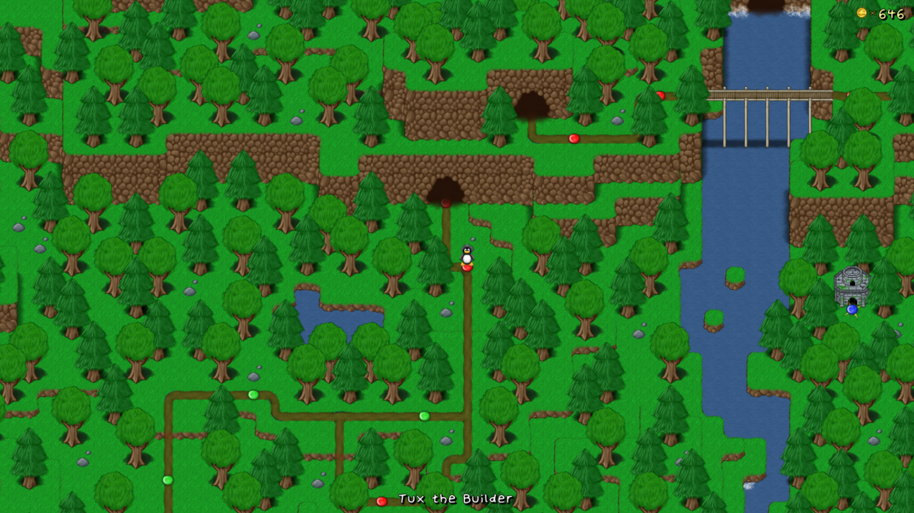

**Rooted Forest** is the second world in SuperTux. It is generally a lively place with many creatures roaming about. Parts of the forest however, are corrupted.
This world is currently still under development but can already be accessed in story mode, and has been in the game for a while now. This world was included in the unstable *SuperTux 0.3*.

It is currently one of the teams priorities for a future release.

---

### Levels

Rooted Forest is still under development and therefore it is not reasonable to state which levels exist. Many will be removed or changed.

### Badguys

Badguys for Rooted Forest can be found at the [Badguys](https://github.com/SuperTux/supertux/wiki/Badguys-Forest) page.

### End Boss

Currently, the end boss of Rooded Forest is the [Ghost Tree](https://github.com/SuperTux/supertux/wiki/Bosses#Ghost-Tree)

---

See also
--------

-   [Icy Island](https://github.com/SuperTux/supertux/wiki/Icy-Island)
-   [Worlds](https://github.com/SuperTux/supertux/wiki/Worlds)

<Category:World>
