We provide an archive of screenshots of previous and current versions here.

### Snapshot 0.3.5

### Snapshot 0.3.3
Released on 2010-03-01, this snapshot includes a main world and 3 bonus islands: Bonus Island 1&2 and Forest World. It is also possible to install additional levels, level sets or even worlds by clicking on "Add-Ons" in the main menu.

### Snapshot 0.3.0
Released on 2006-12-17, this is was preview of what is to become Milestone 2. Many new features were implemented, e.g. levels that scroll in all directions, levels with multiple sectors, moving platforms, a shortened ice world, and a whole new forest world.

### Release 0.1.2
This was a release for the big SuperTux fans. We were asked to make more levels, and to make them more challenging. Our answer was this: a version which had a brand new Bonus Island map, new map features, a new enemy, and some new tiles.

### Release 0.1.1
This version featured the built-in editor that was removed from the previous release (0.1.0), new hand-written fonts, and a few bug fixes.

### Milestone 1 (aka 0.1.0)
Milestone 1 was in huge parts the result of the GotM event on happypenguin.org: it contained completely new graphics, lots of new levels, a story and a worldmap.

### Flexlay
Flexlay is the editor that was used to build most of the levels and the Worldmap in Milestone 1. It provided a few more features than the built in one (zoom, minimap, worldmap support), but requires a few more dependencies including OpenGL.

### Release 0.0.6
Released on 2004-03-15, this was a code clean-up version. It featured a level editor and an OpenGL front-end. The menu was improved, and fonts were also remade.

### Release 0.0.5
Released on 2003-12-29. The graphics were improved. This version features a menu and internal clean-ups had started.

### Releases prior to 0.0.5

Welcome to our SuperTux screenshot album!

Supertux 0.4.0
--------------

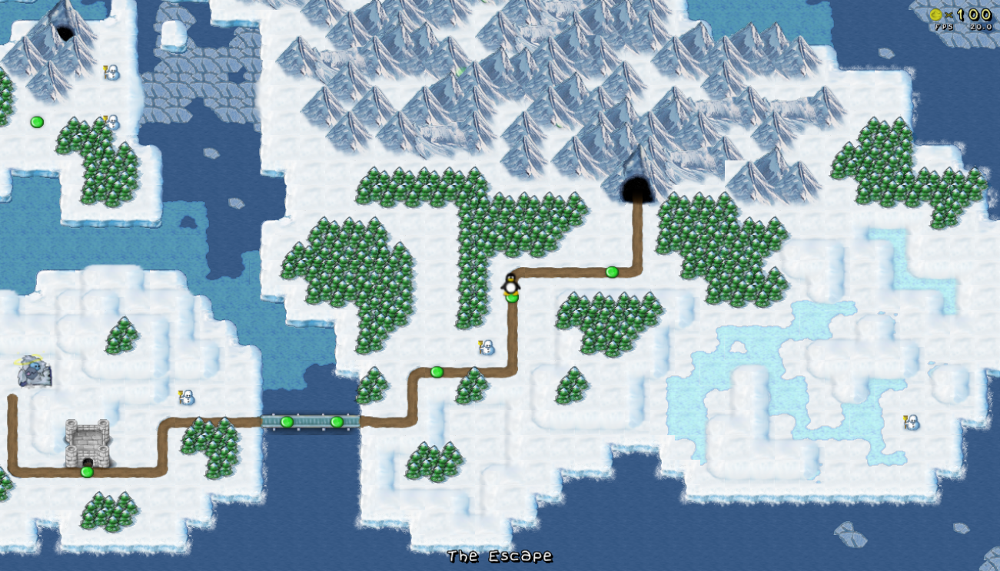

SuperTux 0.3.3
--------------

Released on 2010-03-01, it includes a main world and 3 bonus islands: Bonus Island 1&2 and Forest World but you can also add other levels (click on “Add-Ons” in the beginning).

  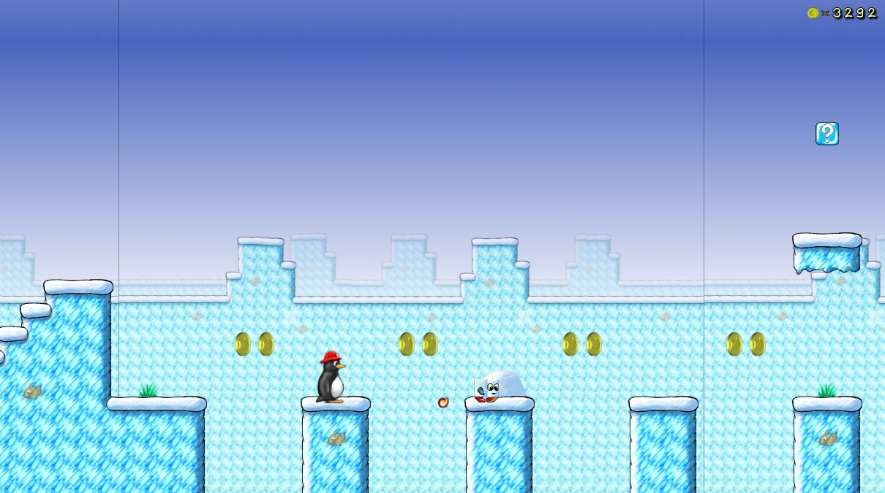

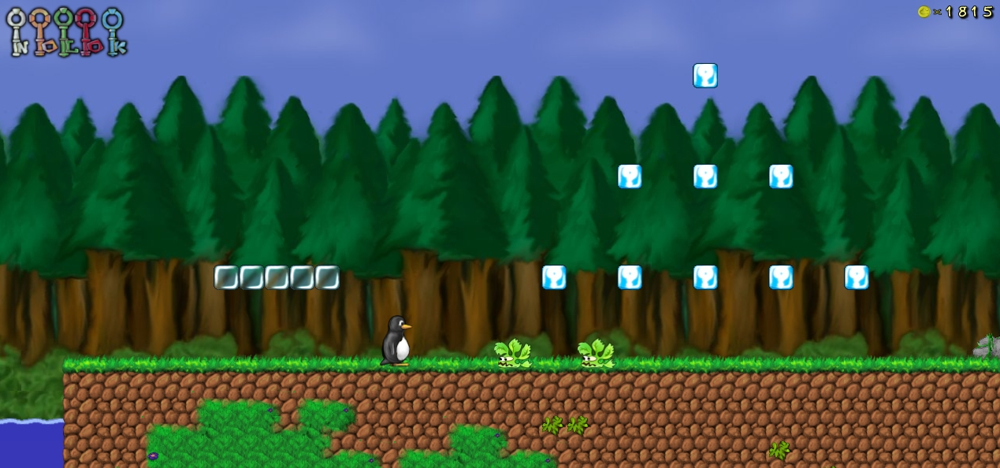 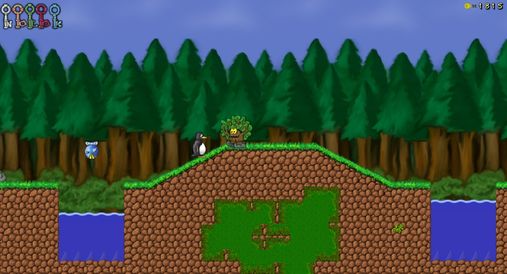 

SuperTux 0.3.0
--------------

Released on 2006-12-17, this is was preview of what is to become Milestone 2. Many new features were implemented, e.g. levels that scroll in all directions, levels with multiple sectors, moving platforms, a shortened ice world, and a whole new forest world.

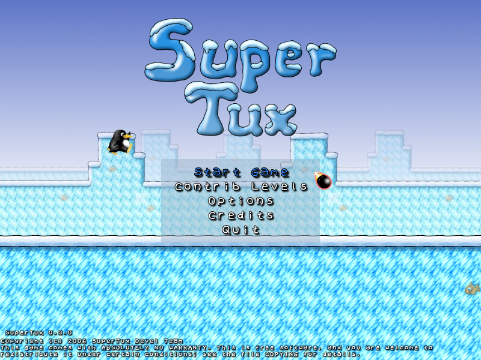  
  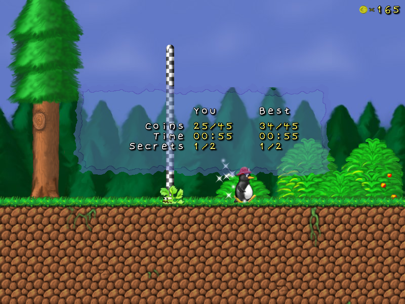

SuperTux 0.1.2
--------------

This was a release for the big SuperTux fans. We were asked to make more levels, and to make them more challenging. This was our answer. This version had a brand new Bonus Island map, new map features, a new enemy, and some new tiles.

SuperTux 0.1.1
--------------

This version featured the built-in editor that was removed from the previous release (0.1.0), new hand-written fonts, and a few bug fixes.

  

SuperTux Milestone1 aka 0.1.0
-----------------------------

Milestone1 was in huge parts the result of the GotM event on [happypenguin.org](http://happypenguin.org), it contained completely new graphics, lots of new levels, a story and a worldmap.

 
 

### Flexlay

Flexlay is the editor that was used to build most of the levels and the Worldmap in Milestone1. It provided a few more features than the built in one (zoom, minimap, worldmap support), but requires a few more dependencies including OpenGL.

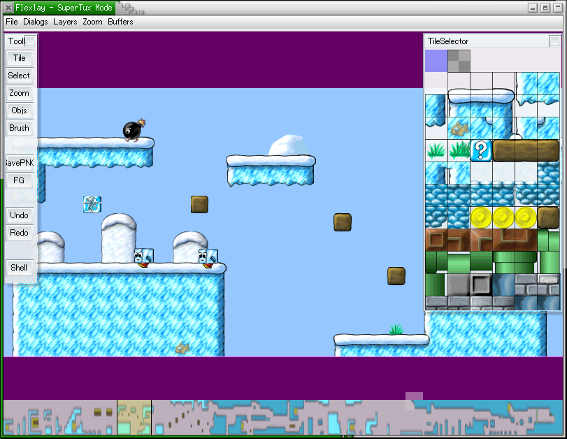 

SuperTux 0.0.6
--------------

Released on 2004-03-15, this was a code clean-up version. It featured a level editor and an OpenGL front-end. The menu was improved, and fonts were also remade.

  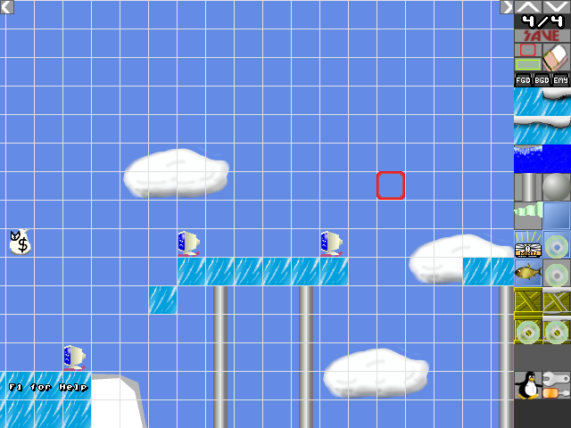

SuperTux 0.0.5
--------------

Released on 2003-12-29. The graphics were improved. This version features a menu and internal clean-ups had started.

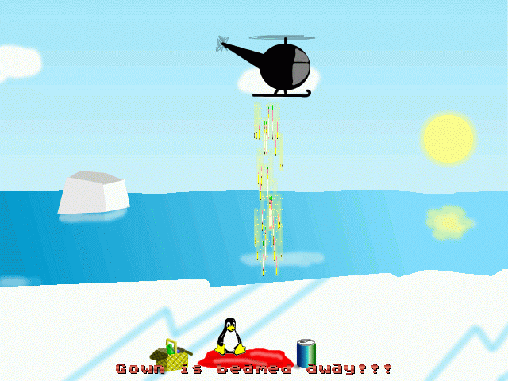 

SuperTux Prior to 0.0.5
-----------------------

The graphics were a bit ugly, but it was already playable and had a Super Mario 1 feel.

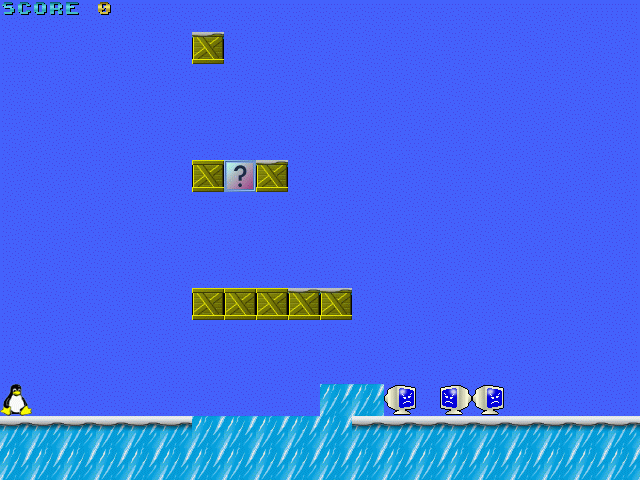  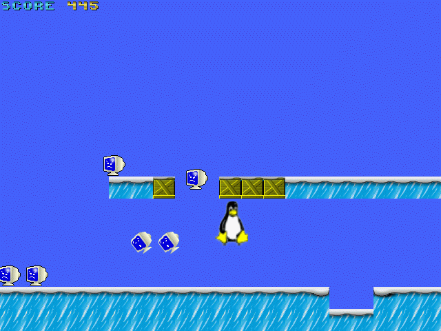
