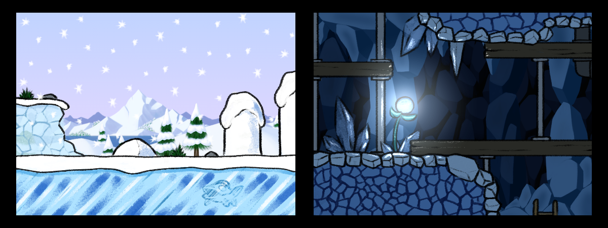
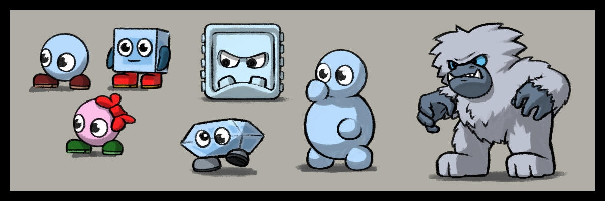
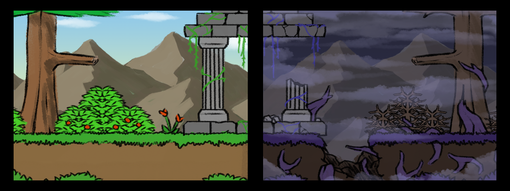
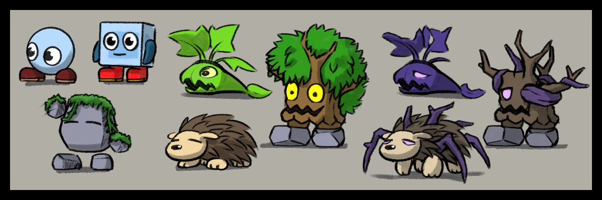

This page aims to lay down the goals for story mode for the upcoming v0.7 release and future SuperTux versions.

# Contents
1. [Cutscenes](#cutscenes)
2. [Difficulty](#level-difficulty)
3. [Progression](#level-progression)
4. Art Direction
   - [Icy Island](#icy-island)
   - [Rooted Forest](#rooted-forest--corrupted-forest)
   - [Tropical Paradise](#tropical-paradise)
   - [Mountain Peak](#noloks-mountain-peak)
5. [Story Summary (v0.7)](#story-summary-for-v07)
6. [Future Story Draft (post-v0.7)](#story-summary-for-v07)

---

## Cutscenes

**Part I: Improve current cutscene quality**

- Make sure all cutscene scripts are stored in their own separate `.nut` files.
- Add comments for things, which are to be changed, or subject to being updated once certain contents are added that are missing for the time being.
- Replace the `Player` object with a `ScriptedObject` to allow for using animations not related to gameplay.

**Part II: Add missing cutscenes**

- A cutscene after the Yeti fight leading to the crystal mine level.
- A cutscene after the Ghost Tree fight leading to Rooted Forest's new outro level.

---

## Level Difficulty

- Drastically improve the overall difficulty curve to prevent drastic changes in difficulty across levels. The first levels shall start off easy,
  increasing slowly in difficulty with the last few levels and castle level being one of the hardest of a world.
- When arriving at a subsequent world, the difficulty scales back down again, roughly around the mid-way point of the previous world's difficulty.
- Ensure levels are kept at a consistent length based on their position in the worldmap progression and story significance
  (see [Level-Design](https://github.com/SuperTux/supertux/wiki/Level-Design#size) for more details).

## Level Progression

- Teach mechanics in bite-sized chunks:
  - First level introduces base mechanics only, nothing too complex.
  - Second level is a first test of said mechanics.
  - Third level solely introduces swimming alone since it will be a more common and important mechanic further on in story mode.
  - Fourth level introduces more "advanced" mechanics (i.e. switches, ladders, sliding).
  - and so on...

- Introduce powerups one at a time, spread out through story mode - in levels that require their abilities to be used so players get a basic grasp over what they offer:
  - Introduce Fire Flower in the first level along the other basic elements.
  - Introduce Air Flower in the first airborne level of the 1st world.
  - Introduce Earth Flower early in world 2 followed by the Ice Flower a couple level in (mid-way point at the latest).

---

## Art Direction

It is very important to distinguish each world of Story Mode to ensure they don't feel the same and offer a fresh visual experience!

### Icy Island

**Environmental Design**

Icy Island shall evoke a friendly and familiar presence in its environment and character design. Like a Winter Wonderland if you will.
Tux knows this place best and mostly nothing shall be of big shock or surprise. The Crystal Mine is the only place that has a slight feel
of mysticism attached to its design as it is a hidden mining facility of Nolok that Tux had never heard of prior to his win over the Yeti.

**Creature Design**

It is Tux's home island and thus all creatures he encounters here should not seem all too threatening. Simple shapes, friendly faces, an
overall cutesy look. An exception to this is the Yeti with his more more animalistic look, being a brutish beast on the hunt for Tux.

### Rooted Forest + Corrupted Forest

**Environmental Design**

Rooted Forest, compared to the previous world, is an unfamiliar, strange, but also mysterious and magical place. It is much more vibrant
and varied in color. Tux is now in a brand new world far from his home that has its own rules and ecosystem.

The Corrupted Forest segment shall invoke a feeling of uneasiness, confusion and even loneliness. The forest has lost its vibrant colors.
Everything is gritty, desolate, cold, covered in a net of purple, almost organic looking roots everywhere you look.

**Creature Design**

Its creatures are designed to lean more into a more vicious and complex look. Some even resemble real animals, like Igel, Owl and Mole.
The idea is to show how outlandish this whole new world feels to Tux. The design of Granito goes back to the design approach of Icy Island
to immediately invoke a feeling of familiarity, indicating their friendly presence.

Their corrupted counterparts have their designs twisted into lifeless husks, lacking all personality, having become uniform through their
shared misery. Even the friendly-looking Granito, Tux encountered before, have now been turned into mindless creatures.

### Tropical Paradise

**Environmental Design**

As a direct opposite to Icy Island's calm and cold feel, Tropical Paradise will be a hot and aggressive place. The further Tux progresses,
the more dangerous the environment becomes, starting with a nice open beach setting, transitioning into a more covered jungle-beach hybrid
into the deep dark thicket that is the main jungle area in the paradise's center, littered with temple structures and totems.

**Creature Design**

This place will have the most bizarre creature design out of all the worlds. Much more detailed, animalistic and violent. Toucan will
ironically be the most "friendly" and "harmless" looking creature of this world, further showcasing his status of being a push-over than
an actual threat to Tux and his quest, unlike the Master Totem.

### Nolok's Mountain Peak

**Environmental Design**

The Mountain Peak's art direction will take a spin on Icy Island's art direction. Back to more simple and familiar designs, but devoid
of all the "charm" and cuteness of the original. The beautiful snowy landscapes will be nothing but a desolate snowy mountain peak, surrounded
by nothing but an endless sea of clouds.

**Creature Design**

All creatures encountered here will be mechanical with barely any facial expression. Many of them are actually a re-implementation of older
designs, like the original black Mr. Bomb and Jumpy designs from during the Milestone 1 development era (represented through Rusty Bomb + Hellbent
and Metaljumpy), as well as the scrapped Mr. Rocket design from during the early Milestone 2 development era.

---

## Story Summary (for v0.7)

**Icy Island:**
  - Nolok captures Penny during a picnic, using purple roots to knock out Tux instantly.
  - Nolok leaves behind a note leading him to a castle across the island.
  - Tux spends an entire day, starting mid-day, making his way to said castle and reaches the icy cave around night time.
  - By the time he reached the exit of the cave the sun begins to rise.
  - At this point, the Yeti makes his first appearance, keeping a close eye on Tux (Tux is unaware of the Yeti's presence).
  - After reaching and traversing the castle, the Yeti reveals himself to Tux, initiating the fight after Tux flees from him to an outside area.
  - When beat, the Yeti accidentally informs Tux on the crystal mines and a boat to use to sail up north.
  - The sun sets when Tux arrives at the crystal mines. He starts sailing up north, during the night.

**Rooted Forest:**
  - Tux arrives at sunrise.
  - First half of Rooted Forest is Tux exploring the new land, looking for clues on where the next castle is located´.
  - Tux passes friendly Granito species along the way.
  - When on a higher section of the forest, Tux takes notice of a big tower towards the far east.
  - During a heavy thunderstorm Tux seeks shelter in a dark cave, stumbling into another outpost.
  - When Tux left the cave the next day dawned and Tux decided to take a small nap.
  - An ill Vicious Ivy peaks Tux's curiosity, followed by a bunch of purple roots bursting out of the ground everywhere around him.
  - Tux makes his way towards the tower while avoiding the roots as they over take the forest.
  - When entering the castle and reaching the very top, the roots attempt to fully destroy the tower and bury Tux.
  - Tux escapes barely but runs into the Ghost Tree, initiating the fight.
  - When beat, the Ghost Tree gets destroyed and the land slowly begins to heal.
  - Surviving Granito thank Tux and wish to help Tux on his journey, leading him to the tropical island Nolok had headed.

---

## Future Story Draft (post-v0.7)

This section is an early and still unfinished draft of the continuation of story mode past Rooted Forest.
Note that all you see here is is nothing but an idea of what is to come story-wise and may differ from whatever the final execution may be!

**Tropical Paradise:**
  - Tux arrives at night at a small beach isle.
  - Tux must swim from there to the main island.
  - More and more Totems appear on the island, the closer and closer Tux gets to the island's temple.
  - Toucan is found inside their throne room, admiring himself on a painting.
  - Toucan is infuriated by Tux's sudden appearance, leading him outside, initiating the fight.
  - When beat, Toucan flees the scene with Tux following suit, in hopes to finally find out about Nolok and Penny's whereabouts.
  - Tux follows Toucan to a hidden fort with a teleporter.
  - Nolok is on his way to activate the teleporter.
  - Upon noticing Tux, Nolok pushes Penny into the teleporter as he summons purple roots to block Tux's path, using the teleporter himself soon after.
  - Tux fights himself through the fort, until he manages to reach and use the teleporter to follow suit.

**Nolok's Mountain Peak:**
  - Tux finds himself on top of a huge mountain.
  - There is a massive fortress in the center of the mountain's peak.
  - The entrance door is locked by five colored keys.

> If Tux does not have all five NOLOK-keys collected:

  - Nolok tells Tux to bring all the five hidden keys spread throughout Icy Island, Rooted Forest and Tropical Paradise.

> If Tux does have all five NOLOK-keys collected:

  - The door is unlocked.
  - Tux navigates through Nolok's fortress, until he finally reaches his throne room.
  - Nolok baits Tux by having Penny right next to himself in a cage.
  - Nolok uses purple roots one more time to bring both him and Tux on the very top of his fortress, initiating the fight.
