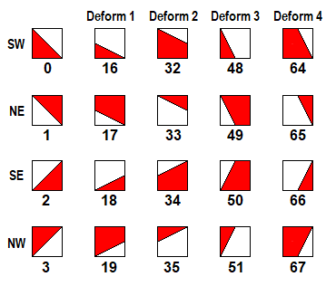

SuperTux tilemaps are composed from tiles, little 32x32 pixel wide images. These tiles are defined
in an [S-Expression](https://en.wikipedia.org/wiki/S-expression) based file, located under `data/images/tiles.strf`.

These tilesets are included into the level by a `tiles` and `tilegroup` entry.

# Contents

1. [Introduction](#introduction)
2. [Tile Attributes](#tile-attributes)
3. [Tile Datas](#tile-datas)
   * [Slope Types](#slope-types)
4. [Adding Your Own Tiles](#adding-your-own-tiles)
   * [Initial Preparations](#step-1-initial-preparations)
   * [Adding Tiles](#step-2-adding-tiles)
   * [Adding Tilegroups](#step-3-adding-tilegroups)

Introduction
============

A general `tile` contains an ID number, an images path and an attribute to determine its use
(e.g. a tile being solid, a slope, slippery etc).

A `tilegroup` describes the collection of several tiles usually sorted by themes. For example,
all snow-themed tiles are sorted into a `snow` tilegroup while all forest-themed tiles are sorted
into a `forest` tilegroup.

Examples
--------

An example of a simple solid tile looks like this:

```
(tiles
  (id 1)
  (attributes 1)
  (images "tiles/[tilegroup]/[tile].png")
)
```

The `attribute` defines the tile's properties. In this example we set it to 1 which makes this
tile solid so Tux can stand on it.

More on tile attributes can be read [here](#tile-attributes).

---

For an animated tile you can define its animation speed with an `FPS` value:

```
(tiles
  (id 2)
  (fps 12)
  (attributes 512)
  (images "tiles/[tilegroup]/[animatedtile]-0.png"
          "tiles/[tilegroup]/[animatedtile]-1.png"
          "tiles/[tilegroup]/[animatedtile]-2.png"
          "tiles/[tilegroup]/[animatedtile]-3.png")
)
```

---

It is also possible to extract parts of bigger images to create tiles:

```
(tiles
  (width 3)
  (height 2)
  (ids
    3 4 5 6
    7 8 9 0)
  (attributes
    0 0 0 0
    1 1 1 0)
  (image "tiles/[tilegroup]/[multipletiles].png")
)
```

---

In the following example, a basic set of tiles will be extracted from the image `tileset_example.png`.
The left tiles are solid ground with the rest of the tiles becoming various types of slopes.

To ignore a portion of an image (e.g. empty spaces), an ID of 0 is always being used in the appropriate places.


To define a tile as a slope, its `attribute` must be set to either 16 or 17. You will also have to set an appropriate `data`
value to define the correct slope-type.

More on tile datas can be read [here](#tile-datas).

```
(tiles
  (width 11)
  (height 4)
  (ids
    10 11 12 19 20 21 22 27 28 31 35
    13 14 15 23 24 25 26 29 30 32 36
    16 17 18 0  0  0  0  0  0  33 37
    0  0  0  0  0  0  0  0  0  34 38)
  (attributes
    1 1 1 17 17 17 17 17 17 17 17
    1 1 1 17 17 17 17 17 17 17 17
    1 1 1 0  0  0  0  0  0  17 17
    0 0 0 0  0  0  0  0  0  17 17)
  (datas
    0 0 0 18 34 32 16 2 0 66 48
    0 0 0 33 17 19 35 1 3 50 64
    0 0 0 0  0  0  0  0 0 49 67
    0 0 0 0  0  0  0  0 0 65 51)
  (image "tiles/[tilegroup]/tileset_example.png")
)
```

Tile Attributes
===============

A tile can have the following attributes:

| Attribute  | Value           | Description                                         | Data section                                                        |
|------------|-----------------|-----------------------------------------------------|---------------------------------------------------------------------|
| solid      | `0x0001` / 1    | Defines if the tile should be considered for collision detection |                                                        |
| unisolid   | `0x0002` / 2    | The tile will only be considered for collision detection when tux is falling down. |                                      |
| brick      | `0x0004` / 4    | The tile acts as a brick that can be destroyed by hitting it from below, with a buttjump etc. |                           |
| goal       | `0x0008` / 8    | The tile finishes a level when touched.             | 0 = Trigger **endsequence**, 1 = Finish level instantly             |
| slope      | `0x0010` / 16 `0x0011` / 17  | The tile is a slope.                   | Type of slope. [See below](#slope-types) for possible values.       |
| unisolid-slope | `0x0013` / 19 | The tile is a unisolid slope.                     | Type of slope. [See below](#slope-types) for possible values.       |
| fullbox    | `0x0020` / 32   | The tile acts as Bonus Block.                       | 1 = Coin, 2 = Fireflower, 3 = Star, 4 = Tux Doll, 5 = Iceflower     |
| coin       | `0x0040` / 64   | The tile acts as a coin.                            |                                                                     |
| ice        | `0x0100` / 256  | The tile is slippery.                               |                                                                     |
| water      | `0x0200` / 512  | The tile is a water tile and is swimmable.          |                                                                     |
| hurts      | `0x0400` / 1024 | The tile hurts the player when touched.             |                                                                     |
| fire       | `0x0800` / 3584 | The tile is a lava tile and is swimmable, but also hurts the player. |                                                    |
| walljump   | `0x1000` / 4096 | The tile is walljump-able.                          |                                                                     |

Tile Datas
==========

Each tile definition can have a `datas` section. This section is used when the yes/no-information
usually stored in the `attributes` definition isn't appropriate for the type of information.
Currently, this section is only used to store slope angles.

Each type of information stored in the data section needs to reserve a range of values for itself.
The slope information, for example, uses the values zero through 67 (64+3), so the mask is at least
`0x007f`. To allow for future extension, the mask `0x00ff` has been reserved.

| Name              | Mask                          | Meaning                                                                                |
|-------------------|-------------------------------|----------------------------------------------------------------------------------------|
| Slope information | `0x00ff` (actually: `0x0073`) | Valid only when the **solid** attribute is set. See [slope types](#slope-types) below. |

Slope Types
-----------




The **deformation** means the following:

| Name    | Value | Meaning                                  |
|---------|-------|------------------------------------------|
| Deform1 | 16    | Only the lower half of the tile is used. |
| Deform2 | 32    | Only the upper half of the tile is used. |
| Deform3 | 48    | Only the left half of the tile is used.  |
| Deform4 | 64    | Only the right half of the tile is used. |

The important part is that the deformation determines which part of the tile is used and
not the actual **form** of the tile. For example, the `0+48` tile is a (steep, south-west)
**triangle**, while `2+48` is a (steep, south-east) **trapezoid**.

---

Adding Your Own Tiles
=====================

You want to contribute new tiles to the main game or just add custom tilesets for your own levels?
This next portion will show how to do so.

You can simply add new tiles with the help of a text editor of your choice. You can now either add
new tiles to the main file `tiles.strf` or create your own should you only seek to use custom tiles.
In that case create a new file and end it with `.strf`!

At first glance a tileset file can look quite intimidating. But worry not. In its core it is not that
bad. The following steps will show you how everything works in a more controlled environment. The SuperTux
tileset file is quite big, which makes it look more complicated than it is.

Step 1: Initial Preparations
----------------------------

To prepare your new file it is important to set it up the right way, so the game can read it properly
*(This step can be skipped if you want to add your tiles to `tiles.strf`)*.

**Before you begin adding your tile entries, your file should look like this:**

```
(supertux-tiles
)
```

Step 2: Adding Tiles
--------------------

Next, you can start adding your tiles one by one. In this example we are adding one tile entry for some
solid tiles and another one for some slopes.

Which tiles you include in one entry is fully up to you. Technically, you could also combine both tile
entries into one big tile entry. But for simplicity and better readability it is advised to make separations!

```
(supertux-tiles
  (tiles
    (width 3)
    (height 3)
    (ids
      1 2 3
      4 5 6
      7 8 9)
    (attributes
      1 1 1
      1 1 1
      1 1 1)
    (image "tiles/[tilegroup]/[tiles1].png")
  )
  (tiles
    (width 4)
    (height 6)
    (ids
      10 11 12 13
      14 15 16 17
      18 19 22 23
      20 21 24 25
      0  0  26 27
      0  0  28 29)
    (attributes
      17 17 17 17
      17 17 17 17
      17 17 17 17
      17 17 17 17
      0  0  17 17
      0  0  17 17)
    (datas
      18 34 32 16
      33 17 19 35
      2  0  66 48
      1  3  50 64
      0  0  49 67
      0  0  65 51)
    (image "tiles/[tilegroup]/[tiles2].png")
  )
)
```

Step 3: Adding Tilegroups
-------------------------

To create a tilegroup which lists all of your new tiles, you must add an `tilegroup` entry. Try categorizing
your tiles by themes (e.g. Snow, Forest, etc.) so you don't have to search for all your tiles in one single
tilegroup.

```
(supertux-tiles
  (tilegroup
    (name (_ "My Tilegroup"))
    (tiles
      1  2  3  0
      4  5  6  0
      7  8  9  0
      10 11 12 13
      14 15 16 17
      18 19 22 23
      20 21 24 25
      0  0  26 27
      0  0  28 29)
  )
  
  (tiles
    (width 3)
    (height 3)
    (ids
      1 2 3
      4 5 6
      7 8 9)
    (attributes
      1 1 1
      1 1 1
      1 1 1)
    (image "tiles/[tilegroup]/[tiles1].png")
  )
  (tiles
    (width 4)
    (height 6)
    (ids
      10 11 12 13
      14 15 16 17
      18 19 22 23
      20 21 24 25
      0  0  26 27
      0  0  28 29)
    (attributes
      17 17 17 17
      17 17 17 17
      17 17 17 17
      17 17 17 17
      0  0  17 17
      0  0  17 17)
    (datas
      18 34 32 16
      33 17 19 35
      2  0  66 48
      1  3  50 64
      0  0  49 67
      0  0  65 51)
    (image "tiles/[tilegroup]/[tiles2].png")
  )
)
```

And that is all! Go open / create a new level in the Level Editor and select your tileset file in the Level
Properties and see if your tiles and / or tilegroups appear in the tiles menu.

---

Tileset Manager
---------------

**WARNING**: *Unfortunately the tilemanage application is broken at the moment and does not work
correctly! You'll destroy several tile attributes like slopes and some of the tiles created from
multiple images, when opening and saving a tileset with the editor!*

We provide an easy to use editor to make this task easier (especially extracting regions of bigger images).
You can find it in the `tools/tilemanager` directory. It's a `mono/gtk\#` app so you have
to have these 2 things installed and should invoke make in that directory then. It'll create
`tilemanager.exe` which you can then start with mono like this:

```mono tilemanager.exe```

NOTE: You should be careful when choosing tile ids to not overwrite existing tiles. You should
also keep in mind that existing levels will break if you change tile numbers later (the levels
just save a big a list of numbers that reference the tile file).

Trickery
--------

Note that some tiles aren't actually used in-game. Right after the level is loaded, various
tiles in the solid tilemaps are replaced with objects. These include all with the coin, fullbox,
brick, or goal attributes, and tile id 112 (invisible block). But the game doesn't end there.
It also adds light sources to torches and lava, which are then hidden unless the level uses a lightmap.
