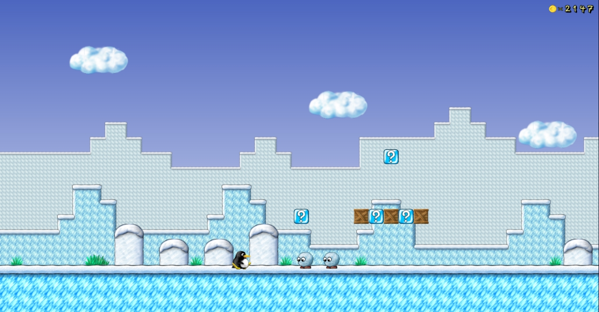

# SuperTux User Manual (For v0.5.1)

________________________________________   

SuperTux is a side-scrolling 2D platformer featuring Tux, the Linux mascot. Over the course of the game, Tux will have to make his way through many different levels, in order to reach and rescue Penny, who was captured by evil Nolok.

This file should help players to understand the features of the game at a user level (How to play, not how it works...)

See the [old wiki's user manual](http://supertux.lethargik.org/wiki/User_Manual) to see the (now outdated) source of some of this information.

## Getting Started

 - Download a copy of the game [here](https://supertuxproject.org/download.html)
 - Start it up, after installing it
 - Use the up/down arrow keys or the mouse to select "Start Game" at the main menu
 - Press the Enter key, or Left Click with the mouse
 - Press the Enter key, or click again, this time on "Story Mode"
 
After this, the intro cutscene should begin. Watch it, and then continue onto the section labelled "Gameplay" in this document.

## Gameplay

Oh no! Nolok has captured Tux's girlfriend, Penny. It is now your responsibility to control Tux, and rescue Penny.

*Disclaimer: It isn't currently possible to save Penny, since the game is not complete.*

In order to do this, you need to understand how to play the game. This section of the Manual should help you.

### Worldmaps

A worldmap is an island or a collection of islands which Tux must explore in search of Penny (or for some other goal). They feature levels which appear as dots/icons connected by paths.

Currently, there is only one worldmap availible in Story Mode: [Icy Island](Icy-Island)

In later releases, more worldmaps will feature.

Some other worldmaps which you can play are:

 - Forest World (development island)
 - The Halloween Island (Spooky)
 - Bonus Islands 1-3
 - All the addons

Check the Contrib Levels menu:
Start Game > Contrib Levels

There are also worldmaps availible in addons. Please see the section labelled "Addons" below for more information.

### Levels

A level is an area of an worldmap which Tux must traverse.
To "win" in a level, Tux must pass through a finish area, often marked by a set of poles.

Levels are filled with Nolok's minions, out to stop Tux's progress, and item boxes,
which provide a way for Tux to collect coins and powerups. They are also filled with puzzles, difficult jumps, coins to collect and [other objects](Objects) which Tux can interact with.

First, though, you need to understand the controls:

### Controls

**Control** |	**Default mapping**   |	**Description**
------------|-----------------------|--------------------
_Left_      |	_Cursor Left_         |	_Makes Tux walk left_
_Right_ 	   | _Cursor Right_        | _Makes Tux walk right_
_Up_ 	      | _Cursor Up_           | _Enter door, activate switch_
_Down_      |	_Cursor Down_         |	_Duck_
_Jump_ 	    | _Spacebar_            |	_Makes Tux jump. Hold down longer to jump higher._
_Action_    |	_Left Control_        |	_Varies; actions are explained below._

The **P** and **Escape** keys can be used to pause the game.

To change the controls, go to Options > Setup Keyboard.
Select the control you wish to change, and click the key you wish to assign it to.

Unfortunately, it's not as simple as just running and jumping freely through levels:

### Getting Hurt

Tux can get hurt in a number of ways:

 - Walking into [badguys](Badguys) (see below)
 - Being crushed by moving objects
 - Being hit by thrown objects (see below)
 - Falling onto spikes or into lava
 - Falling down a pit
 
Usually, this will cause Tux to lose a [powerup](Items). If he has a [Fire, Ice, Air or Earth Powerup](Items), he will lose his hat. If he is only [Big Tux](Items), he will shrink. Some things will make Tux die instantly, like falling down below the level. Powerups won't help you here.

**If he is small Tux, hurting Tux will make him die!**
 
When Tux dies, it will cause him to return to the start of the level (unless he has reached a checkpoint, please see below)

But don't worry, Tux can find [items](Items) in the levels, to help him overcome these adversaries:

### Items

Tux can find powerups, coins and other goodies in [item boxes](Items)

### Powerups

Powerups can be found in bonus blocks and on the ground. Most are eggs, which will allow you to backflip by pressing down then jumping and butt-jumping by jumping then pressing down. If you already have an egg, hitting an item box containing a powerup will give you a flower.

- Fireflowers will allow you to kill most badguys by pressing the action key, which makes Tux throw a fireball
- Iceflowers will allow you to freeze some badguys and kill some others by pressing the action key, which makes Tux throw a ball of ice. If they are frozen, you can kill most badguys by butt-jumping on them.
- Airflowers will allow you to jump further, sometimes even run faster. However, it can be difficult to do certain jumps as Air Tux.
- Earthflowers give you a light. Also, pressing the action key then down will turn you into a rock for a few seconds, which means Tux is completely invulnerable.

The more fireflowers you collect, the more fireballs you can throw at once.
The more iceflowers you collect, the more balls of ice you can throw at once.
The more earthflowers you collect, the longer you can remain as a rock.
The more airflowers you collect, the longer you can glide.

### Badguys

Tux must also avoid [Badguys](Badguys) which are found in the level. These are Nolok's minions, and can cause Tux to get hurt.

### Objects

There are also some other [objects](Objects) that Tux can interact with.

## Add-Ons

Addons are sets of levels provided by the community. To install and play a new addon: 

 - Select "Add-ons" on the main menu
 - Click on the addon you wish to install
 - Watch as it downloads
 - Go back to the Main Menu (by pressing Escape, or selecting Back)
 - Go into Start Game > Contrib Levels
 - Select the new item(s) in this list, which you wish to play

These addons are not managed by The SuperTux Team, so please do not register your issues regarding them on the SuperTux/supertux repository.
You _may_ be able to get help by making an issue [here](https://github.com/SuperTux/addons/issues)

By default the game searches for new addons in the SuperTux Team's addon repo [here](https://github.com/SuperTux/addons).
If you wish to submit a new addon to the repo, please make an issue or pull request there.
If you would rather change the addon repo which the game looks for new addons in, you can start the game with the repository-url argument specified: `supertux2 --repository-url URL`
**WARNING: THIS IS NOT RECOMMENDED BY THE SUPERTUX TEAM**

## Using The Level Editor

### How to Start
You can find the Level Editor in the main menu.

Once you're there, you can create a new level subset and after that you can create a new level.

### Placing Tiles
Once you have created a level, you can already start to build.
Press the **Tileset** Button in the top right coner and chose one of many diffrent tileset categories. (For example: Snow)

Select a tile that you want to use and start building.

There are different ways to place tiles:

 - Placing one tile at a time by pressing the left mouse button. 
 - Hold the left mouse button pressed and move your mouse to create a large area of tiles. 
 - Fill an area with tiles. 
 - You can also remove tiles by selecting the rubber. 
 
### Placing Objects
After creating a path for Tux to walk on, you should add some objects.
Press the **Objects** Button beneath the **Tileset** Button and choose one of the following object categories.

 |	 |	 |
--------|-----------------|----------|
Hostile | Projectiles     | Lightmap |
Bosses  | Interactive     | Ambient  |

When you press this  Button, it changes to this  Button and you can copy objects by clicking on them.
Once you're done with copying objects, you can simply press this Button again. 

### Level Properties
You can edit your level properties by pressing on this  Button and select **Level Properties**.
There you can change the level name, the level author, the license and the target time.

### Sectors
A level can have multiple sectors.
To add a new sector, you have to press the **Sector** Button in the bottom left corner and press **Create new sector** and if you want to remove a sector, select the sector, you want to remove and press **Delete this sector**.

You can also edit your Sectors properties. To do so, select the sector you want to edit and press **Sector settings...**
There you can change the name of the sector, the music for this sector and the size. You can also change the ambient light and add an initialization script.

### Path Nodes
If you want to make a moving platform or want specific objects to move, you can do this through **path nodes**.

Some objects are able to follow paths. Those objects have a white circle in their upper left corner, when you select them.
This white circle is a path node.

Now, if you want to make an object moving, you have add another path node. For that you need to select this:  
You can find this in the **Ambient** category.

Once selected, click on the white circle of the object you want to move and then click on the position where you want your object to move.

If you wanted to change the speed of your moving object, just right click on your path node and change the speed value.

### Scripting
You can use scripts to add more dynamic into your levels.

You can add scripts for objects and an initialization script.

An **initialization script** is a script, that activates once you start the level. (For example: If you want Tux to be invisible at the beginning of the level, just put `Tux.set.visible(false);` into your initialization script.)

Here you can find a list of [scripts](http://supertux.lethargik.org/wiki/Scripting_reference), you can use. (Note: It is currently an outdated list!)
