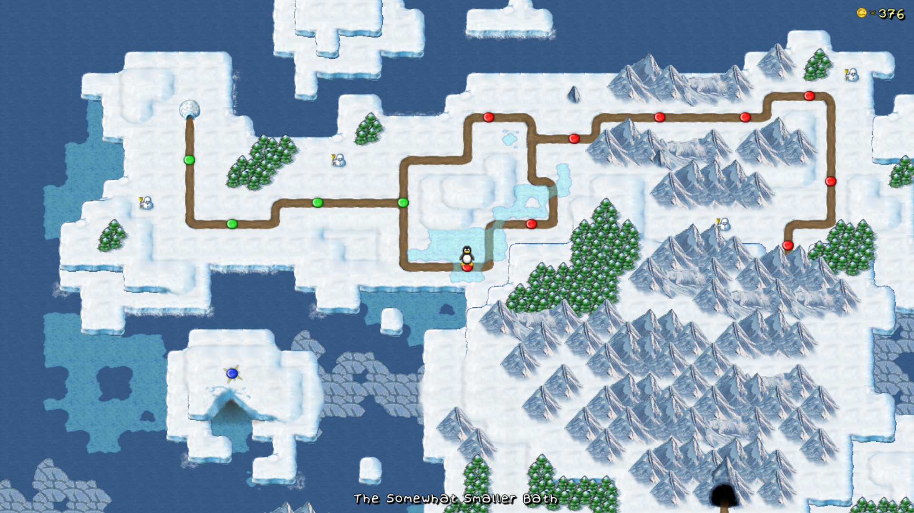

 

SuperTux is a side-scrolling 2D platformer featuring Tux, the Linux mascot. Over the course of the game,
Tux will have to make his way through many different levels, worlds and climates in order to reach and
rescue his beloved Penny, who was captured by the evil Nolok.

This document should help players to understand the features of the game at a user level
(How to play, not how it works...)

See the [old wiki's user manual](http://supertux.lethargik.org/wiki/User_Manual) to see the (now outdated)
source of some of this information.

# Contents
  1. [Getting Started](https://github.com/SuperTux/supertux/wiki/User-Manual#Getting-Started)
  2. [Gameplay](https://github.com/SuperTux/supertux/wiki/User-Manual#Gameplay)
  3. [Addons](https://github.com/SuperTux/supertux/wiki/User-Manual#Addons)

---

## Getting Started

 - Download a copy of the game [here](https://supertux.org/download.html)
 - Start it up, after installing it
 - Use the up/down arrow keys or the mouse to select **Start Game** at the main menu
 - Press the Enter key, or Left Click with the mouse
 - Press the Enter key, or click again, this time on **Story Mode**
 
After this, the intro cutscene should begin. Watch it, and then continue onto the section labelled
**Gameplay** in this document.

## Gameplay

Oh no! Nolok has captured Tux's girlfriend, Penny. It is now your responsibility to control Tux, and save Penny.

In order to do this, you need to understand how to play the game. This section of the Manual should help you.

*Disclaimer: It is not currently possible to save Penny, since the game is not complete!*

### Worldmaps



A worldmap (or world) is an island, part or a collection of islands which Tux must explore in search of Penny
(or for some other goal). They feature levels which appear as dots/icons connected by paths.

Currently, there are two [worlds](https://github.com/SuperTux/supertux/wiki/Worlds) availible in Story Mode.

In later releases, more worlds will be featured.

Some other worldmaps which you can play are:

 - The Bonus Islands
 - The Halloween Island
 - The Christmas Island 

To play these worldmaps, check out **Contrib Levels** at the main menu:
Start Game > Contrib Levels

There are also worldmaps availible as addons. Please see the section labelled **Addons** below for more information.

### Levels


A level is an area of a worldmap which Tux must traverse.
To "win" in a level, Tux must pass through a finish area, often marked by a set of poles.

Levels are filled with badguys, out to stop Tux's progress, and item boxes, which provide a way for Tux to collect coins
and powerups. They are also filled with puzzles, difficult jumps, coins to collect and other objects which Tux can interact
with.

First, though, you need to understand the controls!

---

### Controls

Control |	Default mapping |	Description
--------|-----------------|--------------------
Left    |	Cursor Left     |	Makes Tux walk left
Right 	 | Cursor Right    | Makes Tux walk right
Up 	    | Cursor Up       |	Enter door, activate switch
Down    |	Cursor Down     |	Duck
Jump    | Spacebar        |	Makes Tux jump; hold down longer to jump higher
Action  |	Left Control    |	Varies; actions are explained [here](https://github.com/SuperTux/supertux/wiki/Actions)

The "P" and "Escape" keys can be used to pause the game.

To change the controls, go to Options > Setup Keyboard.
Select the control you wish to change, and click the key you wish to assign it to.

Unfortunately, it's not as simple as just running and jumping freely through levels:

### Getting Hurt

Tux can get hurt in a number of ways:

 - Walking into badguys
 - Being crushed by moving objects
 - Being hit by thrown objects/projectiles
 - Falling onto spikes or into lava
 - Falling down a pit
 
Usually, this will cause Tux to lose a powerup. If he has a fire, ice, air or earth powerup, he will lose his hat. If he is
only Big Tux, he will shrink. Some things will make Tux die instantly, like falling down below the level. Powerups won't
help you here.

**If he is small Tux, hurting Tux will make him die!**
 
When Tux dies, it will cause him to return to the start of the level (unless he has reached a checkpoint, please see below)

But don't worry, Tux can find items in the levels, to help him overcome these adversaries:

---

### Special Objects

Throughout a level, several special objects like trampolines, doors and switches which Tux can interact with can be found.
The most common object is the item boxes which contains valuable items, such as coins and powerups.

For more details on objects, please see [Objects](https://github.com/SuperTux/supertux/wiki/Objects).

### Powerups

Powerups can be found in bonus blocks and on the ground. Most are eggs, which will allow you to backflip by pressing down then
jumping and butt-jumping by jumping then pressing down. If you already have an egg, hitting an item box containing a powerup
will give you one of four special flowers.

For more details on powerups, please see [Actions](https://github.com/SuperTux/supertux/wiki/Actions#Power-Ups-1).

### Badguys

Badguys are foes of Tux and are encountered in levels. Tux must either avoid or beat these to not get hurt. There are different
types of badguys that vary in their movement and abilities.

For more details on badguys, please see [Characters](https://github.com/SuperTux/supertux/wiki/Characters#Badguys).

---

## Addons

Addons are sets of levels provided by the community. To install and play a new addon: 

 - Select **Add-ons** on the main menu
 - Click on the addon you wish to install
 - Watch as it downloads
 - Go back to the Main Menu (by pressing Escape, or selecting Back)
 - Go into Start Game > Contrib Levels
 - Select the new item(s) in this list, which you wish to play

These addons are not managed by The SuperTux Team, so please do not register your issues regarding them on the SuperTux/supertux repository.
You *may* be able to get help by making an issue [here](https://github.com/SuperTux/addons/issues)

By default the game searches for new addons in the SuperTux Team's addon repo [here](https://github.com/SuperTux/addons).
If you wish to submit a new addon to the repo, please make an issue or pull request there.
If you would rather change the addon repo which the game looks for new addons in, you can start the game with the repository-url argument specified:
```supertux2 --repository-url URL```

**WARNING: THIS IS NOT RECOMMENDED BY THE SUPERTUX TEAM!**

---

Further Reading
---------------

Have fun browsing the SuperTux wiki. You can find lots of in-depth
information about most objects in the game here.

If you have paid for SuperTux, you have been ripped off. Supertux is
available for free download at [supertux.org](https://www.supertux.org/download.html).

[Category:For Users](Category:For_Users "wikilink")
