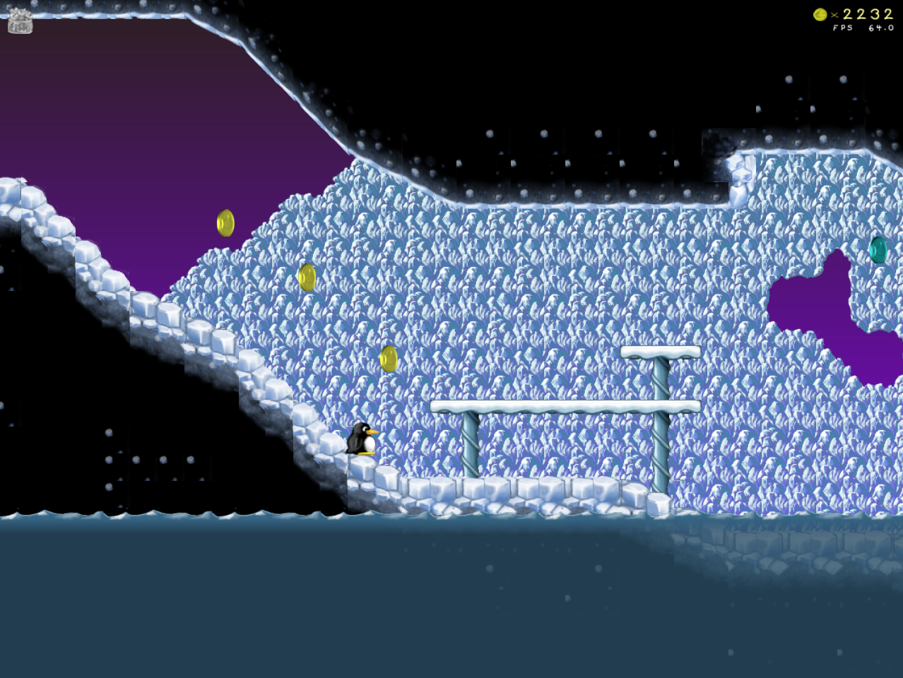
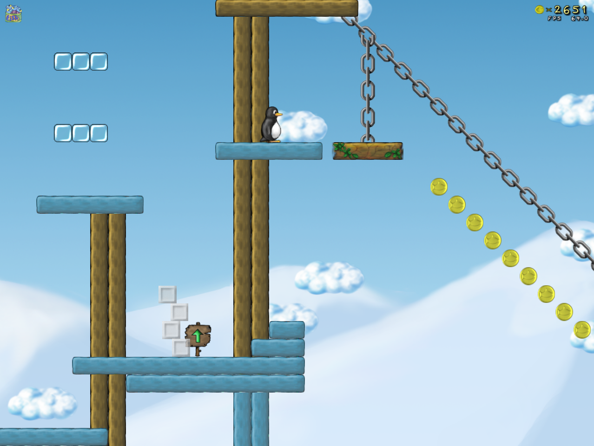
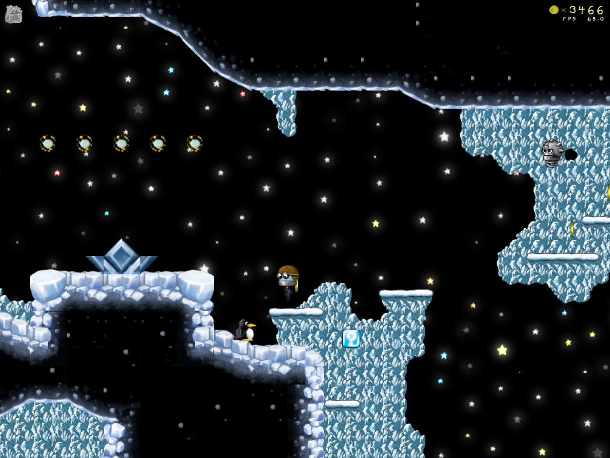
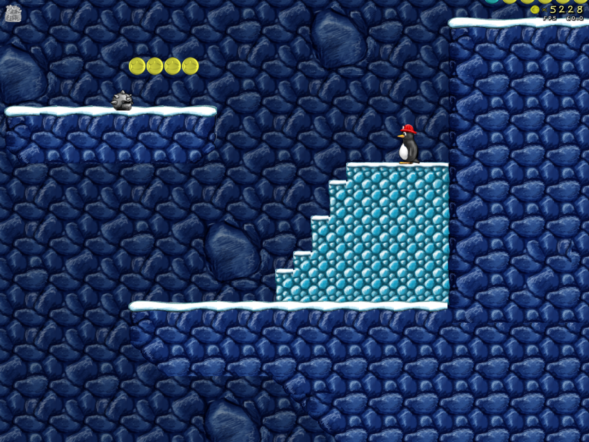
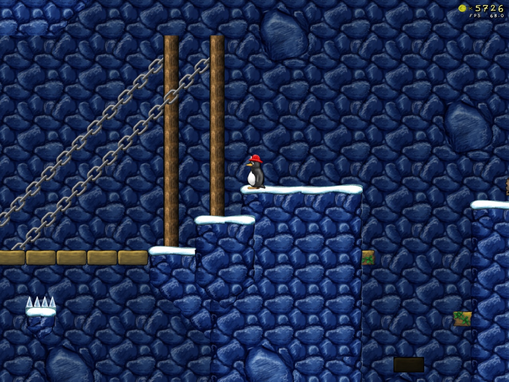
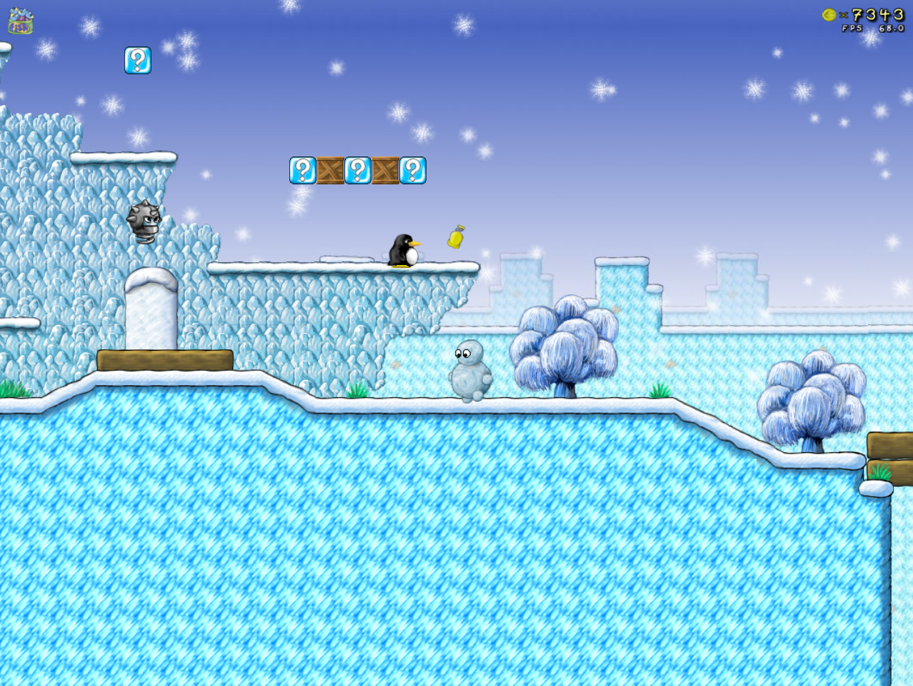
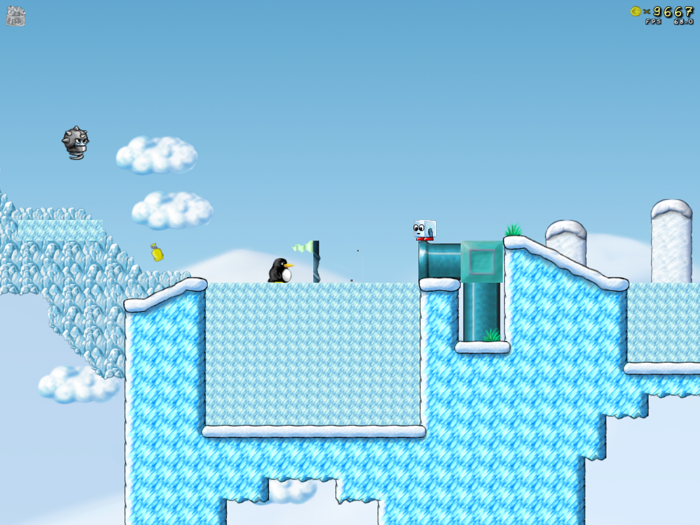

**Yeti's Revenge** is an addon for Supertux 0.3.3-svn (September 2011) by *niso*. It contains a brand new worldmap, two storylines and over 30 levels. At the end of the main story Tux has to fight against Yeti again. Although the whole addon is more challenging than the main game, all levels can be finished completely (each coin, secret etc. is reachable).

**Recommended resolution: 1280x720px**

#### Links

-   Download addon from [Bugtracker Entry](https://supertux.lethargik.org/bugs/view.php?id=836) (to prefer) or [Fan-Forum](http://forum.freegamedev.net/viewtopic.php?f=69&t=2451)
-   Download best working supertux-snapshot from [Fan-Forum](http://forum.freegamedev.net/viewtopic.php?p=27149#p27149)
-   [Youtube-Video](http://www.youtube.com/watch?v=pFgh6ffZH68)

#### Worldmap

#### New Bonuses

 **Fishboxes:** To play the
second storyline Tux has to search for 35 fishboxes which are hidden
(sometimes hard to find) in each level.

 **Blue Coins:** If Tux
collects 5 of these coins in one level (without to die), he will get 3
lifes (300 coins).

#### Levels

| Screenshot                                                                           | Name                               | Type              | Direction | Difficulty | Lenght |
|--------------------------------------------------------------------------------------|------------------------------------|-------------------|-----------|------------|--------|
|                       | A Loud Night                       | intro             | right     | -          | -      |
|                       | Leaving Home and Start the Journey | normal            | right     | easy       | normal |
|                       | Above the Clouds                   | normal            | right     | easy       | normal |
|                       | Carry Me                           | normal            | right     | easy       | normal |
|                    | Hail Storm                         | normal            | right     | medium     | normal |
|                       | Through the Groundwater            | normal            | right     | easy       | long   |
|                    | Playground in the Water            | normal            | right     | easy       | normal |
|                    | Crazy Cave                         | normal            | right     | medium     | normal |
|                    | Lotus Grotto                       | normal            | right     | medium     | normal |
|                    | Staple Me                          | normal            | right     | easy       | normal |
|                    | It's Getting Colder                | normal            | right     | easy       | normal |
|                    | A Bombastic Day                    | normal            | right     | medium     | normal |
|                    | Blue Mountain                      | normal            | right     | medium     | long   |
|                    | More of the Blue Mountain          | normal            | up        | medium     | long   |
|                    | Reaching the Top                   | normal            | up        | hard       | long   |
|                    | The Way Down                       | normal            | down      | medium     | long   |
|                    | Don't Be Afraid                    | puzzle            | ?         | ?          | ?      |
|                    | Path Without Name                  | normal            | right     | easy       | normal |
|                    | Pirate's Harbor                    | normal            | right     | medium     | normal |
|                    | Foreign Passenger                  | normal            | right     | hard       | long   |
|                    | Escape From the Pirates            | chase             | right     | hard       | long   |
|                    | Something to Enjoy                 | normal            | right     | easy       | normal |
|                    | Windy Day On Ice                   | normal            | right     | medium     | normal |
|                    | Next to the Stars                  | normal            | right     | medium     | normal |
|                    | Slippery Climbing                  | normal            | up        | hard       | long   |
|                    | Controlling the Temperature        | normal            | right     | medium     | normal |
|                    | The Grand Bridge                   | normal            | right     | medium     | normal |
|                    | Shaft Racing                       | normal/autoscroll | down      | medium     | long   |
|                    | I Go With My Latern                | puzzle            | right     | ?          | normal |
|                    | Freeze 'n' Flee                    | normal            | ?         | medium     | normal |
|                    | Living Spikes                      | normal            | right     | hard       | normal |
|                    | Spooky Way of Life                 | puzzle            | ?         | ?          | ?      |
|                    | Hang Out in the Underground        | normal            | right     | medium     | normal |
|                    | Cave of Waterfalls                 | normal            | right     | hard       | normal |
|  | All's Well That Ends Well          | ?                 | ?         | ?          | ?      |
|  | Yeti's Revenge                     | bossfight         | -         | ?          | -      |
|  | Bonus                              | ?                 | -         | -          | -      |
|                    | Something in the Water             | intro             | right     | -          | -      |
|                    | A Wonderful Day                    | normal            | right     | easy       | normal |
|                    | Big Wave                           | chase             | right     | hard       | normal |
|                    | Surfing Tux                        | autoscroll        | right     | hard       | normal |
|                    | No Brigde Out There                | normal            | right     | hard       | normal |
|  | Still Waters Run Deep              | bossfight         | ?         | ?          | ?      |
||

